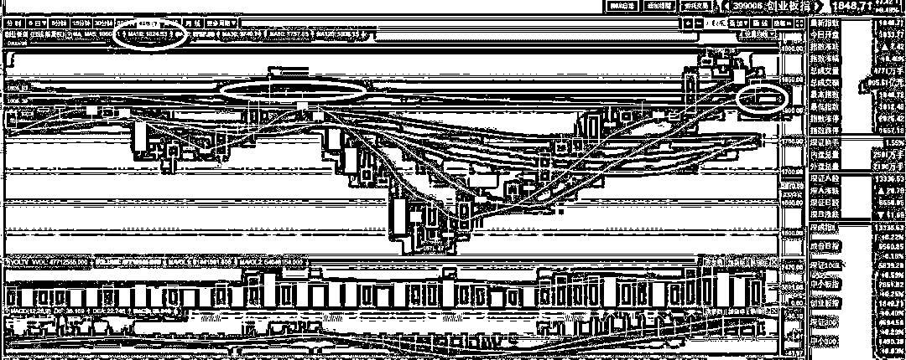
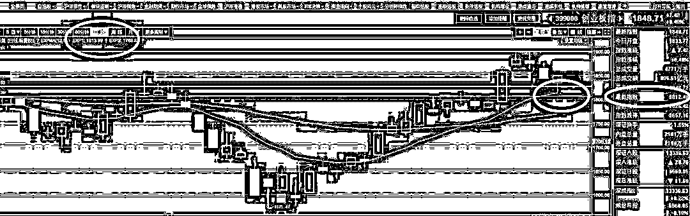
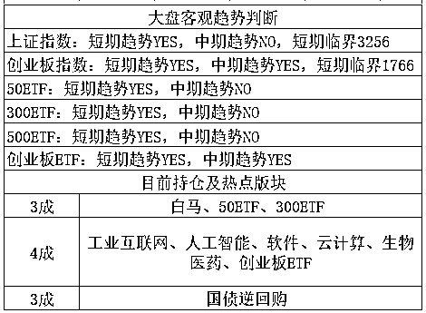

# 暴跌，惨剧人寰的次新股

  <link rel="stylesheet" href="view/css/APlayer.min.css">

昨天证监会宣布了一个 55 亿的罚款，针对是操纵次新股的大游资，另外对次新股版块进行了风险提示，昨天晚上告诉大家，今天次新股版块承压是毫无悬念的，领导都说这么重的话了，必须得给面子。

今天这个风险提醒兑现了，全天次新股版块暴跌，盘中一度下跌 6%，注意这是整个次新股版块的跌幅，整个板块跌 6%，你觉得持有次新股的人今天是啥感受，齐刷刷的一片跌停啊，今天全天就是次新股拖着整个大盘向下走，等次新股杀的差不多了，大盘奋力拉升的过程。

今天次新股暴跌的太多了，收盘跌幅 5%以上的铺天盖地，就不谈了。今天最吸引眼球的次新股，是养元饮品，虽然他收盘只跌了 3.5%，但是他今天成了媒体热点，因为他盘中破发了。

养元饮品的发行价 78.73，盘中最低价为 78.72，成为最快破发新股，这个价格如此精准，刚好破发 1 分钱，很明显是有人趁着今天次新暴跌故意砸了一下，可惜收盘拉回去了，如果收盘也低于发行价，那就热闹了。

除了盘中破发之外，今天晚上的 315 晚会，养元饮品也被推上了风尖浪口。我们知道，315 晚会专门打击消费民生类造假行为，造假被点名，就算是上市公司，也是点谁谁死，没有被点名了，那就恭喜你了，熬过一劫。

今天晚上，**315 晚会曝光了一些黑作坊利用核桃香精，大批量制造假冒的核桃饮料和杏仁露饮料，我们来看看新闻稿原文**。

315 晚会曝光，“稳定剂，安赛蜜，阿斯巴甜，山梨酸钾，甜蜜素…”各种添加剂+两吨纯净水+核桃香精=市场上热销的一款“核桃花生”。这款产品既没有添加核桃，也没有添加花生，核桃的味道靠的是核桃香精，一罐料汁能生产出 8000 瓶“核桃花生”。除了在产品类型上跟风模仿，有的公司在外包装上也是煞费苦心。产品都和某品牌核桃乳非常相似，“六个纯核桃”只多了一个字；“六仐核桃”、还有“六禾核桃”，只是一笔一划的差别。外观设计，包装色调，构图，代言人形象也是他们模仿的主要内容，让人难以分辨。一些从业者透露，这些跟风模仿的产品，主要是销往一些三四线城市及农村市场。

很明显，315 打击的是假冒伪劣的六个核桃，而六个核桃是养元饮品的核心利润来源，国家出面肃清假冒伪劣的竞争对手黑作坊，按理说应该是利好六个核桃的，根据这个逻辑，养元饮品该涨。

但是，在整个打假视频中，用低廉的成本，黑作坊就可以做出口味几乎一模一样的饮料，这损伤的是整个核桃饮料行业，民众看完这种视频后会对核桃饮料有一种天然的反感。而养元饮品的招股说明书中说，一瓶饮料，最贵的罐头价值 0.55 元，原料成本 0.25 元，加上营销费用总成本 1 元，其他都是利润。就算按 0.25 元算，这个费用也只够买 1/3 个核桃的，更别说六个核桃了。

所以六个核桃今天被媒体热议到风口浪尖，多重因素叠加，令他后续的走势非常难以判断。其实香精勾兑也没什么，大部分饮料不都是香精勾兑，资本考虑的主要是盈利能力，能赚钱就行，盈利能力考量的就是消费市场的大小，民众的感受是第一要素。而 315 打假对他的影响我觉得多空均衡吧，如果走势平稳那我觉得就没参与的必要了，如果因此引发了暴跌，跌的足够深之后，那反而是个参与的好机会，当年伊利股份被三聚氰胺弄的那么惨，这是被直接攻击啊，后来还不是慢悠悠的爬起来了，股市从来不嫌弃谁是烂股票，只要你价格足够低，低于正常价值，那就是好股票。你价值再好，价格太高，远高于正常价值，那你也是坏股票。

对了，和六个核桃一起被打假的，还有杏仁露，也处理了一大批黑作坊，直接受影响股票是上市公司承德露露，其思考逻辑和六个核桃类似。

315 晚会还公布了**珠宝店骗局****，赠送奖券，一刮就出一等奖，可以免费领取珠宝，但是要承担 8-18%不等的鉴定费，**听起来是不是很划算，但是标价 5830 的和田玉，实际进价是几十元。。。

315 晚会上面那个记者花了 5830*0.18=1049 元买到的金和田玉挂件，经过专家鉴定，玉是真的，但是质量在和田玉里是垫底的，金箔也是真的，但是金箔仅有 0.05—0.1 克，所以并普通消费者如果去告的话，是很难告赢的，但是这个挂件在玉石批发城里售价是多少呢，仅仅几十元，为什么敢标价 5830 呢，因为黄金有价玉无价，你怎么扯得清。。。

我这里和大家说一个以前知道的小知识，买玉的话，没有懂行的朋友陪着千万不要乱买，那种大型商场里的玉，都是从各个玉产地批发来的，批发价是多少呢，你把大商场里的玉的标价，减掉一个 0，再除以 3，基本就是玉产地的进价了，而且我说的是真货，质量还是比较中上等的那种，如果更黑心的给你上假玉，那就便宜了，价格低的就没谱了。。。

 

今天，孙宏斌宣布正式退出乐视网之后，融创中国的股价大涨 6%，市值超过 1400 亿港元，**孙宏斌放弃乐视网颇有弃车保帅的意味**，相比他的根基融创中国来说，乐视网真的只随便投投，有点心疼，但是还没伤到肉，如果继续纠缠不清，有可能在坑里越陷越深，无论额外投多少钱都只能看个水花，换谁也受不了啊。

不过他壮士断臂退出之后，乐视网里面的散户就遭殃了，连董事长都没有的公司能产生什么好业绩。。。另外乐视网今天已经公告，公司未形成任何引入投资者增资方案及意向，明天开市复牌。明天复牌之后，走势可想而知。

关于大盘，昨天给大家说了，由于昨天宣布了强监管严处罚，所以今天继续回调是大概率，次新股是承压主力，当回调到横盘整固区间的下缘 1816-1826 范围的时候，记得做下缘买入 T。

今天开盘之后，创业板开始下跌，上午的时候再 1829 获得二次支撑，感觉是有人在抢跑。临近午盘的时候次新股二度暴跌带领创业板再度向下，到下午的时候在 1816 获得密集 N 次支撑，中间只有一瞬间被打到了 1812 然后被迅速拉回来了，在 1816 这里横盘了接近 1 个小时之后，全面启动，拉升接近 1.8%，到了收盘直接拉红了，收涨 0.4%，这个下缘 T 和 1900 的横盘区间上缘 T 做的一样舒服。

很多人问 1816-1826 是怎么定出来的，为什么这里真的就跌不动了，首先我们可以看到，创业板的 10 日线是 1824，而前期的高点是 1826.

其次，EXP 白线是 1813，这是我昨天重点提到的技术指标，所以综合起来就是 1813 和 1823 构成二个支撑线，这二个支撑线都有可能止跌回弹，而我习惯取 6 位尾数，听起来好听，而且追求尾数的个位数精确毫无意义，所以就定为 1816 和 1826 了，而今天实际的最低点，也是在这个附近。

至于为什么这次取 10 日均线和 EXP 白线，而不是取 20 日均线和 EXP 黄线，是因为我觉得不会回踩那么深，至于为什么这么判断，纯粹是盘感来的，每天坚持看盘中的指标股走势，以及感受每一波盘中小拉升的时候，到底蕴含了多少总队的意志，是真拉还是假拉等等，看动用的指标股和参与的资金量和判断，这个就要靠时间练习了，不是几个指标能解决的。

而今天全天，蓝筹白马全面启动，在次新股全面暴跌的时候稳住了局势，起了一个定海神针的作用，我说的压舱石也是这个含义，他这种稳定的特性，特别适合当储备仓位，一方面压舱，一方面治疗手痒，免得一不留神就满仓没仓位做 T 了。

今天创业板触底回升之后，人气大振，短期回调基本结束了，但是我个人认为，1900 的上缘区间，依然压力巨大，1900 之上密密麻麻的全是套牢盘，早晚会冲破的，但是一次冲破比较困难，如果说第一次突击 1900 回落的概率是 90%，那么这次突击 1900 失败的概率应该有个 70%，第三次突击就不好说了，55 之数，就不用卖了，但是第二次突击 1900 的时候，不妨再 T 一次试试看。

创业板的临界点继续提升 10 个点，飞速上升中，上证的临界点继续原地不动。。。

紫色的股

经济-金融-投资