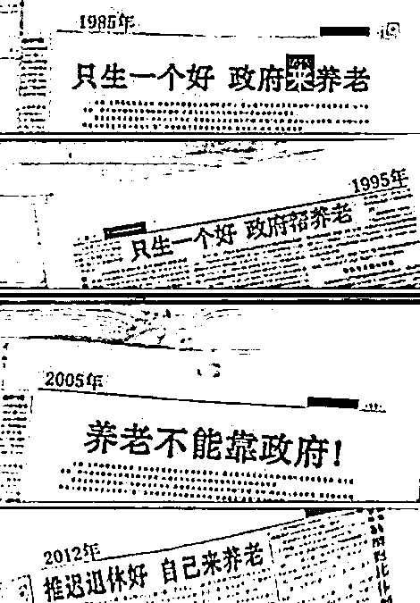
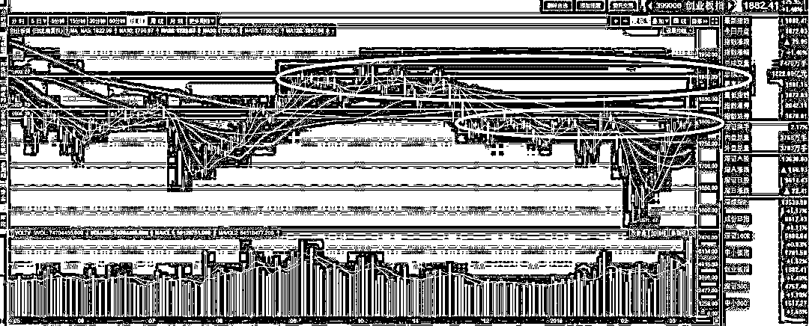
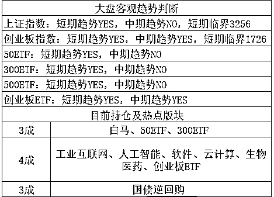

# 刚刚，千亿圈钱计划宣布

<link rel="stylesheet" href="view/css/APlayer.min.css">

今天收盘后，农行宣布拟以非公开发行方式发行不超过 274.73 亿股 A 股，募集资金规模不超过 1000 亿元，将全部用于补充核心一级资本。简单的说，就是要进行定增，募资一千亿元，这么大手笔的圈钱抽血计划立刻就把我震惊了，赶紧去看公告。

看了之后发现这么几点，首先定增的价格是过去 20 日的平均价格打 9 折，看似是 9 折，但是由于整体蓝筹股的走势是强烈冲高之后大幅回落，所以这个定增价格，我粗粗一算貌似比今天的收盘价还高，而且高不少，具体的还要等落地才知道，但是肯定是溢价定增没跑了。

其次，非公开发行的发行对象共 7 名，分别为汇金公司、财政部、中国烟草总公司、上海海烟投资管理有限公司、中维资本、中国烟草总公司湖北省公司、新华保险。清一色国企成员，里面没有私募或者个人投资者，这些定增对象的钱很大可能就不是从股市里抽出来的钱，而是其他渠道的钱。另外这些定增对象都是长期持有者，不像一些个人投资者和私募，解禁期一到就立刻急吼吼的卖出变现，对股市构成沉重抛压。

所以总体来说，好像还算个利好，另外这 7 个定增对象都是国企，都是能赚钱但是不能吃亏的主，赚钱的时候没问题，赚多赚少都行，一旦亏钱那就不行了，**如果他们认为农行未来会有大跌，是不可能这个时候巨额定增的**，所以我认为农行未来要想出现 20~30%这种级别的大跌，是不可能的，以蓝筹去年的涨幅来看，如果这个级别的跌幅都不会出现，那整体就是横而不跌的格局了，至少这 7 家国企以千亿资金表达了他们的这个态度。

对了今天新华社发了一篇报道，谈养老难题，标题是：个人养老投入成趋势。关于这个议题，我以前曾经发过长文，就不重复表达观点拉，一图表达，其他不多说。 

今天个股简直和疯了一样，跳空高开然后疯狂上涨，创业板盘中一度攻击 1900 点，前几天还在看 1800 点年线位置能否有效突破，今天直接就上去摸 1900 了。

我们能明显看到，1900 的压力位是明显大于 1800 的，老实说，我曾经认为 1900 就是上涨的高点，而且可能要花费一二个月时间才能达到，1900 之上是层层叠叠的套牢盘，如果 1900 之上的区间被突破，打开 2000 点雄关，那么可以说，整个 18 年以小票为尊，价值投资靠边站。

创业板涨成这个样子，是明显的 V 型反转，就算不称尊，小票强于大票也会成为未来一段时间的趋势，毕竟过去二年里，小票跌的太惨了。要是近看本波段，现在创业板已经强悍的连 5 日线都不破了，而且短期之内严重超涨，可以预期，明后天冲高回落等一下，整固一下走势，等一下均线的概率比较大，可以盘中做做 T，但是要注意买回，连 5 日线都不破的时候贸然轻易不要减仓，只做 T，今天冲击 1900 点的时候涌现出大量抛盘，毕竟 2 天时间从 1800 之下嗖的一下冲到了 1900 之上，速度简直太恐怖，上面这么强的压力区卖一下很正常。所以今天 1900 点回落了，但是回落之后大家可以看到，整个下午都是横盘支撑，连早上的跳空缺口都没回补，这明显都是早上高抛的资金在做 T 买回仓位，就做了 1%的 T 就开始买回了，说明这批资金有多么不愿意放弃手中的筹码，这种情况只是在去年价值投资的时候看到过。

今天早上冲击 1900 点是 10 点 22 分，然后一直回落到 11 点左右开始企稳，随后一直横盘，这种横而不跌预示后面还会有冲高，反复冲击套牢区域测试抛压。另外我们还应该看到，小票开始回落之后，10 点 32 分上证指数就直接启动了一波涨势，一直涨到了 11 点，小票止跌之后，上证立刻停止上涨。

这说明上证的蓝筹，是被当成定海神针来使用的，单边拉升蓝筹不可能了，今年的主题曲是新经济，蓝筹维持不跌就好，但是在小票的回落中，上证一般都跳出来涨一下，我建议大家也持有一部分蓝筹当压舱石，利用好这里面的关系顺手做做利差，偶尔调动一下仓位，是很舒服的。

当前创业板趋势属于完美多头趋势，所有均线开始扭头向上，短中期指标已经翻多 N 天了，目前连 20/30 日均线在图形上都能看出明显扭头了，每天的收盘价连 5 日线都没破，唯一能看空的理由缺点居然是短期涨太多了。。。强多头趋势，只能看多，不用怕回踩，这里浅回踩只能做做 T，深回踩就是送钱。

紫色的股

经济-金融-投资