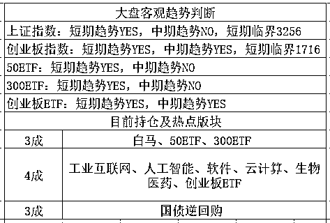

# 谈谈我对房地产税的看法

<link rel="stylesheet" href="view/css/APlayer.min.css">

本周末，监管层 LSY 对股市发表了重要意见，周五下午收盘后，LSY 在出席人大会议后，回答了记者的提问，对诸多问题作出了回应，其中最重要的我列举出来。

首先，明确表态支持新经济，LSY 表示，限于当时特定的时间窗口、制度环境和市场容量，一些主体在中国、有特殊股权结构安排的新经济企业选择到境外上市，对提高企业的规范运作水平、提高企业质量以更好地服务境内居民来说，是好事情。但国内投资者没有享受到它们增长的成果，是一个历史的遗憾，“在新时代，这个遗憾就不能再发生了。”他说。

这句话一出，不多说了，新经济至少短期内是没啥事了，该炒继续炒，我觉得比独角兽靠谱多了。

然后，表态对资本市场充满信心。“我对未来五年充满信心。”在回答媒体“如何看待未来五年资本市场的发展”的提问时，LSY 如此表示。

这句话没毛病，身为监管层一把手，对资本市场充满信心是理所应当的，中国股市二十多年来，不管股市牛熊，历届证监会主席在任何时刻都是对股市充满信心的，没有一个说对股市感到悲观的，否则就是政治不正确啊。所以，我也对资本市场充满信心，不过和官方的充满信心是二码事=。=

LSY 总共对 7 个问题进行了表态，我觉得值得谈一谈的就这二个，另外，周五的时候 IPO 总共是 3 家，17 亿元，基本属于底线发行，属于利好。另外，周五美股大涨，涨幅相当可观，其中纳达克斯科技股创出收复全部失地并创出历史新高。

外围的上涨能支撑大盘股，而新经济又受到监管层明确表态支持，新经济版块的个股上涨能有力的支撑创业板，所以估计短期之内二者都处于强势状态。

人大会议上还有几件事，第一件事就是房产税，这几天好多人问我了，我也在评论区的翻牌回复了，现在想一想还是再公开说一下，关于房产税我的态度很明确，今年人大只会是放风测一下市场态度，不可能推行，要落地最少也是 3 年后的事情了。

理由也很明确，今年的主旋律是去杠杆，防金融风险，因为今年是 18 年，87/97/08 年都出事了，今年防风险明显比什么都重要，杠杆哪是那么好去的，去杠杆的过程一定是经济痛苦无比的过程，全国都在竭尽全力的去杠杆。而房产税这东西，是降房价的王牌炸弹，房价又是全国经济的命根子，就算是经济形势非常好的时候，推房产税也是胆颤心惊。官方的治国能力再怎么差，也不会在 18 年这么敏感的时间点上，整体经济去杠杆的时候，不负责任的推出房产税。

推出房产税的良好时机，是整体经济平稳健康的增长，其他经济领域的杠杆去到了谷底，这个时候其他领域加杠杆，地产领域推房产税去杠杆，互相对冲影响。同时还有一个前提，ZZ 卖地的收入损失应该小于推出房产税的预期税务收入，所以我才会说，3 年之内都不太可能落地，18 年的概率接近于 0，但是放风还是要的，给以后的落地做做铺垫。

对了还有一件事，据媒体报道，个税起征点或提升到 5000 块，从 3500 提升到 5000，这件事我是强烈反对的，不是反对提升，而是提升的太少了，5000 块有什么用呀，全是工薪税，真正收入高的老板一堆合法避税的手段，看起来年年没收入，公司账目不挣钱，但是人家就是有钱富的流油。。。

**我个人看法，至少 7000 以上，一万才算靠谱，**因为政府是很难很难才去调一次税务标准的，这次要不是民怨沸腾，政府压根不会搭理这件事，所以不趁机提高点标准，下次再想改，那又是五年八年后的事情了，最好一次性定到一万以上，这样好歹三五年之内还有用，就这个货币发行速度，真的不够用。

所以呀，我帮大家呼吁一下，也算为大家谋福利，大家没事也呼吁呼吁，虽然力量小，但是积沙成塔，也许就缺那么一根羽毛，最后个税起征点标准就抬上去了。

紫色的股

经济-金融-投资