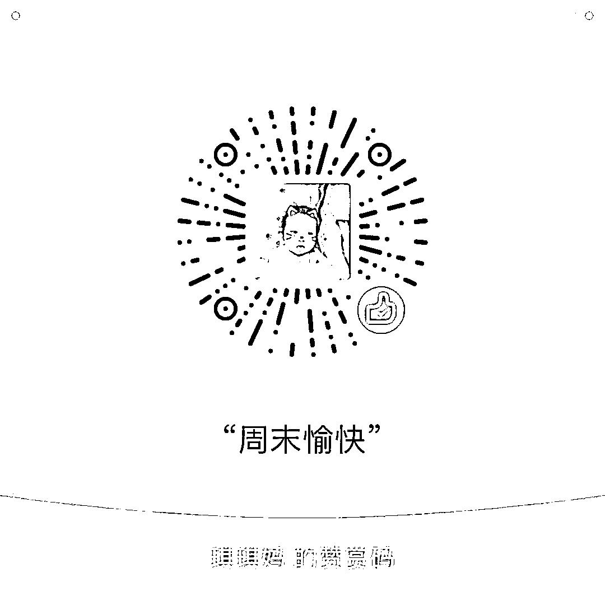

# 史上最牛逼的公司是什么样子的

<link rel="stylesheet" href="view/css/APlayer.min.css">

当今世界上，有很多非常牛逼的公司，比如苹果，一年的利润总额高达四五百亿美金，超过新加坡一年的财政收入。比如沃尔玛，旗下公司员工 230 万人，和中国人民解放军总人数相当。比如微软，他让创始人比尔盖茨富可敌国。这些都是很伟大的公司，但是他们和人类历史上最牛逼的公司相比，那就远远不如了。

人类历史上最牛逼的公司，当属东印度公司。东印度公司创立于 1600 年，由一群商人所组成，是民营公司，公司创立之初，共有 125 个股东，资金为 7.2 万英镑。随后，公司利用手头的几条船往返于印度和英国，老老实实做贸易，积累自己的原始资产，扩大自己的船队，这种远洋贸易，一做，就是一百多年。

这一百多年里，东印度公司不仅仅是打下了自己百年老店这种信用那么简单，多年的积累也给他带来了巨大的资产，这让他拥有了庞大的船队，并且有钱雇佣一些军事力量来保卫自己的商队了，东印度公司的武装商船可是鼎鼎大名的。

这种积累到了一定的地步，引发了质变，随着东印度公司在印度贸易的深入，和印度封建势力爆发了激烈的冲突，于是在 1757 年，英国东印度公司 32 岁的雇员罗伯特·克莱武，率领由 900 名英国人和 2000 名印度雇佣军组成的军队，击溃了由 2 万骑兵、5 万步兵组成的印度军队。驰骋南亚、中亚的印度骑士，在这场战役中，一败涂地，**开创了公司征服国家的先河**。

这一战之后，东印度公司直接占领马德拉斯、加尔各答和孟买。在这里设立了三个管区，各设一名省督管辖，同时开始逐渐侵占印度其他地区，印度沦为东印度公司的殖民地。东印度公司在印度疯狂进行殖民掠夺，训练了大批武装力量，除了抢劫孟加拉国库外，1799 年，攻陷迈索尔首府时，又抢劫了价值 1500 万英镑的王室珍宝。

为了扶持公司的发展，加速对印度的侵蚀，英国政府先后将交战，媾和、司法、行政等诸多国家才能拥有的权力给予了东印度公司，**东印度公司最终占领了印度几乎全部领土，成为了印度实际上的统治机构，和国家无异，并直接负责英国对亚洲的一切事务**。

占领了印度之后，东印度的公司的目光就瞄向了亚洲最大的国家，中国。攻打中国这种事东印度公司还没有想过，他毕竟是个公司，赚钱才是他的第一目的，就算是打仗，那也只打有利可图的仗。

但是当时东印度公司的普通商品在中国并没有销路，而中国的瓷器和茶叶却非常受到欧洲人的欢迎，**东印度公司在中国最赚钱的商品是什么呢，是鸦片**，鸦片给东印度公司带来了巨额的财富，并直接逆转了白银贸易逆差的问题，中国的白银源源不断的通过鸦片流入到了东印度公司手中。

清政府一直禁止鸦片入口，又在 1799 年重申禁烟，但东印度公司仍从孟加拉透过贸易商和中介走私鸦片到中国广州等地，到了 1838 年，东印度公司每年走私进入中国的鸦片数量高达 1400 吨，清政府不得不对走私者处以死刑，并派出钦差大臣林则徐监督禁烟。

这次禁烟是玩真格的，力度非常大，给东印度公司造成了巨大的损失，于是东印度公司怒了，这次禁烟直接引爆了 1840 年的鸦片战争，清政府一败涂地，并最终割让香港岛。

至此，东印度公司达到了它的巅峰时刻，它的统治地区包括印度、缅甸、新加坡和香港，世界五分之一人口受它的统治，直接管辖的武装力量有 30 万人，是当时英国本土军队的两倍。

东印度公司的其他事迹还有在英法战争中出钱出力协助英国击败法国，并最终将拿破仑关押在东印度公司占领和统治下的圣赫勒拿岛上。在印度的横征暴敛曾导致连年饥荒，仅 1770 年的孟加拉大饥荒就饿死了一千万人，约占孟加拉人口的三分之一。**东印度公司在美国的茶叶垄断性倾销导致了波士顿倾茶事件，并最终引发了美国的诞生**。《泰晤士报》评论说：在人类历史上它完成了任何一个公司从未肩负过，和在今后的历史中可能也不会肩负的任务。

东印度公司为了股东的投资利益，覆灭印度，正面击败清政府，成立的二三百年里，给股东带来了无尽的财富，每年发的财务公告都是靓丽无比，股东大会都是在分钱的祥和声度过的，**在伦敦的交易所里，东印度公司的股价每年就一个字，涨。**这样的公司才是 A 股需要的好公司啊，这才是真正的独角兽，不知道什么时候这样的好公司能在 A 股上市呢？

看完了觉得有启发的，顺手点个赞吧

紫色的股

经济-金融-投资