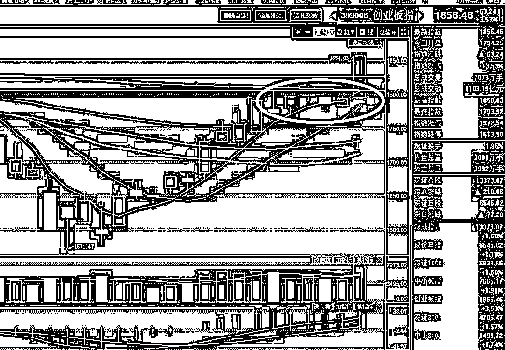
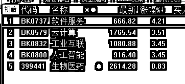
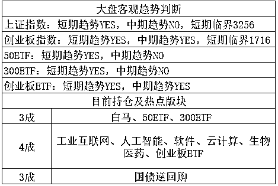

# 今晚给你们看个好东西

<link rel="stylesheet" href="view/css/APlayer.min.css">

今天，创业板全面启动，以横代跌完成横盘消化之后，几乎没有回调的情况下再次向上突破，于是在今天盘中，用之前的午评号发了紧急通知，在原有 3 成底仓的基础上，再次加仓 1 成，依旧加仓工业互联网、人工智能、软件、云计算、生物医药等创业板版块。 

我之前就说过，创业板的图形好看的不得了，唯一的缺陷是短期涨太高了可能会有个回调，而本次起爆，是创业板熊了一年半之久之后的第一次起爆，之前全部都是蓝筹白马、价值投资，谁买创业板谁 SB 的风气，所以首次突破的时候没有严格遵循客观趋势，因为主观上首次起涨肯定默认他是假的，必须等他涨出气势来才能确定价值投资的资金转移到他这里了。而今天暴涨的原因也已经明确了，今天的 IPO 又是 3 家，17 亿元，非常温柔，足以支撑下周的强势，而支撑创业板上涨的核心力量新经济版块，今天依旧非常强势，只有生物制药略拖后腿，不过医药版块都是属于防御版块，比如前几天其他 4 个版块不涨横盘的时候，他涨的是非常欢快的。

而今天下午，既然都加仓了创业板，那可以预计这股力量足够支撑上证指数完成那微微一跳突破压制线，于是顺手加了 3 成白马股，这 3 成是当压舱石用的，毕竟现在蓝筹和题材还是平分秋色，既然他的客观压制线被突破，怎么也要买一点，至于剩下的 3 成依旧国债逆回购进行无风险套利，等机会。

后来想了想，我还是编写一个表格吧，以后每天的正文写我的主观看法，以表格形式列客观看法，下面这个表格如同机器人一般描述客观走势，不带主观看法，这里给大家讲一下他的用法。

短期趋势，指的是日 K 级的趋势，看多标注 YES，看空标注 NO，属于趋势派的右侧交易，后面会标注他的临界点，当原趋势为 YES 的时候，如果收盘低于临界点，则会翻空。而中期趋势，则是周 K 级的右侧，中期趋势翻多，一定是滞后于短期趋势翻多的，操作上看短期趋势即可，那么那么中期趋势有什么用呢，当短期和中期趋势都看多的时候，突然暴跌的概率几乎就没有，任何异常下跌，都是送钱的机会，可以强烈看多。当短期趋势和中期趋势一个是 YES 一个是 NO 的时候，那就未必，需要谨慎看多。

客观趋势适用于剧烈波动的股市，波动越剧烈，其效果越好，如果波动非常缓慢，那么这么做基本等于在送手续费，所以我会以主观看法进行补充，但是纯客观的描述，我觉得还是有必要的，而且这个表格一目了然，我觉得很好用，以后就可以集中精力写正文了，不必每天都重复一遍。

我在表格里标注了上证指数，创业板指数，50ETF，300ETF 和创业板 ETF 的趋势，我觉得已经够用了，以后如果有需要的，我再加上去。

其中，**50ETF 的购买代码是 510050，300ETF 的购买代码是 510300，创业板 ETF 的购买代码是 159915。**

至于国债逆回购，是一个无风险操作，除非国家崩塌，其可以认为是现金使用，不过每年比起纯现金不动，可以多弄 3~4%的收益率，关于国债逆回购的操作方法，我曾单独写过文章，可以点击《谈国债逆回购》

列表如下，以后每天放末尾。

紫色的股

经济-金融-投资