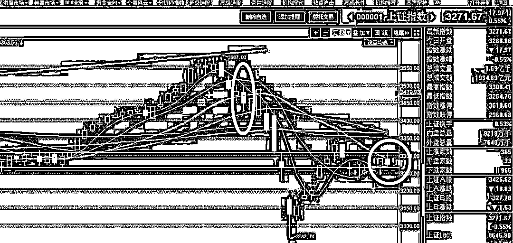
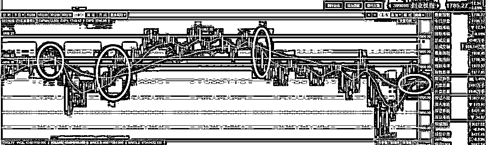

# 上涨压制线差一点被突破

   <link rel="stylesheet" href="view/css/APlayer.min.css">

今天上午开盘，上证指数一路上冲，创业板一路下滑，出现典型的二级分化，其中上证指数直接冲破了 3300 上涨压制线并坚持到了 11 点，随后扛不住了开始下滑，最后收跌 0.55%，3300 得而复失。

为什么说 3300 点是上涨压制线呢，我们看看下图。

我们知道，春节之前有过一波丧心病狂的暴跌，而我们差不多在 3450-3480 附近就分 2 波跑路了，第一波跑路是遵循的上证指数的 20 日均线被击破，第二波跑路是遵循的 50ETF 的 20 日均线被击破。第一波是纯被动的跑路，本质上是不想减仓的，因为上证虽破位，但是 50 和 300ETF 非常强势甚至还在创历史新高，所以当时还看多，第二波是被动+主动减仓，指标显示空头，主观也看空，在这二波减仓里，20 日均线都占据核心地位。

于是春节前的伤心病狂的暴跌就这么躲过去了，躲过去之后，并没有轻易抄底，第一波有超跌反弹是肯定的，但是第一波的超跌反弹向来都是刀尖舔血的事情，还是等缓慢筑底再上比较好。至于创业板，创业板自从 17 年下半年就开始看风格转换了，最后还是买 50 和 300ETF，所以创业板的反弹更不会参与，等他哪一波引领风骚了再说吧。

这就是当时的判断逻辑，在这个逻辑下，我们等了很久很久，如今上证指数终于再次触碰到了这根线，这根线之前是支撑位，下跌的时候支撑力强大，所以破了要跑路，如今就是上涨压制线，上涨的时候抛压沉重，所以突破要买入。

当初暴跌的时候，下方 3200 处是留有一个巨大的缺口的，天然具备强大的吸引力，前一段时间国外天天跌，都死活不补缺口，国外稍微好一点就试图突破 3300，那么可以判断，一旦缺口被补足，就会引来超多的抄底盘，这种抄底盘的力量有可能支撑大盘根本不补这个缺口，要补这个缺口只能依赖国外大跌的力量来干涉，否则很难了。

今天突破 3300 点，但是得而复失，收盘没有站稳，所以需要继续等待，但是没关系，已经等很久了，不在乎多等这一会了，而突破失败后，抛压并不是很大，回撤的非常慢，只是被重新打回横盘区间而已，从盘口走势判断，这里回撤休息一段时间后，还会重新向 3300 发动攻击。

对于创业板而言，这一波走的是扬眉吐气，直接逆转了过去的疲软形象，创业板的上涨甚至对蓝筹构成了吸血效应，虽然没有直接把蓝筹给吸崩，但是目前来看，和蓝筹算是平起平坐的地位了，而创业板的指数，短期指标和中期指标，已经全部转入多头了，尤其是有着新经济的大旗帜，给予了明确的炒作方向。

全部转多归转多，但是创业板这一波涨的太多了，短期之内回调压力是非常明显的，看多，但是不追高，这个时候追求开始的时候就重仓压创业板已经没意义了，从目前来看，暴跌之后精准重仓抄创业板的大 V 几乎没有，重仓持有创业板的几乎都是常年重仓创业板，一路跌下来不知道亏多少的，这一波反弹也只能是勉强回点血而已。这一波做的最好的就是顶部减仓跑路，甚至顶部减仓跑路，底部精准接飞刀买回到重仓也很少，因为这一波属于 V 型反转，非常罕见，从概率上说，是极低的，接这个飞刀死的概率是远大于抄底成功的概率的，炒股就是炒概率。。。

从目前来看，创业板的图形明显比上证指数好看很多，趋势即将逆转，我们在图中可以看到，EXP 白线即将上穿黄线，而在过去一年多的时间里，这个指标有效的指出了创业板的中期趋势，加上我们的主观判断，所以判断中期趋势转多，并且抄底区间提升到 1750 附近，也就是交叉点。

而上证还处于逆转的临界，所以下一波反弹的走势，创业板会强于上证，开头谁强，谁就会强一整波，这是规律，所以这一波的仓位分配比例可能是 46，甚至 37 开，创业板仓位占大头。

不过目前来看，创业板短期涨太多，看好他，但是就等回调一下，创业板是典型 V 型反转，已经很难回调到踩第二只脚的区域了，略微回调，可能就会再度加仓。而上证蓝筹目前没有仓位，即将濒临突破上涨压制线，这一段时间他都没怎么反弹，所以有可能是先买他，具体先买谁，那就看是创业板先回调到位，还是上证先突破压制线了。

紫色的股

经济-金融-投资