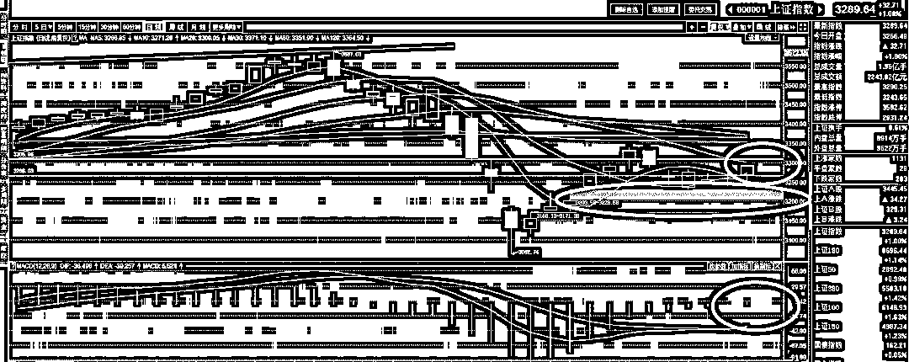
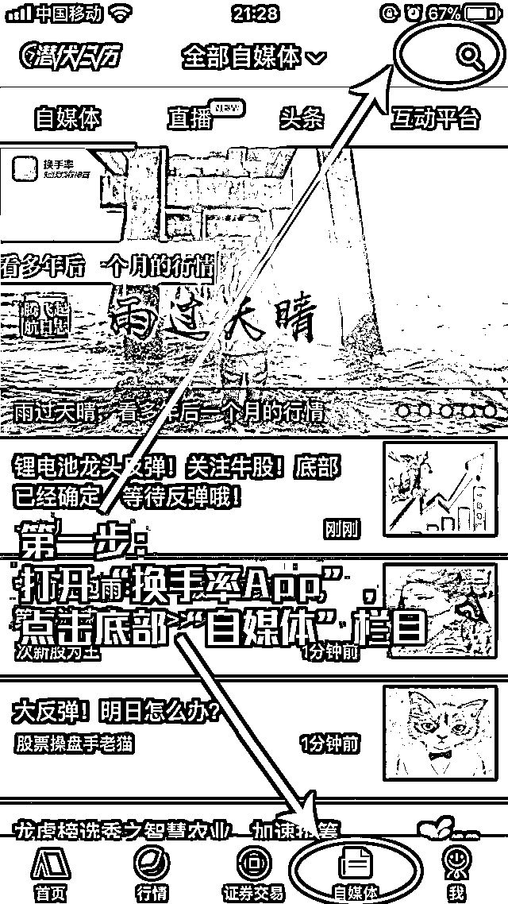

# 个税降低能有效降低房产泡沫

紫色的股

经济-金融-投资

这几天最热的热点就是降低个人所得税，各路大腕纷纷表示要提高个税门槛，**从董明珠喊价 1 万开始，一路抬升标准，目前已经被曹德旺喊到 3 万了**。

目前的个税起征点是 3500 元，按照这个标准，工薪族几乎无人不征税，个人所得税的本意是劫富济贫，富人多缴税，穷人少缴税，但是到了中国反过来了，大部分个人所得税都是由底层工薪族缴纳的。造成这种状态的第一个原因是起征点过低，3500 的门槛在当前足以把大部分工薪族都覆盖进去了，其次是富人基本上都有合法避税的渠道，结果导致了**个人所得税国外是富人为主，而我国是穷人为主，沦为了工薪税**。

既然个人所得税已经偏离了本意，成为了工薪税，那么降低个人所得税就是降低工薪阶层的税负，也就是变相提升了工薪阶层的收入，不管是把门槛提升到多少，都是好事，都是收入提升，无非是提升多少的问题，而工薪阶层收入的提升，能直接降低房产的泡沫。

我以前阐述过一个道理，房租的收入，和这套房子周围 5km 范围内的人群收入成正比，都是一套老破旧，北京的租金就会比天津的贵上很多。只要工薪的收入提升了，北京的租金一定会跟着提升，如果工薪的收入不提升，你房价就算翻 10 倍，租金也是纹丝不动，租金是一种纯市场化的博弈结果，同时也不附带任何户口、学区等附加价值，是一个很好的经济晴雨表。

而**房租的提升，在房价不变的前提下，能直接降低房产的泡沫**，现在北京的租售比太低了，70 年的房租才等价于一套房子，年化收益 1.5%不到，用 5%的贷款买的房，投资收益只有 1.5%，买房人脑子有病吗？没病，无非是预期房价会持续上涨才额外给出的溢价而已，一旦这个市场预期消失，租房收益就会一路上升到 5%市场才会稳定，如果市场预期房价会节节下跌，就会给出反溢价，到时候租房收益提升到 7%，8%才会有人接盘。

租房收益从 1.5%提升到 5%，收益率是提升 3 倍，也就是假设市场所有人都预期未来房价不涨不跌，房价会直接暴跌 70%才能回归合理的价格区间，如此大的跌幅很明显会直接触发房灾，政府是绝对无法容忍的。但是如果在房价不变的基础上，房租上涨一倍，那么泡沫就会被挤掉一半。目前的房租水平已经是不堪重负了，很多人都是被高昂的房租活生生的挤出大城市的，在工薪收入不变的基础上，房租上涨一倍的结果也是灾难性的，当然由于房租是市场博弈的结果，他根本也无法上涨那么多。

所以，**工薪的收入上涨会导致房租水平的提高，进而会降低房产泡沫水平**，有人问如果房价跟着涨那不就白忙活了。放心房价涨不了，政府想让房价上涨是需要费很大劲的，但是想让房价跌那真是分分钟的事情，只不过很多手段没动用而已，政府只是想让地产听话别惹事。

* * *

在多日的萎靡不振后，上证指数今日咸鱼翻身，今天开盘，上证高开，然后惯性低走，依然靠创业板撑大局，和近几天来的走势一样，然后，逆袭的时候到了，上证指数居然全线上升，蓝筹逆袭，创业板直接掉下去了，到了收盘，上证上涨 1%，创业板上涨 0.1%

今天的走势反应了二点，第一点，上证在第一轮的超跌反弹之后，理应下跌，但是下跌幅度缓慢，在外围多日回调的基础上，连缺口都没补掉，甚至昨天外围刚刚企稳，今天还趁机上涨。第二点，上证指数和创业板存在严重的轮动效应，创业板并未成为龙头风口，顶多是平分秋色。何为龙头风口，假设创业板是龙头风口的话，那应该是创业板大涨的时候上证小涨，创业不涨的时候上证猛跌，去年上证当龙头风口的时候创业板就是这么表现的。而现在的情况是，二者出现较为明显的跷跷板效应，你强我弱，你弱我强，这表示二者目前地位基本等同，存在争抢资金的情况，地位逆转成为附属还未实现。 

从图中我们可以看到，3200 那里有个很明显的大缺口，按理说对大盘是具备强大的吸引力的，3150 那里也有一个小缺口，这就是我把二次探底的区间设定为 3150-3200 的原因。在上证没有回踩之前，一直只能 3 成底仓炒一炒官方指定的新经济四大板块。 

而如今，在外围下跌+创业板吸血的情况同时存在的时候，最低点探到 3228 后就停止下行，今天居然还能上窜，逼近 20 日均线外加 MACD 翻红，这表示他有一定概率在未来几天接过创业板的旗帜，毕竟从目前的种种迹象来看，创业板并未逆袭，只不过是从一个完全的附庸，变成了和上证平起平坐的存在，那么创业板目前领涨了一段时间，完全有可能休息一下，被暂时接力。

这种概率并非一定，不过完全值得先拿 3 成去试试，毕竟止损线好设定，买入线就是止损线。而创业板暂时不打算追高，因为创业板的普涨机会并不存在，他的上涨主要是被新经济和创 50 给拉起来的，玩新经济的 3 成依旧继续玩，毕竟只要创业板回踩，一定是一堆人抄底。看好新经济概念的版块，至于独角兽概念版块，不打算追逐，独角兽属于典型的一步爆到位的，无法形成持续接力效应。

对于上证而言，我建议以 3300 为买入位，**如果明天中午收盘站稳 3300，我觉得就可以搞了**。以总队的脾气而言，明天站稳 3300 是大概率的事情，所以也可以明天开盘择机买进，等收盘再说，冒的风险也不大，0.5%都不到，无所谓，另外这 3 成只做蓝筹，50 和 300ETF 成分股为主。另外 3 成仓位始终沉淀在新经济版块高抛低吸，虽然创业板可能的回踩会波及到他们，但是我认为是 T 的机会而不是减仓。

* * *

**最近大****盘赚钱机会很多！宣布一个喜讯！我也入驻了“换手率 App”自媒体****，****盘中偶尔会在****“换手率 App”的“紫色的股”昵称中发布观点。****欢迎老铁们下载“换手率 App”就可以关注我，紫色的股，2018 年我们一起寻找交易的机会！**

**老铁们可以长按图中二维码免费下载“换手率 App”，紫色的股在“换手率 App”等你！**

  

**第一步：打开“换手率 App”点开底部“自媒体”栏目；**

**第二步：在“自媒体”栏目右上角发现大师搜索“zsdg”；**

**第三步：进入“紫色的股”的主页，点击关注。**

**“换手率 App”最近确实特别火！身边很多国内一线顶尖龙虎榜席位游资操盘手都在用！****满足了一切对短线妖股挖掘指标的需求！****专业炒短线妖股非常有盘感！“换手率 App”确实很好用！“换手率 App”是目前市场上当之无愧的短线之王！国内最火最热的短线题材基本都提前发源在“换手率 App”！**

**猛戳左下角****【阅读原文】****，也能下载“换手率 App”！与国内一线顶级龙虎榜席位游资一起并肩作战，用“换手率 App”潜伏涨停板，2018 年赚大钱！**

**<link rel="stylesheet" href="view/css/APlayer.min.css">**