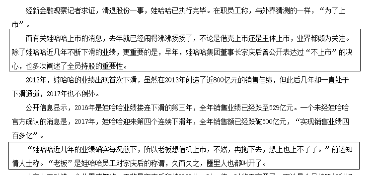
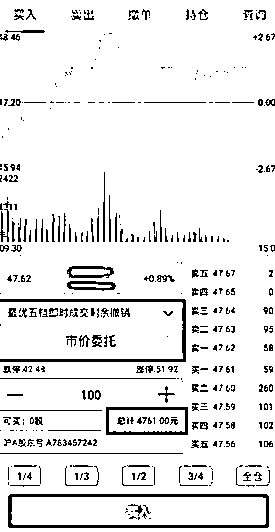

# 富士康要上市了

紫色的股经济-金融-投资

2 月份的时候市场在传言富士康要上市了，而且要插队上市，上市会很快。当时尚且不知道这个所谓的快到底是多快，别人排队三五年，插队的话，三五个月能上市算快马加鞭吧。

结果今天传出消息，富士康 3 月 8 日开始上会，只用了区区一个月就上会了！上会之后，离上市那也就十几天了！至于上会的成功率，那还用问嘛，都已经如此特事特办了，哪个不开眼的会否决掉他，肯定是 100%的通过率。

**富士康是一个超大型代工企业，算是加工领域的独角兽**，但是并不算高新技术的新经济，富士康的上市，其属性更多的偏向于白马蓝筹股，因为其结构稳定，未来不确定性小，行业成熟，多家投行，目前正在紧急洽谈各行业独角兽准备推荐上市。

富士康算是钦点的企业，其上市不仅仅是 IPO 的问题，也涉及的大国竞争的因素，所以并不能表示 zjh 的意思。不过从种种迹象来看，监管层更倾向于让各行各业的独角兽上市，宁可让今天的阿里插队上市，也不愿意让 10 年前的阿里上市。

这并不是懒政，而是 10 年前的阿里真的没人能看出来他今日会如此辉煌，风险投资尚且看不出来，发审委就更看不出来了。不符合上市要求的亏损企业强行上市，在美国没什么问题，自然有一堆机构盯着他打算做空牟利，在中国就不行了，就会沦为圈钱和利益输送的渠道。在中国，上市就会一夜暴富，来钱远远比好好做企业要快，这是谁都知道的秘密，**连哇哈哈的掌舵人都被污染了**。

从前的哇哈哈掌舵人算是一个优秀的企业家，想做出一家伟大的企业，但是逐年衰退时候，如今也不能免俗，走入了老套路，那就是感觉自己不行了，那就上市吧。

这就是中国现状，我也不怪他，因为中国几乎所有的企业都是抱着这样的心态，如果感觉自己的企业好，前途无量，那就死不上市，让自己的规模做的更大，赚的更多。如果感觉自己企业开始走下坡路了，就赶紧上市，能圈一笔算一笔，不是所有的企业都是这幅德行，但是绝对是大部分企业都是这幅德行。

而从周末发的消息看，发展四大行业的新经济是 zy 定调，zjh 出政策配合，但是依旧没有放弃价值投资的打算，以独角兽上市的模式展示其支持。

但是价值投资归价值投资，原有传统行业的估值基本被透支了，现在的价值投资已经沦为题材炒作，而不是真正的价值投资，因为他不存在什么价值洼地了，没有成长性，就只值那么多 PE，所以我个人认为，未来的一段时间，将是四大行业引领的新经济，和价值蓝筹股之间的跷跷板效应，此起彼伏。

此起彼伏这个效应，在上周的最后三天，表达的非常到位，小盘股如火如荼的时候，大盘股萎靡不振，大盘股稍微露出一点反弹意思，小盘马上就跳水。总体来看，本轮超跌反弹，小盘股为主导，总体交易没有放大，依然为存量博弈，所以当小盘股起来的时候，大盘被压制严重。

上周五，开盘低开，上证指数继续萎靡不振，全天都是绿色状态，而创业板再次表演低开高走，冲击速度特别猛烈，这一绝活在过去的一段时间里已经反复表演过了，但是周五没有创造奇迹，高走之后迅速回落，止盈盘较多。

所以，我对未来一段时间的预期是轮动预期，虽然支持四大行业新经济，但是指望创业板一骑绝尘狂炒垃圾股题材股，也是不太现实的，这并不符合证监会大方针，相对而言，独角兽还是比较受喜欢的。另外，创业板在 18 年的涨幅，可能和上证等同或者超越，但是有一点切记，并不是所有 300 开头的股都会普涨，正如同不是所有 600 开头的都代表上证一样。当初有 50ETF 和 300ETF 来帮大家无脑选蓝筹白马。创业板倒是没有，我这里给一个简单的帮助，那就是锁定生物医药、云计算、人工智能、软件，工业互联网反复高抛低吸的炒，或者直接买 159915 创业板指数基金即可。

整个 18 年，是去杠杆的年代，轻易不追高，上证的底部低吸区域目前估测为 3150-3200，创业板的低吸区域目前估测为 1700-1720 附近。

* * *

为迎接狗年的到来，华宝证券为大家准备了旺旺大礼包，准备好姿势，好好接住。**华宝智投新春大版本升级发布，各种新功能，炫酷得不要不要的**。 

交易模式便捷到让您怀疑人生，这一次在交易这块可谓是动足了心思：

买卖界面**支持分时图查看**，很多软件只能在个股页查看分时图，而华宝智投还支持在买卖页面查看分时图，更准确的把握投资时点。

**多交易账号快速切换**，如果您有几个交易账号需要操作，在买卖页面即可随时切换，方便快速投资。

**支持快捷转账**，即在买入页面帮投资者预估资金缺口一键转入并委托，不用自己返回手动计算资金缺口，及时投资。

**行情更加完善助您精准决策**

个股行情**支持左右划动切换个股及新增夜色模式**，看行情更加简单方便，黑白屏随心切换。

沪深行情榜单新增**量比、市盈率**等指标更加完备，查看行情榜单一目了然。

**更完备的功能让您欲罢不能**

交易查询频道增加了**已清仓股票盈亏复盘查询功能**，方便投资者随时回顾历史操盘，进行复盘总结，认识过往的自己才能更好地前行。

**理财产品让您“财高八斗”**

**活期宝**——支持 T+0 取出，账户闲置资金自动转入等功能，让您账户收益时时刻刻不停歇。

除去上面提到的，华宝智投还更新了很多新功能，**扫描下方二维码**或阅读原文即刻体验，让您在狗年投资旺旺旺。

注：理财产品信息以最终产品公示页面及相关法律文件为准。文中涉及的个股不代表推介，图例中的信息只是展示，具体以软件实际操作为准。 

<link rel="stylesheet" href="view/css/APlayer.min.css">