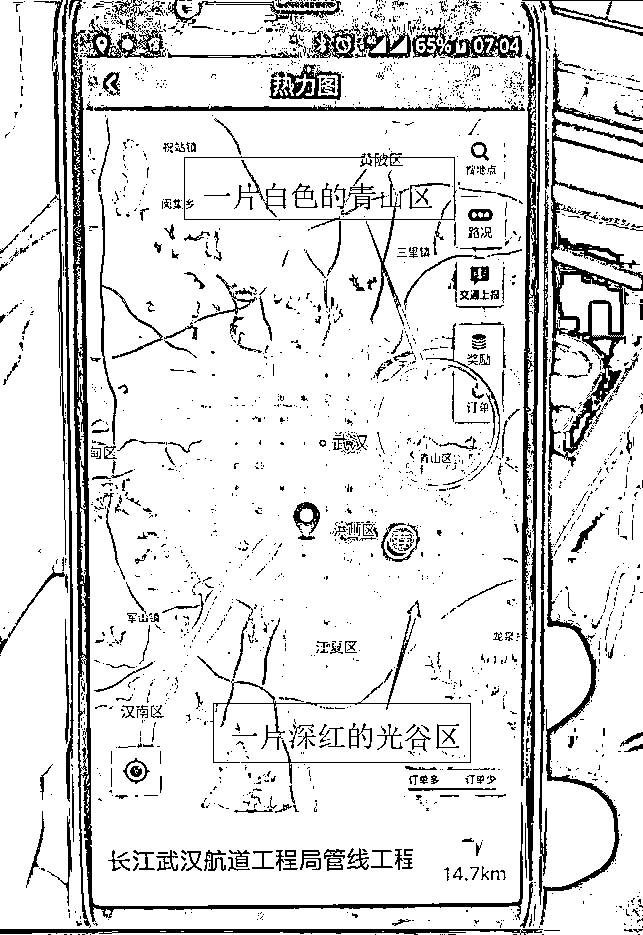
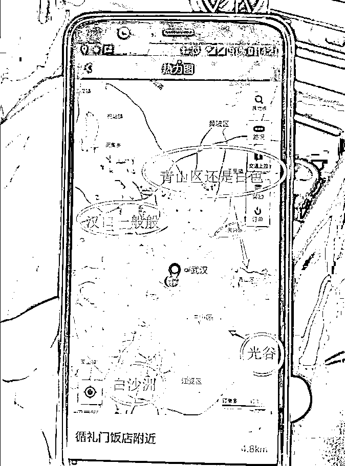

# 滴滴软件也能拿来炒房，劳动人民真聪明

喜欢我的都关注我了~

今天出门有事，叫了一辆滴滴快车，结果在和司机闲聊的过程中发现这位司机大哥是一个拆二代，家里有 7 套房，每年收租达到 50 万。他之所以出来跑滴滴有二个原因，第一个原因是在家里太无聊了，每天出来拉几个小时打发下时间，第二个原因是滴滴软件居然可以拿来炒房，他靠这个软件来每天监测武汉的房价，简直太神奇了。

首先做一个免责声明，这个不是滴滴的广告贴，是一个客观陈述日记贴，老粉可以知道，以前滴滴出负面新闻的时候，我喷滴滴的帖子不是一个二个了，是一群。而为什么我出门还用滴滴，这就涉及一个用户习惯的问题了，用惯了就懒得换，只是不敢拿滴滴出远门和走荒野了，白天在大城市里走我还是没啥心理负担的，我还是个男的。这种路径依赖的用户习惯，从某种意义上，让滴滴有能力涉嫌垄断。

好了言归正传，我们首先来看一下，这位滴滴大哥的炒房逻辑。

滴滴热力图

当时我打车到武汉青山区，这位司机一听青山区就开始吐槽，说以前武钢在的时候，青山区到处都是打车订单，武钢倒了之后，滴滴热力图上青山区都快成白色区域了，订单特别少，拉客人去青山，很多时候都是空车回来的。

我当时就问，热力图是啥，这位司机大哥马上就来劲了，说热力图是个好东西，他当年就是靠热力图分析的武汉房价，果断把汉口的房子卖了在光谷买的房，结果房租收益比以前的邻居高好多，然后洋洋得意的给我秀他的收入，说他把拆迁款和拆迁房收入的钱，在光谷买了 7 套房，年入租金 50 万。

滴滴热力图是司机端的一个界面，系统把打车密集的地方标记为红色，打车越多，红色越深，这个软件推出的目的，是方便司机了解目前打车需求巨大的地方。然后这位拆二代司机大哥当时一门心思想找租金高的地方多买几套房子，以后靠租金吃饭，自己也不懂金融软件和工具，就打上了这个软件的小心思。

这位大哥向我展示了他保存的手机截图，早上 7 点的时候，很明显青山区是一片空白，而光谷区出现深红色。

然后他还给我展示了除高峰期外的一张图，下午 2 点，图中显示打车需求最密集的地方，还是光谷，另外白沙洲区域也上榜了。青山区依然一片白色，汉口地区一般般。

我问司机大哥为什么不去白沙洲买，司机大哥说他跑到白沙洲特地进行过考察，白沙洲的用车需求主要是因为那边新建了大量住宅，但是却没有通地铁，公交覆盖的密度也不够，所以产生了大量的需求，和光谷那边地铁发达公交发达却依然有大量用车需求的情况没法比。

司机大哥据此判断，光谷是武汉打车需求最大的地方，所以经济也是武汉最活跃的地方。他们家当年拆迁房是在汉口的，他根据自己的研究成果据理力争说服了爸妈，把分来的房子都卖了跑到光谷买了 7 套房，都改造成独门独卫的单间那种租出去。同等资产的情况下，租金收益明显比汉口高一截，从此他成为了家族英雄。

光谷的奥秘

这位司机大哥的判断是没有错的，他根据热力图得出目前光谷经济最活跃的结论是对的，不过他这种分析办法是落后的，因为等热力图显示出来这里具备大量打车需求的时候，也表示该地区的经济已经成型，他此时选择，是比普通人快一点，但是比正常的分析办法，要慢很多。

光谷为什么领先于武汉经济，青山为什么垫底于武汉经济，汉口又为什么不温不火，这都是有道理的。

光谷经济之所以发展这么快，和政府的规划有很大关系，十几年前，武汉市政府就明确了光谷新技术开发区的地位，所有的高新技术企业，全部用优惠政策引入光谷区域，而且重点引入电子软件行业，试图打造中国的硅谷。

而恰好，最近几年软件行业大爆发，IT 男虽然苦逼，但是个个穿金戴银的，光谷经济自然也跟着腾飞，那么原来在这片区域买房子的人，都跟着享福了。

这位司机大哥还告诉我一个好玩的事，光谷那边最好租的房子，位于光谷软件园附近，一套房子离开软件园 100m，则月租金少 100 元，可谓寸步寸金。

青山之所以垫底，那自然是因为经济支柱武钢集团倒塌了，整个青山其实都是围绕武钢这一个企业转的，武钢没了自然整个区域的经济都崩了。

而汉口之所以不温不火，那是因为汉口代表的是传统商业经济，在电商的冲击之下，谈不上崩塌，但是发展速度肯定明显迟缓与光谷很多。

这位司机大哥靠热力图炒房，没有问题，不过迟缓很多，那么最好的投资买房办法是什么呢，不是根据热力图，是根据行政规划图。

行政规划图明确未来的发展方向在哪个区域，优惠政策向哪些区域倾斜，哪些区域就会值得投资。

有人会问了，政府让企业去光谷，企业就一定去光谷？他们会这么听话吗？当然不会，政府没这么万能。

但是当政府全力以赴发展光谷区域经济却依然失败的时候，可想而知，其他区域的经济也好不到哪里去。武汉市和杭州市相比，很明显武汉市的软件经济完败，光谷没有成为硅谷，杭州阿里大厦附近，更像是中国硅谷。但是在武汉市内进行竞争排序的话，不管武汉市整体发展的好还是坏，光谷的经济增速都会领先于武汉市其他区域。

所以对于全国任何一个城市的居民来说，直接跟着行政规划走是最保险的事情，涨的时候会比别的地方多涨点，跌的时候会少跌一点，而很多普通工薪族其实并不清楚这个规律，他们都是按自己的心情去购买。。。

那么专业的炒房族知不知道这个奥秘，那当然知道啦，这个在专业投机客眼里是很基础的知识，压根都谈不上奥秘。不信，你看看宣布雄安新区的时候，有多少人冲进去抢房子了，北京人是全国最懂行政规划威力的一群人，没有之一。这套战术唯一的风险就是遭遇政府强行干涉，几乎没有啥大问题，完全是在赚那些不懂政治工薪族的智商税。

而位居中间的，就是那位开出租的司机大哥了，虽然不懂金融，也没有分析工具，但是靠自己的聪明才智，巧妙利用周围一切可以衡量经济的东西来做出判断，虽然慢了一点，但是依然比普通人要快，这是劳动人民的智慧，值得赞叹。

排在末尾的，就是那些后知后觉或者干脆没有知觉的普通人了，买房完全看这个房子长的漂亮还是不漂亮。。。

知识不是万能的，但是很多时候，知识还是有点用的。

~~~

最后插播一个知识，我个人使用发现，很多时候使用滴滴快车，有时候会长达 5 分钟都没有响应，这个时候我直接取消订单，然后选择滴滴优享，10 秒之内就会有司机接单，这种事情我尝试至少 3 次了，屡试不爽。

我不知道是啥原因，不瞎猜了，怕滴滴告我诽谤。

觉得此文的分析有道理，对你有所帮助，请随手转发。

长按下方图片，识别二维码，即可关注我

近期精彩文章回顾（回复“目录”关键词可查看更多）

华为员工都这么穷，怪不得拼多多能火 | 房价跌 20%就会全面崩盘，地产杠杆远比你想的要脆弱 |  为什么碧桂园的质量那么差 | 清醒点，放弃全面开征房产税的幻想 | 央行和财政部隔空掐架，我支持央妈 |中国土地制度源自香港，但是香港却是劏房密布 | 为什么中介哄抢租赁房源，因为贩毒都没它来钱快