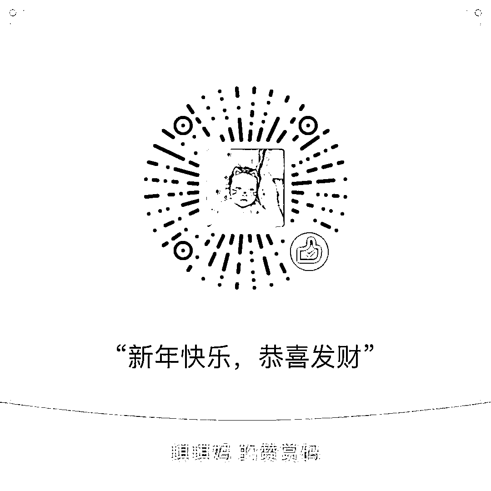

# 春晚收视率下降是不可逆转的趋势

<link rel="stylesheet" href="view/css/APlayer.min.css"> 这几年春晚的收视率一直在下降，昨天大年三十刚看了春晚，正好谈谈这个话题，我认为春晚的收视率下降是一个不可逆的趋势。

好多人说春晚的收视率逐年下降是因为节目老化，新鲜感不足，天才演员的江郎才尽等等，其实并不是，我个人的看法是，春晚不是几个天才导演和天才演员能解救的，本质上属于电视时代的终结，正如同手工业社会里，再天才的手工师傅，也无法拯救整个手工行业，他是无法和机器时代对抗的，因为那属于时代的趋势。

平心而论，春晚的质量是很高的，不管是歌曲、舞蹈还是小品，都是国内甚至国际顶尖水准，在春晚舞台之外，是很难看到如此高质量的作品的，集合在一起，那更是难得。如果没有外力干扰的话，我肯定是目不转睛的看完的，我不怀疑春晚的实力。

但是偏偏，干扰是存在的，而且很多，地方卫视那个就不谈了，毕竟也是电视节目，无非就是尺度比春晚宽一些所以精彩一点，春晚只要尺度放宽立马就能反超，毕竟最顶尖的人才都在春晚上面，但是春晚作为国家门面，只是为了精彩而放宽尺度，未必是好事。

最大的干扰，来自于电脑和手机，尤其是手机，手机的精彩无处不在，很多人看春晚的时候只是象征性看春晚，人在心不在，只是为了陪爸妈才看的，全程很难抬头，大部分时间都在刷手机玩，很多人宁愿花半小时去抢马爸爸的一块钱红包，都不愿意花半小时看含金量十足的春晚，手机就是年轻人的第二生命，即便是除夕+春晚，都很难竞争。

这不是春晚的错，也不是导演或者演员的错，我上面说过，就算出现几个天才导演或者天才演员，也只能短期内提振春晚人气，缓缓下跌依然是不可逆趋势。我举个例子，我已经几年时间不怎么看电视了，脱离了工作电脑，基本就是手机的天下，脱离了手机，那就是只剩下睡眠时间了。电视在家里基本就是个装饰品，还有老人来的时候开给他们看看。

整整一年的电视节目，那么多电视台，里面的精华加起来绝对是远远超过春晚的，但是看的时间微乎其微，而且不是个例，越年轻的人看的越少，只有在没手机玩的时候才会被迫去看电视。

如今电视和手机的关系，让我想起了几十年前农村唱大戏的，每逢年关，乡村里如果有扎台唱大戏的，那可热闹了，十里八乡的都赶过去看，受苦受累受冻那都不是事，就为了去看戏。是因为他好看吗？的确很精彩，但那是因为当时还没有电视机，等到农村普及了电视之后，唱戏这个国粹从江湖霸主的地位，逐渐式微，不管是黄梅戏还是京剧，观众都大幅度减少了，远没有旧社会一统江湖的盛况了。

电视机成了娱乐界的霸主，饭后看电视成为了家庭的主要娱乐，这一切持续了几十年，一直到智能手机的出现。这是一个神奇的东西，能够胜任电脑的大部分娱乐功能，不谈工作，仅从娱乐方面说，就是个掌上电脑，网络世界的精彩完爆电视机，电视有的功能手机都有，手机有的功能电视没有，这仗没法打。

如今我们还看春晚，更大的原因无非是想陪爸妈聊聊天，至于上面的节目，我认为能把电视机旁刷手机的头勾引的抬起来看一下的节目，都是顶呱呱的，已经很了不起了。

电视机取代了舞台成为了过去几十年的娱乐载体，而春晚作为电视机时代的最强娱乐精华集合体自然称霸江湖几十年，而手机正在挑战电视机的娱乐载体霸主地位，正如同当年电视机挑战舞台戏剧一样，这个过程是时代进步的趋势，是缓慢但是不可逆的，我并不认为春晚收视率下降是导演或者演员不行，他们个人的力量违逆不了大势，败，非战之罪也。

春晚的确非常优秀，集阳春白雪和下里巴人精华之大成，但是想全身心投入的看完春晚是越来越难了，哪怕去影院看一部电影，都比看春晚专注，这不是春晚的错，是时代进步所不可避免的缓慢趋势。

