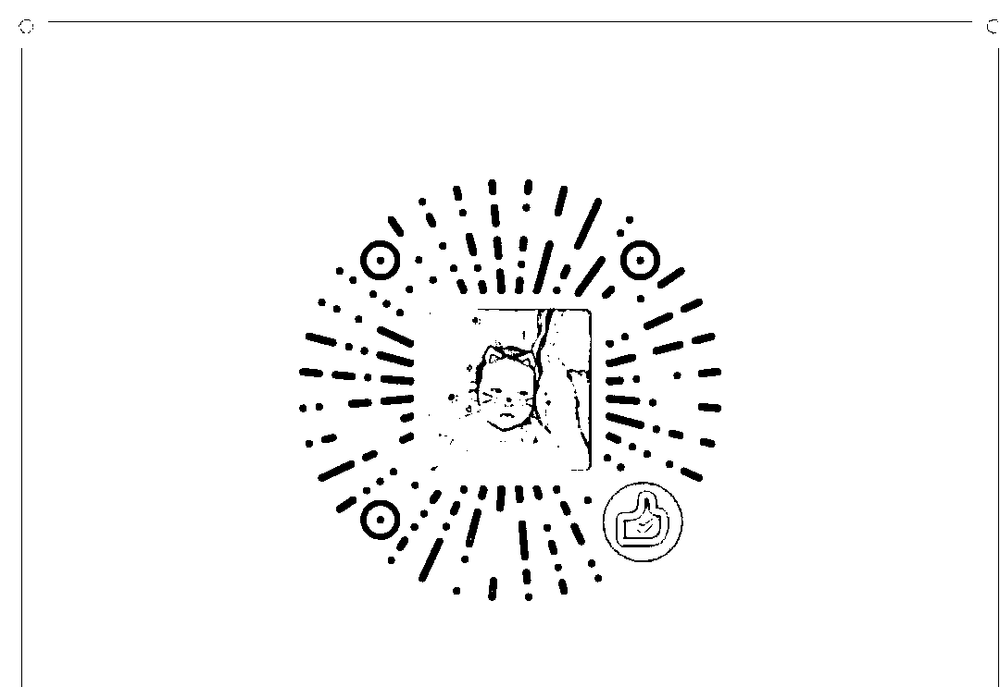

# 最后一个交易日就不折腾了

<link rel="stylesheet" href="view/css/APlayer.min.css">

昨天，美式四万亿计划被通过，特朗普宣布美国 1.2 万亿美金基建计划，抄袭中国的创意，这个消息导致昨天美股大涨，进而诱发了 A 股今天早盘的上涨。

不过这个东西的实际效果我昨天晚上实际就已经分析过了，效果肯定是有的，不过要是说像兴奋剂那种效果是不太可能的。有一个缓缓的释放过程就很不错了，因为美国和中国不一样，美国推这个计划那就真的纯粹只是一个刺激计划，而中国当年推四万亿，除了这些基建计划的刺激作用之外，更多的体现了国家意志，所以才止跌的那么迅速。

今天创业板全面熄火，虽然全红，但是个股涨幅一般般，蓝筹又开始启动了。全天出现冲高回落姿态，盘中上证最高涨幅 2%，到了收盘还剩 1%，创业板最高涨幅 1.2%，到了收盘涨幅 0.03%，勉强挂红，盘中几度翻绿。

那么观望结果也出来了，前几天都是题材主涨，到了今天直接改蓝筹，这并不是啥好事，因为前二天涨的并不多，然后题材就不行了，要换蓝筹接力。题材本来就没有优势，长期下跌趋势+官方始终压制，唯一翻身的希望就是赚钱效应远超蓝筹。但是刚涨 2 天就被蓝筹接力，赚钱效应根本谈不上压制，如果只是相似或者略高，那么不好意思，一定会被证监会给打死，价值投资才是主流，除非迫不得已，否则绝不会放弃的。

另外一个不好的点就是，没有龙头领涨，轮涨，尤其是大跌之后的轮涨，说明这里只是一个超跌反弹，未来如何走很不好说，超跌反弹是非常危险的，肉是有的，但是飞刀也很多，风险收益比太低，不划算，就好像前几天说的乐视网和保千里跌停开板千万不要抢是一样的。

这种连续跌停开板，是会有反弹的，但是 90%的概率都不是最终底部，所以第一次开板的反弹不是一个零和博弈，是一个负和博弈，参与的人是游资和散户，那么谁能安然退出，当然游资的概率大，这一点是显而易见的。

乐视网是反弹最凶猛的，当天从跌停到收盘+5%，参与抢筹的浮盈 15%，但是有几个人能把利润带来呢，次日直接跌停开盘，成交减半，然后连续下跌，今天又收跌 6%，大家看看成交量就知道了，开板第一天参与的资金怎么算他都是总体亏损的，就算这几天的卖单全部是开板日买入的都是，更别提还有一部分卖单可能是原有套牢盘，那样的话参与开板的资金亏损更大。除了乐视网之外，还有一个保千里也是超跌反弹，这个就更不谈了，直接活埋，看看 K 线图和成交量就知道惨烈状态。

* * *

今天的市场明星其实不是蓝筹，也不是题材，更不是冲高回落，而是一个次新股，养元饮品，他的主营业务大家也很熟悉，那就是六个核桃，这家上市公司只卖这个，靠这个大单品活着。

一个卖饮料的有啥好关注的，当然有，那就是他上是第二天直接被砸了个跌停。上市首日大家都惯性涨停，他也不例外，但是今天是上市第二天，直接跌停了，而且是早盘就封死跌停。

我分析了一下原因，首先是发行价过高，高达 78.73 元，这么高的发行价导致散户中一签的收益特别高，第一天账面浮盈就三万多，这对很多很多市值才十几万的散户心灵冲击是非常大的，至于 浮盈比例，那都无所谓了，要的是净收益。其次，是这个股市值特别高，流通市值 43 亿，总市值 549 亿，就股要是拉一倍，那市值就千亿了，单看流通市值也百亿了，太难了，靠六个核桃是绝对撑不起来的。

不过，即便是这样，这个股第二天直接跌停也是出乎很多人意料之外，看今天换手率就知道了，18%，也就是说至少 82%的人还没有跑出来，都等着继续数涨停板呢。这个股被称之为最有可能上市破发的股票，因为他的不利条件太多了。当然，如果上市几天就破发了，那是对 IPO 的打脸，不到迫不得已，都会有人去救的。

* * *

对了，明天是最后一个交易日，很快就过年了，记得别忘了点逆回购。至于大盘的总结，我觉得就没啥好总结的了，明天大部分资金都已经进入休假状态了，能有大波动才会见鬼呢，既然不会有大波动，那么横盘概率大，以总队的习惯，加上春节给领导图个喜庆，拉红盘的概率比较大，参与价值不大，不如等年后再说，毕竟春节期间时间太长，看看假期新闻再说吧。

