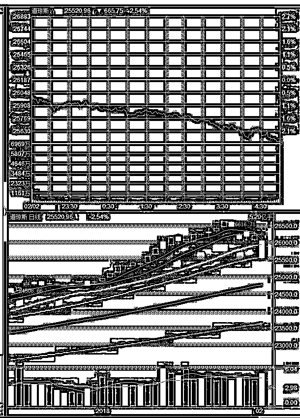
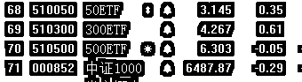

# 下周一先抗风暴

<link rel="stylesheet" href="view/css/APlayer.min.css">

本周五，IPO 为 4 家 51 亿，中规中矩，没有因本周的下跌而减速，也没有故意加速。**本周末的其他消息主要是美股暴跌，其余的消息和他比起来几乎都可以忽略不计**。

美股不是天天涨吗，都涨了 10 年了，怎么就暴跌了，跌多少算暴跌？看下图，美股周五是这么跌的，收跌-2.54%。

这种程度的下跌，放到 A 股里都能吓死一堆人了，放到涨多跌少的美股里，更是能吓死一堆，要知道美股想看到绿色都挺难，何况是那么大的绿色。

在 A 股里，目前是属于两极分化的上涨，蓝筹涨多跌少，题材涨少跌多。其实美股和 A 股也是属于两级分化的，美股涨多的少，A 股涨少跌多，10 年累计的差距是巨大的。其实可以类比成美股是蓝筹股，A 股是题材股，这样就很方便理解这 10 年来二者的累计差距了。

那么当蓝筹股下跌的时候，题材股都会跌的稀里哗啦的，类比过来，美股下跌的时候，也会给 A 股带来很大的冲击。当然，A 股在上周已经提前下跌，预支了很多跌幅，冲击力会削弱很多，但是绝对还是有冲击的，这一点非常好理解。

所以，下周一的时候，美股的这场下跌风暴会先席卷 A 股，低开是肯定的，消化掉这个冲击是必须的一个过程。

而周五的时候，触发超跌反弹，我们知道，上周蓝筹没怎么跌，但是题材股跌的太惨了，非常容易触发超跌反弹，但是本来是属于题材的超跌反弹，最终演变成了蓝筹收红，题材的超跌反弹是由开盘大幅下跌+尾盘微绿来实现的，特别惨。

这个收盘的唯一结果就是再次强调本轮风口依然在蓝筹，并不能说明什么。另外周五的超跌反弹其实是幅度较大的，如果这样的走势再来一天，估计本轮回调就可以提前结束了。但是由于美股周末暴跌的存在，下周一再来这样走势的可能性不大，概率很小。当然，由于 A 股提前透支的原因，跟随美股崩盘的概率也很低。

正常来说，美股跌 2.5%，A 股直接就吓尿了，崩盘大概率，但是既然上周已经提前预支了跌幅，那么下周如果低开太多或者盘中下杀过度，抄底盘会出来，当然，这种所谓抄底，都是来捡超跌反弹做 T 的，没几个打算真正加仓的。

毕竟，以目前的个股弱势格局，外加境外风暴来袭，下周一能稳住不跌，就算 A 股牛 X，真的很牛了，A 股引领全球向上，美股靠边站，这种好事敢想吗？期望就可以了，暂时距离还很遥远。

所以，下周一以观望+做 T 为主，盘中肯定是剧烈震荡，如果能站稳 20 日均线，那么会买回，否则持续观望。

* * *

周末监管层宣布将对虚拟货币境外交易平台网站采取监管措施，强化监管，排除风险。中国监管层对于虚拟货币的态度是深恶痛绝的，和国外呈现鲜明差距，但是偏偏最喜欢玩虚拟货币的就是中国人。。。

现在国内很多平台、ICO 项目组都搬到国外去了，以人民币计价的交易寥寥无几了，但是依然遭到再度打击，说明监管对于目前的现状仍不满意，要求继续打压。

那么，对于 A 股来说，**区块链题材，下周一会再次遭到打击，注意回避风险**。

* * *

周末美股带来了大风暴，上周 A 股的提前回撤，是不幸，也是大幸，因为有这个提前回撤，美股暴跌风暴给我们带来的影响可能并不致命，但是掀起单日巨震还是非常容易的。

故，明天做 T+观望为主，轻易不加仓，等风暴过去再说，总结完毕。