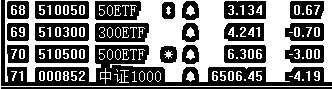
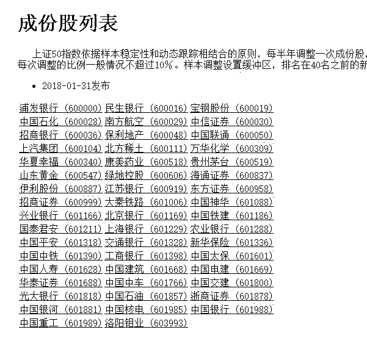
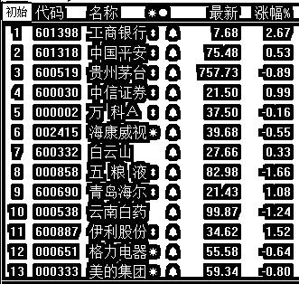

# 股票闪崩带来的暴风雨

<link rel="stylesheet" href="view/css/APlayer.min.css">

今天，题材股的黑色日，全天特点就是闪崩，所谓闪崩股就是那种走的好好的，突然被大单砸到瞬间跌停的股票，闪崩股带来了一场暴风雨，整个市场都在瑟瑟发抖。

截止收盘，市场共有 200 多个跌停，其中闪崩股都有几十个，蓝筹拼命拉升也最终被拖下来了，最终失守 20 日均线。今天市场比昨天还恐慌，恐慌的核心就是今天的闪崩股太多了，闪崩股这种东西是很罕见的，以前出现一个，就立马上头条了，今天倒好，不要钱似的，一出一大片，大家都担心自己的票会不会是下一个闪崩股，管他是不是，卖了再说，于是个股抛压沉重，绵绵不绝，始终拉不起来。

**这些闪崩股的特征是流通股中存在着大批的信托扎堆、业绩估值不匹配、大股东股权质押比例较大。**为什么这么说，首先这种闪崩股是一定和杠杆资金挂钩的，没有杠杆就不存在闪崩，只有当杠杆资金强平的时候，才会出现这种无脑摁跌停的情况。国家最近收紧信托以及场外配资，命令降杠杆，很多高杠杆信托到期之后不允许展期，当市场恐慌的时候，里面的某股资金可能就提前斩仓了，从而引发连锁穿仓。而信托资金，从来都是和大股东高质押挂钩的，股票大面积质押掉，再用信托资金高杠杆买上去维持股价，如此循环，是做市值常见套路。

所以今天出现了大面积闪崩，恐慌蔓延，而大量闪崩股收盘之后直接宣布停牌，停牌的都是一时半会找不到护盘资金需要时间凑资金的，不停牌的是手头还有点资金能抗一下的。这种大量停牌的风潮，让我想起来了 15 年的股灾期间。

没错，目前这种状态，对于中小创来说，和股灾没什么区别了，和蓝筹形成了强烈的二级分化，今天在一片惨绿的状态下，50ETF 依然上涨了 0.67%，300ETF 也只下跌了 0.7%，对比之下，中证 1000 下跌了 4.19%之多。

从这张图我们可以清晰的看到，盘子越小，跌幅越大，盘子最大的 50，昨天上涨 1.24%之后，今天再度上涨 0.67%，而题材小盘股，业绩地雷引爆之后，连续 2 天的走势可以堪比股灾了。今天其实蓝筹是努力上涨拉盘的，但是题材跌的实在是太恐怖了，硬生生的就给拖下去的。

我这一个月至少谈了 7 次，只买蓝筹，题材股扔一边去，至少本轮风格没有切换，前一段时间的上涨，大家无非是涨的多涨的少而已，后来题材还补涨了一段，差距几乎拉平了，但是这二天，当蓝筹一跌的时候，差距立马就凸显出来了。当风口不在蓝筹的时候，比如题材牛市，蓝筹跌不跌无所谓，题材该怎么涨就怎么涨，当蓝筹牛的时候，蓝筹一跌，题材立马稀里哗啦不可救药。

昨天晚上我和大家说，加仓部分的警戒位是 3456，收盘不能低于，否则本轮加仓的依据就失效了，一旦破位，会减掉 3 成，至于其他仓位坚定不动，主观看法依然是上涨途中的回调。总布局依然是一线和二线蓝筹，无视题材股，等下轮风口轮到他再谈切换的事情。

**老实说，单看蓝筹，反弹的非常良好，我主观也不想卖，但是既然昨天说了这句话了，我就会执行，被动减仓，把持有的 50 和 300 蓝筹给减掉 3 成，至于其余的，依然持有不动。**

有很多人不知道 50 的成分股是哪些，其实这些东西百度就可以直接查到，都是公开的，但是好多人还是懒得查，我可以给大家贴一下，当然还有一个更简单的做法，购买 510050 或者 510300，直接买入 ETF 一篮子股票。

图 2

对了，既然都说到这了，给大家**再贴一下白马股**，我各行业都摘一个业绩龙头出来，给股盲一个参考股池，这里都是各行业名气最大的业绩白马，他们今天的走势也是红绿交织，总体基本和 50/300ETF 涨跌幅对等。

对了，**这里的减仓，只针对 50 和 300 蓝筹股，至于题材股不在此列，题材股跌的实在是太惨了，堪称是股灾级暴跌，短期之内可能会有超跌反弹，不是明天就是下周一。**对于不听话买题材股的，鉴于套的太深，当鸵鸟吧，等反弹在出局，但是千万不要看到蓝筹没怎么跌，题材跌的多，就把今天卖掉蓝筹的钱去买题材博超跌反弹图高收益。

我对题材股超跌反弹的态度，这个月也至少说了 3 次，今天说第四次，概不参与，只看不动，这反弹让给别人，坚决不做题材股的超跌反弹，宁愿等蓝筹的上涨回调到位，二者承受的风险不是一个量级的。比如这一波的 3 成尝试性抄底，抄蓝筹和炒个股，其承担的风险这二天大家都看到了。在业绩地雷引发的恐慌远超预料的情况下，如果是 50，这二天甚至是赚的，赚的还挺多，如果是 1000 甚至更低的题材，那跌的简直不忍直视。

今天上证收盘击穿 20 日均线，虽然主观看好，但是依然被动减仓 3 成，把之前抄底的减掉，原始底仓依然不动，现在 3 成底仓+3 成 T 就行了。因为依然看好，所以当下次站回 20 日均线之后，立刻再度买回，买的时候依然买 50 和 300 蓝筹。

看好后市，在手里的 50 和 300 并没有跌的情况下依然减仓，一方面是为了严格遵循计划，毕竟昨天的计划制定了，如果不执行，那和没定有什么区别，先执行了，后面站回 20 日均线，我再纠错买回来就是。另外一方面是严格敬畏均线系统，不管怎么说，破位了，就算手里的没跌，你也要先卖了防一手，等风暴稳定了再买回即可。另外我从今天的走势看，蓝筹拉指数的时候也是在苦苦支撑，到了尾盘，也就是拉了一下把上证跌幅拉回到-1%以内，并没有逆转乾坤的大手笔，所以我预估本轮回调见底是一种降落伞型，而不是弹簧型，这样的话可能还需要几天的缓解时间。

对了，我这里再强调一遍，我文中说了减了 3 成蓝筹，但是千万不要给我把钱拿去买题材博超跌反弹了，那些是被套在里面动弹不得的人享受的，他们跌了 10 个点，弹回去 5 个点又怎么了，千万不要去贪这点便宜，依然趴在蓝筹里，买也是要等下一波买入机会，还买蓝筹。

为什么这么做，因为做风口是最简单的，当这一波风口是蓝筹的时候，就做他，跌的最慢涨的最快，如果蓝筹都跌了，其他股都能直接崩，今天足够体现这一点了。当下一轮风口如果判断是转移到题材了，那么我们会毫不犹豫的抛弃蓝筹全面转换为题材，但是本轮不是，所以本轮继续拥抱蓝筹。

下面我们的计划是按兵不动，3 成底仓不变，2~3 成继续 T，防御状态等暴风雨过去，预估大盘下周就可以反弹回 20 日均线之上，甚至我觉得本轮连 3400 都很难跌破，但是依然站稳 20 日均线再度买入，因为主观看法依然是上涨途中的回调，加减仓不过是严格遵循纪律而已。买入的时候只买蓝筹，无视题材股，等下轮风口轮到他再谈切换的事情。