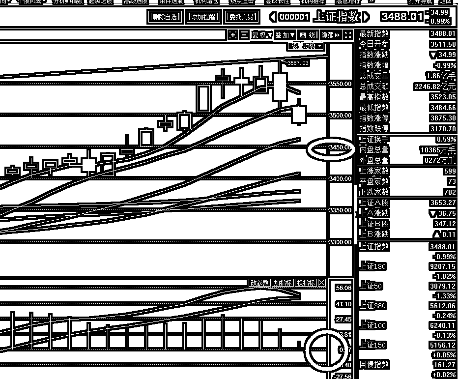

# 让人看傻眼的巨额亏损公告

<link rel="stylesheet" href="view/css/APlayer.min.css">

今天，乐视网发布了一个惊天动地的公告，让人直接看傻眼，说自己 2017 年亏损 116 亿元，这个公告有什么意义呢，我给大家说，上一次公告说乐视网亏了 16 亿已经震惊了各路机构了，等于一次性把乐视网上市那么多年的利润亏个精光。而这次更牛 X，业绩亏损直接放大到 116 亿，大了一个量级，这个亏损额表示乐视网已经亏成渣了，净资产只剩以前的零头了，太狠了。

如果按照这个业绩，13 个跌停一点都不多，乐视网上市 10 年的利润才十几亿，今年一口气亏 116 亿，基本说明这个公司只剩个壳了。

为什么会出这么离谱的公告，昨天有眼尖的网友看到孙宏斌点赞了一条“老贾”爆仓的微博，被媒体曝光之后火速取消点赞，我个人认为是孙宏斌已经认套，这一波放弃治疗了，已经被老贾坑到无法挣扎了，既然自己已经没有可能顺利脱身了，索性破罐子破摔，一口气把乐视网砸到底，把里面所有的筹码全部砸爆仓，在很低很低的位置买入加大自己筹码。

于是，把所有能列入或者可能列入的亏损，都在 17 年列进去，趁着老贾还能背黑锅的时候，股价一口气跌到深渊之后，可以甩掉历史的包袱，并且可以给未来预留空间。

于是，惊天动地的 116 亿亏损诞生了，这么小的公司一年亏这么多代表的意义能让乐视股东彻底绝望，要知道茅台这么大的巨无霸才赚 260 亿。。。

鉴于亏损突然从 16 亿放大到 116 亿，乐视网本周是开不了板了，下周再说吧，跌停板上继续趴一会。

当然，还有一条比乐视网更离谱的公告，ST 保千里说 2017 年的亏损额暂时无法确定，有可能亏到负资产，乐视网的净资产好歹还有个零头，保千里直接亏到了负资产，持有一股保千里，实际价值为负，这是个什么概念。。。

对于这种连续跌停板的个股，**我的建议**就是每天晚上坚持提前挂跌停板，运气好的话提前就跑掉了，运气不好的话，第一次开板跑出去了，也不用觉得亏，因为连续跌停的股票，第一次开板的反弹，95%的概率那都不是真正的底，只是略微反弹一下而已。

对了，此外还有几个爆跌的股，贝因美巨亏 10 亿，獐子岛说他的扇贝又出问题了，亏损不明，有人总结如下：

贝因美：亏 10 个亿，服不服

乐视网：不服，我加个零

保千里：亏的数都数不清了

獐子岛：哦，我的扇贝又跑了，嘿嘿嘿

* * *

还有**网宿科技**的事情要说一下，我昨天就想说的，但是忘了，写完了才想起来好像有啥忘了说。

网宿科技周五的时候紧急停牌，谣传说腾讯入股 10%，周末辟谣说完全没有这回事，我对这个辟谣的判断是真辟谣。昨天晚上忘了写，放在评论席里翻出来给大家看了。

**判断真假辟谣**，A 股有一个规矩，就是看公告的措辞，必须是严厉鉴定的措辞，一丝一毫余地都不给自己留的，那就是真辟谣，真没这回事，但凡有一点暧昧的，都属于变相承认，假辟谣。今天说这个，是给大家增长一点知识，真假辟谣是很好判断的，大家下次记得就行。

* * *

今天万科也出了件事，万科独董刘姝威请求证监会命令姚老板卖出万科，理由是其资管计划已经到期，持有不卖严重违反证监会相关规定，请求强制卖出。

这个消息引发万科今天盘中大跌，如果姚老板被迫卖出，哪个只部分卖出，市场也是承受不了的，但是收盘之后，宝能紧急发文，称资管计划早就已经续期，合法合规合理，这个公告一出，**今天抄底万科的有福了**。

* * *

说到抄底，昨天给抄底计划定了区间，**3486-3506**，为什么定这个区间，因为 3506 是一道技术支撑线，3486 又是一道技术支撑线，那么这二个支撑线中间的区域，就是逢低买入的良机。

最强支撑是 20 日均线，大概会到 3470 附近，但是很显然，个股千差万别，不可能按照某一个点去卡死，假如我说 3486 这个点卡死买入所有的股票，显然是不合理的，那么按照一个区间，根据自己的个股情况分别逢低买入，是最合理的。

今天上午，大盘围绕 3506 激烈抵抗，最低点 3503，抵抗了足足一上午，快收盘的时候才被击破。今天下午，围绕 3486 激烈抵抗，数次支撑，全天最低点 3484.66，这些支撑位都是技术支撑位，每一层都有抵抗力，其覆盖区间就是合理的抄底区间，如果炒股是炒概率的话，那么这里概率最大，20 日线是最强支撑，但是估计是一闪而逝，没有给你过多的时间考虑买入。

**今天业绩地雷频爆，估计明天会轻点 20 日均线，但是我预估是很难击破的，**毕竟趋势在，偶尔回调很正常，所以今天在抄底区间内，底仓加到 6 成，结合 3 成做 T 资金，已经有 9 成资金是使用状态，剩下的一点我考虑是年后使用，暂时不动。

那么有没有止损策略呢，有，如下图所示，当 MACD 翻绿的同时，指数击穿 3450，那么本轮加仓的 3 成考虑减掉。因为正常状态下，是不会击穿的，这里会反弹，但是意外击穿，虽然不理解，先减了加仓的再说。至于其他的仓位，依然不动，因为个人主观看好这轮行情，死不了的

对于明天，个人认为是在 20 日线盘亘，一根小阴线，就像我前面说的，轻轻触及 20 日均线，一闪即逝，完成本次回踩动作，明天是周三，那么回调结束，下半周就应该开始上涨，和剧本不符合，那就是出问题了，需要慎重考虑趋势，至于现在，没必要考虑，依然判定为上涨趋势中的回调。