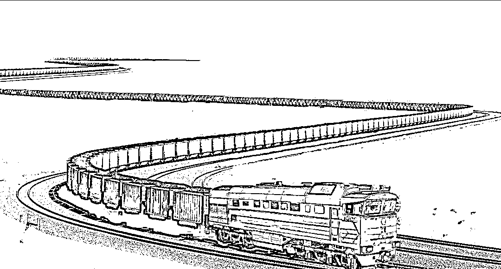
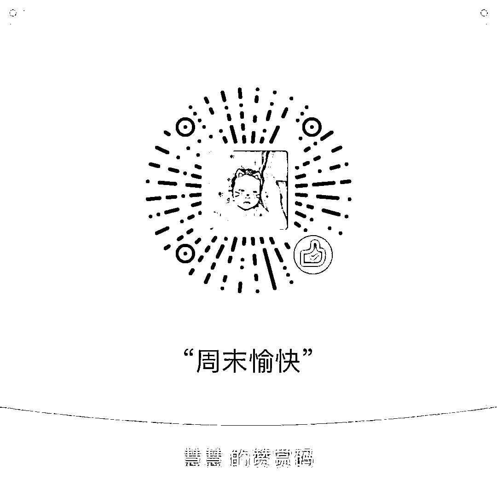

# 车票涨价才能让农民工顺利回家

<link rel="stylesheet" href="view/css/APlayer.min.css">

这个标题和前几年的经济老专家的口吻一样，一大群喷子看了标题就准备开喷了，别忙，我怎么可能有那么弱智的思想呢，看完下面再开喷。

铁路春运期间又到了，持续 40 天的春运，铁路部门是绝对主力，其客运量远远超过公路部门，一辆又一辆的火车发出，确保中国人能顺利回家过年，然后又顺利的返城上班。

春节回家对于绝大部分在外打工的人来说是刚需，但是矛盾出现了，铁路运力不足，假设有 110 个回家的需求，那么只会有 100 个回家名额，不管采用网络抢票制度也好，还是全面涨价压制需求也罢，必须得有 10 个人买不到票，区别只是不同的制度下，这 10 个人是谁而已。

但是实际上，这 2 种制度，都是严重不利于最底层农民工的，首先谈谈网络抢票制度，最有利的就是中产白领阶级，每天对着电脑，开着抢票软件不停的刷，票一放出来一分钟就没了，你让工地的工人怎么跟你抢。而全面涨价制度最有利的是富裕阶层，他们本来只在乎结果，根本不在乎价格，网络抢票制度下他们也懒得抢票，都是直接找黄牛加价购买，因为节约时间啊，在他们看来抢票花费的时间和精力是远远不止那一点黄牛钱的。而农民工就不一样了，价格是阻碍他们回家的第一重要因素，车票钱对他们来说真的不是小钱，如果全面涨价，第一个淘汰出局的就是农民工，他们的回家名额让给了购买力更强的白领和富裕阶层。

换言之，无论是哪种制度，最贫困的农民工阶层都是最受伤害的群体，春运车票紧张，对富裕阶层来说无非是黄牛费的高低而已，对于中产阶层无论是多花几个小时去抢票而已，最后抢票失败，迫不得已了咬咬牙也是掏得起黄牛费的，不会回不了家。每年所谓因为买车票困难回不了家的人，基本都是农民工，比如鼎鼎大名的摩托车千里回家。

那么能否指望中国铁路高速发展，未来会有足够的车辆班次来解决这个问题呢，我很遗憾的告诉大家，永远不可能，无论铁路系统多么发达，都无法解决春运困难的问题。因为铁路客运是一个潮汐式的行为，平时大家都窝在大城市不动，不使用铁路，到了春运期间一窝蜂的使用铁路回家，客运量突然暴增。如果铁路客运量能够完全满足春运需求，让每一个人轻松回家，那么代表的结果一定是大量的车辆在平时闲置，春运只有一个多月，其他 11 个月都闲置，这个经济损失多大？如果在正常的时间段内，铁路运能达到一个经济合理的正常水平，那么春运一定是运能不足的。君不见，高铁开通后增购了很多动车组，运能大增，如果当年的绿皮车还在，这些额外增加的运能，足够让春运轻轻松松。但是由于平时的闲置，无人乘坐，当年的很多绿皮车，全部淘汰出局不再使用，这就导致增购了如此之多的运能，新建了如此之多的铁路，今天我们还是春运困难。

看完之后是不是绝望了，无论怎么搞，春运农民工回家一定困难，而为了表面的平等，白领需要付出大量的时间，金领需要付出大量的黄牛费，给国家资源造成了严重的浪费和内耗。

其实这里只需要解决一个核心问题就能搞定，那就是运能闲置问题，中国铁路并非没有运能，而是如果能满足春运需求，那么其余 11 个月一定是闲置的，车辆的折旧和保养是非常耗钱的，如果开动但是车上没人，那更耗钱。到了年终盘点利润的时候，国家可不管你是不是为了人民解决了春运困难，只会看到你利润大幅度下降了，挨批、换人，所以铁路部门不愿意做。

有没有办法解决，有的，我们来看看新加坡的医疗制度，能给我们提供一些思路进行借鉴。

新加坡的医疗是分级的，无论是门诊还是病房都是分级的，以病房为例，分为 A1、B1、B2、C 级，最贵的 A1 级是豪华单间，要多豪华有多豪华，全部自费，价格 400 新币/天（约合人民币 1900 元），最便宜的是 C 级，9 人间，要多寒掺有多寒掺，价格是 35 新币，并且政府还给报销 75%，超级廉价，确保穷人一定看得起病住的起院。但是付出了天壤之别的价格，病人得到的医疗是一样的，不同等级的病人并没有区别对待，都是混合在一起随机分配主治医师的，以保证医疗公平性。

简单的说，保证大家得到一样的医疗服务，但是为了防止富人搭免费便车，以不同的分级制度来确保，要是富人丢得起那个人，并能忍受 9 人间的嘈杂和不方便，欢迎来 9 人间享受廉价医疗。为什么给穷人准备的 9 人间医疗能那么廉价，就是靠 AB 级的高级病房收取的超额费用来补贴给穷人的，这个道理和廉租房不设置厕所是一样的。

那么以此类推，就能解决春运车辆的成本问题，完全可以把货运车为原型设计一种超长火车，春运专用，大概是下图这个长度规模。

一般的火车大概是 20 节，这种春运专列 100 节起步，二三百节也行，车头就按货运标准来设计，速度当然快不起来，我也不希望他快，80km/时就可以了，里面的设施要多简陋有多简陋，能用就行，极端情况可以考虑取消座位全部是站座，或者零星座位专卖老人孩子，其余大部分是站座。平时拉到干燥的西北地区保养闲置即可，春运的时候养护一下拉出来用，反正闲置的是车厢，金贵的车头平时完全可以拿出去拉正常的货运车皮，春运期间再调过来，至于车票嘛，政府补贴 90%，堪比免费。

这个成本并不算太高，但是也不算太少，毕竟车厢闲置了 11 个月，真轮起综合成本来，比高铁还要贵，政府还补贴 90%，这钱谁出？

当然是有钱人出了，谁坐高铁谁出这个钱，同样的旅程，高铁是 300~350 每小时，春运专列是 80/小时，你 4 个小时就到家了，别人要花 16 个小时，那么自然加价喽，春运期间，高铁价格全面上浮，根据春运人流的紧张程度，每日价格都不同，定价原理参考飞机票，上浮 10~100%不等来调节人流，这部分多收的钱，专款专用，政府不要，专门拿来补贴穷人春运专列的维护成本。

大概就是这个想法，全面涨价是没有任何用途的，运能不会增加一丝一毫，原来多少人回家现在还是多少人回家，只不过是把农民工挡在门外了而已。真正的好政策就是应该分级，弄出一个运载力大、成本低、就算免费有钱人都不愿意去坐的廉价车次出来，专供农民工回家。这种春运专列速度缓慢，乘坐舒适度差，平时是肯定没人坐的，车厢直接找个地方闲置保养，车头拿出去拉货，造成的闲置成本从快捷舒适的高铁乘客里面出，普通二等座就少加点，高铁商务座就多加点，至少把现在的黄牛费要加进去吧，黄牛费可真不低现在。

这种分级制度，才是真正的公平，提供一样的春运到家服务，满足所有人的到家需求，利用速度和舒适度进行人群筛选，让富人多出点钱，补贴给穷人回家。

和珅都说过，救灾粮一定要渗沙子，这样灾民才能活，不然全给贪污了，灾民只有饿死一条路。中国的廉租房里面有了厕所空调以后，全给有钱人通过关系拿走了，真正需要住的人给排除在外，希望铁路春运能吸取这个教训，给真正回家困难的农民工谋点福利。

