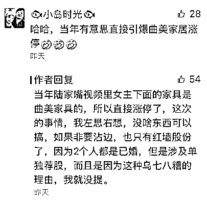
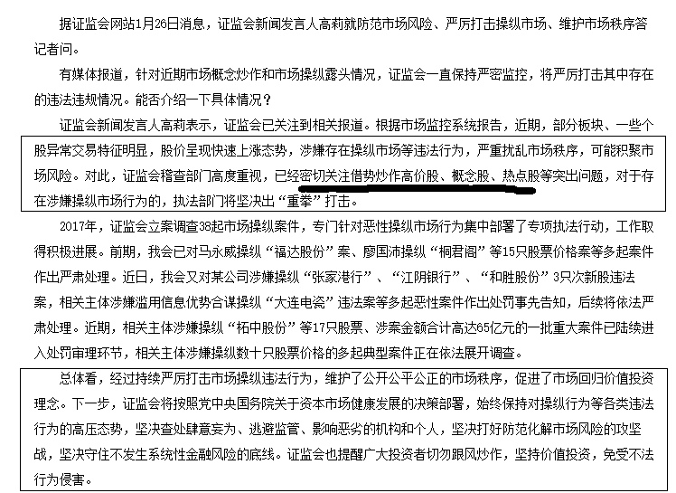

# A 股第一出轨概念股

<link rel="stylesheet" href="view/css/APlayer.min.css">

今天，红墙股份平开，正常开局，然后直线拉升，最终涨停，红墙股份是一个化工股，卖水泥、粉煤灰和一些化工试剂的，今天在没有利好的情况下突然涨停是因为什么呢。

就是昨天我在评论里贴的这个理由，和昨天的桃色新闻有直接关系，因为这个理由过于乌七八糟，所以就没在正文里提，但是每一次这种轰动金融圈的桃色事件出来，总有相关概念股有所表现。红墙股份，仅仅因为他的名字，就被改成了出轨概念股，纯粹炒作，严重脱离基本面，但是 A 股就是这个尿性，加上这个股里面本来就有一股资金刚潜伏，不是那种纯散户的万人坑。

这种票，之前每一次娱乐圈明星出轨他都有所表现，所以游资定义为出轨概念股了，历次的明星出轨和这次的桃色八卦，都让这个股坐实了**A 股第一出轨概念股**，不过当乐子和知识储备就行了，只能短炒，看后劲的话还是蓝筹靠谱。

* * *

本周，股市继续上涨，而且创业板首次站稳 20 日均线，补上了牛市最后一块短板，他这么一补，消除了隐忧。总的来说，本周的后半周，上涨的速度出现了明显的减缓，冲锋的时候总是有大量的抛盘压制上涨，短途休息一下的概率增大了很多，但是总体走势，非常强悍，大势看涨无疑。

这是妥妥的牛头，而且不仅仅是纯粹靠蓝筹堆指数，本周总体来看，个股也没少涨，甚至本周的个股涨幅比蓝筹还要高。但是我这里需要强调的是，题材股只是补涨，领头的还是一二线蓝筹。

判断谁带头有一个很简单的准则，这一波启动的时候谁第一个涨，谁就会是贯穿整个波段的领头羊，他涨其他人才会涨，他不涨所有人都不行了。那么判断是震荡市还是牛市还有一个准则，带头大哥涨的时候，其他人哗啦啦的跌，那不叫牛市，顶多是震荡市，带不动小弟的大哥不叫大哥，叫自娱自乐。当大哥吃肉，小弟喝汤的时候，才能叫牛市，牛市一定是普涨的，只不过是大哥多涨点而已。

另外，本周涨速减缓，短期回调的概率在增大，但是不要指望回调太深，气势已经打出来了，我上周五就说了闻到了牛市的气息，这周也不会例外，而至于本周下半周的涨速减缓，昨天也说的很清楚，顶多就是做 T 的级别。

* * *

乐视网今天吃了第三个跌停，已经触及了贾跃亭的第一层补仓线，1-23 号的时候深圳有一家重仓乐视网的私募机构人士表示，按照贾跃亭最新一笔的股权质押来计算平仓线的话，除权后大概是 11 元附近，总质押情况不详，是否补仓情况不详，但是大差不差，今天已经触发了强平线，明天再来一个跌停，基本都应该全部触发了。上述机构人士称自己持有的乐视大概是 11 元爆仓，如果股价跌到 10 块，认识的所有朋友都要爆仓。

贾跃亭持有大量的乐视网股票，除非补充保证金否则肯定触及强平线，但是贾跃亭回国补充保证金的可能性趋近于 0，所以我们只能继续数跌停板。

当然，质押的股份很多是非流通股，流通股只是一部分，券商也只能强平能流通的那部分，非流通的属于不良资产了，他们也只能拿着，反正卖也卖不掉。今天乐视网的封单成功的从百亿级降低到了八十多亿，当然，和硬吃了 2 个跌停有很大关系，如果再多一个跌停，同样的股数封死跌停，只有七十多亿了，太惨了。

* * *

周五晚上的 IPO 是 3 家 49 亿，正常量，不过这周 18 家上会企业，只有 3 家过会，14 家被否，1 家取消审核，这个过会率堪称是屠杀级，远远比 IPO 的数量要重要，今年不太可能狂发 IPO 了，慢慢发有可能，证监会主动减少 IPO 的数量，而且是从源头开始减，当然是**利好**。

* * *

对了，今天证监会又发公告了，表示始终保持对操纵行为等各类违法行为的高压态势，字数太多我直接贴图表达。

（点击图片可放大查看）

我翻译成简单的描述就是，瞎炒题材的注意点了，过一段时间挨个收拾你们，可怜最近其实也就那么寥寥几个题材股在大涨，所以大家后面还是听领导话，规避下题材股比较好。