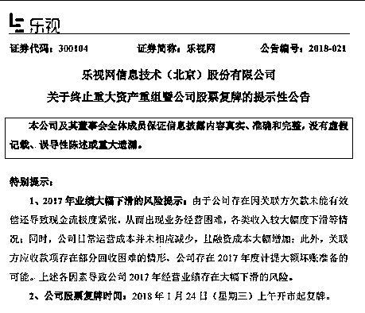
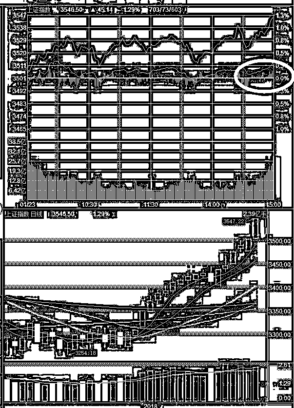

# 明天开始数跌停板

<link rel="stylesheet" href="view/css/APlayer.min.css">

今天上午，市场就在疯传明天乐视网会复牌，不过消息来源还是“据可靠消息透露，到了今天晚上乐视网出了正式公告，宣布自明日起正式复牌。

图一

这也就代表着乐视网跌停大戏正式开始，堪比美国大片的精彩，陷在乐视网里的机构、散户和融资盘不计其数，股东 18 万人，预计会有 400 亿市值灰飞烟灭，而且里面除了大批小股东之外，还有很多的是大机构以及银行的资金，而乐视恐怖的下跌幅度也导致他们注定损失惨重，中国的随意停牌的制度当初打的是保护中小投资者信息知情权的旗号，这真是一种莫大的讽刺。

其实我们知道，真正的内幕消息，早在停牌之前几星期就被大资金给知道了，等到停牌那一天已经没什么意义了。当然，也有可能在停牌过程中的突发消息是不可控的，比如重组意味失败等等，停牌能拉近大小投资者的信息差距。但是过于漫长的停牌，比如动辄停牌大半年的，其实是严重损害中小投资者利益的。

如果不停牌的话，不管什么惊天动地的突然利空出来，次日直接跌停开盘那种，也最多最多就是 3 个跌停必然开板，而不像现在，预测最乐观的人，都不敢说 5 个跌停之内能开板。而且类似这种连续跌停的个股，第一次开板之后诱发反弹，通常后面都还会有第二次阴跌才会真正见底。明天开盘必然封死跌停板，持有乐视的现在就可以挂单了，万一运气好你第一天跑出去了，也说不准啊。

换句话说，**从明天开始，我们可以开始数跌停板了，这恐怕是资本市场最近最热闹的事情了，堪称万众瞩目，**毕竟是乐视网啊，曾经的第一概念股，鼎鼎大名的 PPT 公司。

* * *

今天上证指数再度冲高，深成指和创业板萎靡不振，冲高的上证指数，显然又是白线远高于黄线。

昨天很多人问我黄线和白线是什么意思，这个问题我多次说过，可能有新来的不清楚，我就再科普一次，白线代表正经的指数，这个指数不是由所有个股的股价组成的，而是单纯的由指数的成分股组成，如果你不属于成分股，那么就代表你哪怕跌成 0，指数都不会动一丝一毫的。例如乐视网，如今已经被调出成分股序列，那么乐视网不管多少个跌停，创业板指数都会纹丝不动，他现在就是和题材股是一个待遇。

那么黄线代表什么呢，代表所有个股的成交均价，不管你是成分股还是普通个股，都包含在内。由于绝大部分股票都不属于成分股，所以我们就可以简单的认为，黄线就表示中小盘题材个股的赚钱效应。

所以后来，我们就把白线当成了蓝筹的走势，把黄线当成了个股的走势，因为他们虽然原始意思是指数和均价，但是和蓝筹及个股走势基本对应。

对于蓝筹股，走势很明显，之前的一年里，也是蓝筹牛，不过很慢很慢，而且有明显的硬拉症状，就是靠政策对个股的围追堵截，以及总队的盘面引导，资金才被迫集中在蓝筹股的。

但是今年元旦后，明显不一样了，从这一段时间的盘面看，已经几乎不需要引导了，蓝筹股形成了自发的上涨趋势，出现了如此强劲的抬头走势，就算不想涨，他也得涨一段，那是趋势的惯性，而不像以前，一松手马上就得掉下去。

当然，这种牛市，是蓝筹牛，而是不是人造蓝筹牛，有真蓝筹牛的趋势，就是市场资金开始自发的向蓝筹聚拢，这是历经了一年的引导最终引起的，这么明显的状态下，我们至少可以判定，本轮风头依然属于蓝筹，而不是中小创，中小创想翻身，等下一轮吧。

这里的不翻身，并不是说他会一直跌，而是说蓝筹大涨的时候他小涨，蓝筹大跌的时候他跟着一起大跌，就好像 07 年一样。

**对于后市的看法我总结为：蓝筹牛市、趋势看涨，一股不卖，回调加仓。**