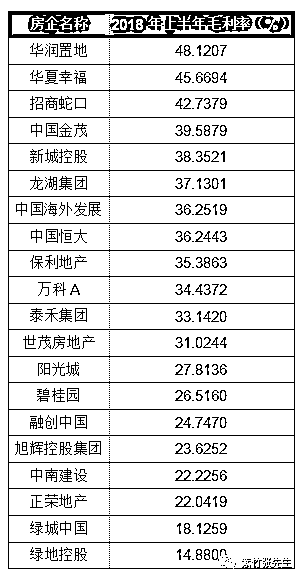

# 房价跌多少幅度才会诱发崩盘？

喜欢我的都关注我了~

经过长期不懈的调控以及金融去杠杆，沸腾的房价终于出现了平稳冷却的迹象，但是国人对于房价的要求却极为苛刻，只允许涨不允许跌，涨了一倍二倍都没事，个别地方零星刚跌了一点，就立马开始有房价崩盘论出现了。

房价崩盘论的理由非常明确，泡沫涨这么大了，只能涨不能跌，根本不可能横，只要开始有下跌的苗头，马上就要崩盘，而且不会拖太久。我今天告诉大家，房价要跌到什么程度才会诱发崩盘，其实远远比你想的要坚韧，这也就是为什么我说横盘阴跌是大概率的原因。

崩盘的定义

首先，泡沫高不代表一定会诱发崩盘，这里面没有必然联系，只能说概率大而已。另外，在谈论崩盘之前，我们首先要给崩盘下一个定义吧，到底跌成什么样算崩盘，需要多少跌幅，这个跌幅到底是从哪里开始算。

其实在我看来，这个崩盘的定义大家的看法是不一样的，如果从个体的角度去看，自己付了 100 万的首付买了 300 万的房价，房价跌 30%，对他而言就算崩盘了，因为他的人生开始变灰了。

但是这只是他自己的看法，从这个社会整体而言，崩盘是需要标志性事件的，2008 年中国房价算崩盘吗？那一年房价跌的很惨，但是在座诸位恐怕没人说 2008 年中国房价崩盘了。但是很多人会认为 2008 年美国房价崩盘了，而且崩到直接诱发经济危机。

这中间的区别在哪呢，区别就在于美国出现了房地产几大巨头的崩溃，典型代表就是二房（房地美和房利美）的破产。房地美和房利美是房地产抵押贷款公司，你可以认为他们是某种特殊类型的银行，他们是一个超级巨无霸，连中国当时都持有大量的二房债券，认为他们是极度安全的大型美国公司。

二房崩溃后，美国市场迎来了迅猛的下跌，然后美国政府终于达成一致，开始进行超大规模的量化宽松，大肆印钱。这说明什么呢，说明美国政府认为，房地美和房利美崩溃后，如果政府不印钞票，危机将会迅速蔓延。

所以，假设在政府不插手的情况下，类似二房这样的企业崩溃，将会是大危机的开端。但是政府不可能不插手，而且我们是想提前逃顶，而不是等这些巨无霸都崩溃了才反应过来，因为那个时候，傻子都知道大事不妙了。

但是从这里我们可以得出一个结论，2007 年美国房价下跌其实政府是不管的，房企大量破产其实政府也没管，最终金融机构大面积倒闭，美国政府才最终出手救市的。

所以，如果连房企破产都没出现，那肯定谈不上什么崩盘。

什么条件下房企会破产

那么什么条件下房企会破产呢，拍下土地之后，预估建成每平米成本价 1 万元，房价暴涨一倍再来个腰斩，房企会破产吗？肯定不会，这才刚回到成本价。。。

小房企先破产，大房企才会破产，毕竟大鱼吃小鱼，要死肯定小的先死。那么达到什么条件下大房企才会破产呢，我们先看看今年上半，各大房企的毛利率。

图中我们可以看到，华润置地的毛利率最高，大概是 48%，碧桂园的毛利率 26%，恒大 36%，万科 34%。

毛利率 48%是什么概念呢，卖出 100 亿的房子，土地+建筑的成本是 52 亿，毛利 48 亿，支付税金和人工后，就是净利润。而实际上，中国房企的负债率很多都是超过 80%的，只有 2000 亿的净资产，敢负债上万亿，换句话说他们的杠杆是四五倍。。。

这么高的利润，这么大的杠杆，你现在知道为什么前几年狂加杠杆的碧桂园和恒大可以弯道超车把万科赶下第一了吧，只要看对一次，净资产翻个几倍是很轻松的事情。

假设某房企一万亿资产，8000 亿负债的话，自成本价向下跌 20%，净资产就归零了，属于实际意义上的破产状态，没有奇迹发生的话，离正式宣布破产只剩三五个月时间了。

但是这个成本价，肯定不是狂飙之后的最高价，而是当年他们拿地的价格，房企前一百名的平均毛利率大概在 30%左右。2018 年上半年的价格，再打个 7 折，差不多就是他们的成本价了，这个 7 折的基础上再来个八折，差不多就是巅峰价格的 56%，没来得及逃顶的房企就会实际处于破产状态，因为这个时候按市价卖出全部资产的话，剩余净资产会是零。

如果以 2018 年的泡沫巅峰房价为基准，差不多要跌个腰斩出来才能打崩房企，这个幅度差不多就是 2016 年初的房价基准，如果考虑到净利因素，那差不多相当于 2016 年底，2017 年初的房价水平。

所以，中国的房价不能回到 2016 年以前的状态，如果回到 2016 年以前的价格，大房企都会崩盘，而那些规模很小，整个企业只有几块地，脑子一抽在 2017 年高价拍了一块地的企业，会首先崩溃。

而且，这个价格指的是企业总平均成本价，是全国范围内普遍降价，低于房企成本 20%，会导致房企彻底崩溃。而房企的平均成本经过计算，差不多就是 2016 年的基础上再加个 20%。

个人的套牢，只要不出现严重社会事件，任何国家的政府都不会太在意的，毕竟这只是财富的转移，最后总得有人买单的，个人不买单还能让谁买单？最佳的状态，就是被套牢的所有资金，全是个人的。

政府真正在意的，是价格的下跌，不能影响到大型企业，尤其是银行的运转，这是底线，一旦越线，必然救市。2015 年股灾，如果不是大量银行资金套进去了，也不会出现国家队救市这件事的。

投机者会过的很痛苦

当房价从最高点跌下去的时候，套在最高点的那个人，伤的是本金，但是对于房地产企业来说，他们只是少赚了一点利润而已，卖出去依然是赚的，甚至对于 95%的不动产业主来说，也只是伤了他们的利润而已，离成本线还很遥远。

要打爆房企，价格必须回到 2016 年之前，而且速度要快，如果给了他们出货的时间，他们手里的现金会越来越多，平均成本会越来越低。毕竟按目前的价格来看，哪怕打折，卖出去也是利润，持仓越来越少，现金越来越多，抗风险能力会越来越强。

所以，这两年购入房产的投机者会过的很痛苦，由于之前这一波上浮的实在是太多，所以不管怎么跌，跌的都是利润，很难伤到本金，所谓的你从 2 万涨到 4 万，跌个 8000 块有用吗？就是这个意思。

而对于更远之前的投机者，就很难打爆了，因为他们的成本实在是太低了，在打爆他们之前，房企已经全死了。

而房企的崩溃，会直接动摇到银行的稳定，而且政府手中还有很多牌没有打，比如限购，比如限贷等等，政府只要时不时的扔几张牌出来做个缓冲，二手房价就不会太过迅猛的下跌，拖的时间足够长，政府的目的就达到了，时间可以消化一切泡沫，无论怎么看，横盘阴跌都是最可能发生的事情，也最符合政府的目的。

故，从种种数据来推断，政府希望房价横盘，也容许房价小范围分批次的下跌，但是当全国总体房价跌回到 2016 年的水平的时候，很大概率会触发政府救市来避免大型房企的破产以保护银行资金。

我上次写过一篇文章，中国房价跌 20%会全面崩盘，里面的依据是有很多房企负债率 80%以上，里面明确说了这个跌 20%指的是房企的成本价，但是那篇文章并没有指明这个成本价到底是多高。所以我今天特地写这一篇文章，给大家算一算房企的成本价到底大概在什么区间。

看完之后你会发现，其实目前持有房产的个人和企业，浮盈都非常大，要跌很久才会打穿他们的成本线，而实际上这种跌幅会远远超过最高点接盘之人的容忍极限，如果真跌到破产边缘政府才出手救市，最高点接盘的人会痛苦到极致。

不过最高点接盘的人的数量，其实是很少的，毕竟中国已经卖了 30 年房子了，很多人压根就没有成本的，但是对于那些房产投机之人而言，这二年最好少碰房地产，政府容忍的底线和你能容忍的底线可能会差距很大，除非你确认你的资金链能够容忍如此之大的回撤，否则不要轻易去赌。

觉得此文的分析有道理，对你有所帮助，请随手转发。

长按下方图片，识别二维码，即可关注我

近期精彩文章回顾（回复“目录”关键词可查看更多）

华为员工都这么穷，怪不得拼多多能火 | 房价跌 20%就会全面崩盘，地产杠杆远比你想的要脆弱 |  为什么碧桂园的质量那么差 | 清醒点，放弃全面开征房产税的幻想 | 央行和财政部隔空掐架，我支持央妈 |中国土地制度源自香港，但是香港却是劏房密布 | 为什么中介哄抢租赁房源，因为贩毒都没它来钱快