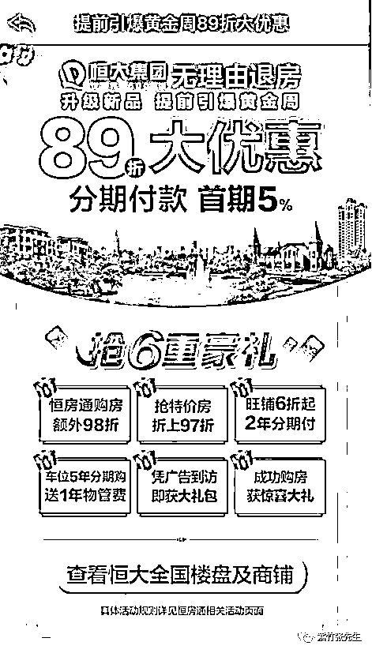
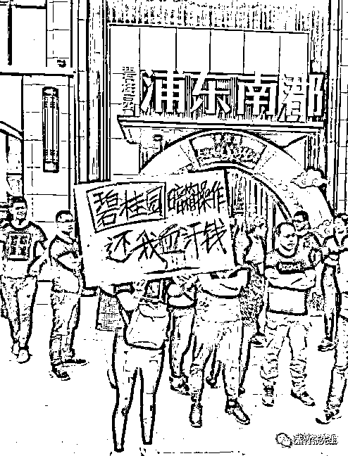
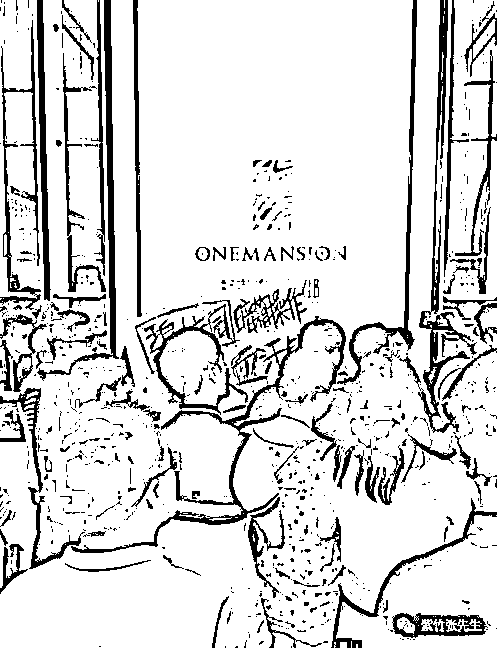
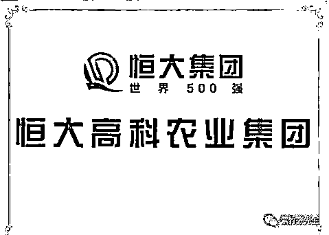
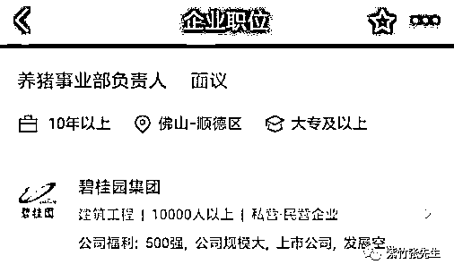

# 恒大率先降房价，退房闹事的却是碧桂园

喜欢我的都关注我了~

房地产有金九银十这一说，但是今年的中国地产在这个黄金时期却处在一片降价风潮之中。9 月初，恒大在全国发起 89 折优惠。

这里，恒大楼盘 89 折起步，还有其他优惠可以反复叠加进行折上折，抢先出货回笼现金的意图已经非常明显。鉴于中国向来都有降价后有人集体退房闹事的传统，我当时就在想，恒大的退房横幅啥时候会上新闻。

结果等了一个月，新闻上没看到恒大，却看到了碧桂园的退房闹事。上海浦东桂园南郡项目出现大规模业主退房事件，碧桂园搞阴阳合同不按上海市政府要求的一房一价政策进行销售。

不过有所区别的是，以前的阴阳合同都是开发商要求涨价，试图绕开一房一价的政府规定，用其他名目多收点钱，而这次碧桂园的阴阳合同，则是以阳合同维持一个表面高价，暗地里以阴合同低于政府规定的价格进行销售，一夜之间将备案均价从 35000 直接降到 28000 至 26000 进行销售。

售楼部也挤满了人

我等了一个月，没等来恒大的退房闹事新闻，结果却等来了碧桂园，这个世界真的是奇妙。

碧桂园上新闻的原因

之所以会是碧桂园上新闻而不是恒大，那是有原因的，在我看来，主要原因应该有二个。

首先，就是碧桂园最近几个月太热门了，自从碧桂园因为内部发文件倡导高周转以来，拍下土地当天出图，5 个月回款等匪夷所思的目标和计划曝光之后，碧桂园就成为了媒体的焦点。

站在媒体的聚光灯下，一切瑕疵都清晰可见，房地产企业这么多，报道谁不是报道，于是大家都来报道碧桂园了。。。

所以，恒大被退房维权也会报道，但是绝对不会像碧桂园报道的媒体这么多，这么热烈。

其次，是碧桂园这个楼盘降价太狠了，从历史经验来看，如果单次降价 10%以内，一般是不会引发已购房业主反弹的，或者说不会引发大规模闹事行为，毕竟开发商本来就有降价的权利，掉价 10%很心痛，个别人可能跑去闹事，但是要鼓动所有人去闹事是很难的，因为其实这些购房者他们自己心里也清楚自己不占理。

所以这次恒大打 89 折，估计也是有人闹事的，但是人数规模不大，所以至今没有上新闻。不过碧桂园就不一样了，直接从 35000 跌到 26000-28000，这差不多要打 7 折了，等于一夜之间首付归零。而且有很多人是刚买了一个月不到，之前还信誓旦旦的告诉业主自家房子保值增值，一夜之间爆跌 30%，换谁谁都受不了。一旦有人鼓动，极易产生聚众闹事。

比如股市，很多人说股民善良，跌这么惨都没人闹，那是因为股市都是阴跌，每天跌一点点，不显山不露水，半年给你跌一半没了。但是在股灾的时候，股民的心态可没那么好了，天天跌停，天天在网上狂喷证监会的人可不是一个二个，如果股市也能找到“售楼处”，里面也有一个实际能赔钱的人，估计股民早把它给围起来了。

那要是换一种情况，一路上涨的走势诱使你掏空全部家产和你父母一辈子的积蓄买入后，一夜之间暴跌 20~30%呢，然后你还带了 3 倍甚至更高的杠杆。这意味着，第二天起来后，你的人生将变成黑白色。

楼市杠杆太大，远远大于股市，股市绝对没有几个人敢掏空家里每一分钱满仓满 3 倍杠杆，这样的操作赚起来自然很爽，跌起来，也很爽。

所以，开发商降价如果想让民众接受，最好的办法是每个月降 5%，温水煮青蛙，相对而言退房闹事的人会少很多。

但是很可惜，中国的开发商一贯执行的策略的，涨的时候每隔一段时间涨一次，逼你购买，形势不好的时候也硬挺着坚持不降价，怕降价之后越来越多的人观望就不买了。

实在挺不过去的时候，价格一口气杀下去吸引购买人群，不管是慢慢涨价还是后面的一口气杀价，都是围绕着走销售量这个目的。而与此带来的，必然是退房闹事。碧桂园在之前有大量已销售客户存在的情况下，一夜之间推出这么大的折扣房，自然会出问题。

所以，恒大没上新闻，碧桂园上新闻了。

房地产整体下行的格局已定

恒大和碧桂园都降价促销，已经零零星星的退房闹事的出现，都标志着房地产整体下行的格局已定。万人抢房已经绝迹，现在连稳如泰山的一手房价格都开始松动了。

之前还有人动辄拿出三五十万的“茶水费”去加价抢一手房，现在那些靠命好摇到一手房的人估计还坐的住，这些拿出大量“茶水费”的人估计已经坐不住了，不过也只能哑巴吃闷亏，一点办法都没有。

而各大地产商，在这一波的降价潮出现之前，其实已经开始做二手打算了，多家知名地产商都开始把资金投入到养猪行业。。。

许家印表示，恒大要投资 3 亿首批援建的 200 个农牧业产业化基地，其中就包括 110 个养殖基地，今年直接成立了一个恒大高科农业公司。

而碧桂园就更直接了，成立了一个养猪事业部，这名字起的简单粗暴直接，责任明确。

放着地产不做，跑去养猪，这说明在这里地产大佬的眼里，2018 年买地建房不如买猪仔养猪划算。而好多农村人把家里的猪都给卖了，凑够首付给儿子在县城里买了一套碧桂园，真是可怜。

上一个让我印象深刻的跨界养猪巨无霸，是武钢集团。

房地产市场很难控制

一降价就闹事，反应出中国房产有相当大的投机性，都是伪刚需，真正只是为了住压根不在意价格的纯刚需几乎不存在。

而房产的价格已经大涨特涨好多年了，调控了很久才算勉强刹住车，金融去杠杆杀了半年，才算真正动摇到了地产商的资金链，最终逼迫他们放弃拍地，并降价出售回笼现金。

实际上地产的降价，才是刚开始，而一轮回调周期绝对没有这么快就结束，漫长的控价阶段是必须的。

实际上，中国的地产真的很难控，再向上涨行不行，不行。现在一线的出租回报比已经跌到了 70 年，这个泡沫非常恐怖了，别说翻倍，再涨 50%都达到 100 倍出租回报率了，懂一点经济的人，都知道这个数字意味着什么，说炸就炸，直接暴跌硬着陆。

中断土地供应，强行维持房价行不行，也不行。直接中断或者大幅减少土地供应，的确能够稳定房价，但是现在地方债务全靠拍卖土地来还，没有卖地收入地方政府马上就会断粮，到时候地方债务资金链一旦断裂，那是比地产崩盘还恐怖的存在。

而房地产税，他也接不了土拍的重担，这个来钱速度差的太远。如果把所有房产价格强行征收 1.5%的税率，那差不多也能和土拍的钱对冲掉了，但是现在的出租回报才 1.5%，你直接收 1.5%的税，房价不暴跌才见鬼呢，房价暴跌了，你这个房地产税，还是收不起来。

你问我怎么办，我怎么知道，15 年这一波地产爆拉，本来就是在赌国运，只要经济持续上行，这些问题他都不是问题，如果不能持续上行，那他都是问题。

地产调控的难度和无奈之处大家也都看到了，不敢涨不敢跌不敢大规模拍地也不敢不拍地，这中间的尺度之微妙，着实考验执政者。

但是最后不管怎么说，地产寒冬他真的来了，像国外那样直接暴跌估计不可能，毕竟是中国特色的地产制度，但是想靠投机房产暴富的人，这几年肯定会很难受。

觉得此文的分析有道理，对你有所帮助，请随手转发。

长按下方图片，识别二维码，即可关注我

近期精彩文章回顾（回复“目录”关键词可查看更多）

华为员工都这么穷，怪不得拼多多能火 | 房价跌 20%就会全面崩盘，地产杠杆远比你想的要脆弱 |  为什么碧桂园的质量那么差 | 清醒点，放弃全面开征房产税的幻想 | 央行和财政部隔空掐架，我支持央妈 |中国土地制度源自香港，但是香港却是劏房密布 | 为什么中介哄抢租赁房源，因为贩毒都没它来钱快