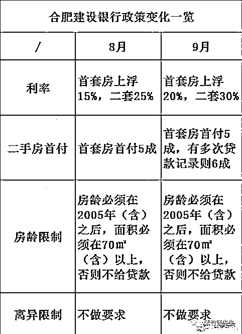
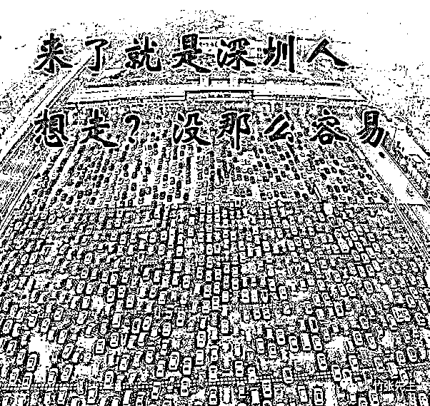
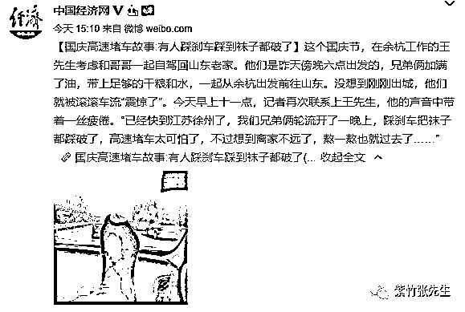

# 你家房子超过 15 年后，银行就不愿意要了

喜欢我的都关注我了~

很多人对房子都有这么一个误区，那就是我花一辈子的钱买的房子，那是永恒不变的，这个房子会陪伴我一辈子，等我想卖的时候，他还能卖出一辈子的钱，所以只要买得起，肯定是划算的。

但是实际上，房子不是永恒的，从本质上来说它是一个消费品，衰老速度虽然慢，但是肯定有。很多普通群众认为房子是恒定的财产，但是银行却不这么看，很多银行都有这样的规定，超过 15 年房龄的住宅，当产生二手房交易的时候，银行不会给予贷款。而超过 20 年的老房子，所有的银行都会拒绝贷款。

我们都知道，房贷的本质，是银行发给你一笔贷款，你拿着这笔贷款给了开发商获得一套房子，但是产权不是你的，产权放在银行做抵押物。所以你拿到贷款的一瞬间，就表示银行认可你这套房子的价值，他觉得这套房子+你的个人信用，足以抹平绝大部分风险。银行要的不是房子，是本金和利息，他愿意把你的房子做抵押物，不管是 5 成贷款还是 7 成贷款，说明**他觉得你的房子能换来这么多钱**。

所以，银行不仅仅给一手房发放贷款，给二手房交易，也发放贷款。但是银行对 15 年以上的老房子，基本不予发放贷款。目前中国大部分银行卡的标准是 15 年，只有个别银行愿意对不超过 20 年的老房子进行贷款，还有几个银行，把标准压缩到了 13 年，比如合肥建设银行。 

这张图是什么意思呢，他的意思就是 2005 年以前的老房子，银行不认，不会发放贷款，你自己爱怎么交易是你的事，银行不收这样的房子做抵押物。

银行不玩就不玩吧，我自己全款交易不就行了。但是实际上，房价之所以能炒这么高，银行贷款资金功不可没，我曾经写过一篇帖子专门说的是银行杠杆资金的威力，这里不赘述了。简单的说，由于房价 3~5 成首付的规矩，每一轮房价飙升其实都是靠银行杠杆资金成倍激增带来的，如果银行抽走杠杆，房价断然不可能涨这么高。

很多人不知道怎么样才能让股价上涨，我可以很明确的告诉你，大量的钱涌进来，硬生生的把股票买上去，股价就能上涨，股价上涨是靠钱买的，就这么简单。房价也是同理，只有大量的钱入场，房价才能上涨，而这些钱，大部分都来自于银行。

所以，当房子只能全款交易的时候，房价会迎来重大的挫折，我举个例子，北京上海那些动辄上千万的房子，有几个中国人靠资金的工资买得起？没有自己以前炒房赚的钱，以及银行资金的参与，你买一个给我看看？实际上，除非每波牛市最热的那几个月，其他时间，全款房都是极为罕见的。

一套房的故事

2005 年，北京某小区开盘，以 100 万的价格，卖给张三一套房，张三首付 30 万，从银行按揭 70 万贷款购得此房产。

2010 年，张三以 500 万的价格将此房产卖给李四，银行只愿意出 5 成贷款，所以李四首付 250 万，贷款 250 万获得这套房。

2018 年，李四将这套房再转手，以 1000 万的价格卖给王五，银行哪怕只给 3 成贷款，也需要发出去 300 万的现金。

到了 2020 年，银行一盘算，你这房子这么老了，各种可能的风险都会有，暂时还没啥事，再过二三十年啥事都可能发生，再发给你长期贷款真的风险很大，银行不愿意干这种亏本生意，所以宁可不做这个贷款生意。

实际上，随着房子年龄的越来越大，银行愿意提供的按揭率越来越小，70%、50%、30%，0%，出现越来越低的趋势，当房龄超过 15 年的时候，绝大多数银行都不愿意提供一分钱的按揭，当房龄超过 20 年的时候，所有的银行都不愿意提供按揭，家里买房已经超过 10 年的同学，可以明天找个银行的朋友问问，如果你把自家住房做抵押贷款，能贷出来多少钱。

房源抵达 15 年门槛后

银行的这种政策没有任何问题，房子本来就是有折旧的，银行为了规避自己的风险对老房子不予贷款很正常，但是对于中国的楼市，就会带来重大问题。

我们都知道，在上世纪 90 年代，中国的楼市是极为幼稚的，实际建造量非常的小。大概是 2001~2002 年开始，楼市才开始步入黄金大牛市，价格飞涨的同时，也刺激地产商大干快上，建设出了大量的房子。

2003 年以后的房子，从 2018 年开始，慢慢的都进入银行 15 年的预警线范围内，他们的房子交易会比正常的房子困难很多。

而实际上，还是有银行愿意对 20 年房龄的房子进行贷款的，金融圈哪怕有一个地方留了口子，资金都会从这个口子狂泻而出，所以其实能对房价产生影响的时间，我们暂定为 20 年。

那大概就是 2023 年开始，逐渐就会有商品房进入预警线内，这个数量会越来越多，因为 2003 年开始中国地产是在加速建设的，地产商的建设能力是一年比一年强的。

当累积的预警房源达到一定数量的时候会发生一件事情，那就是这些房的房主想脱手交易的时候，只能选择全款的买主，而这样的买主是非常稀缺的，如果想要成交，就必须大降价给予让利。

当 20 年的房源找不到银行愿意贷款，被迫全款降价交易的时候，就会震慑 15 年的房源进行降价，因为买主不愿意负担将来无法脱手的风险，而 15 年的房源进行降价，就会震慑 10 年的房源进行降价，以此类推。

一直以来都有人说，中国楼市最大的风险是第一批房子 70 年产权到期后的风险，到时候肯定会大降价，但是我现在看来，老化房源无法贷款的风险，会大大提前与 70 年产权到期风险先行引爆。

我之前曾经给大家说过一个判断，最近二三年房价肯定是不会涨了，横盘微跌，三五年横盘之后，有可能再拉一波，如果拉了那一波，大概率可能就是中国击鼓传花的最后一棒了，在那最后一棒里，除了自己自住的，其他都得脱手。

商品房再怎么好，它也是商品，他会老化会折旧，它不是一个百年不变的永恒宝物，银行的一堆博士精算师，你觉得是他们傻，还是你傻。

大家平时评估自家住房值多少钱的时候，一般都是跑中介假意卖房，看看能挂多高，我这里建议大家，**没事也可以跑跑银行，假意住房抵押贷款，问问银行愿意出多少钱**。

~~~~~~~~~

今天在网上看到了全国高速大堵车，打开手机导航一看，全国高速几乎处处飘红，放大再看到处都是事故标志，北京、杭州号称是今年最堵的城市，当然也有深圳，深圳这么好客的城市怎么能舍得放你走。

对了，还有人自己在高速上呆一夜了，自己踩刹车踩的袜子都破了，真的是惨。 

对了，你们以为挺过高速这一劫，到了景区就胜利了吗？呵呵太天真了，这就是明天景区的你。 

所以，像我这样洞悉未来的人自然就老老实实躺家里养膘了，估计今天晚上得有人在高速过夜了，为了避免你们在高速上太无聊，我在家吃着西瓜赶篇文章给你们看，祝今夜在高速上玩的愉快。

觉得此文的分析有道理，对你有所帮助，请随手转发。

长按下方图片，识别二维码，即可关注我

近期精彩文章回顾（回复“目录”关键词可查看更多）

华为员工都这么穷，怪不得拼多多能火 | 房价跌 20%就会全面崩盘，地产杠杆远比你想的要脆弱 |  为什么碧桂园的质量那么差 | 清醒点，放弃全面开征房产税的幻想 | 央行和财政部隔空掐架，我支持央妈 |中国土地制度源自香港，但是香港却是劏房密布 | 为什么中介哄抢租赁房源，因为贩毒都没它来钱快