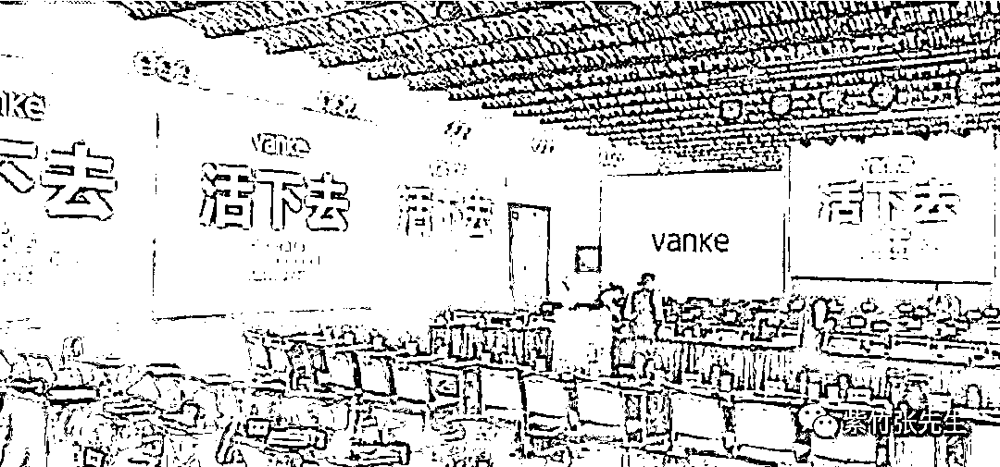
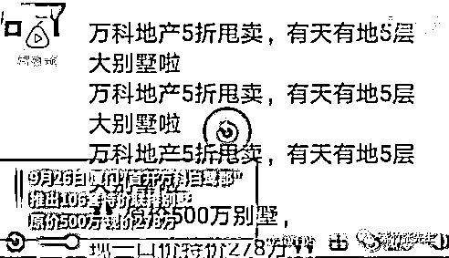

# 万科掀起价格战，并公开喊出活下去的口号

喜欢我的都关注我了~

今天，万科火了，火的原因是它在秋季例会的墙上打满了标语，而这个标语居然是三个字**“活下去”**。

看到占据整个屏幕的“活下去”，完全可以猜到它在今天的例会上会说些什么，核心主题已经都贴在墙上呢。而前几天万科董事会主席郁亮也曾公开表示：万科要做的第一件事就是进行战略检讨，以“活下去”为最终目标。

那么怎么来实现活下去的目标呢，万科也给出了明确的定义，那就是完成 2018 年回款 6300 亿的目标。郁亮表示，这个目标是所有业务的起点、基础和保障。“如果 6300 亿回款目标没有达成，所有的业务都可以停，因为这说明企业没有任何资格和能力做下去。”

什么叫回款，或者说回款 6300 亿是什么意思呢，就是说你拿出 6300 亿的现金，万科拿出 6300 亿的房子，大家交换交换，这个就叫回款 6300 亿。

为了达成这个目标，万科率先在厦门掀起惊爆眼球的价格战，在 9 月 26 日，厦门的“首开万科白鹭郡”开始调整价格，推出 106 套，89-110 平米的联排别墅，中间套一口价从原价 500 万直接降到 278 万，直接打出了**5 折甩卖**的广告标语。

 

据业内人士进行测算，实际的降幅并没有半价那么夸张，因为这套别墅原本是报价 50 万的精装修，现在改成了毛坯，原本车位是赠送的，现在也要花钱买，实际折扣应该是 36%左右，如果考虑到精装修本身是开发商自己弄，实际成本并没有 50 万，那么最终折扣可能会达到 40%左右。

虽然实际是六折，没有五折，但是相比那些 95 折就喊大降价的开发商来说，这个降幅可以说是惊天动地了。不过这个楼盘降幅这么大，是因为这个楼盘本来报价就虚高，这个小区是 2017 年开盘的，当时报价是 450 万一套，2018 年的时候宣布涨价到 500 万一套，现在直接砍价到 278 万。

掉价这么多，原本买房的业主会不会过来拉横幅闹事，如果真的有人买了，那真的会闹事，我从不高估中国购房业主的素质。为什么万科敢直接砍价这么多，很有可能这个别墅区从 17 年开始就一套都没有卖掉，所以不担心业主前来闹事，否则这促销第三天了，也没看到有业主来打砸售楼处。。。

那为什么 2017 年一套都没有卖掉，标价虚高 2018 年还敢涨价 50 万，很简单啊，越涨越有人买，不涨反而没人买了。你们可以看一看自己周边的开发商，是不是经常玩这个套路，每次只开盘几栋楼，然后每开盘一次都涨价一次。。。

在房地产上行周期，这么玩是没问题的，能大幅度促进销量，同时不至于一次出太多货，保证现金流就可以了，还能享受涨价的红利，但是在地产下行周期，这么玩就是和自己的资金链过不去了，所以万科直接来了一次六折大甩卖。

而实际上，万科喊出“活下去”的口号，并高调掀起价格战，其目的绝对不仅仅是活下去，理由很简单，**越是觉得自己快活不下去的企业，越是要对外表现自己的强大**，这样可以给予银行和投资者信心，不至于被抽贷给弄死。

万科如此高调的宣布自己要“活下去”，这哪里是活不下去的样子，这是在向所有中小房企宣战，明确告诉他们，**你们快活不下去了，只有我能活下去**。

为什么这么说，因为万科从 2014 年开始，就看衰房地产，郁亮喊出地产已经进入白银时代的口号，准备了大量的现金打算收购破产的中小房企，准备了多少现金呢，账面上足足趴了 627 亿现金不动，外面还借着银行贷款，都让这些现金趴着待命。由此还引来了“野蛮人”宝能系的股权收购战，闹出了一系列风波。

2014 年的时候，万科是行业第一，看衰地产准备大量现金过冬，但是碧桂园和恒大却大肆举债加杠杆。结果 16 年掀起一波地产大牛市，万科掉到了第三名，碧桂园和恒大弯道超车，但是万科依然坚定的降杠杆，2018 年中报，万科储备的现金已经飙升到 1598 亿。

另外一个看衰中国地产的人，是李嘉诚，他从 2013 年就开始减仓中国地产，一直到 2017 年基本完成了清仓，而万科则一直在默默的储备子弹，万科的净负债率这几年始终保持在业内最低水平。可以说如果房价崩盘引发行业大佬连锁爆仓，万科应该是最后一个死的。

当然，国家绝对不会容许地产巨头全部死掉，如果死成了那个地步，整个经济都会崩掉，国家只会允许中小房企在一定范围内破产，再多，就会启动救市政策，因为中国最大的地产获益者，很明显是靠土拍赚钱的政府。所以，无论从哪个角度看，万科都不会出事。

然而到了 2018 年，在地产行业一片风声鹤唳的时候，万科携 1600 亿现金，公然喊出“活下去”的口号，然后开始打折促销大肆回收现金，这不是真的活不下去了，而是磨刀霍霍向猪羊，一轮价格战逼死中小房企的资金链，然后趁机低价吃肉扩大市场占有率，让自己重新回到行业老大的地位才是其真实目的。

万科这么玩，有二手准备，第一个是房地产脱离政府掌控，彻底崩盘滑下无底深渊，那么万科真的在“活下去”，而他也肯定是生命力最强的那个。第二个是如果房地产在政府可控范围内深调一波，弄死一批高杠杆投机的房企，完成地产领域的去杠杆，那么万科就会是低位抄底的那个人。只有房地产明年直接再掀起一轮大牛市，万科才会失算，行业排名可能连第三都保不住了。

2014 年的时候万科失算了，踏空一轮大牛市，但是 2018 年这一次，我觉得万科不会失算，趁机反超排名是做得到的，但是我并不认为地产价格会崩，可控范围内深调后反弹是大概率。

所以，万科这个“活下去”的标语，是高调亮给中小房企看的。而对于我们而言，最近二三年消停点，除了刚需房没办法，投资房可以稍微缓一缓，等形势清楚了再看，横盘阴跌是大概率。

其实对于如此高位的房价而言，只要能确认他不会暴涨，不管是横盘还是阴跌，暂时都没有参与的价值，我会一直等到货币政策再次放松的那一天。

持有房产越多的房企，最近几年越要考虑活下去的问题，他们都在回笼现金，那么你呢？

觉得此文的分析有道理，对你有所帮助，请随手转发。

长按下方图片，识别二维码，即可关注我

近期精彩文章回顾（回复“目录”关键词可查看更多）

华为员工都这么穷，怪不得拼多多能火 | 房价跌 20%就会全面崩盘，地产杠杆远比你想的要脆弱 |  为什么碧桂园的质量那么差 | 清醒点，放弃全面开征房产税的幻想 | 央行和财政部隔空掐架，我支持央妈 |中国土地制度源自香港，但是香港却是劏房密布 | 为什么中介哄抢租赁房源，因为贩毒都没它来钱快