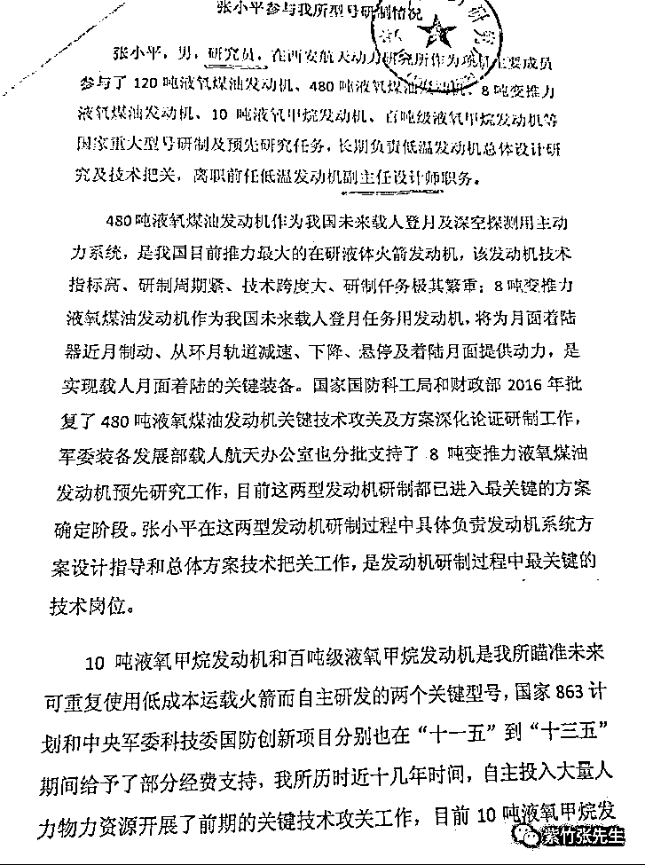
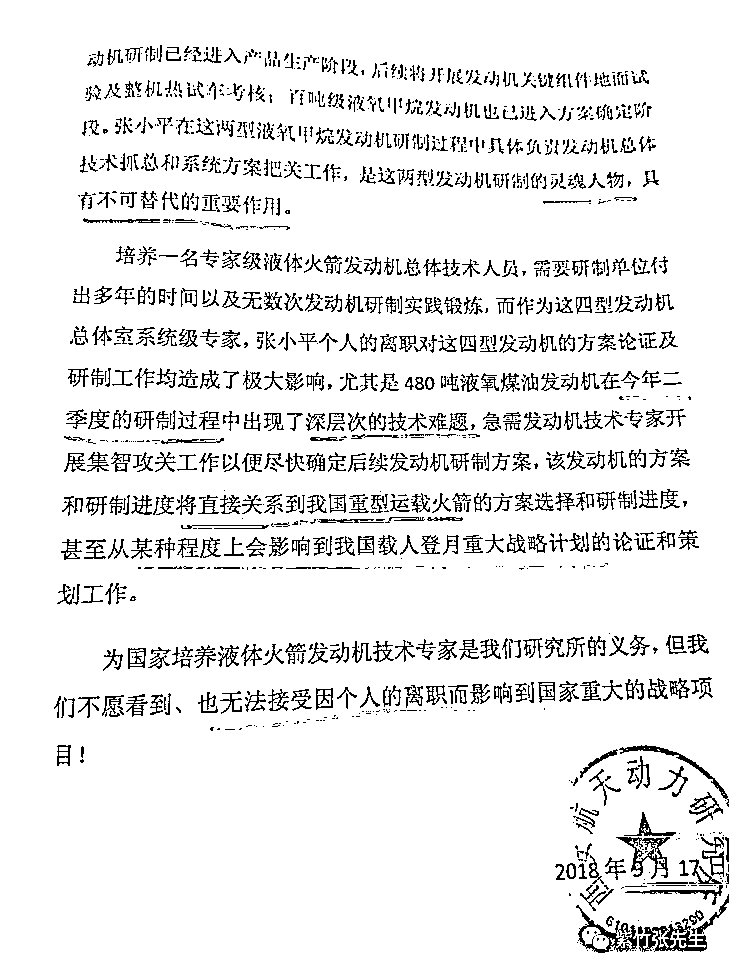

# 离职能直接影响中国登月的人才，只配待在国企底层？

喜欢我的都关注我了~

一直以来，大家都在说国企不注重人才，但是很多人并没有直观的感受，我今天以一个刷屏航天圈的网红工程师在国企的遭遇，让大家感受一下高级人才在国企的生活是怎样的。

西安航天动力研究所，又称航天 601 所，是我国液体火箭动力事业的发源地，使我国成为世界上少数几个掌握先进超低温高性能推进技术的国家之一，可谓是国企中的高科技典范，和那些低技术含量只靠垄断政策保护的国企犹如云泥之别。

按理说，这样的纯靠技术吃饭的国企，应该是特别注重人才的，因为他们的一切都是建立在人才上面的，从某种意义上说，这家国企的人才保护做的怎么样，人才梯队培养的好不好，是影响整个国家的安全和国际地位的。

但是最近航天 601 所的一封公文让这家国企彻底的火了，这个公文简单翻译一下就是，我司研究员张小平跳槽了，当初批准辞职的时候没觉得他有啥了不起，但是他离职之后我们突然发现没有他整个项目都瘫痪了，恳请国家派人把他抓回来继续研究项目。。。

先给大家欣赏一下媒体爆料的公文原稿。

这封公文堪称史上最搞笑的公文，研究所的一个小小研究员，负责最关键技术岗位，是发动机这种最核心部件研发的灵魂人物，具备不可替代的作用，这不是我说的，是公文说的，这简直是用整个体制的信用，给张小平的个人研究能力背书。

既然能力和作用都这么大，那么这种国之栋梁研究所肯定是像掌中宝一样呵护起来吧，你错了，公文中又明确写了，张小平只是个研究员，职称是副主任设计师，这是整个航天 601 所的最底层，因为整个航天 601 所，70%的人都是副主任设计师。

换句话说，除了新来的实习大学生，还有那些领导们，其他的一线基层研究员都是和张小平同级的。这种基层研究员，居然掌握核心科技？他一走整个项目都能瘫痪，而且还是发动机领域？张小平头上有正主任设计师，他不会做项目？正主任设计师头上还有副总工程师、总工程师，这些技术大佬在干嘛，随便选一个研究员指导指导也能把项目推进下去吧。

据爆料，张小平的待遇是 12 万一年，跳槽后加入了北京蓝箭空间科技有限公司，年薪直接达到百万。这次 601 所公开发文要押张小平回去，刷屏航天圈，张小平的能力变相得到整个国家体制的承认，肯定还要加薪升职。

而更搞笑的是，张小平辞职的时候没有遭到任何阻碍，领导直接就批了，估计主管领导压根不懂业务，根本不知道张小平在项目中意味着什么。区区一个副主任设计师，研究所里遍地都是，要走随便走，我这可是国企，很多人想来还来不了呢，还怕没人干活？

等张小平走了一段时间，慢慢发现不对劲了，公文中写的清清楚楚。今年二季度在研制 480 吨液氧煤油发动机的时候出现了“深层次”的技术难题，急需发动机技术专家“集智”以便推进项目，所以发文向国家要人，期望张小平回来。二季度是 4~6 月，出现了重大的问题需要专家，卡住了项目进度，才有了 9 月份的这份要人公文。

张小平从一个小工程师，突然变成了关键人才和灵魂人物，离开他整个中国都受到影响了，他的个人离职居然能影响国家战略，当初项目成功时的邀功表拿出来，我看看张小平排在第几页。

换句话说，如果不是因为项目被卡住了，601 研究所压根不会理会张小平的死活，主管领导也根本不认可张小平的技术能力，如果主管领导知道张小平有这么重要，就冲他今天能发出这种公文要人的紧迫劲头，当初就算闹上中央他都不会放人的。如果张小平没有辞职的话，他在研究所里注定一辈子是底层，根本没机会爬上去，因为你的技术和成绩，领导不认可，也看不到，直到你辞职后整个项目出问题了，领导才会发现你的价值。

更让人心中发寒的是，张小平掌握我国如此核心技术，却给了如此之低的技术层级，按照我国保密法，从我国核心技术部门离职的人有一个脱密期，在脱密期内不允许到外企任职，出境需要原单位审批。脱密期的长短和技术职称直接挂钩，职位越高，脱密期越长，关键岗位一般都是需要八年脱密期的。

但是张小平的技术层级太低了，他最多就是 1 年脱密，有可能连保密层级都沾不上边，因为层级实在是太低了，是最基层。我现在很庆幸他去的还是中国企业，要是他直接合法的跑到外企甚至出国去了，那才真的是呵呵呢。到时候法律应该制裁的不是合法跑掉的张小平，而是不给他升职的主管领导。

而像张小平这样的遭遇，并不是个例，在国企中十分常见，这是国企的特性所决定的，我今天给大家总结一下国企的特性：

国企的第一个特性是没有淘汰制，国企几乎不会开除任何员工，哪怕是一把手想开除一个基层员工都很难，除非出现重大责任事故或者员工触犯刑法等，否则国企就等于铁饭碗。如果员工想偷懒，那就只能养个闲人，你顶多就是不提拔他，除此之外毫无办法。

而这种特性不仅是基层有，领导层也有，国企里还有一个最大特性是领导只能上不能下，只要是当了领导，那就一辈子是领导，哪怕能力不足，混吃等死，也只能把他平级调动到其他部门，有些国企甚至出现了特地成立一个 XX 部来安置这些所谓的“领导”，只给待遇不用干活。这样的养老部门，几乎每个国企都会有。

国企的第二个特性，是政治正确大于业务正确，国企领导层的选拔，第一考虑的不是业务，而是政治是是否过硬，并且经常调动升迁。所以国企领导不需要懂业务，外行领导内行的情况非常普遍。

以上二个特性，导致国企人浮于事，只能上不能下，没有淘汰机制的国企，注定带来劣币驱除良币，能力越差的人，在国企里呆的越舒服，而他们拿的工资，都是从那些能力超强的人头上剥削来的，所以业务能力越强的人，越不希望待在国企。而提拔领导只看政治不看业务，也导致技术大牛几乎不可能被提拔，你不是技术强吗？待在基层老老实实干活最适合你，当了领导哪还有时间研究技术。

以上种种，导致国企成了一个围墙，能力越差的人越想进去，只要进去了，国企会保护他们一辈子。而能力越强的人越想出来，因为只有出去了，他们的人生价值才能得到实现。

刚毕业的时候，是看不出谁强谁弱的，所以大家都想去国企呆，国企代表稳定，代表铁饭碗，哪怕自己能力差，也能活的很滋润。但是锻炼个几年之后，彼此的差距就会非常明显，如果你的技术强到团队不可或缺，薪水能直接翻倍甚至更多，那我建议你还是要跳出国企。

离职能直接影响中国登月的人才，只配待在国企底层，那你呢？

张小平：领导能提点待遇吗？我现在攒个首付结婚都困难。。。

领导：爱干干,不干滚！

张小平：好吧，那我滚了。

领导：嗯，好走不送~

几个月后

领导：你回来！你 TMD 给我快回来！

觉得此文的分析有道理，

对你有所帮助，

请随手转发。

长按下方图片，识别二维码，即可关注我

近期精彩文章回顾（回复“目录”关键词可查看更多）

华为员工都这么穷，怪不得拼多多能火 | 房价跌 20%就会全面崩盘，地产杠杆远比你想的要脆弱 |  为什么碧桂园的质量那么差 | 清醒点，放弃全面开征房产税的幻想 | 央行和财政部隔空掐架，我支持央妈 |中国土地制度源自香港，但是香港却是劏房密布 | 为什么中介哄抢租赁房源，因为贩毒都没它来钱快