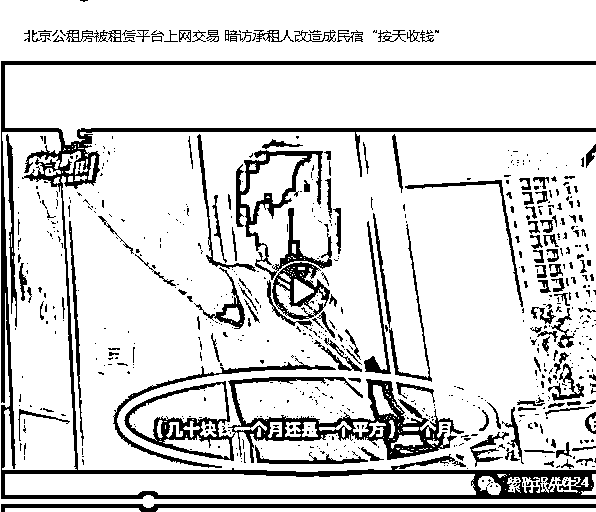
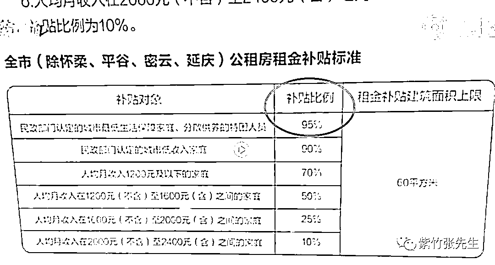
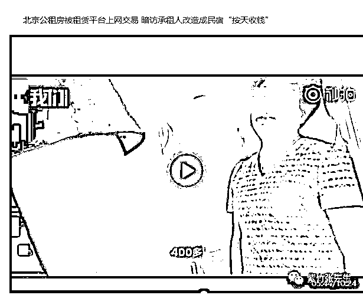
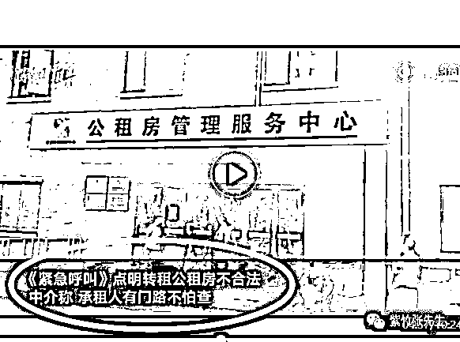
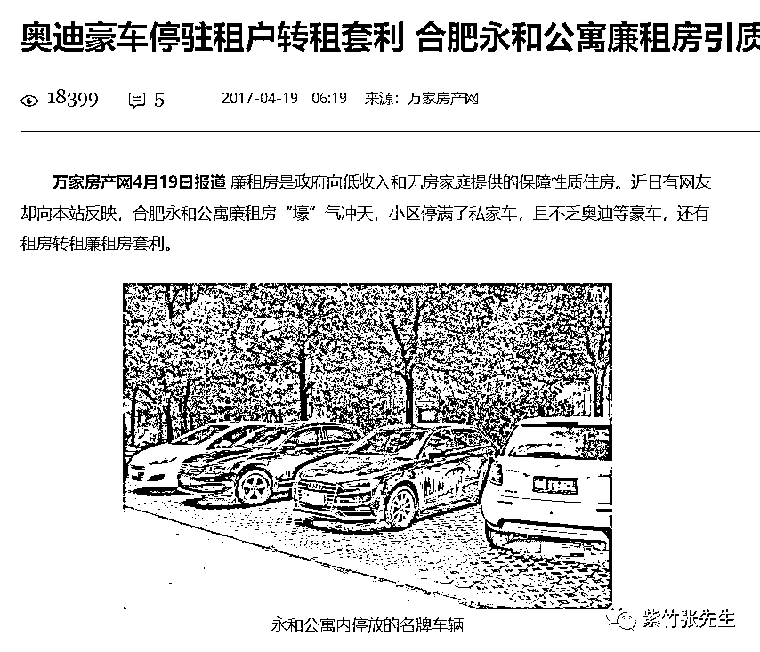
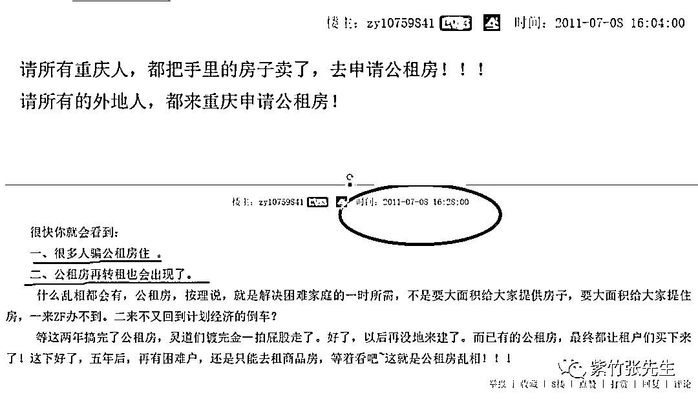

# 公租房到手年入就涨 5 万，这种好事我怎么没有 | 紫竹张先生

喜欢我的都关注我了~

从房价暴涨以来，买不起甚至租不起成为了民众最大的痛点，为了达到在不降低房价的基础上安抚民众怒气，我国推出了如经适房、两限房、廉租房等一系列政策，但是由于这些政策天然违背经济规律，所以在引发恶劣社会影响后，这些政策一律以失败告终。

后来，我国又推出了公租房政策，用来慢慢替代之前的几个政策，如经济适用房，很多地方就已经停止执行了，因为来钻漏洞购买的人群实在太多了，经济适用房住的大多是权贵，这不是一个段子，而是事实。。。

而公租房，还没过几年，就走上了它前辈的老路。目前，北京的公租房，只要申请到手，年入立涨 5 万，这让很多辛苦干一年收入还没 5 万的二三线城市人口羡慕死了。

近日来媒体集中报道公租房乱象，北京多个公租房的业主，以极低的价格租来了房子，然后转手高价租出去，什么都不用干，每个月套利四五千元，每个月开着豪车来收租就行看。

他们拿到手的租金就多低呢？一个月仅仅几十块钱，转手就可以四五千元租出去。

他们是如何做到的？首先这套公租房是二房，政府的定价是 2100 元，而市场价是一居室 3500 元左右，二居室 4000-5000 元，但是政府在这么低的价格上还给予了补贴，最高可以补贴 95%的租金，剩下的还能用低保抵扣一部分，所以做到了每月只用缴几十元的壮举。

还有过更分的，直接把公租房改为了民宿，按日出租，一天收费 400 多元，据老板说生意可好了，七八月份全部满租，淡季的话一个月大概租出去 25 天的样子，月入妥妥破万。

而据视频中的中介所属，出租的业主，都住在另外一个小区，这个公租房就是拿来套利的，当记者问这里不是不允许转租的时候，中介很不在意的回答：“他们有门路，不怕查”。

换句话说，不管你在北京干啥的，只要你能搞到一套公租房，转手就可以月赚四五千，年收入妥妥的涨 5 万，这不仅仅是北京的公租房如此，全国各地的都如此，公租房小区经常豪车密布。

法规上明确规定，公租房是给困难户住的，结果小区里不仅有停车位，还停满了私家车，甚至豪车都能连成排，岂不是咄咄怪事。

1**公租房乱象是必然结果**

公租房、经济适用房等一系列所谓的政策房，他们基本都成为有钱有权之人的套利工具，真正有需要的人拿不到，这个道理在无数国家被证明了无数次了。

因为公租房的本质是补贴，政府以几十元的价格，把价值四五千元的东西租给贫困户，这和直接发给他四五千元现金，然后让他去市场找房子住是一个效果，无论怎么换名头，都不会改变他财政补贴的本质。

如果公租房不设门槛，无限量供应的话，那么公租房的需求会变得无限大，一直到商品房的租金价格被拉平到和公租房等同的地步。至于说收入和各种证明，这都不是事，只要你肯花钱，都能做的出来。

这种低于市场价的公租房，本质上就是公共财政出来做补贴。虽然他的本意是把利益输送给贫困阶层，但是实际操作中必然变成把利益输送给中上阶层造成权力寻租，用门槛和权力，来抹平这个差价。任何一个稍有经济学头脑的人，都会得出这样的结论，不信我们看一看 2011 年对公租房的“神预测”，其实一点都不神，大家都知道一定会是这么个结果。

当年经济适用房和限价房为什么设立了重重监管，都没能挡住腐败和权力寻租，黑幕摇号，内部指定等新闻层出不穷，其本质原因就是价格双轨制下存在巨大的利差，这一定会引来权利寻租套现。

2**什么才是真正的公租房**

我上面说了，公租房的本质就是政府想让穷人有地方住，把房屋低于市场价租给穷困阶层，但是不管这个价格再怎么低，你提供的房源始终是有限的，整个北京始终就只能有那么多人住。

所以这是典型的掩耳盗铃，价格再低，有当年的福利分房低？那个价格可是零。但是当年的福利分房让全国人都住上大房子了吗？没有，人均住房面积比解放前还低。如果真心想让穷人住上房子，只有一个途径，那就是扩大供给，建造大量的房源，这样才是真正的人人有房住，否则不管你怎么搞，他一定失败，没有一丝例外的可能。

真正的公租房或者廉租房，肯定不是修建的那些公租房小区，而在于当初被清理的群租房，群租房虽然住房条件差，但是他是真真切切的增大了供给，很多北漂借助群租房，才在北京活了下来。那些喝茶遛鸟吃低保的北京大爷大妈其实并不是社会底层，很多人的财富能超过别人一辈子的打拼所得。什么人才是真正的社会底层呢，那些北漂才是，二袖空空，月月精光，他们不是最需要帮助的社会底层，你说什么才是？

这个道理谁都懂，但是为什么还要坚持不懈的闹腾什么经济适用房、限价房、公租房这些东东呢，我的理解是这些东西根本就不是为了彻底解决穷人居住问题而推出来的，否则也不会清理群租房。这些政策的本质是面子工程，是为了在高房价无法解决的阶段进行社会稳定，他是一剂麻醉药。

不然的话，我就问你一个问题，假设你是执政者，现阶段不允许你大幅增加土地和房源供应，不允许你大幅打压房价，直接发放现金补贴一样会引来套利腐败行为，你会采用什么办法来安抚社会的怨气。

很显然，经济适用房啊，公租房啊是最佳选择，消除穷人的怨气，给他们一个盼头，理论上他们也能住进这样的好房子，不至于让绝望的穷困阶层去闹事。所以每一个政策都能拖好多年，经适房爆出大黑幕就推公租房，公租房这次爆出大黑幕，过几年再推出一个新政策来替代他就是了。他的使命就在于此，所以这个政策其实并没有失败，实际上他是很成功的。

对了，你以为公租房是权贵套利的宝地嘛，并不是，因为一年 5 万实在是太慢了，要论套利大师，当初的经济适用房才是，那是一口气几十万甚至几百万的套利。

每年土拍批地数量翻一倍，不管你建商品房还是公租房都一样，什么住房问题都能解决，从经济学的角度来说，只有扩大供给，才能对价格釜底抽薪，可惜现阶段不敢使用这样的政策。

觉得此文的分析有道理，对你有所帮助，请随手转发。

长按下方图片，识别二维码，即可关注我

近期精彩文章回顾（回复“目录”关键词可查看更多）

华为员工都这么穷，怪不得拼多多能火 | 房价跌 20%就会全面崩盘，地产杠杆远比你想的要脆弱 |  为什么碧桂园的质量那么差 | 清醒点，放弃全面开征房产税的幻想 | 央行和财政部隔空掐架，我支持央妈 |中国土地制度源自香港，但是香港却是劏房密布 | 为什么中介哄抢租赁房源，因为贩毒都没它来钱快