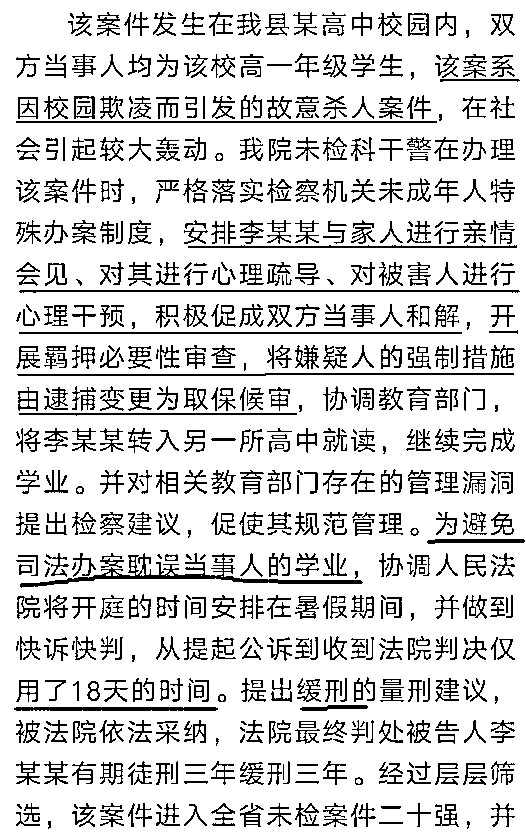

# 冰释前嫌和危险的 14 岁

喜欢我的都关注我了~

这几天，冰释前嫌成了热门词汇，而其爆红的根源，在于鲁山检察院发布的一则微博和其公众号文章。 

原来，今年暑假，16 岁的小赵是鲁山县的初二学生，因“一时冲动”强行和 17 岁的女孩小花发生了性关系。这是一起恶劣的强奸案，小花报案后，2018 年 7 月 24 日鲁山县人民检察院批捕小赵，鉴于小赵“主观恶意较小”，检察官介入后强暴者和受害者“冰释前嫌”，于是检察院将对小赵的强制措施改为取保候审，**赶在开学之前释放**了小赵，为表示感谢，小赵的家人给检察机关送来了锦旗，鲁山检察院当成重大功勋发布在自己的公众号上。当然，检察院收到的锦旗只是小赵家人的，小花的家人没有送任何锦旗给检察院。 

检察官是深感欣慰了，小赵的家人也深感欣慰了，但是小花没有深感欣慰，我也没有深感欣慰。据悉小赵的家人拿 8 万元获得了和解的机会，但是这种恶性强奸案，是区区 8 万元可以解决的？尤其是检察官**直接插手**和解过程更是不应该，有**利用公权力暗暗压迫**女孩的嫌疑，如果当成**功勋**发出来，那简直是滑天下之大稽。

而检察官之所以这么做，是和我国长期优待未成年人的政策分不开的，很多未成年的恶性犯罪行为，都予以轻判甚至不判，你以为强奸罪不了了之就很恶劣了？我们看看鲁山检察院的另外一个“重大功勋”，**故意杀人案**都能庭外和解。 

故意杀人啊，然后居然和解了，杀人犯一点事没有，直接缓刑处理，还能去另外一个高中继续上学，至于死的那个可怜孩子，就没人管了，这个案件，被鲁山检察院认定为未成年精品案件，热烈祝贺。从这个逻辑我们可以看出，只要是未成年恶性犯罪，经检察官调解之后受害人愿意和解，让犯罪嫌疑人直接释放的案件，都是精品案件，应热烈祝贺，而那些把恶性犯罪的未成年人送入监狱的案件，都不是精品案件，不会表扬，说不定还会批评。

那么到底是受害人重要，还是犯罪嫌疑人重要，是施暴人可怜，还是被施暴人可怜，鲁山检察院能回答一下吗？检察官为施暴者考虑的面面俱到，连他上学时间都怕给耽误了，死去的受害人也是学生，有检察官能考虑一下他们父母的感受吗？ 

这种恶劣的案例给所有人一个暗示，**只要未成年，杀人不犯法**。这不叫**冰释前嫌**，叫**冰冷刺骨**还差不多。 

危险的 14 岁

根据中国《刑法》第十七条规定，已满十六周岁的人犯罪，应当负刑事责任。已满十四周岁不满十六周岁的人，只有犯下故意杀人、故意伤害致人重伤或者死亡、强奸、抢劫、贩卖毒品、放火、爆炸、投毒罪的，才应当负刑事责任。而不满十四周岁的，则完全不用负刑事责任。

简单的解释一下就是，未满 14 岁，哪怕杀人都不负刑事责任，满 14 不足 16，只有犯下零星的几个重罪才会负刑事责任，而在实践中我们看到了，实际尺度比这个还松，16 岁的小赵犯了强奸罪都能放回去继续上学。。。

为什么对 14 岁之下的青少年免于刑责，法律的理由是 14 岁以下的青少年，心智不成熟，无法认识到自己这么做是属于犯罪。

实际上当上世纪 80 年代颁布这个法令的时候，这么做是合适的，那个年代的青少年接触信息的渠道很少，14 岁的时候大多数都是懵懵懂懂，啥都不知道，营养不良导致体力也不足。但是互联网爆炸之后则不一样了，14 岁的青少年几乎啥都知道，有些甚至都知道怎么反侦查！很多青少年不仅知道自己是在犯罪，而且还清楚的知道自己不会被法律所惩罚，心智上已经完成了一个量变，而国家富强后充沛的营养供应，也让这些孩子的体力完全不能按照之前的标准去衡量。

所以，出现了一个新名词，叫**危险的 14 岁**，接近但是不满 14 的青少年是最可怕的，营养充足的今天，他们很多人已经有能力杀人，而且知道自己属于法律漏洞，他们非常的危险。

而实际上，早在 2006 年，就有很多媒体曾提出质疑，并呼吁完善法律，但是很可惜，法律始终没有被完善，12 年前的少年就知道**“我不满 14，我可以杀人”**以及**“我到了 16 岁就不偷了”**，你以为今天的青少年不知道？

而实际上，随着改革开发以来，我国民众进入温饱之后营养的极大丰盛，青少年的身体发育普遍加快 2~3 年，而互联网的出现，让青少年的心智发育也普遍加速 2~3 年。

所以我这里认为，刑法所规定的 14 岁和 16 岁二个门槛，应至少**全部下调二年**，改为 12 岁以下杀人不犯法，14 岁以下小偷小摸不犯法，才勉强算合适，也能起到保护青少年的作用。

美国的法律是怎样的

那么，以人权著称的美国，是怎样保护青少年的呢。美国的法律也保护青少年，不过保护的是合法的青少年，对于犯法的青少年保护远远不如我国严格。

美国的 50 个州里，有 37 个州没有规定刑事责任的年龄下限，也就是在法理上你 1 岁杀人都要是负刑责的。而剩下的州里面，也都不是无脑规定 14 岁以下必须免刑责，而是规定若 14 岁以下的孩子不知道他做的是错事，那么他不用负刑事责任。换句话说，如果检察官能证明这个孩子知道他做的是错事，那么他依然要负刑事责任。

**8 岁的女孩**因为在学校更衣室偷拍别人被刑拘，以“传播未成年人色情物品”的重罪起诉，这是一个真实的美国案件，不是开玩笑。

而之前中国三名未成年人在美国霸凌二名女同学，没强奸也没杀人，只是殴打辱骂一下，这种在中国**顶多是派出所批评教育的小事**，被美国法院判**处 6~13 年的重刑**，刑满释放后还会被永久逐出美国。 

那么这个案子是不是最多只能判 13 年呢，不是的，这是三名犯罪嫌疑人和检方达成了诉辩交易，主动认罪，而检方撤销了折磨罪这个重罪指控才最终只判了 13 年的。按犯罪嫌疑人律师的说法，如果不和检方妥协，始终不认罪的话，一旦案件拖到了陪审团阶段，面临的刑罚很有可能是**无期徒刑**。

中国连强奸杀人都能免于刑事处罚，而在美国殴打折磨同学都能判无期徒刑，**同样是未成年人，差距怎么就这么大**。

我的孩子 16 岁之前肯定是乖宝宝，不会去触碰刑法，所以中国这种纯粹保护恶人的未成年保护法对她只有害处，没有好处，为了保护我家的宝宝，我肯定要强烈反对这种不完善的法律，杀人不犯法的年龄至少也应该降低到 12 岁以下，如果能降低到 10 岁那就更好了。

否则的话，除了那些少数坏孩子，其他所有的好孩子，都会是这种法律的受害者。

觉得此文的分析有道理，对你有所帮助，请随手转发。

长按下方图片，识别二维码，即可关注我

近期精彩文章回顾（回复“目录”关键词可查看更多）

华为员工都这么穷，怪不得拼多多能火 | 房价跌 20%就会全面崩盘，地产杠杆远比你想的要脆弱 |  为什么碧桂园的质量那么差 | 清醒点，放弃全面开征房产税的幻想 | 央行和财政部隔空掐架，我支持央妈 |中国土地制度源自香港，但是香港却是劏房密布 | 为什么中介哄抢租赁房源，因为贩毒都没它来钱快