# 人体内都发现塑料微粒了，大自然的惩罚从来没放过谁

编辑/怡宝

最近，外媒齐刷刷地报道了：**“人类粪便中首次发现了塑料微粒”。**

在 2018 年欧洲消化医学会的会议上，奥地利环境局提出了这个最新的研究成果。**在志愿者的粪便中不仅发现了塑料微粒，而且塑料种类多达 9 种。**

参与研究的志愿者来自意大利，日本，俄罗斯，英国和奥地利等 8 个国家，从 33 到 63 岁不等。**他们的饮食日志看起来和我们差不多，都吃塑料包装的食物，饮用瓶装水。**

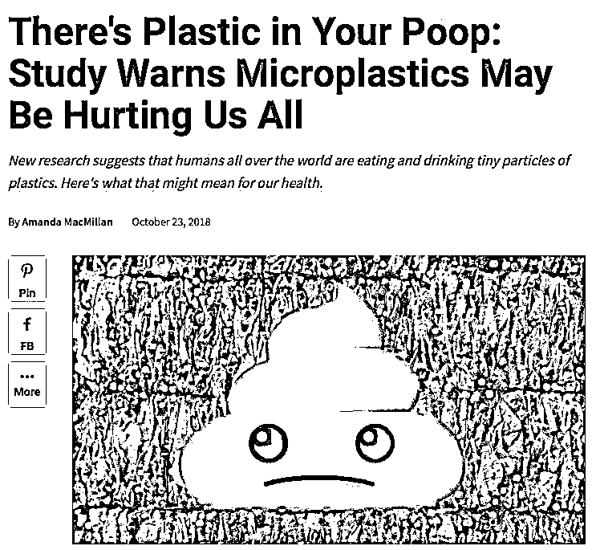

**塑料从污染大自然、对海洋动物造成伤害，到真正开始危害人类，没想到居然这么快。** 

看看四周就会发现，**我们已经被塑料包围了，**矿泉水瓶、外卖塑料袋、塑料盒、一次性餐具、绝大多数的产品包装......

今年 9 月，台风“山竹”过境之后，曾出现满地塑料垃圾的景象。

当时就有网友感慨，**“人类扔了半个世纪的垃圾，大自然不过半天就还回来了。”**

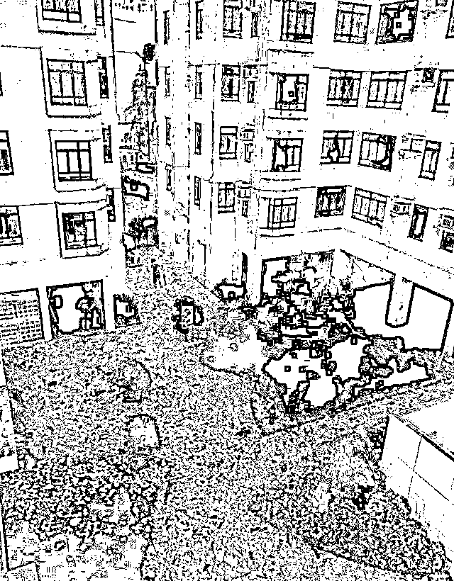

曾有美国学者化验了来自五大洲 14 个城市地 150 份自来水样本，发现高达**83%**的样本带有塑料颗粒。

**值得警惕的是，**如果参照塑料微粒对其他动物的影响，**最小的微塑料能进入血液、淋巴系统甚至肝脏，**绝不仅仅是通过粪便排出体内这么简单。而且，积聚在肠道中的微塑料也可能影响到消化系统。

**从空气到食物，破坏环境给人类自身带来的后果，多像悬在我们头上的达摩克利斯之剑。**

**01 **

**2002 年到 2012 年间，人类产生的塑料垃圾比整个 20 世纪都要多。**

一只塑料袋需要近 20 年才能完全降解，一只塑料瓶则需将近 450 年。

2017 年约有 1400 万吨塑料倾倒入海洋，两年前这一数据还是 800 万吨。

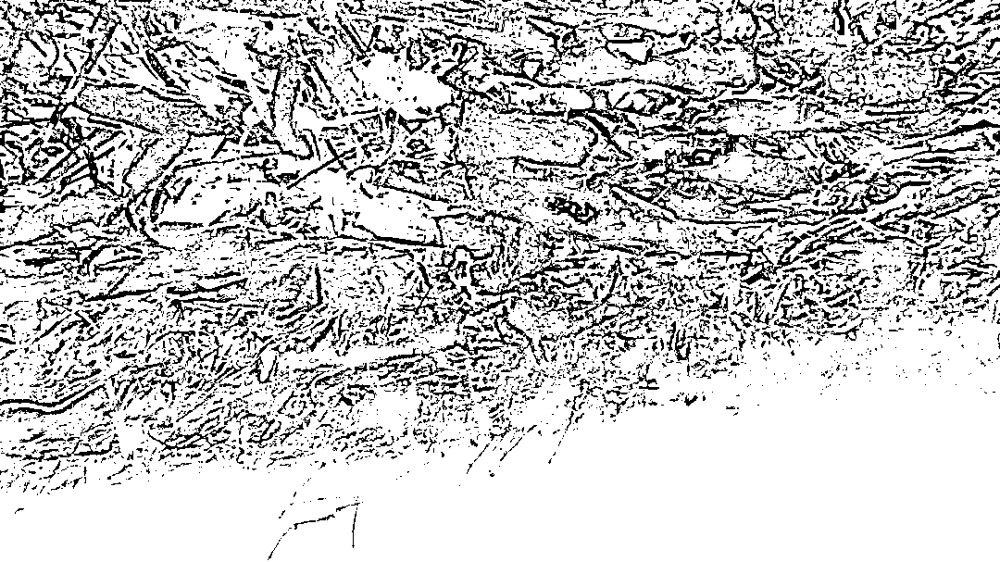

可奇怪的是，99%的塑料垃圾进入海洋后失踪了。

它们去哪儿了呢？

科学家给了两种解释：

第一，他们进入了海洋生物的消化系统里。

第二，它们太小了，无法通过常规途径检测到。

成千上万的海鸟、海龟和其它动物不知道吃了多少塑料。

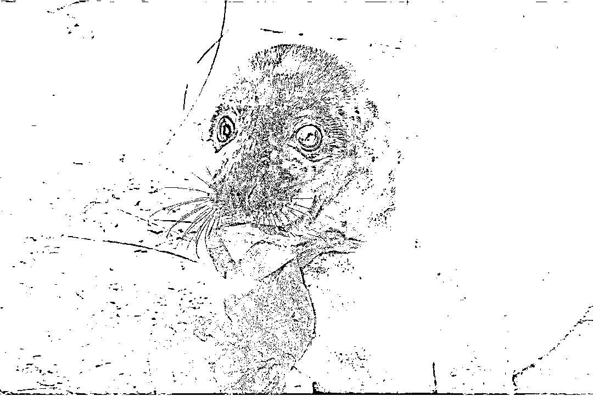

2015 年 6 月，一只短尾领航鲸搁浅了，人们解剖时发现，它的**胃部塞满了 10 公升的垃圾，****它****再也吃不下正常食物了，是被活生生饿死的。**

可是这只小鲸鱼**才不到 1 岁，**却吞食了如此之多的垃圾，**可见海域已经被污染成了什么样。**

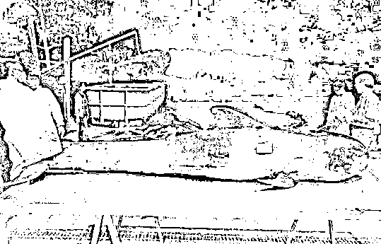

据统计，全球至少一半的海龟体内有塑料，大约 60%的海鸟曾经吃过塑料碎片，**到 2050 年，这一数字将增加到 99%。**

**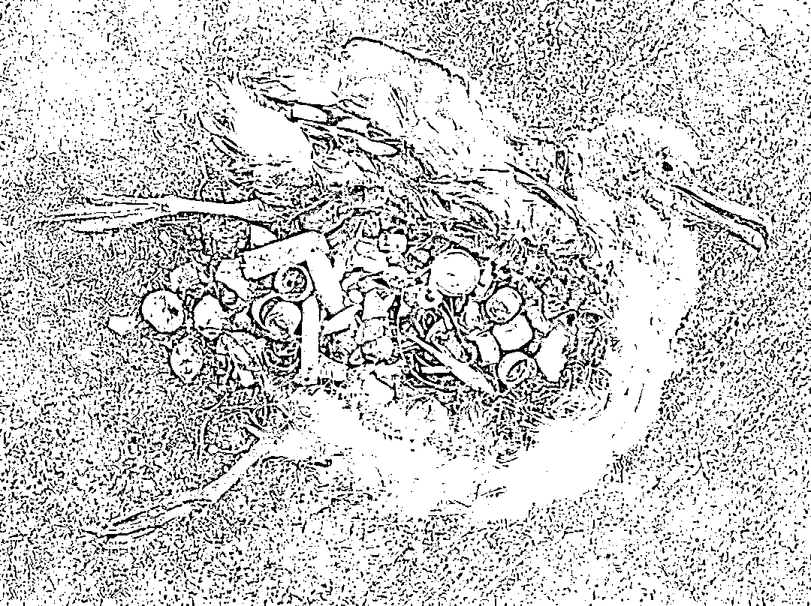**

塑料不仅会导致动物**肠阻塞，溃疡，胃穿孔**，还会产生虚假的饱腹感，导致动物们**停止繁殖，最终饿死。**

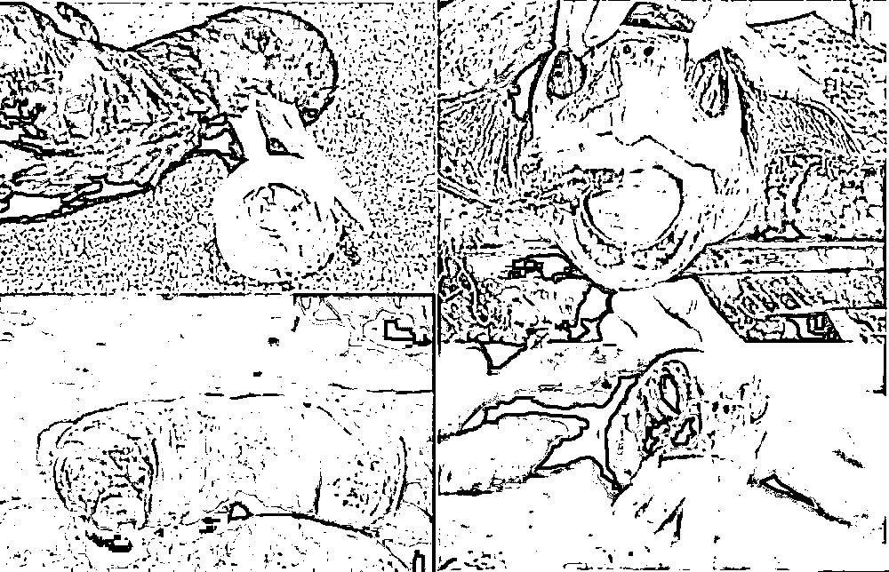

就连我国载人潜水器“蛟龙号”，2017 年从**4500 米的深海**带回的海洋生物，**体内都检出了微塑料。**

不得不承认，人类活动的污染已遍布全球各个角落。

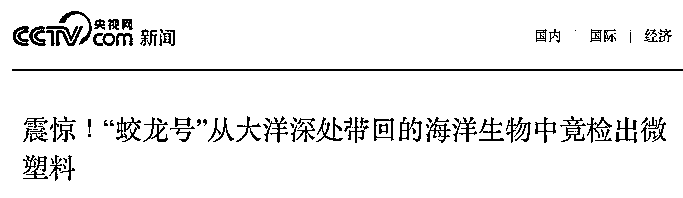

**我们听不见动物们的绝望呻吟，直到塑料也进入了我们的身体里。**

**02**

新西兰奥克兰大学的 Ana Markic 博士通过长期调研发现，**新西兰市面上常见的 9 种商业捕捞鱼，其中 8 种鱼经常食用塑料元素。**

美国 5Gyers 研究所的报告也显示，**塑料制品已经进入了人类的食物链系统。**

这就是为什么，在来自世界各地人的粪便中都发现了塑料微粒。

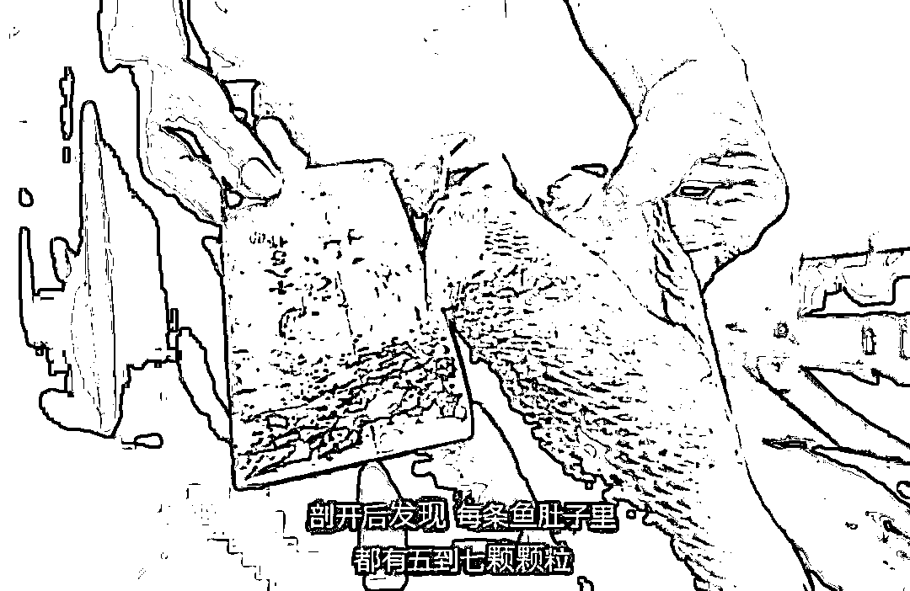

被海洋生物吃掉的塑料，最后重新回到了我们的餐桌，回到了我们的嘴里，胃里，血液里。

而且，**这已经不是吃不吃海鱼的问题了。**

那些焚烧不掉的垃圾，还有很多就在我们身边，在我们赖以生存的湖泊、河流里，土地里。

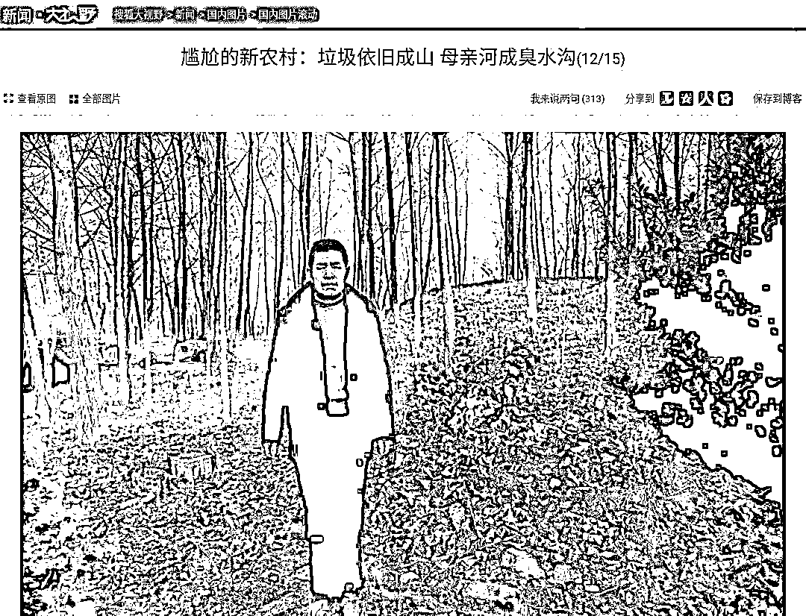

我国住建部的一项调查数据表明，**中国三分之一以上的城市被垃圾包围，四分之一的城市已没有合适场所堆放垃圾，**垃圾堆存累计侵占土地 75 万亩。

地球拥有自己的循环系统，水、空气、陆地、海洋、动物，**没有一个环节可以独善其身。**

**03**

我之前写过一个投身环保事业的男孩 Slat，他是个天才少年，但他放弃了一份大好前程，**选择了孤独地走上海洋垃圾治理这条艰辛的路。**

他到 Ted 上演讲，**向人们阐释他的海洋清洁概念；单枪匹马创建了 The Ocean Cleanup，**以消除世界上的塑料海洋********为使命。****

**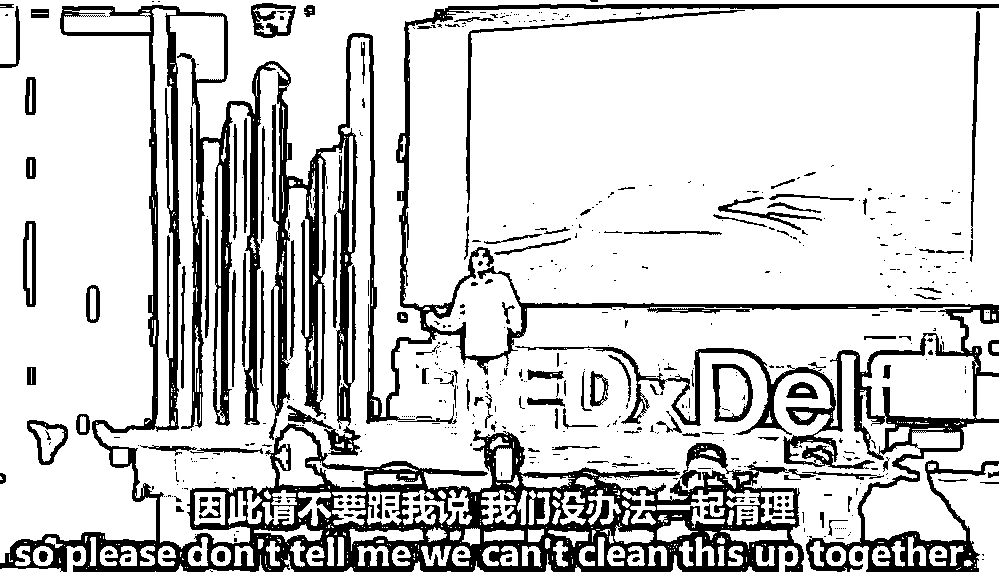**

**他花了整个青春去研究和试验，顶住了无数质疑与嘲笑，终于做成了自己的**海洋清理系统。****

**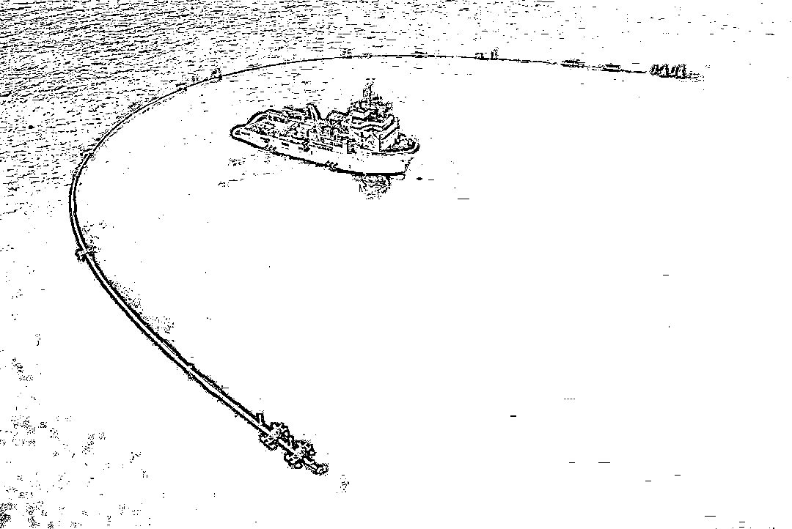**

这个系统的运行速度比塑料更快，利用速度差捕获塑料。**只要部署 60 个这样的清理系统，**在五年之内有希望清理掉环太平洋垃圾带中一半左右的垃圾。****

而且，他的团队把打捞上来的塑料运到陆地上，**重新制作成塑料制品，循环利用。**

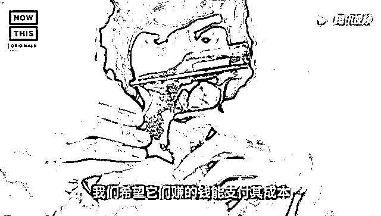

不是每个人都心怀拯救地球的梦想，但从自己开始改变也未尝不可。

比如，世界上还有一些人在身体力行“零垃圾生活”。

有一位纽约女孩叫 Lauren Singer，毕业于纽约大学环境科学系。

四年来，她积累下的不可降解垃圾，仅仅装满了一只 500ml 的玻璃罐子。

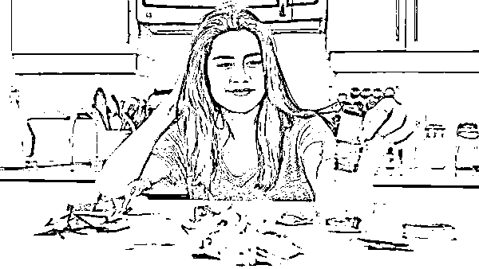

她家里储存食材的器具全部是布袋和玻璃罐，没有任何塑料袋或塑料器皿。

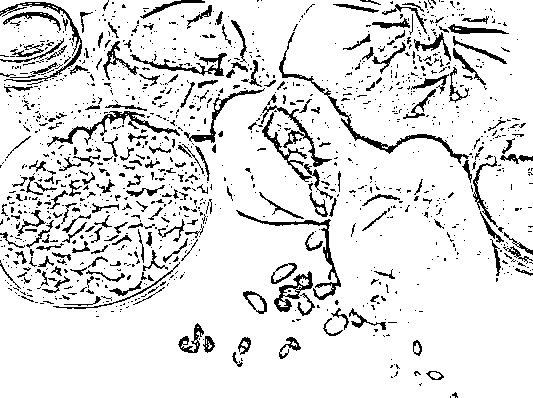

外出吃饭时，她会随身携带一块干净的茶巾，拒绝店家的一次性包装。

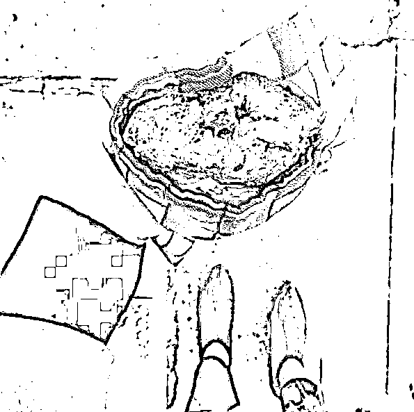

垃圾围城已经把我们困住了，即便我们是食物链顶端的人类，也无法幸免。

**当那些被我们扔掉的塑料一点点回到我们体内的时候，**是时候意识到点什么了。

**现在不计后果的享受，毫不在意地扔扔扔，代价即使不会报应到自己身上，也会报应到我们的子孙身上。** 

面对数以万计的动物活活死去，你可以冷血地不理不睬。

但是我们的存亡都成为一个选择题的时候，让我们停下来反思下自己吧。

**大自然不一定需要人类，但人类需要大自然。**

生态链上的所有生命，都是一荣俱荣，一损俱损。

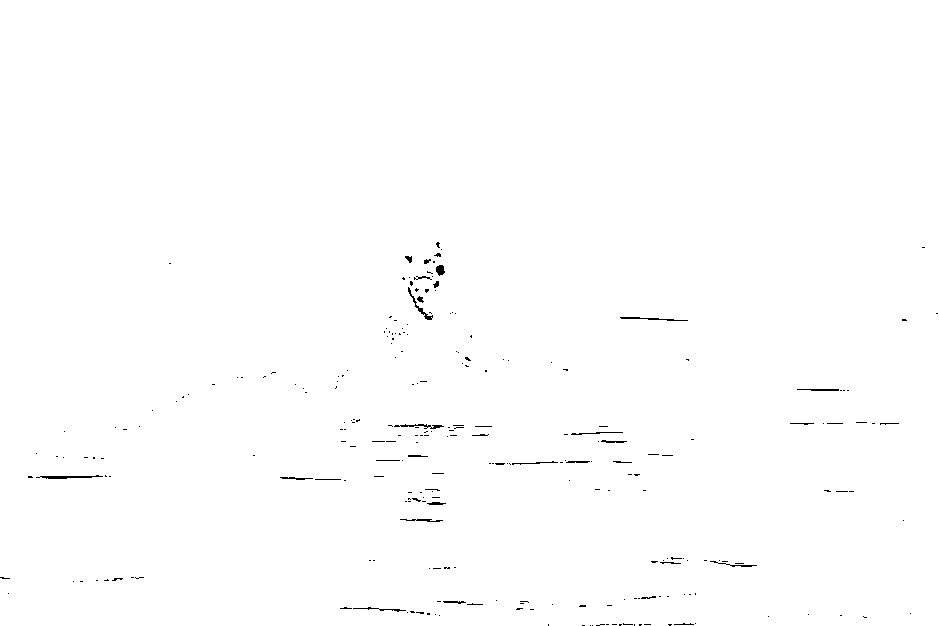

你不一定要做到“零垃圾生活”，

但自带购物袋、自带水杯；拒绝一次性餐具，尽量少用塑料袋；选择玻璃罐保存食品；**注意垃圾分类回收；**不购买塑料微珠制品……以及培养孩子的环保意识，都是我们可以做到的啊。

 **不要把****“对不起”****，变成****“还不起”****，甚至是****“来不及”****。** 

**我们不是在拯救地球，是在拯救我们自己。**

**您的转发，**

**将会让更多人知道，**

**”塑“命难逃，我们需要行动了。**

**本文转载自每日怡见**

**致力于分析社会热点，科普实用财经。**

**升维思考，降维行动，陪你一起智慧生活，共同成长。**

**扫描下方二维码即可关注**

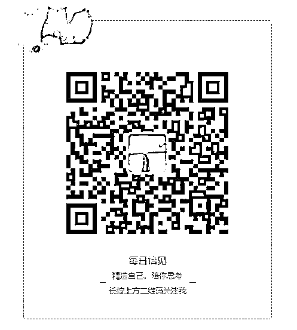