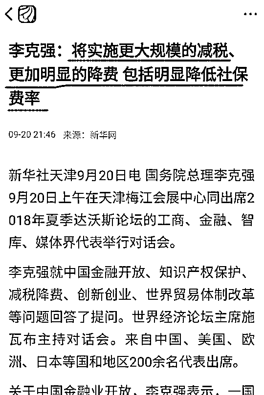
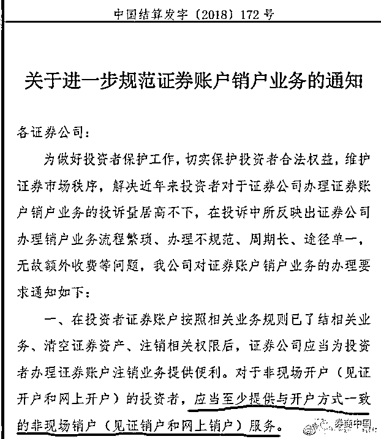
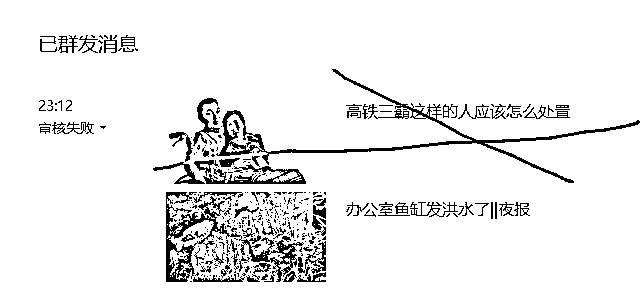

# 办公室鱼缸发洪水了||夜报

 前几天我辛苦给办公室弄了一个超漂亮的鱼缸，放了不少漂亮的热带鱼，结果今天早上一看傻了，当初安装师傅没有拧紧泄水孔软管，导致软管脱落，由于半夜无人，导致水漫金山，所有水全部外泄，漂亮的热带鱼肯定也全部挂掉了。

于是紧急联系维修，修复软管之后重新注水，然后给鱼缸布景，又浪费我半天时间，这里顺便给大家讲一讲大鱼缸的特点吧。

首先，大鱼缸很漂亮，而且并不贵，特别高档，但是实际上并不比室内家具贵太多，安装也很方便，有电就行，进水出水都可以用软管接很远的水龙头即可。

虽然鱼缸不贵，但是鱼很贵，而且是越小的鱼越贵，比如一条银龙鱼，几十元上百元就可以买一条 12cm 左右长度的，看起来也挺气派了，一个大鱼缸放三五条就差不多了，而且长的特别快。

而那些小型热带鱼，单只很便宜，大概 1 块钱一条，体长 2cm，但是放到大鱼缸里和沙粒一样渺小，根本看不到鱼，我给大家做个科普，体长 12cm 的鱼，视觉效果绝对不是体长 2cm 鱼的 6 倍，实际上 60 倍都不止。所以小型灯科热带鱼，要么不放，要么就放一群，150cm 的鱼缸，大概要放上千条。。。而且这种小型鱼特别脆，很容易死。

那既然如此，大家都买大型鱼算了，但是实际上，大型鱼只适合裸缸，就是一个空白玻璃鱼缸，你们可以关注下养龙鱼的，缸里都一清二白啥都没有，如果你想造很多景观在缸里，那就只能用小鱼了，否则会破坏布景，小鱼成群之后，视觉效果其实是远远超过大型鱼的，就是比较烧钱。

哦对了，你觉得买一次鱼就 OK 了吗？不是的，这些鱼经常死，你得死很多回之后才能摸索出经验让他们活的久一点，就算你能保住不死，其实喂食成本也很高，比如那个龙鱼，其实远远比小型鱼便宜，但是喂养费用其实远远比小型鱼高，因为他太能吃了，吃的又精细。

所以，鱼缸不花钱，鱼很花钱，买鱼不花钱，养鱼很花钱，大概就是这么个状态。

另外，家庭内如果要放大鱼缸，请切记不能放在木地板周围，千万不要觉得鱼缸质量好，是品牌缸，就觉得万无一失了，这玩意哪怕一年二年之后漏一次水，都能造成毁灭性的打击，而你完全不能保证你的鱼缸一定不漏水，所以鱼缸请回家之后，默认他将来某一天一定会大漏水一次，如果鱼缸脚下的东东完全不能接受漏水，那就换个地方放，或者不买鱼缸，这是中肯劝告，按最坏的情况打算，不冒这个险。鱼缸一定不放在木地板上，只可以放在瓷砖上，而且周围要有地面排水设施。

~~~~

这二天，高层密集发声，连续谈及税费和社保的问题，而且用词一天比一天严厉，今天的用词直接改为了“更大规模”的减税，“更加明显”的降费，“明显降低”社保费率。

相对于昨天的说辞，这里更加强化了一层，不管从哪个角度去解读，这都一定是个利好，而且是一个挺大的利好。 

而今天券商接到通知，要求方便投资者销户，至少应提供和开户渠道一样便利的销户渠道，换句话说，以前网络开户容易销户难的情况，以后就不存在了，网络开户不爽随便就去销户，这对散户来说是一个重大的利好，以前很多人被券商的这个规定给卡的难受死了，唯一可惜的是，这份通知给了券商 5 个月的时间升级软件，增设渠道，明年 3 月 1 日起正式施行。 

这几天没怎么管股市，因为他走的很好看，所以我就不再多说，实际上月 K 已经 6 连阴了，连跌半年，月月跌，天天跌，中间几乎就没有啥像样的反弹过，哪怕 08 年其实也没跌这么惨过，至少那个时候还有过个别大反弹。

所以，我就懒得动了，等大反弹再跑，反正 18 年都是练手的，牛肯定不是牛，但是我们不能长期脱离市场，还是要经常看一看，反正我对弱市的操作准则很明确，少量钱，然后多看少动，感知市场，等大面积赚钱效应出现，才能引来资金，而外部资金入场，才算牛市。

筑底彻底完成，我觉得需要国庆之后，正常来说国庆节前不会发动大反弹，避开长假不稳定因素，大家都要等一等，但是鉴于频繁发布的减税利好，节前的筑底应该是阳性筑底，这种大利好，多少还是有点用的，不敢涨多，涨一点，然后少跌一点，还是做得到的。

而这里的走势，怎么看都是筑底走势，暂时没看出其他的可能来，至少反弹到 2900~3000，再考虑减仓问题，弱市难操作，但是并没有那么难操作。

~~~

今天其实 11 点就发了，4000 字的头条呀，审核了 20 分钟然后失败，为防意外，我直接删除了头条不发了，只放次条

可惜了，白写那么久。。。