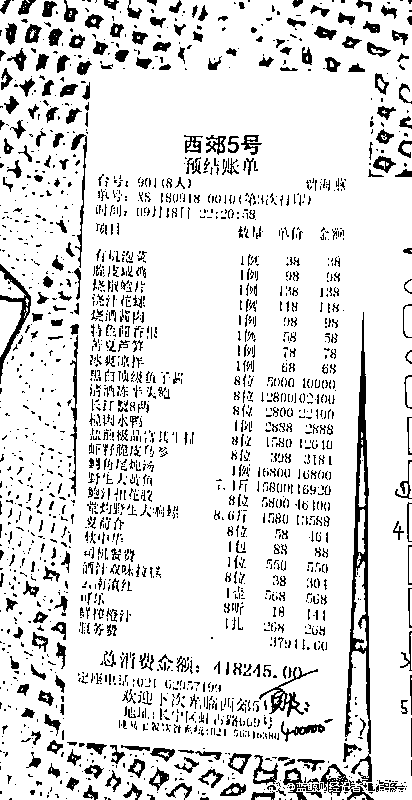
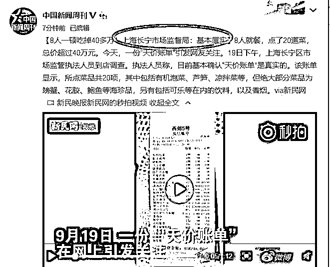
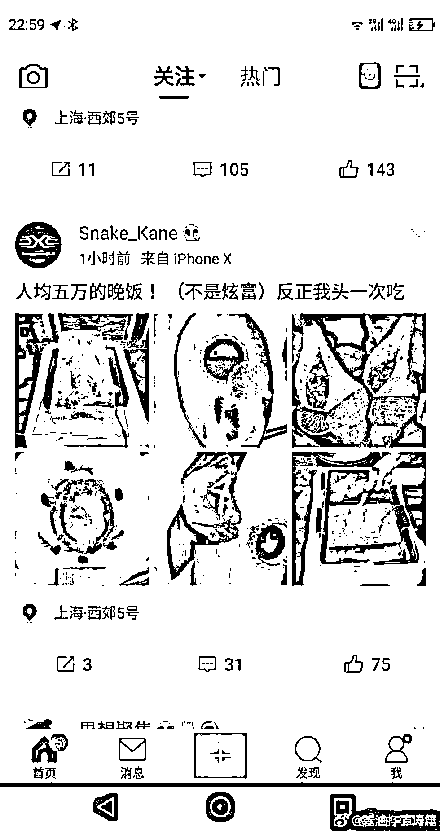
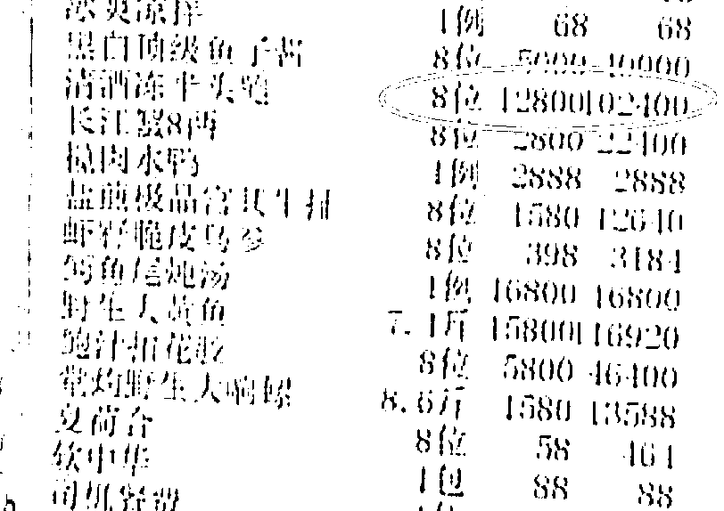
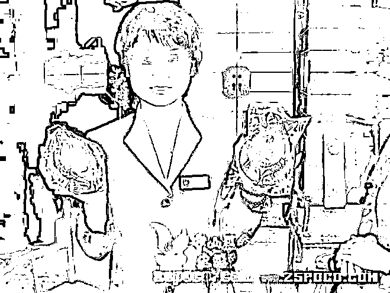
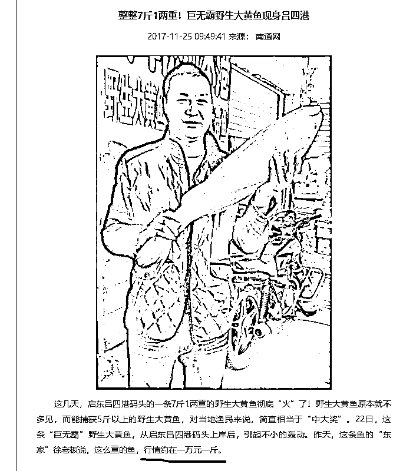
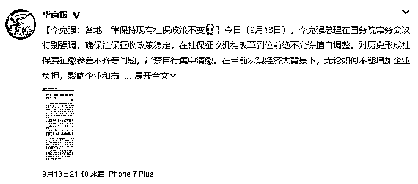
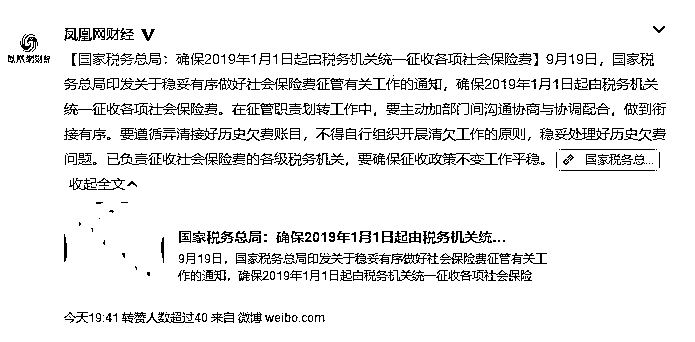
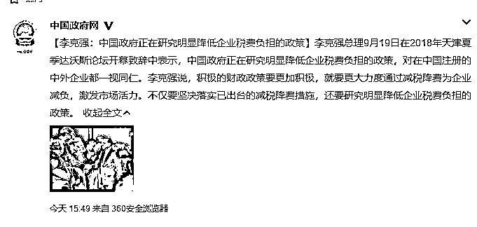

# 吃一顿饭应该花多少钱？||夜报

喜欢我的都关注我了~

昨天下飞机到家都凌晨 2 点了，今天又在办公室处理了一堆棘手的事情，先发一篇夜报体吧，多条新闻点评串起来谈一谈。

首先谈谈标题，也就是今天火热的天价饭局的事情，这件事本来是可以写成头条的，不过今天实在太累了，就委屈到夜报把。

今天最火的就是下面这张图，有人爆出西郊 5 号的一张结账清单，一顿饭高达 40 余万，服务费就 3.8 万。 

服务单显示，共 8 人吃饭，那么人均就是 5 万元。很多人不相信这是真的，但是今天官方已经证实，这张清单确实是真的，有关部门正在核查此事。

而还有网友翻查历史记录，在微博上活捉了饭局当天出来炫耀的一个帖子，也佐证了此事确实为真。 

关于这个新闻我的看法主要有 2 个，第一个是这个世界上真的是有很昂贵的食材的，这个会所不算天价坑人。第二个是富人的交际饭局其实和穷人一样，有时候都带有出血宴请的目的，本质是一样的，只不过档次不一样而已。 

首先看看这里面巨贵的几道食材，其实这里面的东西我都认识，但是都不认识这么贵的，例如这个鲍鱼，我也吃过鲍鱼啊，好像也就几十块一个吧，是挺贵的，但是不至于这么贵吧。8 位客人，每人一只，每只 12800 元，合计 10 万元就吃个鲍鱼，清酒冻半头鲍这是什么鬼，半头鲍比鲍鱼值钱这么多？是不是头少了一半的鲍鱼啊。。。果然是贫穷限制了我的想象力，今天我在朋友圈看到了这么一张图。 

这只硕大无比的鲍鱼，并不是半头鲍，半头鲍的规格大概要比图中的还要大一倍，简直是巨无霸。。。1.28 万一只绝对是市场价，这种鲍稀有无比，会所没坑人。至于图中 5000 元一人的鱼子酱，1.58 万一斤，一条 7.4 斤卖 11.74 万的野生大黄鱼，这都是市场价，童叟无欺。很多人不知道 7.4 斤大黄鱼有多大，大概这么大。 

这个渔民打算以每斤一万元的价格拍卖，这还是沿海渔场啊，要是运到西郊 5 号这种豪华会所，只卖 1.58 万/斤，真的很良心价。

食材都这么贵，这家会所的内部装修就不提了，要多豪华就有多豪华，超过你想象的奢华。其实对于那些财富超过我们千倍的富豪来说，花 11 万吃一条野生大黄鱼，就和我们花 110 块钱吃一条清蒸鲈鱼是差不多的。

这就引出我的第二个观点了，这么贵的食材，是市场定价的，之所以敢定这么贵，是真的有人去消费，他们既然愿意花钱去消费，那是因为他们确实有这么个需求。

7 斤重的野生大黄鱼，一定比 7 两的黄鱼好吃吗？未必，甚至有可能更难吃，因为肉老了。但是这个没关系，富豪们吃的就是面子，7 斤大黄鱼之所以这么贵就是因为罕见，一般人见不到，这就足够了。

我们普通人在家里吃饭，一家人吃一顿可能成本 50 都不到，但是如果宴请客人，我们经常去餐厅请客，点一桌子菜，其中的主菜基本都是我们自己平时不舍得吃的菜。通常 8 人聚餐，吃个一千块太正常了，好一点的吃 2000 块，这是普通工薪族的消费力，但是请客之人，平时自己出去单人吃饭，舍得花 50 就不错了。

普通工薪年入多少，我算高一点，10~20 万吧，翻个一千倍，大概是年入 1~2 亿的样子。对于那些百亿级的富豪来说，这个速度太慢了，要 100 年才能挣到百亿啊，所以他们的年入都是十几亿甚至几十亿。

所以对于年入破亿的人来说，40 万请人吃一顿饭，大概相当于我们掏 400 块请人吃一顿饭，而且是请 8 个客人吃一顿。。。这真没啥大不了的。

年入破亿很难吗？一定是富豪大老板吗？也不一定啊，很多打工皇帝也都年入破亿，例如目前的冠军张小龙，年薪是 3 亿。。。

年薪 10 万的人花 1000 块请 8 个人吃顿饭，张小龙要掏出 300 万请人吃顿饭才算双方出血程度相同。

所以，那些昂贵的食材，真的是有市场需求的，硕大的半头鲍和硕大的野生大黄鱼，未必多好吃，但是够稀有，足够体现主人和客人的身份，市场经济下这是必然存在的，野生黄鱼的价格多年来都是这么贵，足以证明这是一个源源不断持续消费的市场，只不过今天被人爆出来，远远超过普通人对食材价格的想象，有句话是怎么说来着，贫穷限制了你的想象力。

如果从铺张浪费来看，我老家有些月入 2000 多的人，动辄拿出千把块请客吃饭，一桌子海参甲鱼等，这才是真正的铺张浪费，远远超过自己实际负荷能力。

虽然这个东西严重冲击了普通人的世界观，甚至我自己，如果不是这次新闻爆出来，我连听都没听过什么所谓的半头鲍，不过我能够理解这张清单为什么会产生出来，虽然略有嫉妒，但是并不仇富。

顺便说一下，这个餐厅的老板对检查人员说这顿饭是迪拜人请的，提前一个月准备的食材，但是实际上这个话是很有问题的，迪拜是穆斯林区域，上流社会的有钱人是一定是穆斯林信徒，穆斯林最大的特点就是不吃猪肉。

但是实际上，这份清单里有猪肉，有烟，还有鳄鱼，这都不符合穆斯林上流人士的身份。

~~~~~

这两天，总理出来发话，密集宣布了很多重要观点，而且是非常重要观点。 

总理强调，各地一律保持现有社保政策不变，确保社保征收政策稳定，在社保征收机构改革到位前绝不允许擅自调整。对历史形成社保费征缴参差不齐等问题，严禁自行集中清缴。在当前宏观经济大背景下，无论如何不能增加企业负担，影响企业和市场预期！

而今天税务总局也对社保政策作出公告，2019 年 1 月 1 日起由税务机关统一征收各项社会保险费，不得自行组织开展清欠工作。 

二个新闻一对照，基本可以得出目前的局势，那就是中央是的确希望减负的，知道企业的困难，并不想增大税负，所以媒体曝光之后，坚决遏制以任意名义增大企业负担的行为。但是社保转给税务局征缴是既定政策，是不会改动的，依然明年 1 月 1 号实行，但是暂时不会对历史欠账进行催缴，我估计整个经济下行期都不会催缴了，一直到经济好转为止。

而在今天的夏季达沃斯论坛开幕致辞中，总理更是直接表示，中国政府正在研究明显降低企业税费负担的政策，要更大力度通过减税降费为企业减负，不仅要坚决落实已出台的减税降费措施，还要研究明显降低企业税费负担的政策。 

这个说的就更直白了，降低企业税费负担是主基调，已经出台的要坚决落实，没出台的也要研究继续推出，种种税费，还有继续降低的空间和可能性。

后面还会出台什么减税政策先不管，至少是有可能，但是目前已出台的，确保执行，不允许各单位以各种名义绕开，以各种手段增大企业负担，这个是 100%的，以官方中正平和，轻易不下论断的发言习惯而言，说这么明确，其实话已经很重了，这表达了政府极大的决心。

对于我们而言，这肯定是好事，有概率继续减税，100%不会加税，当然是好事，欢迎。

~~~~

前几天我和大家吐槽过果 X 不好用，所以果 X 加后缀的新品我都不想买，这件事情大家还记得吧。第一批新款苹果 18 日到货了，直接跌破官网报价，已经出现黄牛在官网退货的情况。

以 iPhone Xs Max 举例，其 64g 和 256g 版本官网报价是 9599 元和 10999 元，但是终端零售的报价已经变为 9520 元和 10920 元。

怎么说呢，苹果自作自受的，肯定和我一篇文章没啥关系，这玩意性价比真的不行，虽然我不认识半头鲍，但是苹果手机我还是认识的，我还没有那个只买最贵的土豪意识，选一款性价比最高的手机才是常规思路。。。

所以，把苹果新款手机价格喊崩的人不是我 ，这锅我不背。

觉得此文的分析有道理，对你有所帮助，请随手转发。

长按下方图片，识别二维码，即可关注我

近期精彩文章回顾（回复“目录”关键词可查看更多）

华为员工都这么穷，怪不得拼多多能火 | 房价跌 20%就会全面崩盘，地产杠杆远比你想的要脆弱 |  为什么碧桂园的质量那么差 | 清醒点，放弃全面开征房产税的幻想 | 央行和财政部隔空掐架，我支持央妈 |中国土地制度源自香港，但是香港却是劏房密布 | 为什么中介哄抢租赁房源，因为贩毒都没它来钱快