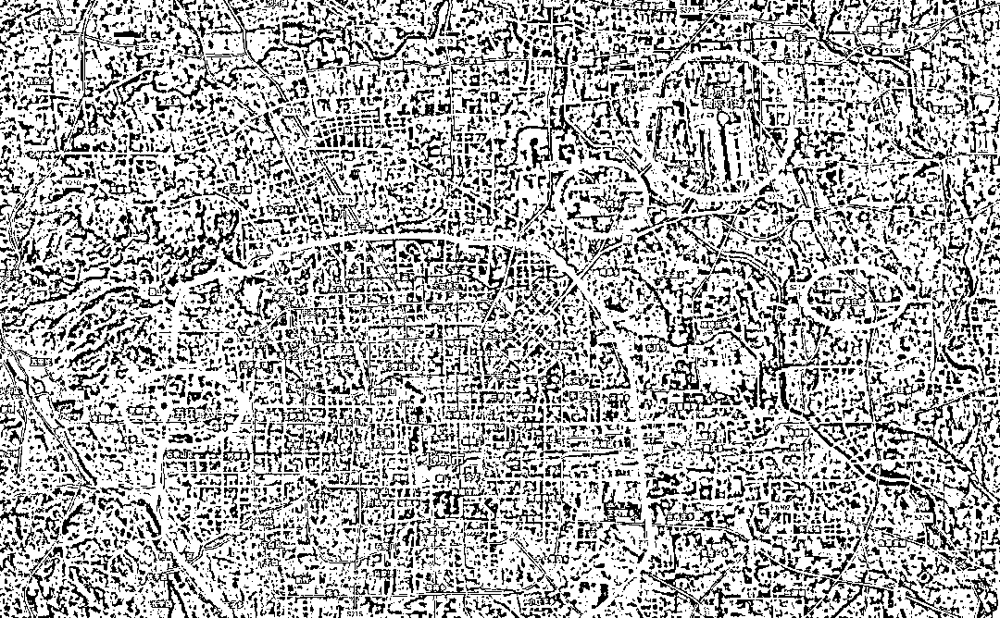
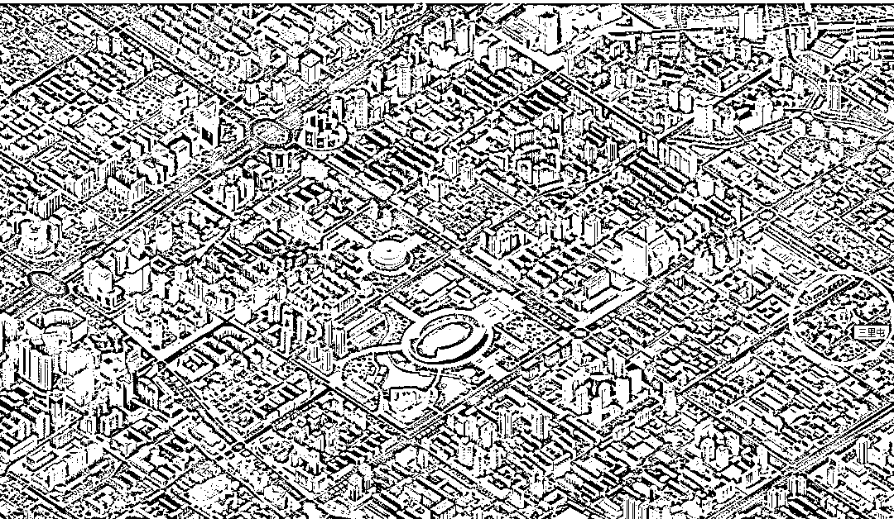
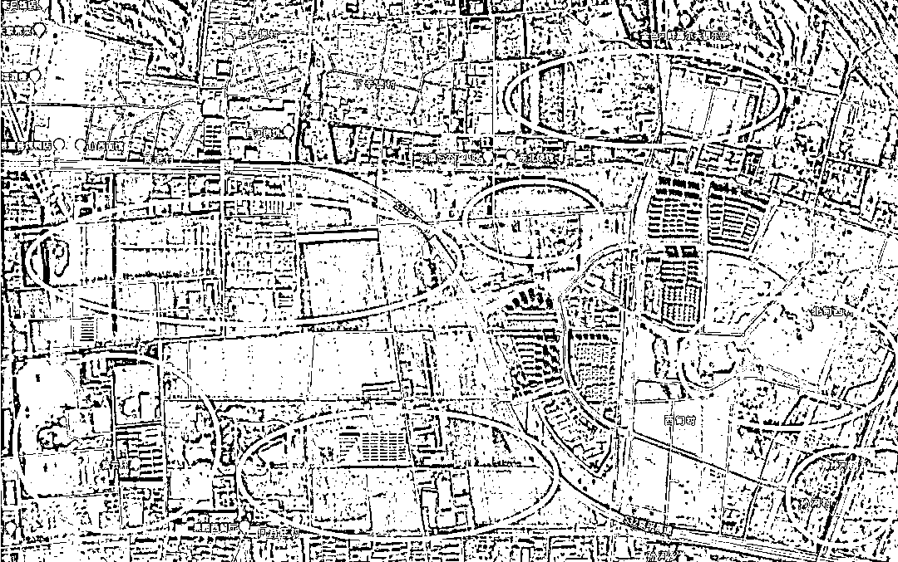
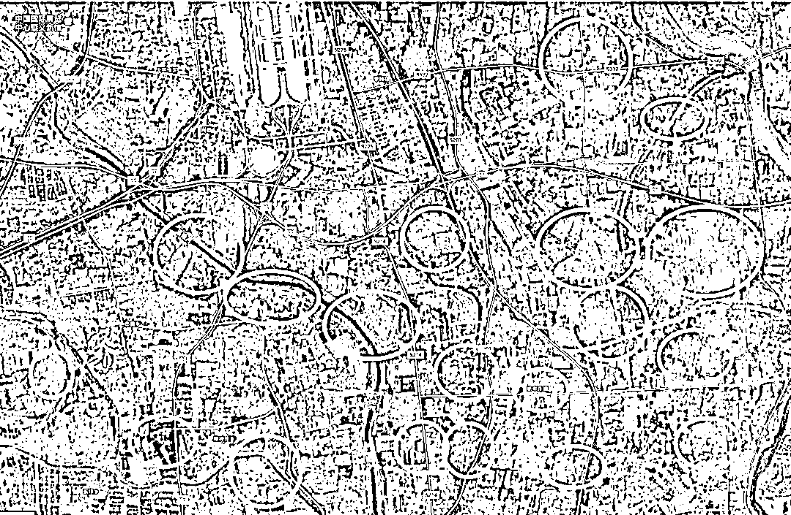
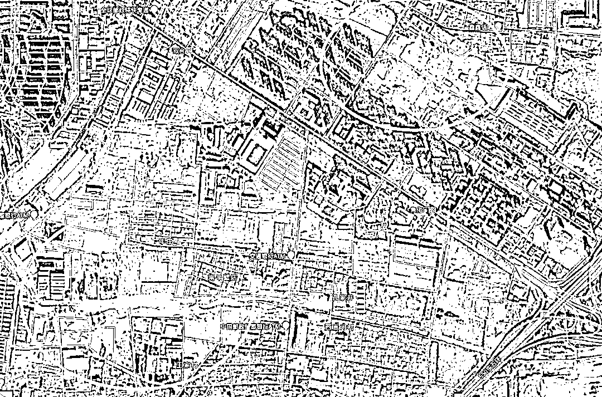
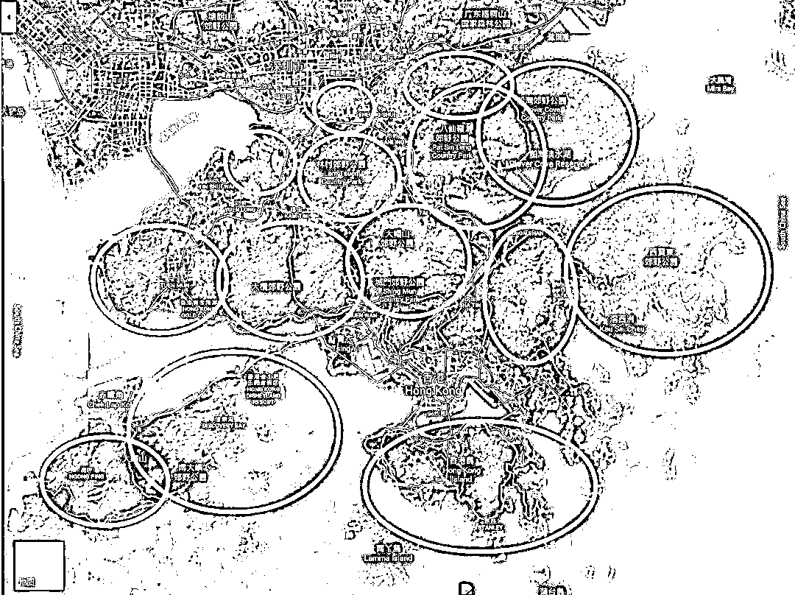
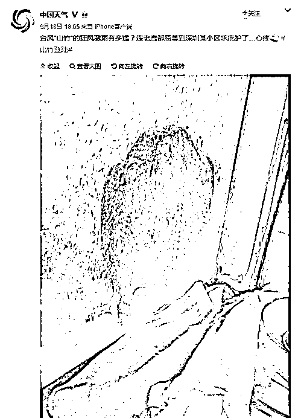
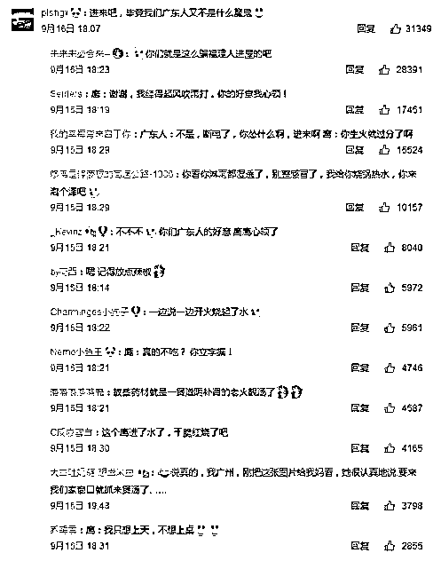

# 北京郊区真的好多空地-夜报

喜欢我的都关注我了~

<link rel="stylesheet" href="view/css/APlayer.min.css">

今天飞到北京，忙了一下午，没时间搜集太多资讯分析，就谈谈我在飞机上的感受把，我今天飞到北京的过程中发现了一个很有趣的事情，那就是就降落在首都机场的过程中我对地面进行了仔细的观察，发现了一个现象，那就是北京郊区的空地真的很多，很多郊区的高档小区周围全是空地。由于居高临下的进行观察，非常像在看售楼处的模型，所以看的很清晰。

当时在飞机上，等我发现这个现象的时候已经快落地了，手机是关机的，没来得及打开拍照，所以我今天从三维卫星地图上截几个图来给大家看一看大致的情况。

首先，北京五环之内是非常繁华的，我特地把五环给用红笔圈了起来，然后我把我落地的首都机场的位置给大家也标注了出来，我随便举个几个地方给大家做例子，第一个是完全位于五环和首都机场中间的孙河乡，第二个是位于机场更远一点的徐辛庄镇，我觉得这二个地方所在的位置很具有典型性**，能够反映一些东西**。

首先是看看彻底开发完毕的地段应该是什么样子，我截了**三里屯的三维模型图，大概是这个样子的**。

郊区太荒凉，没有人愿意花精力做三维模型图，所以我们只能直接找卫星图。先看看五环和机场中间的孙河，这里有一个地铁 15 号线，在孙河开了一个地铁站，地铁站周边应该是核心繁华区域了把，我在这里截了个图，发现有大片的空地。

而在更郊区一点的徐辛庄镇，这个现象体现的更为明显，卫星图中明显可以看到有数个高档小区已经坐落在了这里，但是周围的空地更多更明显。

实际上如果我们把视角放大的话，可以看到机场下面的徐辛庄镇附近，密密麻麻全是空地，图中红圈区域，都明显是空地居多，建筑很少。

而五环之内，建筑就密集很多，当然并不是完全没有空地了，例如我在五环边上就发现了这么几块很明显的空地。当然，整个五环内类似的地块数量很少，并不多见，而只要离开五环一点点，空地就突然急剧增多，连绵不断。

从这个角度说，北京并不缺地，而且并不是缺生地，就连熟地都不缺，那种已经通水通电通路，基础设施建设完毕的地块，周围的很多高档小区甚至已经投入使用了，还是有很多地块压在手里当储备并未投向市场。

这一控制手段，非常类似香港，我们来看一看香港的卫星图。

可以看到，香港玩的就更过分了，图上连灰色都没有，大片大片的纯绿色，这么多土地宁可闲着也不开发成住宅，确保香港地价稳定，房价不跌。

北京的郊区，很多地块同样是闲置备用，其目的同样是支撑房价，我们知道，香港区区弹丸之地有那么多人口，还居然把如此之多的土地闲置当成郊野公园，可以看出想让人人有房住是很简单的，只不过这样不符合利益而已。

**一个小区的建造费用有多低，**建安费一般只有 2000~3000 元每平米，很多人不信是把。2014 年的时候，很多县城的现房售价，只有 3000 多元，也是现代化小区，也有电梯，也是 30 层，地价+税费+利润，总共售价 3000 多元每平，这不是孤例，是普遍现象，你可以想想他们的建安成本才多少，你们可以打听下自己的亲戚，14 年的县城是不是这个价格。

都是用钢筋混凝土搭建起来的东西，难道北京的钢筋就比县城的贵，还是说这几年房价涨了，钢筋也跟着翻几倍？肯定不是的，钢筋混凝土依然是这个价格，只不过地价和房价都贵了。

实际上，**愿意掏出 5000 元每平做建安费的小区，已经可以做成豪华小区**的标准了，真的是非常豪华了。

**那北京上海为什么很多小区卖到 10 万一平**，很简单，地价贵啊，北京一套 80 年代的老旧房都能卖 10 万一平，他的售价和他本身的建筑造价会有啥关系，恐怕就只有一毛钱的关系了。

如果北京的储备地块被大量的放出去，那么北京地价必崩，然后房价也必崩，这就没办法实现“可持续发展”了，注意是打引号的。

大概就这么多吧，这个话题就写到这里就够了，反正就是科普下卫星地图的基础资料，再写深了估计我能被抓典型。

* * *

**尾部送一个好玩的图。。。真的很好玩，忍不住直接放文末了。**

今天太累了，就不翻评论了，明天还要开会呢，今天的评论由紫嫂翻。

觉得此文的分析有道理，对你有所帮助，请随手转发。

长按下方图片，识别二维码，即可关注我

近期精彩文章回顾（回复“目录”关键词可查看更多）

华为员工都这么穷，怪不得拼多多能火 | 房价跌 20%就会全面崩盘，地产杠杆远比你想的要脆弱 |  为什么碧桂园的质量那么差 | 清醒点，放弃全面开征房产税的幻想 | 央行和财政部隔空掐架，我支持央妈 |中国土地制度源自香港，但是香港却是劏房密布 | 为什么中介哄抢租赁房源，因为贩毒都没它来钱快