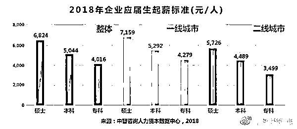
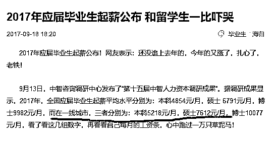
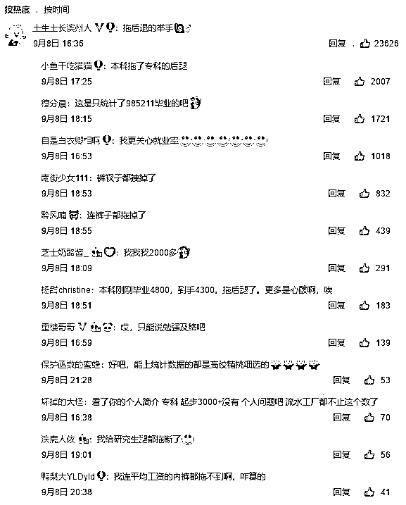
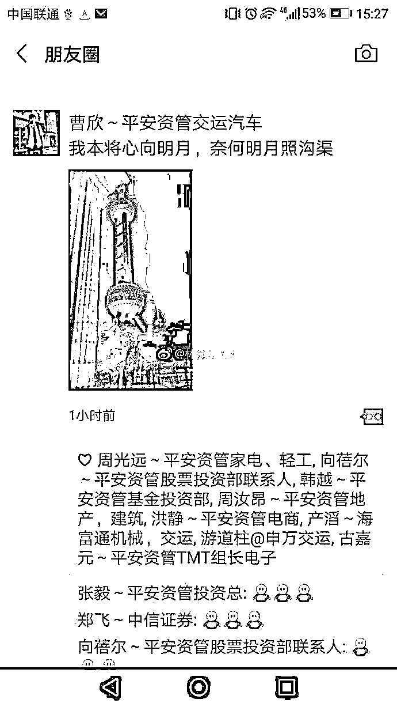

# 毕业生起薪全下调，平安资管全裁员，我们应如何保护自己

喜欢我的都关注我了~

前几天，媒体公布了 2018 年的毕业生起薪，本科生一线城市（北上广深）平均起薪 5292 元，二线城市（各地省会）平均起薪 4489 元。

那么今年的毕业生起薪和 2017 年相比，是上升还是下降了呢，我们来看一看 2017 年的数据。 

根据 17 年的数据对比，一线城市本科生起薪几乎纹丝不动，而硕士生从 7600 元降低到 7100 元。

所以，根据公布的明面数据，2018 年的毕业生起薪没有像之前一样连年增长，而是出现了罕见的下降。那么这个下降的数据是不是低于真实数据呢，不是的，2018 年毕业生起薪报告的下方评论，网友清一色表示自己拖后腿了，实际收入远远不如公布的数据。 

之所以会出现这种反差，而且反差还很强烈，主要有三个原因：

**第一：公布的起薪，是含五险一金的。**国家统计局在《主要统计指标解释》中，对工资总额的解释是:工资总额是税前工资，包括单位从个人工资中直接为其代扣或代缴的房费、水费、电费、住房公积金和社会保险基金个人缴纳部分等。

换句话说，你的五险一金全算进工资里了，甚至单位帮你支付的房费水费电费，全都算进工资里去了。所以大家实际感受到的工资，和统计表上的工资，是要扣除这一部分的。

**第二：毕业生吹牛**。大家知道这个毕业生起薪是哪来的吗？是学校报上去的，学校的数据哪来的知道吗？是学生报上去+辅导员“详细”询问的，而很多毕业生报喜不报忧，因为怕丢人，哪怕没拿到那么多工资，也报个四五千上去。但是这可是毕业生自己亲口报的薪水啊，真的不能再真了，但是实际情况大家都懂，所有的学校就业率都是 99%，中国不存在就业难问题，所以这个起薪，肯定是包含水分的。

所以，大家感受到的实际毕业生起薪，是要扣除掉这部分水分的。

**第三：很多人是“被平均”了。**这个就不谈了，人类历史上所有的平均值数据，一定是少量人高于平均值，而大多数人低于平均值。毕业生起薪其实算差距最小的了，但是依然存在这个问题。

因为大多数人都是低于平均值的，所以实际感受到的工资，相比平均工资还是要扣除一截的。

这三重误差一扣除，公布出来的平均起薪就完全符合你的现状了，公布的数据下浮个一二千，差不多就是大多数人实际感受到的起薪价格了。你还真别嫌扣除的数据大，光那个五险一金就不少钱要扣掉。

既然毕业生的起薪开始下降了，那么具备丰富工作经验的江湖熟手，薪资应该还不错吧。但是实际情况就别提了，现在不是说多少工资的问题了，很多江湖熟手连工作都没了，平安保险是大公司吧，平安资管一听就很高大上吧，平安资管里面的员工一听就很牛逼吧，每天谈的都是几十亿的生意，低于 10 亿的项目都懒得看。

前几天，金融圈爆出大新闻，平安资管被一锅端了，30 多个投资经理和资深投研，只留下 3 个人，其他的全部开除，给 2 个月时间找工作。

 

平安资管部的朋友圈截图，一股苍凉的意境破纸而出。 

为什么毕业生起薪下调，平安资管也大幅裁员，很明显是因为整体经济的原因，大环境好，猪都能飞起来，大环境不好，神仙都得趴着。

很多人天天盼着房价崩，觉得房价崩了自己就能买房了，看看目前的状况吧，这房价还没崩呢，经济也没崩，裁员潮已经开始露出苗头了。如果房价真崩了，经济必崩，经济一旦崩盘，你要么被裁员，要么就是大幅降薪，而房价也是一天更比一天低，这个时候你还敢借几百万去买房吗？银行的钱也是钱，借了是要还的亲。所以我可以保证，到时候你依然不敢买房，甚至可能连吃饭都困难了。

那么碰到经济不太好的时候，我们应该怎么办呢，混吃等死吗？肯定不是的，经济好不好不是我们能说了算了，每个人在国家大势面前都是微不足道的一粒沙子，所以我们只能做好自己，而不能指望靠改变经济大势来改善自己，那是绝对不可能的事情。

那么如何做好自己呢，古代战争告诉我们，活到最后的王者，都是广积粮缓称王，在 18 年这种环境下，你想做任何很激进的事业，基本都是在找死，大家都是在收缩保命，而工作，也是一样。

所以，在 18 年，很明显我们应该以提升自己的能力为主，你买不到好股票没关系，你买不到好房子也没关系，这些投资都是二等投资，一等的投资，是投资自己。如果你提升了自己的能力，那么将来你到天下任何一个地方，都将成为座上宾。

我们知道，有些人干了一辈子，天花板就是月薪 3000，而很多人工作五年十年后，就成为了部门主管，年薪都是三五十万甚至上百万。那么是不是他们靠资历熬上去有那么多的工资呢，实际工资是虚高的。不是的，这些主管带来的价值远远超过普通员工，他们给公司创造的价值是远超他们拿到的薪水的，所以他们无论去哪家公司，他们都能拿到这么高的工资。

衡量你的工资高不高，根本不是看你拿的薪水到底有多少，而是看你创造了多少价值，如果你一个月只创造了 1000 的价值，那么哪怕给你开 1500 的月薪，你的工资都高了。而如果你成为张小龙那样的人，哪怕年薪上亿，这工资也不高。因为微信每年给腾讯带来上千亿的价值，张小龙是第一功臣，年薪上亿一点都不贵。

所以，经济下行期，可以多尝试一些挑战自我的工作，一些富有创造性和高难度的工作，大量提升自己的能力，才是给自己最大的加薪。如果固步自封，不愿意承受高强度、高难度和高创造性工作的人，那么如果经济真的崩盘了，第一个被裁员的可能就是你，因为高管还有降薪这个选择，而你的工资已经无法再降低了。

觉得此文的分析有道理，对你有所帮助，请随手转发。

长按下方图片，识别二维码，即可关注我

近期精彩文章回顾（回复“目录”关键词可查看更多）

华为员工都这么穷，怪不得拼多多能火 | 房价跌 20%就会全面崩盘，地产杠杆远比你想的要脆弱 |  为什么碧桂园的质量那么差 | 清醒点，放弃全面开征房产税的幻想 | 央行和财政部隔空掐架，我支持央妈 |中国土地制度源自香港，但是香港却是劏房密布 | 为什么中介哄抢租赁房源，因为贩毒都没它来钱快