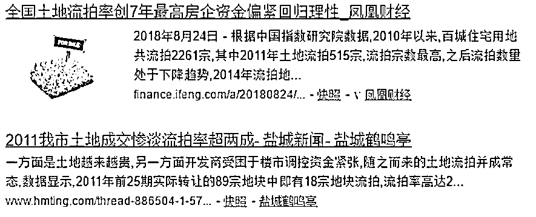
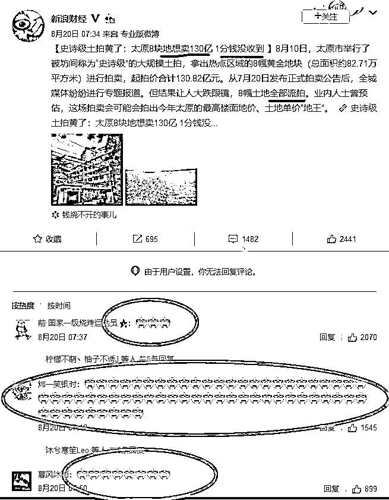
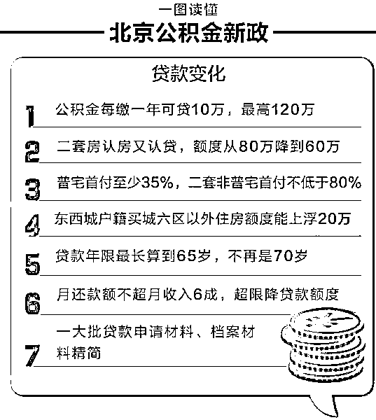
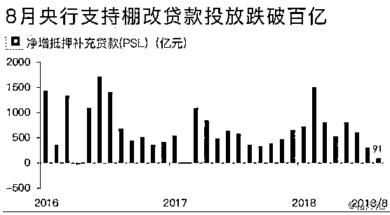
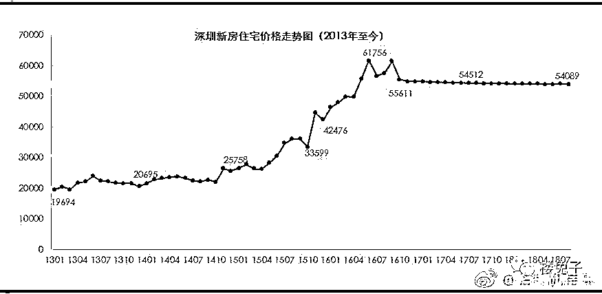

# 土地大量流拍后房价一般怎么走

最近房地产领域最火的新闻，莫过于对今年所有流拍地块的数量统计，数据显示，今年 1~7 月，全国总共流拍土地 800 宗。

很多人不知道这个数据代表什么，我这里帮大家分析一下，看看这组数据的惊人之处。根据中国指数研究院数据，2010 年以来，百城住宅用地共流拍 2261 宗，其中 2011 年土地流拍 515 宗，流拍宗数最高，2016 年土地流拍仅 80 宗，为近年来最低水平。（数据来自于中国指数研究院）。

大家可以看到，8 年来总共流拍了 2261 宗，今年前 7 个月就占了 800 宗，而第二高出现在 2011 年，全年 515 宗。那么我们还需要留意到的是，今年只统计了前 7 个月的数据，如果按这个速度到了年底，那流拍宗数要达到 1500 宗。。。就算下半年减速，今年的总数据也必定突破 1000 宗。

所以，今年的流拍土地宗数，达到了目瞪口呆的创记录高峰，这个数据简直太惊人了，至少是历史第二高峰的二倍，也可能是三倍。。。

而太原市今年拿出 8 块黄金地段打算卖 130 亿，结果别说溢价，底价都没人出，全部流拍，而下方的网友评论也很搞笑，清一色的队形。

那么出现大规模的土地流拍之后，房价一般是怎么走的呢，手头还真有一个历史样本可以参考。 

**2011 年曾出现过极度类似的情况**

我们都知道，本轮房价暴涨起源于 2015 年下半年，大概 2017 年下半年结束，本次土地流拍数量开始激增，也是 2017 年下半年开始的。

一轮翻倍暴涨之后，突然出现土地大量流拍，地产商不愿意拿土地，这让我们想起了 2011 年，情况极度的类似。

2009 年初，全国土地开始暴涨，基本也是直接翻倍，2010 年，中央全面调控压制房价。从 2010 年底开始，土地流拍数量迅速增加，2011 年全年，土地流拍数量达到历史峰值 515 宗。

大家可以回忆一下历史，从 2011 年初开始，暴涨不休的中国房价戛然而止，陷入慢熊市，缓慢但坚定的下跌，但是跌的不多，可以定义为横盘滞涨，轻微下跌，中间仅仅因为 2013 年央行放水救钱荒而凸凸了一下，然后又迅速回归原样。

而 2018 年这一次，和 2011 年是无比的相似，都是暴涨后被调控然后出现土地大幅流拍，唯一不同的是 2018 年的土地流拍数量，是曾经的历史峰值的 2~3 倍。

之所以会出现如此夸张的数据，在于 2018 年的房价实在是太高了，出租回本周期高达 70 年，要知道以泡沫高涨著称的 2011 年，出租回本周期好歹只有 40 年呢。当年好多人喊着出租年化收益才 2.5%，回本要 40 年，房贷利息 5%完全不能被抵消，所以房价必崩，不知道他们看着今年这 1.5%，70 年回本的房子会作何感想。7 年过去了，房价泡沫没有缩小，反而更大了。 

**土地流拍的根本原因是缺钱** 

为什么土地开发商最近突然不再拍土地，是因为他们集体看空后市吗？不是的，看空后市的人有，但是绝对还有大量的开发商是看多后市的，就好像股市的熊市一样，无时无刻都有人看空，但是同时也是有人看多买入的，如果所有人都看空，那叫无量跌停崩盘。

而实际上，房价泡沫由来已久，有很多人看空很久了，比如万科曾在 2014 年喊出房地产已经到了白银时代导致错过这一轮地产大牛市等等。万科巨头看空依然不耽误这一轮地产暴涨，这说明地产大佬看空看多其实并不重要，而实际上，很多人并不是不想拍土地，而是想拍，但是手头真的没钱了。

地产商看似很有钱，动辄几十亿几百亿的运转，但是实际上这些钱大部分都不是他的，而是银行的钱，一旦银行收紧银根，地产商马上就要断粮。在 2018 年这种银行普遍全面收紧对开发商贷款的时间里，开发商每天想的根本不是怎么样才能拿下土地，而是怎么样维持自己的现金流来慢慢归还到期贷款。一旦某一笔贷款到期无法按时归还，引发银行的连锁抽贷，这家地产商肯定是死路一条，俗称资金链断裂。

所以，土地流拍的根本原因是缺钱，而不是地产大佬看空还是看多。但是对于普通人而言，关心的并不是地价，而是房价，其实对于房价也是一样，房价涨跌其实根本不在于地产大佬看空还是看多，而在于整个市场是否缺钱。

假设全市场有一亿套房，总共流入地产的货币是一万亿，那么每套房子就是一万元，如果流入地产的货币是 100 万亿，那么每套房子就是 100 万元，这个道理非常简单。所以，一旦流入地产领域的钱减少，房价必然会跌，或者说失去上涨的动能。

你以为银行仅仅是收紧对开发商的贷款吗？其实对于购房者的贷款，他们一样收紧了，银行提升利率，增加首付从 17 年中旬就开始陆续执行了，银根在一步步的收紧，昨天的新闻看了吧，北京连住房公积金都收紧了。 

而这一轮三四线城市房价暴涨的重要催化剂货币化棚改，其货币投放量创下历史新低，8 月仅投放 91 亿，只剩下之前的零头了。 

图片来源：财新数据 数据来源：中国人民银行

房地产早已金融化，而且是过度金融化，1.5%的投资回报率显示房子目前不存在投资价值，赤裸裸的就是一个投机工具，大家买房的唯一目标就是赌房价继续上涨，高位卖给后面的接盘者，没有一个人买房子是想着说靠出租的收益来回本赚钱的。 

**一手房的限价导致下跌空间不明朗** 

按理来说，如果货币供应出现了短缺，房价必跌无疑，但是从去年开始执行的房屋限价政策，让下跌空间变的极不明朗，我们来看一看深圳的房价走势图。 

我们可以看到，从 16 年 10 月开始，深圳的房价走成了一条直线，比你拿笔画的还直，深圳的房价高度稳定，稳定到了极致。

我上一次看到这种走势图，还是在庄股里面，庄家在卖 1 那里挂了一万手，在买一那里也挂了一万手，导致股价走势出现了绝对直线。

但是房价和股价不同啊，政府只能出政策，可以影响买盘和卖盘，但是自己是没办法亲自下场挂单的，所以房价是极难控制，绝对不可能出现直线走势。

但是如今，他就是出现绝对直线走势图了，那么怎么解释这一现象呢？唯一的解释就是，这和庄家控盘是不一样的，这种走势图应该用黑市限价走势图来解释。

我们都知道，在历史上政府曾多次作出物价管制，你这个东西市场价 100 块，但是政府要求你只能卖 50 块。在这种情况下，价格就被钉死在 50 块那里，由于东西本身价值 100 块，所以绝对不可能跌到 49 块，但是政府不允许涨价，所以价格也不可能涨到 51 块。所以政府不需要挂买单和卖单，价格就会出现永恒的 50 块，从走势图来看就是一条直线。

深圳的房价也是一样，现在的新房都是政府指导价，让你卖多少就得卖多少，所以每个月深圳的均价就是上下几块钱的波动，出现了绝对直线。

这种直线走势图表明，现在深圳的新房存在套利空间，实际市场价绝对是超过政府指导价的，否则不可能出现这种直线走势图。

因为实际价格高于名义价格，所以就算市场缺钱，深圳的这种一手房也不会掉价，就算实际价格从 100 元掉到了 70 元，他名义价格依然还是 50 元，不可能掉到 49 元，就是这个道理。

由于政府限价，所以导致下跌前景不明朗，很多空间都被提前封掉了，但是那些二手房的房价就没那么好运了，房价承压现象很明显。

**未来房价会怎么走**

首先我们可以判定，房价肯定是不会涨了，你甭管开发商是没钱拿地还是不想拿地，反正他们是不去拿地了，地王的诞生也是一样的道理，你甭管开发商是看多后市，还是钱太多导致去抢地，总之他们是抢地了。

所以，地王的诞生通常预示房价的上涨，因为市场的钱多了，而大面积流拍现象的诞生，通常预示房价的下跌。

所以，未来几年，房价的下跌压力会非常的大。

那么房价会不会崩盘呢，当然也不会，目前的种种现象，都是政府一手出政策压制的，只要他撤销几个政策，房价压力马上就会小很多。

房地产其实不是我们的命根子，而是政府的命根子，所以在弹尽粮绝之前，政府绝对不会容许，也不敢让房价崩盘。

所以最后的走势，会高度类似于 2011 年之后的走势，横盘滞涨，极其缓慢的阴跌，我记得 2011 年跌到 2014 年，3 年多的时间大概跌了 10%都不到。

而这一次，应该也会类似，这是由历史经验和最新的论证得出的结论，唯一的区别就是，这次承受的回调压力至少 2 倍于 2011 年，可能是三倍四倍都不止，70 年回本和 40 年回本，绝对不应该是简单的倍数关系，因为 20 年回本显然是不存在任何泡沫的。

大概就是这样，未来三年的房价走势图已经都标注好了，横盘，而且会阴跌，我估计 20%的回调幅度应该是有的，再多就很难了，因为再多的话，房价就要崩了，政府肯定撤销管制政策来维护房价。