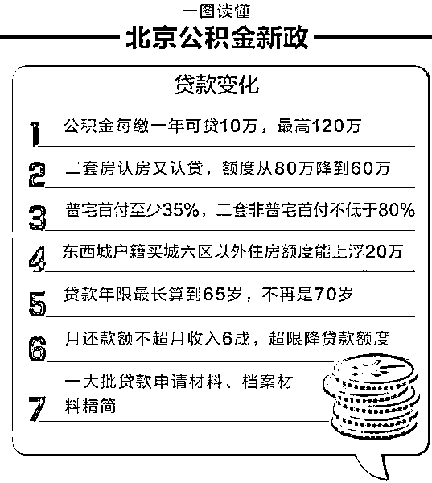

# 北京公积金政策被再次大量修正 | 夜报

前一段时间，北京刚刚修正过公积金政策，大幅降低了公积金的存缴比例，从固定的 12%的存缴比例修正为 5~12%，然后所有的企业，包括华为这样的浓眉大眼的孩子，都立刻修正为 5%。

而今天，北京再度修改了公积金政策，宣布了最新的公积金新政，最新的政策宣布，公积金“认房又认贷”、“缴存额度与缴存年限挂钩”

在北京，公积金每缴存 1 年可贷 10 万，最高可贷款 120 万，换句话说，如果你是刚毕业一年的学生，哪怕你清华毕业进世界 500 强，最多贷款 20 万元。

二套房既认房又认贷，最高贷款额度从 80 万元降低到 60 万元，这个就不谈了，实际含义等于字面意思。

首付比例大幅上升，不再统一 20%，普宅改为 35%，二套非普 80%，实际含义等于字面意思，对于北京动辄 10 万一平的房价来说，35%的首付基本代表普通年轻人可以不再考虑北京买房了，回老家考虑一下吧。

我认为最重要的几点就是上面这几个，其他的都无所谓，简单的来说，随着房价的这一轮翻倍飙升，北京的公积金不仅没有跟随飙升，反而开始压缩，本来房价翻倍后，公积金就明显不够用了，如今再度压缩，当然更不够用了。虽然都是不够用，没啥区别，不过这表明了政府的一个态度。

之前的一波公积金修改，把缴纳公积金的额度从 12%下浮到 5%，大幅度的减少了北京公积金的收入，为什么愿意把自己的收入降低，很明显是给社保让路，因为社保已经不够用了，在削减公积金的基础上，各地曾零星发生税务局带头催缴社保的事件，这表明政府希望在不超过企业负担极限的基础上，优先以社保为主。

这从侧面也反应一个事情，那就是当前政府的工作中心，并不是房价。

~~~~~

房地产市场遇冰点，广州多楼盘从 8 月开始陆续开始打折促销，包括但不限于，万科、越秀、保利、金地、时代等房企，通过开盘优惠、推特价单位等手段，开始花式促销。而恒大公寓、办公、写字楼、商铺产品可在 89 折到基础上，额外享受最低 6 折优惠，这意味着接近半价出售。比较热门的市区广钢新城板块，多楼盘推出新优惠。

这样的新闻，不止广州有，其他地区也多有报道，而土地拍卖频频流拍，更是铺天盖地的见诸报端。

这一切都指明了一个现象，房地产增长真的停滞了，今天时间不足，我明天详细分析这个话题。

~~~

中美毛衣战有新进展，今天商务部向媒体宣布中方确实已经收到了美方的磋商邀请，美国向中国发出邀请，希望中方赴华盛顿磋商，昨天晚上这个消息就开始大面积流传，富时 A50 指数深夜突然暴涨，人民币也突然暴涨。

商务部发言人高峰今天对媒体回应，中方确实已经收到美方邀请，对此持欢迎态度，双方正在就一些具体细节进行沟通。中方认为，贸易冲突升级不符合任何一方的利益。

毛衣战这东西，本来就是边打边谈，打打谈谈，第一轮谈崩之后，打了二三个月，如今开始进入第二轮谈，这是好事啊，至少代表第一轮的战斗已经结束了，我们至少会有一段时间好日子过了，这东西本来就是二败俱伤，看谁熬得住了。

受到这个利好刺激，今天股市大幅高开，但是随后受到熊市惯性砸盘，高开低走，午后一度翻绿，但是随后秀了一个深 V，尾盘大幅拉起来。

仅从这个走势图而言，是非常典型的见底走势，而昨天有大量的蓝筹崩盘，也一定符合熊市末期的见底表示。

熊市末期的见底最大标志，就是抱团取暖的股票开始崩盘，坚挺在整个熊市里的股票崩盘的原因，就是因为其他股票跌的太惨了，估值过于低廉，当抱团取暖的股票不再上涨之后，很多资金就开始偷偷撤出购买其他地板票，这么一进一出，抱团取暖票就崩了。

大家可以研究一下，这个现象是非常典型的，对了，我依然没动，这个底磨了 2 个多月了，我就一直趴着，坚信这里不会崩，随便磨。

~~~

前几天，有一则新闻刷屏自媒体，继上次砸几十亿收购量子云之后，这次又有人收购自媒体公司了，利欧股份发布通告，拟逾 23 亿元收购微信自媒体内容营销公司苏州梦嘉 75%股权。

公告显示，拟以现金收购苏州梦嘉 75%股权，标的公司的整体估值预计为其 2018 年承诺净利的 12 倍，即整体预估值为 31.20 亿元；此次交易对应的交易金额为 23.4 亿元。苏州梦嘉是一家主营微信自媒体的内容营销公司，在用户数量、客户资源、业务能力等方面是行业领先企业之一，目前已积累约 2.8 亿名订阅用户，为约 2500 家客户提供服务。

我打听了一下，这家公司有 4000 个公众号，流水化批量生产文章，恕我直言，这种公司就是因为前期的公众号红利才起来的，压根谈不上高质量内容，量子云也是 4000 个公众号，50 个小编负责，苏州梦嘉多少个小编？哪怕有 500 个，也是一个人负责 8 个号，他们能生产个鬼出来，我一个人负责一个号都累死了，白天有点事情，晚上就不能保证稳定更新。。。

所以，这种公司看似很赚钱，但是实际上是一种资本化的贪婪存在，他们没办法和读者共赢共存，属于短期套利很厉害，但是长远发展后劲不足。

苏州梦嘉如果有 4000 个人才来负责这 4000 个公众号，那我觉得还可以投资投资，如果不是的话，那真没啥意思，纯粹是利用他们短期套现能力强大来帮上市公司做账做业绩，然后一起收割股民。

我本身就是自媒体+股市的资深人士，这种玩法套路我有充足的资历和身份可以做出鉴定。虽然比起大多数上市公司玩的所谓资产充足，收购这个营销号自媒体公司已经很良心了，但是它依然是个坑，自媒体是新兴领域，会持续辉煌，但是营销号真不是，这已经是下半场了。现在的读者越来越精明了，他们在慢慢进化，已经可以自己分辨出好内容和坏内容了。

~~~

最后，预告一个事情，下周二我要到外地开会，（保密的那种），周一的飞机，所以周一我尽量保证一篇夜报的内容输出，也可能木有。周二全天开会，晚上 9 点飞机直接回来，这样可以保证次日还有时间写头条，所以周二是肯定完全请假的，先和大家说一下，提前请个假。