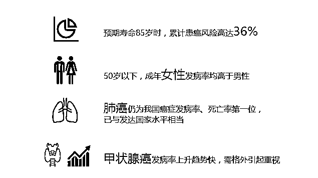
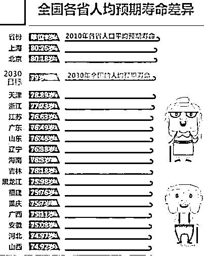
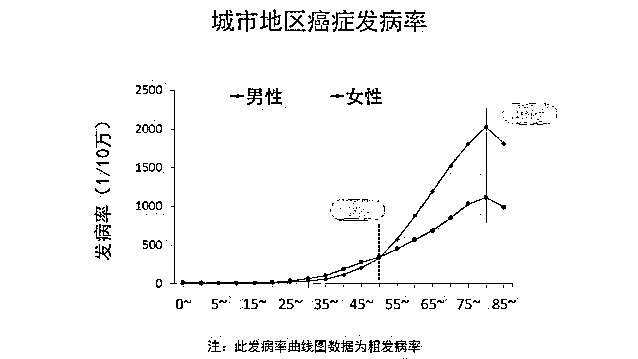

# 中国患癌率高达 1/3，平均每个家庭都会出现至少一个癌症患者

喜欢我的都关注我了~

 最近十几年，癌症这个词汇越来越多的出现在了中国人面前，被冠以绝症之称，成为了国人第一杀手，那么大家知不知道癌症的一些细节资料呢，比如罹患癌症的概率到底有多高。

根据美国公布的统计资料，37%的女性和 42%的男性会在一生之中遇到癌症，而中国国家癌症中心也发布了类似的数据。中国最新癌症数据显示到 85 岁，一个人患癌风险为 36%，全国每天有一万多人确诊癌症。 

所以综合考虑，认为一个人患癌的概率为 1/3，是比较合适的，换句话说，每 3 个人，就会有一个人得癌症。而即便是再幸运的家庭，双方父母合计 4 人，自己 2 人，小孩 1 人，7 个人全部一辈子都不得癌症的概率，是 2/3 的 7 次方，我替你们算了一下，是 0.09%，换句话说，每个家庭都会出现至少一个癌症患者。

看到这个数据很多人可能感觉很奇怪，感觉这个数据比日常生活中感受到的偏高，所以这里要做一个解释，癌症虽然是绝症，但是并不是得癌症必死，也不是说你身患癌症的一瞬间就已经离死神不远了，实际上，多年带癌生存才是人类的常态。

很多人觉得癌症不吉利，实在不想谈，以为自己像鸵鸟一样把头埋在沙子里装看不到，癌症就不会找到自己家人了，这是非常幼稚的一种想法。实际上，了解癌症，熟悉癌症，你才会知己知彼，才能知道如何预防癌症，如何应对癌症。 

很多人都在带癌生存

进行全文科普之前，首先要纠正大家对癌症的恐惧心理，实际上癌症对人类的威胁是非常小的，除了少数恶性癌症，大多数癌症的发展是非常漫长的，动辄要生长一二十年才能对生命构成威胁。

所以在改革开放以前，中国人很少为癌症担忧，因为死于癌症的概率太低了，绝大多数中国人在体内的癌症还没有开始要命之前，就会死于其他原因。当大多数中国人达到小康温饱水平线之后，绝大多数疾病都杀不死中国人，人均寿命大幅度提升之后，癌症的威胁才开始慢慢凸显。换句话说，癌症之所以成为国人的头号杀手，那是因为其他疾病都被中国人给控制住了，否则的话癌症根本排不上号。

我举几个数据，2017 年卫生部发表的数据显示，中国人健康头号杀手为癌症，年死亡人数为 170 万，看起来是很多，但是癌症分好多种，肺癌、胃癌、肠癌、胰腺癌那都叫癌症，林林总总共有数百种，仅仅淋巴瘤就有七八十种类别。

所以癌症其实并不可怕，以头号恶性癌症肺癌为例,这是一种死亡率非常高的癌症，恶性程度在所有癌症里面都是排前列的，中国因癌症每年死亡 170 万人，其中 59 万人属于肺癌，可以说是非常可怕了。但是与此同时，整个呼吸系统，最轻微的疾病是感冒对吧，甚至几乎没人把感冒当病，在医疗体系如此发达的今天，这种不算病的病，每年导致 20 万中国人死亡，整个呼吸系统的各种疾病致死人数累计起来，肺癌根本就不算啥。

所以，死于癌症的人根本就不多，就算把最大的肺癌拎出来，致死人数也不是很多，尤其是在医疗不发达的以前，肿瘤还没长大估计人就没了。从这方面说，你可以认为癌症是一种老年病，因为大多数癌症的发展需要很多年，例如前列腺癌，是一种男性发病率非常高的癌症，有人曾经对一批意外身故身死的 40-60 岁男性尸体进行解剖，发现很多人的前列腺里都出现了零星的癌细胞，概率有多高呢，30%的健康尸体都被检出了癌细胞。

而美国科学家还曾对一批 80 岁左右去世的女性解剖，发现 2/3 的人其实身患乳腺癌，但是这批人里只有 4%的人是死于乳腺癌，而其他 96%都是其他死因，所以她们和前一批男子一样，其实是带病生活，即便身患癌症，也未必死于癌症。那么同样的，有另外一批科学家对 85 岁的男性尸体样本进行了解剖，发现患前列腺癌的概率为 3/4，而前一批 40-60 岁的样本，患前列腺癌的概率仅为 1/3.

所以很多人都常年携带癌细胞而没有任何感觉，绝大部分人在被癌症杀死之前就死于各种其他原因或者疾病，所以医学界研究癌症的重心根本不在于清除所有癌症，而在于把癌症变成慢性病，能和人体共存就可以了。

全国的平均寿命为 74.9 岁，而通过中国的人均寿命图，我们可以看到，中国人均寿命最高的就是北京和上海，高达 80 岁，而人均寿命倒数前三名，则为西藏、云南和青海，其中最低的西藏，人均寿命为 68.17 岁，比雾霾猖獗的北京低 12.01 岁。 

所以，呆在无污染的西藏天天吸纯氧的确对你的健康有好处，但是那并不是决定人均寿命寿命的主要因素，决定人均寿命的核心，是钱和完善的医疗体系。

如果你是有钱人，天天躺在西藏，还有私人医师服务，肯定能活的更久，如果你是没什么钱的普通人，听我的，天天呆在北京吸雾霾绝对比跑到西藏和云南吸纯氧活得久。 

癌症的发病原理

那么癌症的发病原理是什么呢，究竟是什么导致了癌症的诞生。其实，癌症的产生原理非常简单，分为下面三个原因：

1、基因突变的积累；

2、细胞损伤的积累；

3、端粒的缩短。

看不懂对吧，我给大家解释一下。人体的细胞不是永恒不变的，每时每刻都有老细胞死亡，新细胞替代，那么身体每产生一批新细胞，就会有一定的概率在里面冒出一些坏孩子，这就是所谓的基因突变。

是不是细胞产生了基因突变，造出来的坏细胞就一定是癌细胞呢，那肯定不是，基因突变出来的细胞是千奇百怪的，只有极少数的细胞有能力变成癌细胞，其他的细胞都是变异细胞里的废品，直接被免疫系统给吞噬了。就好像你把软件里的代码取出来，随机选一段代码去掉，然后替换成一段乱码，有极小的概率这个软件会按照另外一套逻辑运转，但是更大的可能，软件会直接报错无法运转，这个概率大概是 99.99999999999%

但是没关系，人活的时间只要足够长，慢慢累积，总能试出来一段完美的代码替换，诞生了一个癌细胞，这就是所谓基因突变的积累。

而细胞损伤的积累就更好理解了，首先，衰老的细胞被自然替换，其突变率是很低的，但是如果是细胞被损伤而替换，因为增大了重生的频率，所以那产生突变的概率就会对应提升，如果是那种反复刺激，反复损伤，就会大幅度的提升得癌症的概率。其典型代表为乙肝病毒对肝细胞的反复损伤，石棉纤维对肺细胞的反复损伤等等。

那么什么叫端粒的缩短呢，这个就比较难懂了，我详细的说一下。首先，按照以上二条的逻辑，人类得癌症的概率应该是线性增加的，活的越久，患癌概率越高，双方呈正比关系。

但是科学家通过实际研究发现，人类得癌症的概率和寿命并不是线性增加，而是指数增加，40 岁之后发病率快速提升，80 岁达到高峰，80 岁老人得癌症的概率并不是 20 岁青年的 4 倍，而是 40 倍都不止。 

从图中我们看到，40 岁之后，发病概率指数级飙升，而 80 岁之后突然开始掉头向下，其原因在于人类的基因。

人类的细胞是不能进行自我分裂繁殖的，一切死亡的细胞，都是由身体内的干细胞进行分化补充的，干细胞虽然是万能的，但是干细胞也是会衰老的。研究发现，老人体内的干细胞，和孩童体内的干细胞，其端粒有明显的缩短，端粒也被科学家称作“生命时钟”。随着细胞的分裂，端粒会逐步缩短，当缩短到一定程度的时候，细胞就无法继续分裂，就会启动程序性死亡。

干细胞的分裂能力不是无穷无尽的，分裂到一定次数的时候，它会出问题，干细胞衰老的理论目前还没有科学家能够解释清楚为什么，但是所有的研究都证明这是客观存在的。

所以，老人的细胞出现问题的概率，会远大于孩童和年轻人。但是人类还有一种基因，叫长寿基因，有那么一部分特殊的老人，他们能活到百岁以上，科研发现他们体内的多个指标非常年轻，例如血液中的各种生化指标和 70/80 岁的人很类似，而且体内不少物质非常活跃。

所以，普通人类的寿命极限大概就是 80 岁，然后大自然会让你体内自行产生癌细胞来收拾你，但是某些拥有长寿基因的人，其各种生化指标都比别人年轻 20 岁甚至更多，所以 80 岁之后，患癌概率突然下降，因为拥有普通基因的人都被自然淘汰了，剩下的人患癌概率反而下降了。

所以，孩童也会患癌症，但是稀少无比，而等你年龄大了，患癌症的概率相对儿童会出现百倍千倍的增加，这是自然规律。

癌症并不一定是绝症

 很多人有一个误区，那就是癌症就是绝症，沾之必死。其实这个是完全错误的，首先，很多人带癌生存很多年都没有发病，其次，多数癌症是可以被治疗的，5 年和 10 年生存率还很不错，个别甚至高达 70-90%

很多人关心癌症，其实并不是真的关心癌症，他们只是关心自己能活多久而已。但是实际上，癌症真的不是什么稀罕的东西，80 岁老人体内几乎一定有癌细胞，男人体内 3/4 带有前列腺癌，女人体内 2/3 带有乳腺癌，而癌症有几百种，你一种都没有的概率是多少？那就是零的概率。

但是这些癌症都没什么，他们发展非常缓慢，需要十几年甚至更长的时间，才能变成恶性肿瘤威胁到你的生命，被医生发现了，也很容易切除治疗，没长成气候之前，还有可能被免疫系统自己灭掉，真是癌生艰难。这种癌症，完全能被普通体检发觉，并被提前治疗，治愈率极高。

而真正让人担心是，是那些特别恶性的肿瘤，众所周知，越恶性的癌症，发展速度越快，有些恶性癌症，从出现一个真正癌变的细胞，到发展到致死阶段，可能只有几个月时间，这种癌症的最佳治疗窗口，可能只有前几个星期，但是这几乎是不可能被检查出来的，而即便检查出来，也很难治愈，只要手术和化疗的时候遗漏了那么一丁点细胞逃脱法网，几个月就能卷土重来，而且由于手术动刀的原因，他们有可能由固定密集状态变成散落状态，换句话说，就是扩散到全身，没办法再救了。

但是这种恶性癌症，其概率是非常非常小的，每年死于恶性癌症的人，并不比肺炎和感冒多，而对于老人来说，与其担心自己身患癌症，不如担心自己得流感，老人体虚，得流感的死亡率真的不比癌症差多少。

而对于那些被确诊为癌症的人，千万要听从医生的指示，有些医生会告诉你，你这个病治不好了，动手术做化疗可能会死在手术台上，建议采用保守治疗，5 年生存率 50%，10 年生存率 30%之类。

你一听立马感到天昏地暗，只有一半的概率能活过 5 年，30%的概率能活 10 年啊，那还了得，那不等于被判死刑了，这医生就是个庸医，是在扯淡。

于是，怕死的你，到处找江湖郎中，这边一个老中医献给你百年祖传秘方，包治癌症，那边一个美国归来的西方神医传给你一套西方最新疗法，都能根除癌症。你信了之后，不好意思你死的更快了，10%的概率能活过 5 年吧，完全看你自己命硬不硬了。

目前美国正在研究靶向药和免疫疗法，已经在部分癌症身上大获成功，但是对于绝大多数癌症来书哦，手术+化疗才是目前根除癌症的常规办法，这种办法对癌细胞杀伤力十分强大，但是病人自己受不了，很多人放疗几次身体就全垮了，没有死于癌症，反而死于免疫系统崩溃的严重感染和各种奇怪的小病身上。

所以，有些癌症不需要治疗，压制到不足以威胁你生命即可，对于 70 岁的老人而言，5 年生存率 50%的疗法已经非常不错了，就算你冒险把癌症给根除了，被严重破坏的身体机能，可能明年就会死于一场流感。

而采用保守疗法，反而可能因为身体放松，免疫力大增，最后 5 年没事，10 年也没事，最后没有死于癌症而死于其他因素的老人，医学史上也是大量存在。

只要没有死于癌症，而是死于其他因素，那某种意义上来说，你的癌症和不存在没什么区别。

如何保护自己

 综述以上所有资料，我们可以发现，降低自己得癌症的办法其实是有的，我归纳总计如下：

首先，降低自己细胞受损的概率，换句话说不要让自己的细胞反复受损，尽量降低自己重造细胞的频率和数量。

如果你的细胞永不更换，那其实就代表你永不患癌，但是我们不可能做到永不更换，再怎么小心保护他也会老死，那么就只能尽量减少了。怎么做到呢，其实我有一个好办法，那就是多睡觉，让自己的细胞处于休眠状态，这样会活的久一点。

另外就是减少和各种致癌物质的接触，这些致癌物质通常有二个特点，第一个特点是增加你的细胞突变率，比如放射性物质或者甲醛等。第二个特点是增大你细胞的损伤率，例如乙肝病毒或者石棉纤维，他们是通过反复破坏细胞，加速你的细胞重生率来增大你患癌症的概率的。

最后，随着年龄增长，你体内是一定会有癌细胞的，如果确诊为癌，先看看是恶性还是良性的，如果是恶性的那就认倒霉，那种几个月就能从 1 个发展到 1 万亿的王者级癌细胞，除非靶向药研发出来，否则真没啥好办法。就当自己得了严重流感了，对老人而言其实威胁程度差不多的。如果是良性癌症或者不那么恶性的癌症，不要被吓住了，该吃吃该睡睡，现代医学有大量的办法能让你再活 5 年 10 年甚至更久，能活 10 年，其实就差不多了，到了八九十岁的时候，身体极度衰弱，一点小病都能要命，体内是不是还有癌细胞，其实已经不那么重要了。

认真阅读完本文，可以大幅度降低你患癌症的概率，也许别人的癌症死亡峰值在 75 岁，而你就是 85 岁，生生多活 10 年，多领 10 年养老金。这些知识如果被扩散出去，可能中国的养老金就不够用了。。。

觉得此文的分析有道理，对你有所帮助，请随手转发。

长按下方图片，识别二维码，即可关注我

近期精彩文章回顾（回复“目录”关键词可查看更多）

华为员工都这么穷，怪不得拼多多能火 | 房价跌 20%就会全面崩盘，地产杠杆远比你想的要脆弱 |  为什么碧桂园的质量那么差 | 清醒点，放弃全面开征房产税的幻想 | 央行和财政部隔空掐架，我支持央妈 |中国土地制度源自香港，但是香港却是劏房密布 | 为什么中介哄抢租赁房源，因为贩毒都没它来钱快