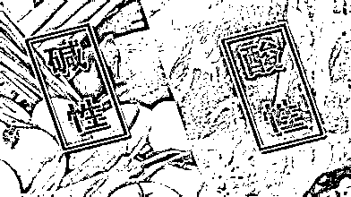
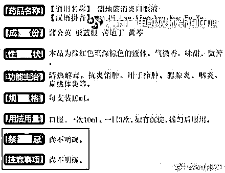
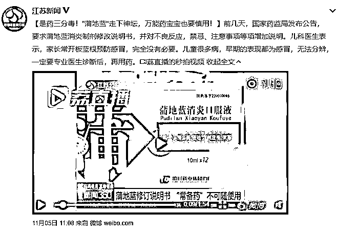
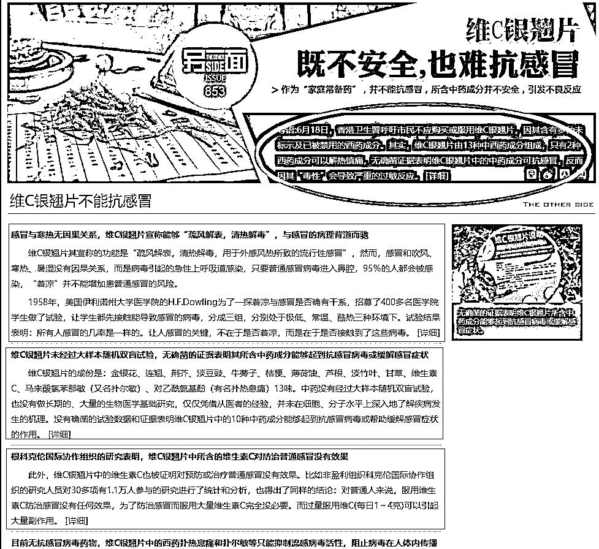
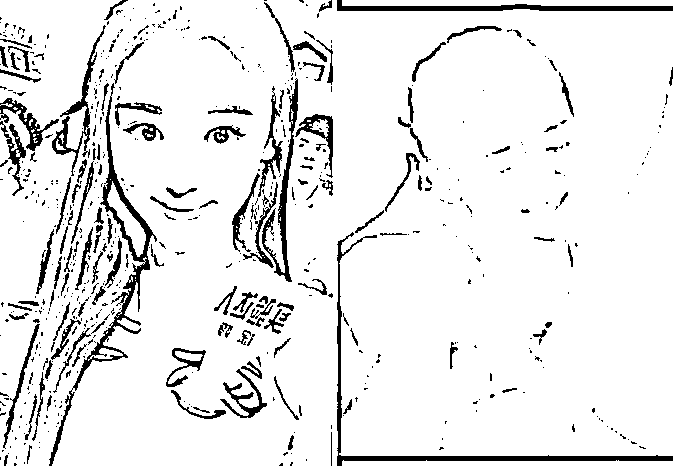
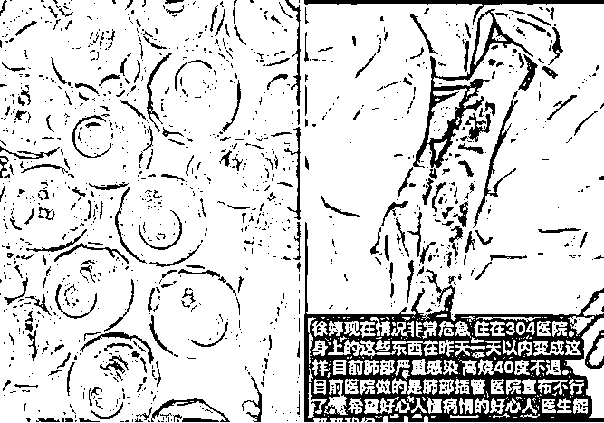
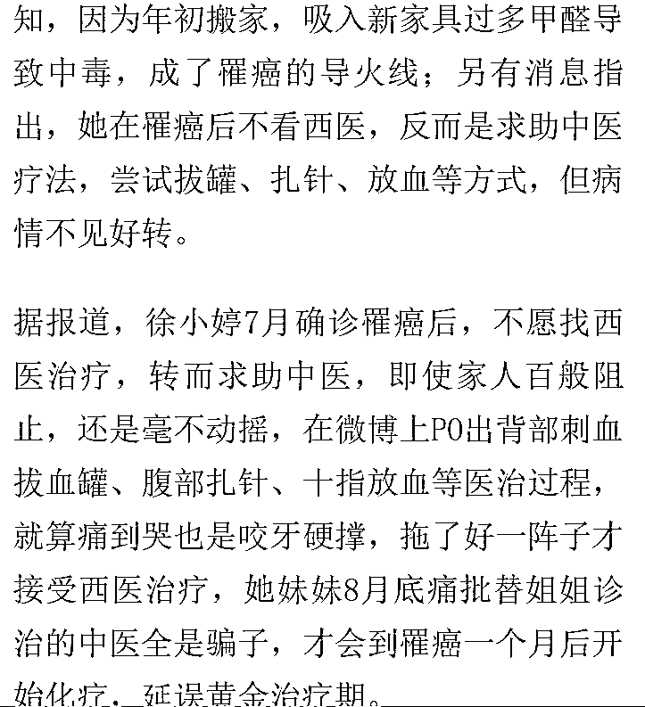

# 美国神医被罚 1.05 亿美金

喜欢我的都关注我了~

中国有很多神医，宣称自己包治百病，大多数都打着中医的牌子，还有个别打着气功大师的牌子。不管用的哪块牌子，他们都有一个共同点是把自己包装的神乎其神，而且初期证伪极难，等到证明了他是骗子之后，他早就骗取无数钱财，糟蹋不少人命了。

但是神医骗子这东西，不仅中国有，美国也有哦，近日美国圣地亚哥法庭宣布著名美国神医罗伯特欧阳赔偿一名癌症患者 1.05 亿美金。谁是罗伯特欧阳大家可能不清楚，但是他纵横美国的一套理论大家应该很清楚，那就是酸碱体质致病论。

罗伯特认为，人类体内的酸碱程度能代表健康，偏酸体质会直接导致各种疾病甚至癌症的发生，只要能用各种手段把体内的酸性环境改变为碱性，就能包治百病，更能治愈癌症！

我前几天写过中美癌症的治愈率对比，中国癌症生存率大概是 30%，美国是 60%，美国遥遥领先，但是再领先那也只有 60%，还有 40%的人要等死。

美国人也是人，走投无路的时候和中国人一样爱信神医，因为这是他们的最后一根救命稻草，罗伯特让一名求助上门的美国癌症病人放弃化疗，接受他的酸碱疗法，然后罗伯特的治疗方案仅仅是把碱性的苏打水混入注射液给病人吊水。最终导致病人的病情急速恶化，进入到了弥留之际，彻底无可救药。

最终，罗伯特被判罚 1.05 亿美金，当庭承认骗局，其创造的酸碱理论彻底被证明是伪科学。

**1.酸碱理论的危害性**

虽然酸碱理论的创始人已经被美国法庭认定为骗子，但是这个骗子为了骗人创造出来的酸碱理论在中国却依然大行其道。

亚健康会导致体质变酸，体质变酸会导致你得病甚至患癌，这套理论传播之广，传播之深令人震惊，我可以毫不夸张的说，今天的读者几乎都听过这套理论，无非就是你深信不疑，还是将信将疑的区别而已。

这套骗术理论到了中国之后，甚至衍生出了一套新理论，那就是 X 精子耐酸，Y 精子耐碱，所以体质偏酸的人容易生女儿，体质偏碱的人容易生儿子，这套新理论的诞生，真是符合中国特色。。。

这套理论的诞生直接导致不少中国备孕期的夫妇，禁喝可乐，狂喝苏打水，真是荒谬可笑。还有不少人，熬夜太累了导致身体有点不舒服，就天天疑神疑鬼，怀疑自己是酸性体质，天天去搜一些“碱性食物”来吃，深信这种食物可以让自己长命百岁，百病不侵。很多中国人，连醋都不太敢吃了，他们认为醋这种酸性食物，能够导致自己体质变酸，然后生病。

发展到最后的狂信徒，就是那些癌症患者了，这些绝症患者走投无路之际，来路不明的中药秘方，西方“先进”的酸碱理论，什么都愿意信，直接向静脉里注射“碱性神药”，其实就是苏打水，他们却坚信可以治愈自己的癌症。

被这种伪科学害死的人，在中国简直是不计其数，中国的伪科学远远比美国昌盛。

**2.伪科学的特征**

伪科学最大的特征就是难以证实，也难以证伪，这是他和真科学最大的区别。如果是真科学，你能很简单的证明他是正确的，或者是错误的。但是伪科学就不一样了，你很难证明他是正确的，但是你也很难证明他是错误的。

在这种暧昧模糊的领域，最容易诞生伪科学，也是诸多骗子扎堆的地方。例如这个酸碱健康论，你就很难证明他是正确的，因为体制偏酸的人容易生病，体制偏碱的人不容易生病，这无从证实，除非你一针小苏打注射进体内，然后百病全消，这当然是不可能的。

但是，你也很难证伪，酸碱教主声称酸性体质是治病之源，你想证明他是错的，那你需要大量的样本数据说明，体质变酸的人得病的概率并不会高于普通人。证明酸碱理论有多难，证伪它就有多难。

所以，酸碱教主靠这个伪科学大发其财，一直到消耗了太多财富和人命之后，才能被彻底证伪。

除了酸碱体质领域，其实中医也是伪科学盛行的一个地方，不可否认老祖宗的确留下很多很有用的中医宝藏，但是中医的一大弊端压根就不是他能不能治病，而是中医很难证实，也很难证伪，特别容易滋生骗子。

当你吃了一剂中药，病好之后，你无法证明你的病是因为吃了这个药而变好的，搞不好你吃一剂安慰剂好的更快，你也无法证明你的病不是因为吃这个药而变好的，毕竟很多人的确吃了这个而痊愈了。所以，中医成了骗子扎堆，伪科学盛行的一个领域，很多人打着中医的牌子在里面招摇撞骗。

要改变这种情况很难吗？其实并不难，古代的西医，一样骗子横行，和中医一样是一门玄学，甚至可以说连中医都不如。西医能变成一门严谨的科学，和西医的严格的临床实验和科学思维密不可分。

西医认为，一个药能治病，这是最起码的，但是这并不代表他能上市给大众使用，药商需要证明这个药之所以能治病，是这个药里面的哪种成分在起作用，多余的成分有没有一定存在的必要，同时需要严格测试这个药会带来的毒副作用等不良反应。

所以，通过临床试验被允许上市的西药，都被强制要求标明成分，并注明不良反应，告诉公众，这个是安全的，通过测试的，可以信赖的。

但是在中国，很多中成药厂商，为了自身的利益，却带头抗拒这种临床试验测评办法，很多中成药，赚取了无数钱财，至今都没有做过临床试验，不良反应永远是尚不明确。

例如我们所熟知的蒲地蓝消炎口服液，成分倒是写出来的，蒲公英、板蓝根、苦地丁、黄芩，但是吃了这么多年，不良反应和禁忌那里都是空白。

换句话说，我们吃了蒲地蓝消炎口服液，到底是因为吃了里面的蒲公英治好的，还是板蓝根治好的，至今都不是很清楚；如果去掉蒲公英，是不是还能治病，也不清楚；去掉苦地丁，是不是副作用更小，也不清楚。这都是因为至今没有做过药物对比试验，既然没有做过试验，当然不良反应也尚不明确。

不过，因为吃这个药，出问题的人有点多，所以最近药监局直接强制要求注明各医院统计上来的各种不良反应，新闻报道后，股价暴跌。。。

你以为这是个孤例吗？不是的，我们更熟悉的维 C 银翘片，今年 6 月被香港卫生署公开呼吁市民不要购买使用，因为维 C 银翘片由 13 种中西药成分组成，其中有 11 种作用不明，原理不明，只有 2 种西药成分是的确可以解热镇痛的，那就是马来酸氯苯那敏（又名扑尔敏）、对乙酰氨基酚（又名扑热息痛）。

换言之，维 C 银翘片就是用扑尔敏和对乙酰氨基酚这二个西方最常见的感冒药成分，再混合了一堆乱七八糟原理不明的中药和维生素 C，就包装成中成感冒药进行销售，既不是中药，也不是西药，号称中西医结合。而实际上，那些多余的成分，目前没有任何证据能证明他们对感冒起作用，蕴含的毒副作用倒是不少，毕竟是药三分毒。

更过分的是，经实验证实，维生素 C 对感冒毫无作用，因为感冒而大量服用维生素 C 不仅没有益处，而且还具备毒性。过量服用维 C（每日 1~4 克）会引发大量的毒副作用。

现在你知道很多中成药为什么一拖几十年，就是死活不做临床试验了吗？不止是因为怕花钱的原因，而是他们的配方，里面有多种成分可能是根本不需要存在的，如果做了临床试验，那么等于被扒皮示众。蒲地蓝消炎口服液和维 C 银翘片这些我们从小吃到大的中药，都这幅德行，何况那些街头老中医贩卖的所谓祖传中药秘方。

药监局的朋友曾经说过药监局有苦难言，这种未经临床验证，安全性不明确的中成药，想撤掉是做不到的，因为所有的中成药都是如此，加上独特的政治、文化加持，敢动他们就等于动祖传遗产文化，也就等于卖国求荣，高帽子不停的给你戴，让你投鼠忌器，不敢去触碰他们的利益。

现在很多中成药上市，都不需要经过严格的药物临床试验，作用机理和副作用都不是很明确，为了保住自己“中药”的头衔，他们经常在里面添加多种连他们自己都不知道有啥用的中药，而这些成分，都是有毒的，大人的代谢系统完善还好说一点，对于肝肾功能发育不全的儿童来说，这是非常致命的，每年中国都有大量的儿童，因为使用“不良反应尚不明确”的多种成分混制中药而急性肝肾衰竭。

**3.中医骗局**

鉴于带头的那些中药大厂商，都是中医文化的受益者，西药必须进行严格四期临床试验，而中药不需要，这不仅给这些中药厂商节约了大量的成本，还带来了大量的收益可以对抗西药。因为如果严格按照四期临床试验走，绝大多数中成药根本通不过试验，也就无法上市，既然无法上市，那谈何收益。

带头的大哥将整个中医的水给搅浑了，下面的小弟自然开心的不得了，浑水好摸鱼嘛，各种中医骗子就层出不穷，如果说那些祖传的某些中药配方好歹还可以治病，只是副作用很大导致用药必要性不足的话，那么很多中医就是赤裸裸的骗钱了。

例如 90 后美女演员徐婷，患癌症后拒绝医院的治疗，迷信中医才是治癌王道，花费大量钱财四处寻找老中医，最终送命。下面是徐婷冒着剧痛使用放血、拔火罐、针灸等中医疗法。

家人百般哀求徐婷到正规医院治疗，但是徐婷因为之前被长期洗脑，鬼迷心窍，拒绝家人的建议，到最后被迫送到医院去的时候，已经不行了。

一代佳人，就这么被中医骗子给活活坑杀了，而忽悠他治疗的那些“中医”，却不需要为此负任何责任，如果抓一个典型罚款一亿，相信那些骗子们也不敢如此猖獗的到处骗人。

真正的科学，没经过严苛无比的试验，绝对不敢说自己对癌症有疗效，而那些伪科学，什么试验都不用做，嘴巴一张就敢信口开河。

这些骗子们，透支的是中医数千年来来传承的信用值，赚取的是自己盆满钵满的财富，拿出来当枪使冲在前面的，则是那些无知的群众。

真正的中医是有的，但是他们一定能讲清楚这味药为什么能治你的病，里面哪些成分是不可或缺的，带来的可能毒副作用有哪些，治好你这个病的概率是多少等等。

如果什么都讲不清楚，仅仅来一句这个药老祖宗吃了几千年都没事，所以你就大胆吃。那和美国的酸碱教主没有任何区别，无非是大家的披的虎皮不一样而已。

中国也需要抓一个典型重罚一次了，否则中医的名声早晚全部败坏在这群骗子手里。而那些推波助澜传播健康谣言的公众号，也应遭到严格的惩罚，他们是在为虎作伥。要知道，造谣一张嘴，辟谣跑断腿，而这种健康类的谣言，通常需要生命做代价，才能做到证伪，有时候，还需要很多条生命才能填满这个健康谣言挖下的大坑。

不想做这个填坑的牺牲品，你就不要轻信这些谣言，而要坚信科学。

~~~

严重警告：本文乃科普扫盲文，专治各种健康谣言，转发到谣言密布的家族群，可能会被踢出群哦。

觉得此文的分析有道理，对你有所帮助，请随手转发。

长按下方图片，识别二维码，即可关注我

近期精彩文章回顾（回复“目录”关键词可查看更多）

华为员工都这么穷，怪不得拼多多能火 | 房价跌 20%就会全面崩盘，地产杠杆远比你想的要脆弱 |  为什么碧桂园的质量那么差 | 清醒点，放弃全面开征房产税的幻想 | 央行和财政部隔空掐架，我支持央妈 |中国土地制度源自香港，但是香港却是劏房密布 | 为什么中介哄抢租赁房源，因为贩毒都没它来钱快