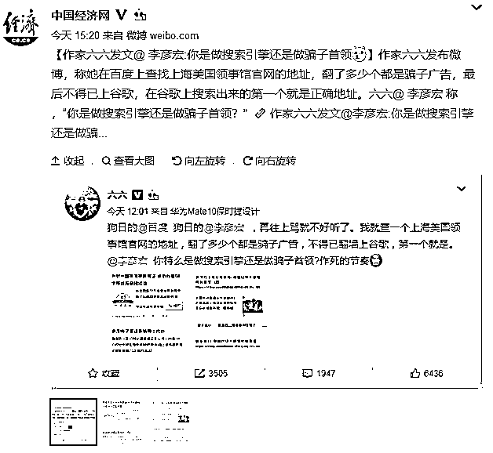
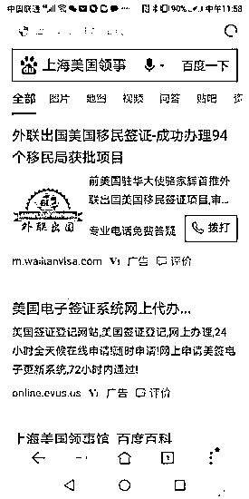
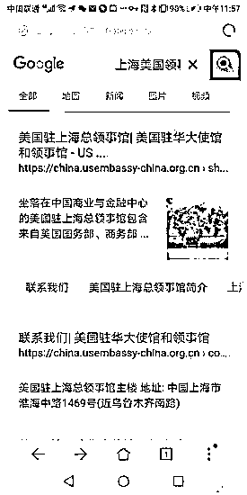
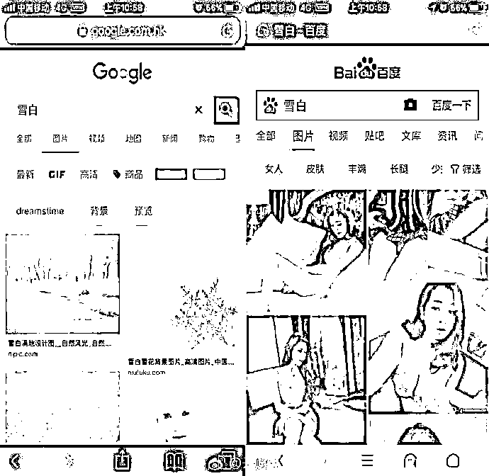
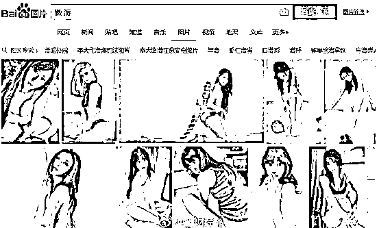
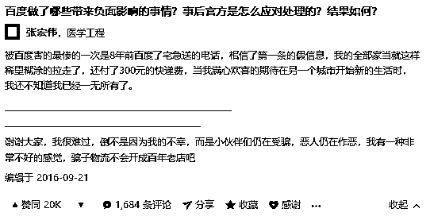
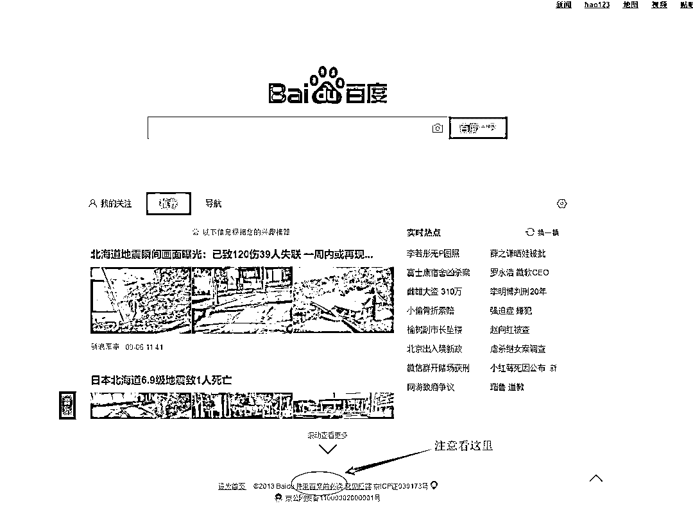
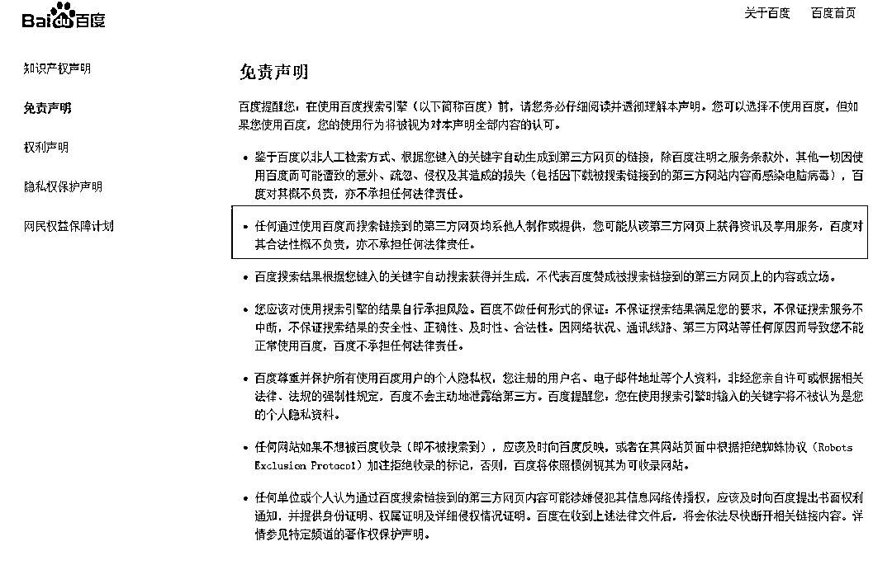

# 百度是搜索引擎，还是骗子大本营？

喜欢我的都关注我了~

今天，作家六六在百度上查找上海美国领事馆官网的地址，结果翻了不知道多少个都是骗子广告，实在找不到真的，最后不得已上**GG**，在 GG 上搜索出来的第一个就是正确地址。于是六六怒了，公开炮轰百度，直接@李彦宏称“你是做搜索引擎还是做骗子首领？”

百度搜索上海美国领事，全是广告。

谷歌搜索上海美国领事，真身直接出现在搜索页第一条。

在引起热议之后，百度又双叒叕道歉了，然后迅速下架了所有的骗子广告，并宣布对上海美国领事馆官网做品牌保护，换句话说，中国人以后使用百度搜索上海美国领事馆官网，第一眼就能看到真身啦，而不是翻了好几页全是骗子广告。

上海美国领事馆官网借这次舆论风波在百度这里享受了特级待遇，但是其他千千万万和民生相关的领域，依然维持原状态，那就是骗子广告密布，很多中国人都有这个疑惑，百度到底是搜索引擎，还是骗子大本营。

一个月之前，李彦宏公开发言，说百度能再赢一次 GG，长期苦于百度的网民怒了，好事的网民直接翻出了百度的黑材料，怎么翻呢，直接百度。。。

例如，你直接在百度和 GG**搜索雪白**，大概是这个样子

比如说，你百度搜索嫩滑。

当然，这个你们已经搜不到了，只要媒体曝光，那就立刻被和谐掉了。

这些擦边小黄图其实都还好，但是更可恶的是，百度的各个民生领域，普遍是由骗子广告占领，当年魏则西事件轰动全国，但是更多的，则是那些在百度上吃了小亏但是投诉无门的普通人。

为什么百度这么嚣张呢，他不怕受骗上当的网民来告他吗？他还真不怕，我们来看一下百度的免责声明，首先你需要打开“使用百度前必读”，就在主页正下方，但是字体非常小，如果不是我这篇文章，很多人可能一辈子都不会发现他的存在。

打开之后你会发现，百度在免责声明里明确的说，**百度对所有搜索结果的合法性其合法性概不负责，亦不承担任何法律责任**。

百度还闹眼子一样的推出了一个百度信用蓝 V，就是你看到那些打广告的下方有蓝 V 标志的，这个叫百度信誉推广，如果在里面上当受骗，百度负责赔付，蓝 V 是长下面这样的。

我打开看了一下，基本都是那种“性感荷官发牌啦”这种调调，这种网站肯定是骗钱网站，一律杀掉都没什么冤枉的。那么你在里面输了钱，被骗之后，百度会不会赔付你呢，不可能的，百度不会赔付你，这是你自己同意的。我们再回到上面那个界面，免责条款下面有一个网民权益保护计划，里面有加蓝 V 标签的赔付声明，里面清清楚楚的写着。

1、用户明知或应知交易行为本身不具有合法性（包括但不限于涉黄、涉赌、非法产品/信息交易、违法网络兼职、商业信誉作弊等）

4.按照一般理性消费者的判断标准，用户对来自网站经营者的商品或服务风险的判断存在故意、重大过失而导致经济损失的；

6.用户与网站经营者之间因不当宣传、商品或服务的质量、价格、售后服务等引发的消费纠纷，或因网站经营者自身经营不善导致的中止/终止交易、停业或破产倒闭等，导致用户遭受的任何损失；

这里面最狠的四个字就是“不当宣传”，**如果这个广告打的有问题，百度不负任何责任，那全是商家的责任，属于消费者纠纷，请消费者自行和商家解决。**

那请问百度你告诉我，在什么情况下，你们才会赔付，恕我愚笨，按目前的条款看，任何情况下，你们都是无责的，那你还闹眼子一样的搞一个这样的所谓网民权益保护计划是给谁看呢，你是保护网民呢，还是保护你自己呢，我怎么看，这个所谓的“网民权益保护计划”都像是蓝 V 收钱免责声明，所以百度开开心心的给蓝 V 再次收一道钱，而且不用负任何责任。

百度发广告养活自己是天经地义的，无可指责，但是百度理应爱惜羽，对自己的广告严加审核，要知道你放上去的广告，尤其是你放在搜索页前列的广告，很多人因为信任百度而信任这些搜索结果，百度绝对不能以免责条款，一免了之。

你比如我，每天有无数人找我发广告，但是那些有害的，垃圾的广告，我一律弃之不顾，每年舍弃的广告费至少千万，我的标准很严格，这个广告必须是无害的，对粉丝有益的，我才会推，但是按这个标准卡下去，达标的广告可以说是凤毛麟角。

所以我选择了另外一条路，就是盈利很低，吃力不讨好的电商，每天的次条都会放一些电商，我的要求是首先价格必须全网最低，有时候甚至要求比淘宝还低，然后所有的商品都必须发样品来试用，确实物美价廉，对读者生活有益的商品，我才会推。

这个标准卡下去，商家利润就不多了，广告费自然也就寥寥无几了，但是优点是不仅不伤粉，反而对读者有益，很多商品就是读者平时在找的商品，而那些常见的商品，厂家直销甚至比淘宝还要低，还能保证质量，节约了很多人大量的购物选择时间，这才叫互利共赢好嘛。

相反，如果我不加节制的疯狂发广告，甚至头条里都塞满垃圾广告，这是很多自媒体大 V 都做的事，大家会怎么想，这样的确来钱快，但是不可持续，竭泽而渔，肯定很多人痛骂。

但是百度做的，比很多天天发垃圾广告的自媒体大 V，还要过分，任何人的商业模式都讲究互利双赢，单边榨取，必然走不远。

虽然百度现在很强，名列互联网四巨头之一，但是**我认为百度命不久矣**，理由很简单，如果一个天天发骗子广告，只要肯给钱什么都敢发的企业能长久存活，那就不是他有病了，是整个中国有病。

觉得此文的分析有道理，对你有所帮助，请随手转发。

长按下方图片，识别二维码，即可关注我

近期精彩文章回顾（回复“目录”关键词可查看更多）

华为员工都这么穷，怪不得拼多多能火 | 房价跌 20%就会全面崩盘，地产杠杆远比你想的要脆弱 |  为什么碧桂园的质量那么差 | 清醒点，放弃全面开征房产税的幻想 | 央行和财政部隔空掐架，我支持央妈 |中国土地制度源自香港，但是香港却是劏房密布 | 为什么中介哄抢租赁房源，因为贩毒都没它来钱快