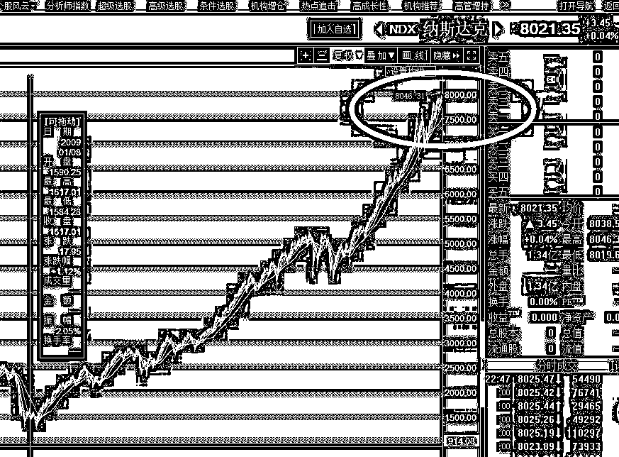
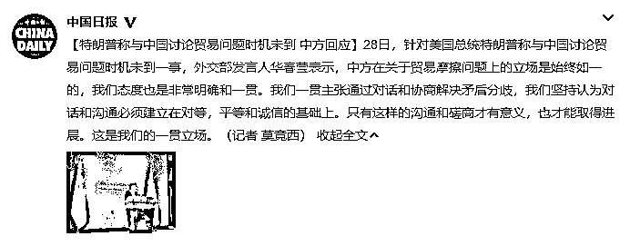
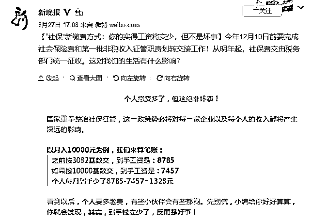

# 夜报 | 纳达克斯又刷新高了

今天的话题都很敏感，所以我点到即止，写多一点都必被删。

首先，是纳达克斯又创新高了，大家看看这个图吧，简直比中国的房价涨的还要疯狂，8046 点最高点今天打出来的，到底是中国楼市有泡沫，还是美国股市有泡沫，这是一个千古难题。。。

然后，今天特朗普称与中国讨论贸易问题时机未到，不予评论，自己看新闻。

国家重拳整治社保，将社保缴费交给税务局监管，预期会大面积的催缴出中小企业应缴但是未缴或者少缴纳的社保。中小微企业解决了全国 80%的就业人口，换句话说，全国 80%以上的人口，喜迎社保缴费上升。

昨天大阳线突破站稳 20 日均线后，我认为这几天会有个震荡回踩，结果今天收了十字星，全天震荡，总的来说，这种十字星走势还是非常强悍的，如果他今天下探到 20 日均线再反弹，那反弹强度就要打个问号了。

故，这一波依然没结束。