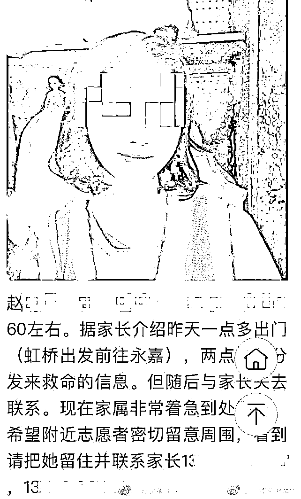
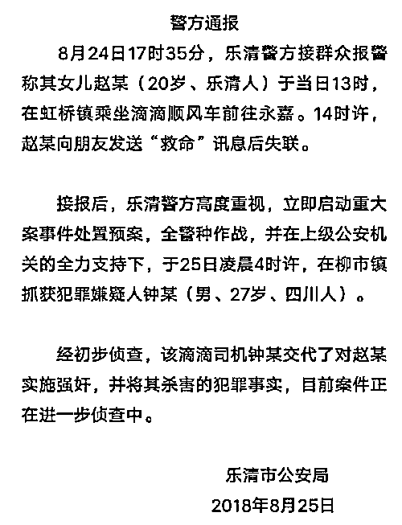
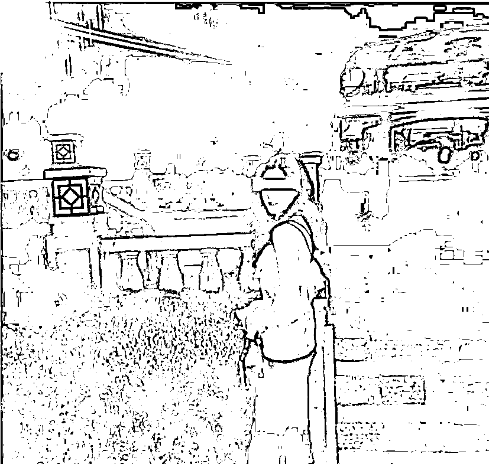
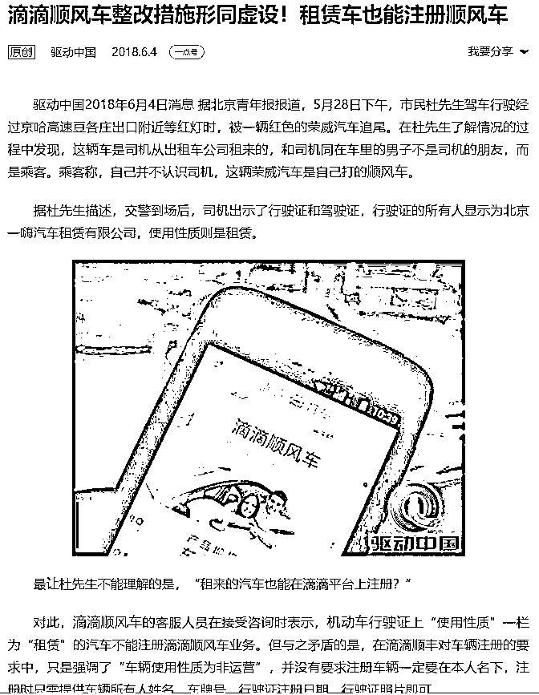
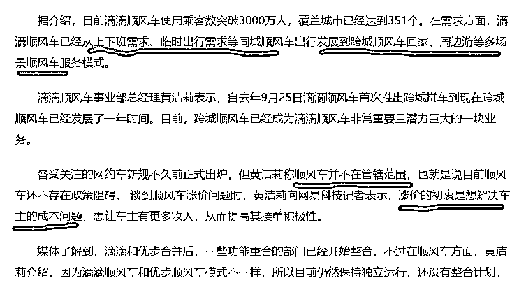
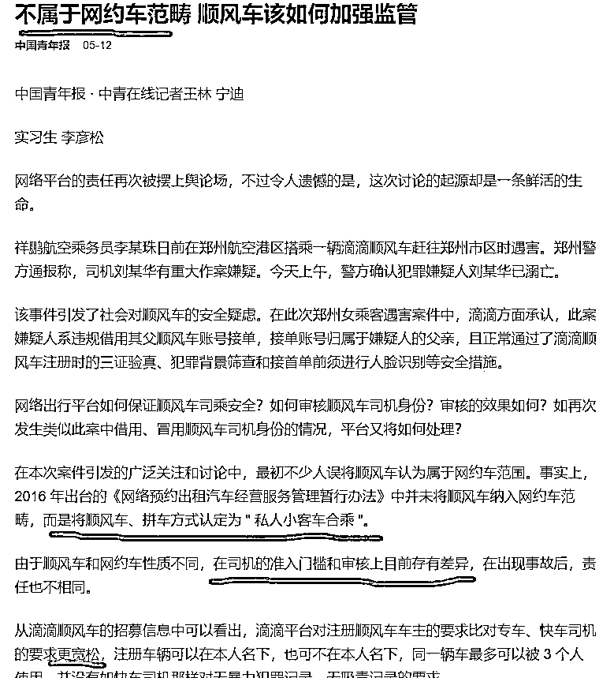
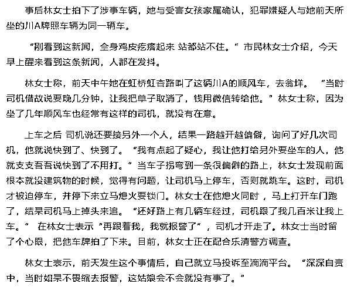
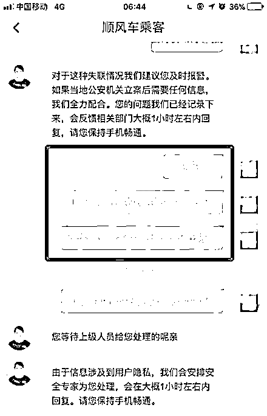
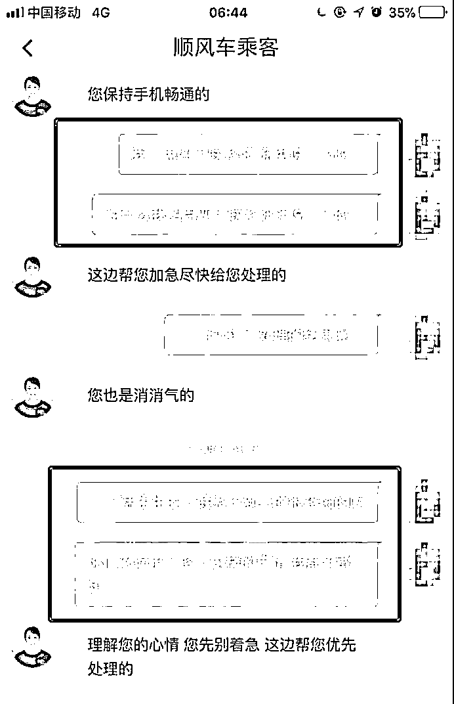
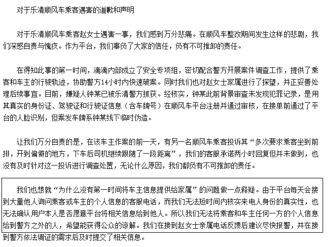

# 又出人命，滴滴顺风车故意放任安全漏洞存在，金钱就那么重要吗 || 紫竹张先生

昨天下午 5 点左右，乐清警方接群众报警称其女儿赵某（20 岁、温州乐清人）于当日 13 时，在虹桥镇乘坐滴滴顺风车前往永嘉，14 时，赵某向朋友发送“救命”讯息后失联。

乐清警方高度重视，立刻按照重大案件启动预案，今天凌晨 4 点，抓获犯罪嫌疑人，经初步审查，该滴滴司机钟某交代了对赵某实施强奸，并将其杀害的犯罪事实。

今日上午 11 点，警方在钟某交代的抛尸现场乐清淡溪山区，在悬崖之下，发现受害女孩的遗体，一个非常漂亮的女孩，在花样年华，就这么没了。

搜救人员正在下悬崖搜索遗体

而实际上，仅仅三个月前，滴滴顺风车刚刚出过一起恶性案件，今年 5 月份，一位刚刚 21 岁的漂亮空姐，同样是乘坐滴滴顺风车被奸杀。

在空姐遇害案之后，滴滴下架了所有关于性暗示的宣传广告以及个性化美女标签等，不允许司机查看乘客头像，对外宣称自己已经全力整改。

但是从实际效果来看，仅仅 3 个月，又出一起恶性人命案，受害者同样是年轻美貌的女子，我觉得就算不整改，可能也就这个频率速度了，17 年顺风车发育期的时候，也没听说滴滴有这么多恶性奸杀案啊。

更引人深思的是，滴滴有很多项服务，有专车，有快车，有出租车，这三种服务如果出了恶性杀人案，一样会引人注目。但是大家有没有发现，这次的遇害，居然又是顺风车，为啥滴滴快车就是不出事，而顺风车老是出事。

所以，这里面一定是顺风车的制度出了问题，否则不可能每次都是顺风车出事，而同样是滴滴软件里的快车专车出租车他就是不出事。

换句话说，5 月份滴滴的整改措施，只是做了皮毛功夫，没有针对本质原因，我们今天来分析一下，顺风车出事的本质原因是什么。

顺风车到底有什么特殊之处

快车、专车、出租车，他们和顺风车到底有什么不同呢，我们今天就来逐个分析一下。

滴滴起家靠的是快车，所以快车是滴滴的常规主力车型，滴滴快车和出租车没有任何区别，都是随叫随到，按公里计费。

而滴滴专车则是滴滴快车的升级版，用昂贵的车型和更精心的服务给高端人士打车用的，当然，价格一般也比快车要贵了 3 倍，所以我们可以看出，快车和出租车是滴滴用来针对中档人群的，而专车是用来针对高档人群的。

那么什么是滴滴顺风车呢，按照滴滴官方的解释和定义，顺风车应该是上班族在上班和下班的路程上，顺路捎带同行者，然后同行者来分担一定的油费，达到合理利用社会资源的目的，车主并非职业司机，只是上下班顺路为之而已。所以滴滴顺风车一开始才会通过种种宣传文案，鼓励乘客主动和司机聊天，因为车主并不是来给你当司机打工的，只是一种互助行为，分担油费而已。

但是在实际运营中，滴滴把顺风车当成了针对低端消费者的车型，同时，故意避开监管，把乘客暴露在安全风险之内。

带血的顺风车

顺风车本是个好事，共享城市资源，但是在实际操作中，为了追逐利润，滴滴硬生生的把他做成了坏事，我们看一看滴滴的制度漏有哪些。

首先，顺风车的车主，其审核明显比快车和专车要宽松很多，毕竟别人的职业是上班，而不是司机，审核尺度宽松到只要你是个车主，而你愿意注册顺风车，你就能注册成功，今年 6 月份就有媒体曝光，连随便租赁来的车，都能注册成功。

滴滴连这个都不予审核，更别提去审核这个车主到底是不是有正当职业，只是上下班顺路拉个乘客分担油钱了。

然后，是顺风车的引导方向，明显偏移了他成立的初衷，从顺风车的种种制度来看，我没看出一丝一毫的顺风车概念，这就是一个典型的低配版快车。

按照顺风车的定义，首先车主是有正当职业的，上下班的过程中顺路拉人分担油费而已，所以车主每天的拉客路径，一定是非常固定的，顶多只在小范围内略有偏移，我是自己上班，只是顺路拉你而已，并不是你的专职司机要特意跑到你指定的路线上拉你。

其次，是顺风车的定价体系不对劲，顺风车的价格定的相当高，只是比快车低一档而已，远远超过“分担油费”的初衷，已经提高到你职业开顺风车，也能赚钱的地步。这导致了很多车主并非上班一族，而是以盈利为目的，特地来开顺风车的。而这，正是滴滴官方希望看到的，这大幅扩张了滴滴的车源，也扩大了滴滴的盈利抽成。

上图这个滴滴官方的声明，说明滴滴官方他本身就不希望顺风车只是上下班顺路接个人，而是希望把顺风车发展为跨城顺风车、周边游等等。这样才能多拉活，多产生车费才是滴滴的终极目的，那种每天只是上班和下班各拉一次人的顺风车，滴滴不喜欢。

所以，我们看到，滴滴顺风车并不顺风，很多人一天到晚开顺风车拉客，压根就不去上班，因为他们的职业就是司机，为什么他们不去注册专车非要注册顺风车呢，因为专车审核严格，他们不愿意当专车，只愿意当顺风车。

按照现在的法律定义，顺风车不属于网约车范畴，不受网约车监管条例管辖，因为顺风车被认定为“私人小汽车合乘”。

所以，在实际操作中，滴滴顺风车被硬生生的做成了低配版的滴滴快车，但是利用顺风车的监管漏洞降低了审核标准，无需有正当工作，无需你每天去公司上下班，你也可以直接注册成为顺风车司机。

大幅度降低审核门槛带来的结果就是大量的低素质司机涌入，给乘客带来了极大的安全隐患，同时，也大幅度的提升了滴滴的市场规模和收入。

关于这个漏洞，今年 5 月份空姐遇害的时候，就有媒体专门提起，已经指出这里是监管盲区，既然滴滴的顺风车不是上下班专用的，哪里都可以去，使用上和快车没有任何区别，为什么不干脆直接并入快车，按快车的标准去审核呢。

很简单，为了金钱，一切能绕开监管的东西，滴滴都会去做，哪怕这样做会给乘客带来生命安全的威胁。如果出事，最多赔几百万而已，不出事就可以继续这么玩，滴滴当年扩张市场规模一天可以烧掉千万，如今靠着顺风车扩张市场，3 个月才出一条人命，赔几百万，那也很便宜，所以绝对不能断掉这条财路。

顺风车的规模扩张，是带血的。

滴滴没有管控司机的能力

在温州 21 岁女孩被奸杀的前一天，嫌疑人所开的顺风车，曾被乐清林女士举报司机将其带至偏僻处图谋不轨，林女士直接投诉到了滴滴平台，但是滴滴没有任何反馈和处理。

林女士浑身瑟瑟发抖，她简直是和死神擦肩而过。而在第二天，被奸杀女孩通过讯息求救之后，其闺蜜立刻报警，然后联系了滴滴客服，要求滴滴提供司机的联系方式和车牌，试图火线救人，但是滴滴客服居然回复不可以，请让警方联系我们。

客服的对话截图

实际上，一个小时，又一个小时过去了，2 个小时之后，滴滴官方终于回复了一句话，那就是“涉嫌泄露用户隐私信息，无法提供。”直到当天晚上 8 点之后，才将信息提供给前来调查的警方。而这个时候，女孩早已遇害，如果在报警的第一瞬间滴滴官方直接接通司机的电话警告这位司机，这个女孩也许就不用死了，只是一个电话而已，滴滴都不愿意去做。

为什么没有丝毫的援助行为出现，事后官方解释是：平台每天会接到大量的询问车主和乘客信息的电话，我们无法核实真实性，所以不能把信息提供给除警方之外的任何人。

这么说其实是没错的，滴滴官方的确没有核实来电真实性的能力。但是在此次案件中，在案发前一天，有一位受害女性侥幸逃脱免于一死，并直接投诉到滴滴作为警报，而次日同一辆车，再次有人做出同样的示警，在这样连续密集的示警下，滴滴依然没有任何对乘客的援助行动出现，甚至连给司机打一个电话询问情况作为威慑都没有。

换句话说，滴滴对于司机一点约束能力都没有，滴滴只负责收钱。在这种情况下，滴滴还把顺风车的门槛搞这么低，没有管控司机的能力，还任由甚至是故意引导低素质司机的涌入，这不是为了钱作恶是什么。

滴滴应该怎么做

问题已经分析清楚了，那么滴滴应该怎么整改呢。首先，滴滴以顺风车节约油费、整合社会资源、上下班一起出行作为噱头开启顺风车项目，以顺风车为市民自发合乘为由头规避网约车监管，降低审核门槛，这个是极端错误的。为何快车专车不出事，而顺风车老是出事，根源就在这里。

所以顺风车应该回归本源，所有的车主，必须提供正当职业证明，每天接送乘客的行驶路程，应该都在一条线路上，不应该也不允许出现大范围的移动，次数也有严格限定，那就是一天最多只允许载客 2 次，价格也应该降低到分担油费的初衷上，而绝对不应该是以盈利为目的，想靠开车赚钱，请去开快车即可。

这么做显然会大幅度降低顺风车车主的数量，只有少量真的顺风的车主才会考虑接单，所以滴滴始终不愿意这么整改，宁可让乘客去负担生命安全的风险。

如果车主真的是有正当工作的，只是上下班顺路带个人，那么可想而知，顺风车的安全系数会大大增加。

除此之外，其他的以开车为职业的车主，应立刻划到快车里去，按快车的标准去审核和计费，你压根就不是顺风，就是特地跑来接人赚钱的，一天到晚都在拉人赚钱，为什么不去注册快车？这里面肯定有问题。你给我说说顺风车能做的事情，快车哪个不能做了，为什么故意以顺风车的名头招募司机去做快车的事情。

滴滴以“顺风车”名义，以共享精神为招牌，行运营盈利之事实，降低司机门槛审核，放任安全隐患的存在，只是为了扩大自己的市场份额，增加自己的盈利收入，让人非常不齿。

同样是滴滴旗下，快车和专车的出事率远远低于顺风车，这里面到底是什么奥妙，外人都知道，滴滴自己难道不知道？

只是为了赚钱，就故意让安全隐患存在,难道乘客的生命在你的眼中，就远远没有金钱重要吗？

长按下方图片，识别二维码，即可关注我

近期精彩文章回顾（回复“目录”关键词可查看更多）

华为员工都这么穷，怪不得拼多多能火 | 房价跌 20%就会全面崩盘，地产杠杆远比你想的要脆弱 |  为什么碧桂园的质量那么差 | 清醒点，放弃全面开征房产税的幻想 | 央行和财政部隔空掐架，我支持央妈 |美貌空姐搭乘滴滴顺风车被奸杀，折射出大企业的贪婪和不负责任