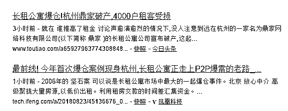
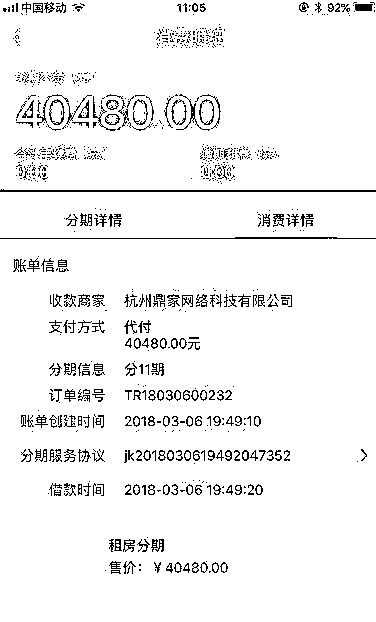
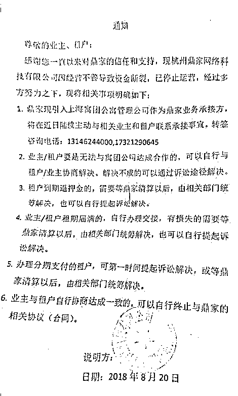
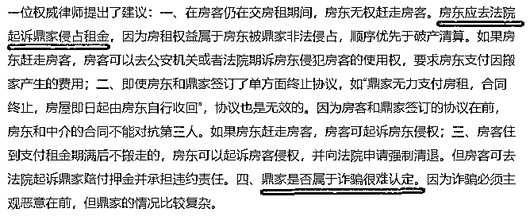
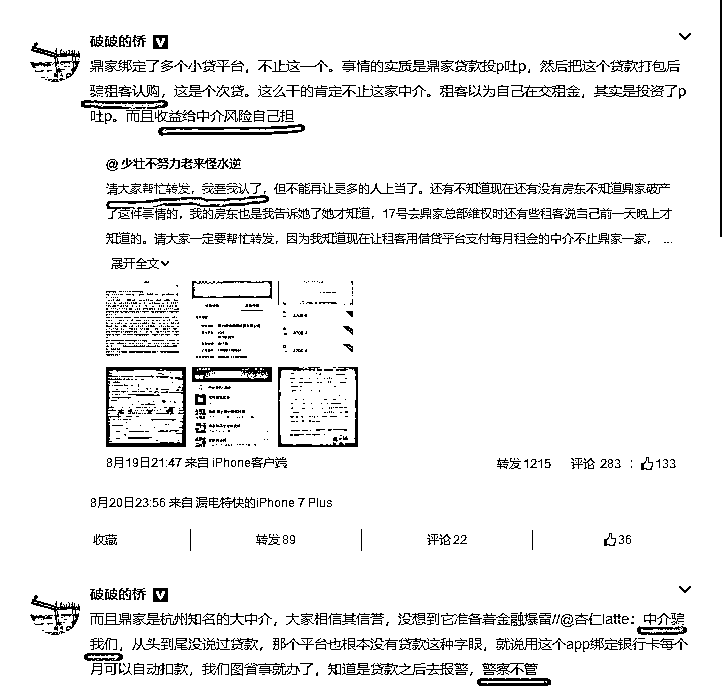

# 杭州长租公寓爆仓，挪用租房贷款和 ABS 是两码事 || 紫竹张先生

点击上方蓝色字体，关注我们

15

 昨天我刚刚点明长租公寓挪用租客租房贷款蕴含巨大风险，严重损害租客和房东权益，今天就看到有媒体报道杭州鼎家长租公寓爆仓，4000 户租客受损。

 

据媒体介绍，杭州鼎家长租公寓的租客通过网贷平台的 APP 贷款，一次性把租金付给了鼎家，涉及 6 家 P2P 网贷公司，其中涉及资金最多的网贷平台是 51 返呗（现更名为“爱上街”）。利率不清楚，但是绝对比银行的高太多了，不仅在利息上要赚房客一笔，而且如今鼎家破产，房客不仅拿不到先行支付的押金，还要每个月按时给网贷平台还钱，而收不到租金的房东已经开始准备收房，这 4000 租客真是惨。。。

我查了一下，鼎家真正的破产日期，应该是 20 号，而不是 23 号，因为他在 20 号就贴出了破产通知，今天被媒体爆出来，肯定是因为昨天掀起的长租公寓批判之风。下面这个鼎家长租公寓的跑路公告跟前段时间 p2p 跑路公告如出一辙，简直就是一个模板写出来的。

在破产通知发布后，鼎家一名负责人直接告诉租户：“没钱退押金，更没钱退房租。”鼎家是真的没钱了，因为他们自己员工的工资都发不出去了。目前，鼎家的租户及业主组成了大大小小的维权群，想通过协商或者法律等途径挽回损失。

按照目前律师所述，房东的权益受损最大，无权赶走租客，法律对租客的权益保护甚至高于破产清算，建议房东去起诉鼎家拿回租金，或者等到租客租赁期满，这不是搞笑嘛，鼎家要是还有钱，能走到工资发不出被迫破产这条路？更过分的是，连认定鼎家是诈骗都做不到，因为钻了法律盲区。

所以，长租公寓资金链断裂破产，卷走租客贷款资金人间蒸发，房东和租客权益严重受损，不是一个推理的结果，而是实实在在已经发生在身边的事情。

至于这满地的窟窿到底是房东吃亏来填，还是房客吃亏来填，那就不好说了，但是法院和社会都是支持弱者，我昨天说可能 55 开和稀泥，现在看，估计和稀泥的时候要 37 开。这才 4000 户，要是 40 万户甚至 400 万户租客被赶出家门流离失所，一定会社会大乱。

大部分房东都是良民，真正能凶神恶煞赶走房客的房东是极少数，尤其是在这些房客也是良民已经支付一年房租并且无力再承担几万租房贷款的前提下，所以这里我要再度提醒一下房东，谨慎签约，即便签约也一定要和房客取得联系，长租公寓可以代收房租，但是绝对不允许长租公寓挪用房客的租房贷款,**向房东支付租金一定是在向租客收取租金之前**，至少也要是同时，否则将来吃亏的是你自己。

杭州街头的 4000 户租客和对应的房东，他们招谁惹谁了，凭什么遭这个罪？这么挪用租客的贷款资金不是故意犯罪是什么。

挪用租房贷款和 ABS 是两码事

鼎家长租公寓爆仓最重要的原因，就是他在没有支付房东租金的情况下，利用网贷平台 P2P 的贷款一次性收取了租客的租金，然后挪用了这些资金做其他事情。当公司发展的一切顺利的时候，所以的收益归自己，美其名曰自己敢于冒险，还愿意**自己给自己做担保**，承诺一定还款。但是真等到爆仓的时候，来一句账面实在没钱了，自己有心无力，让全社会来承担他的损失，真是打的一手好算盘。

这几天，有些人说，长租公寓这么玩，是 ABS，是资产证券化，能促进长租公寓发展，这种言论是非常错误的，不懂装懂，半桶水乱响，有严重的常识性错误，误导舆论，我今天就给大家解释一下，什么才是真正的 ABS。

资产证券化（ABS）是指将流动性较差但具有相对稳定的可预期现金收入的**资产**转换为在金融市场上可以出售和流通的证券，得以变现的过程。

很绕口是吧，我举个例子给你们解释一下，假设你购买了 3000 万的设备，扣除折旧年收益率 10%，那么你每年可赚 300 万，这个时候你不满足于现有的规模，你打算继续购买更多的设备去赚钱，但是你手里没现金了，怎么办呢。

你把这 3000 万的设备**资产**，打包成一个证券，按年收益率 9%当成一个债卷去出售，你抽 1%管理费，市场同意以 3000 万元购买这个资产包，那么你手里就立刻变现了 3000 万现金，然后你拿着这 3000 万，再去买一个设备出租，如此循环。这样你赚了大钱，社会资金得以流入最需要的地方，互利双赢。

注意这里的重点，你首先是购买并拥有了 3000 万的**资产**，这个资产预期可产生稳定现金流，你才能使用 ABS 把他卖到 3000 万，这还需要你找担保人补足质押率，因为 3000 万的资产直接套现，一般只能套 1500 万左右，这里有个质押率覆盖风险的问题存在，这个信用差额，只能靠担保企业的信用补足了。

如果你只付了 300 万的首付，其他的分期付款 10 年付清，然后你就想拿着这个东西包装成 ABS 卖 3000 万的现金带走，你当投资人傻么？至于说你承诺将来一定会付清剩余 2700 万，这项目肯定赚钱，所以你现在拿 3000 万购买我这个 300 万的资产不用担心，那都是鬼话。承诺要是有用的话，你为什么不向银行承诺你将来一定还钱，能还钱的原因只是因为这个项目你说他肯定赚钱，然后让银行痛快的批给你 3000 亿让你去发展规模？

银行不给你，是因为银行不傻，没有足够的底层资产做质押担保，不管你把你的项目赚钱能力夸的天花乱坠，银行理都不会理你，风险过大，本银行庙小容不下，请找风投基金。

目前，采用 ABS 模式只是少量长租公寓的部分选择。中国目前租赁人口已达 1.9 亿人，住房租赁市场年租金已超过 1 万亿元。长租公寓的租户，按照月租 2500 一个月计算，一个租户一年需要贷款 3 万元，链家的自如在北京城能 2 个月推出 8 万套房源，全国所有中介的长租公寓一年哪怕只按 100 万个租户贷款来计算，每人 3 万，那也是 300 亿规模的 ABS，你去查查中国目前销售的 ABS 总共才多少钱，自如这么大的龙头，才搞了 5 个亿的 ABS 而已。

换句话说，大部分长租公寓的资金，不是通过 ABS 渠道募集的,长租公寓更倾向于和 P2P 合作一次性套现。长租公寓为什么不采用 ABS 去市场套现，而非要和网贷平台合作发放贷款，就是因为他们的底层资产无法通过 ABS 的审核。

按照 ABS 的规矩，假设房东报价月租 1 万，你一次性支付给房东 12 万，你才算购买了一年的租赁权，这个时候，你才有资格去 ABS 市场，把你已经购买到手的一年租赁权，打包成底层资产进行出售换取 12 万现金。如果你暂时拿不出钱买一年的租赁权，但是又想套 12 万的现金，那也可以，拿其他**资产**做补充质押，自己给自己空口担保市场是不认账的，因为那等于没有担保，所以需要你拿别人的资产来再次担保补充信用，要是底层资产从账面上都明显不能充分覆盖风险，那还有什么好谈的。但是如果你底层资产严重不足，你觉得那个企业会帮你做额外担保，你当担保人傻么？实际上，如果拿着价值 3 万的租赁权想套 12 万的现金走人，就算有人担保，市场投资人也是不认账的。

如果你仅仅支付给房东 3 个月的房租，就算你和房东签的是 10 年的合同，那也不算你已经获得了 10 年的租赁权，只能算你获得了 3 个月的租赁权，其余的 9 年合同仅仅是一个可能会赚钱的没有落地的项目而已，不算资产，所以你去 ABS 套现，只能套 3 个月的钱出来，绝对不可能拿着 10 年的租约就能空手套出 10 年的现金，那样从 ABS 骗钱也太容易了。租约不代表租赁权，不能构成底层资产，你付完钱，这个租赁权才算你的，才能算你的资产，这里再强调一次。

而找 P2P 合作就不一样了，只要你能找到人愿意和 P2P 签贷款合同，P2P 就立刻放款到你指定的账户，至于这个钱到底干嘛去了，P2P 不管，这总比贷到其他地方保险。而长租公寓拿了钱之后，根本不让房东知道这笔钱的存在，直接放飞自我想干嘛就干嘛去了。

所以，正常的 ABS，需要你先购买完整的租赁权，然后你才有资格把这个租赁权当底层资产进行出售，这中间不需要任何网贷平台的参与，而那些需要找网贷平台贷款租房的合同，清一色有鬼，一次性套现出来的资金，长租公寓绝对不会老实的交给房东的。

只花 300 万买的资产，能 3000 万卖出去，仅仅承诺我会按时付款，就能套取 2700 万的现金，正常的市场有谁会这么傻？但是那些被长租公寓套路的房东和房客，真的就这么傻。

觉得此文的分析有道理，对你有所帮助，请随手转发。

长按下方图片，识别二维码，即可关注我

近期精彩文章回顾（回复“目录”关键词可查看更多）

华为员工都这么穷，怪不得拼多多能火 | 房价跌 20%就会全面崩盘，地产杠杆远比你想的要脆弱 |  为什么碧桂园的质量那么差 | 清醒点，放弃全面开征房产税的幻想 | 央行和财政部隔空掐架，我支持央妈