# 拼团|| 好看极了的北欧风的床品要不要试一试？

写在前面：

这个四件套的价格简直优惠到爆，不过要求 5 人才能成团，开团失败则退款，这个难度实在太大了，不过在协商下，退了一步大幅度下降了拼团难度，只需要任意 5 人，新老用户都可以参团开团，则拼团成功，这个就比较容易了，拉一个新用户的难度至少等于 3 个老用户。

不过还有一点，为了尽可能的降低成本，拿出最有竞争力的价格，这次的四件套采用的是先下单后生产的模式，生产周期大概需要一个月，所以现采取预售的形式，**今天下单，预计 9 月 25 日左右发货**，拼团时间截止到明天午夜。

差不多就这么多，要提醒的有点多。。。

* * *

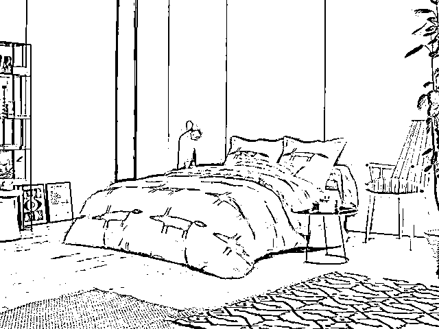

橙色狐狸印花

**这样的北欧风床品，图案好看到让人激动，抱住就再也不想松手。**

让人不住地感叹：**“实在是太好看了！”**

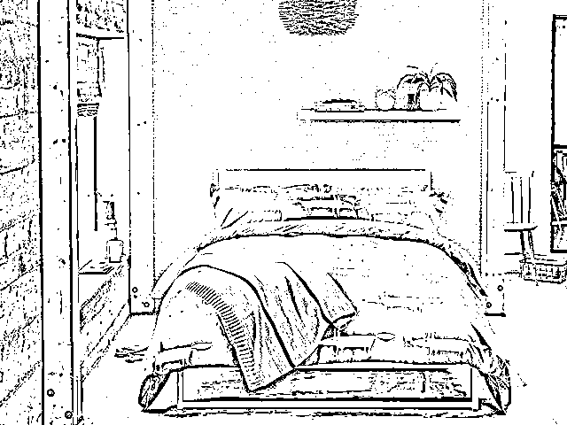

灰色狐狸印花

**它来自英国家纺品牌 Scion 塞恩。**

Scion 在全球许多发达国家很受欢迎，在**日本的 Nishikawa、英国的 John lewis、台湾新光国际百货**等知名百货公司都有销售。

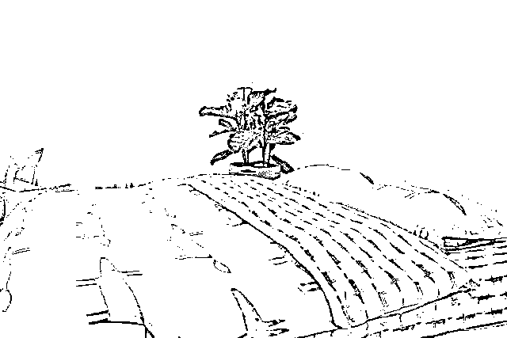

北欧一年 1/3 时间都处于冬季，冰雪覆盖，黑夜漫长，于是出现许多色彩靓丽的设计，**来温暖人们灰暗的心情。**

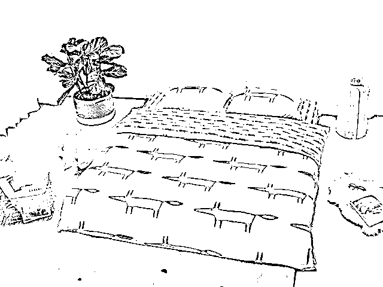

北欧风的床品似乎有一种神奇的魔力，看到它的人都会不自觉地被吸引，感觉非常愉快，非常放松，非常舒服。

忙碌一天回到家里，**只要看到这套床品满满地铺在床上，一切压力都会烟消云散，**在上面美美地睡上一觉，明天也是美好的一天。

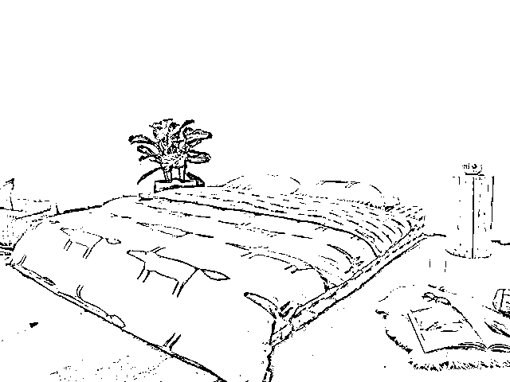

如果你不知道如何布置自己的卧室，试试换一套北欧风的床品吧！

**它醒目却又那么百搭，能让整个空间立刻变得不一样，充满活力和艺术气质。**

**狐狸先生印花全棉四件套**，包含被套 1 件，床单 1 条，枕套 2 个。

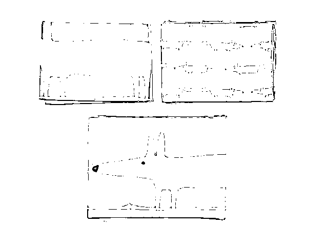

**灰色**

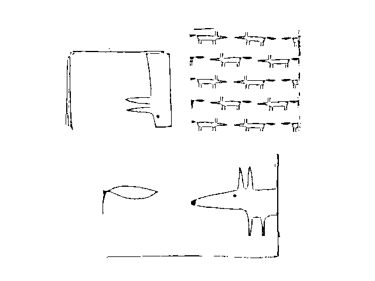

**橙色**

有 2 色可选：灰色、橙色。

每种颜色有**2 种尺寸可选**。

**1.5 米床用**，被套 200cm×230cm，床单 245cm×240cm，枕套 48cm×74cm。

**1.8 米床用**，被套 220cm×240cm，床单 245cm×240cm，枕套 48cm×74cm。

限时特惠：

狐狸先生印花全棉四件套限时拼团价￥359（日常售价￥1500）

不管是老用户还是新用户，都能发起团购，

任意五人成团，

申请开团后 24 小时内，只要有 4 位用户参团，即成团。

享受超值拼团价 359 元（日销价 1500 元）

拼团特惠至 8 月 24 日 23:59 结束

因为四件套的价格现在非常有优势，现采取预售的形式，预计 9 月 25 日左右发货。请大家耐心等候～

长按识别下方商品二维码即可拼团

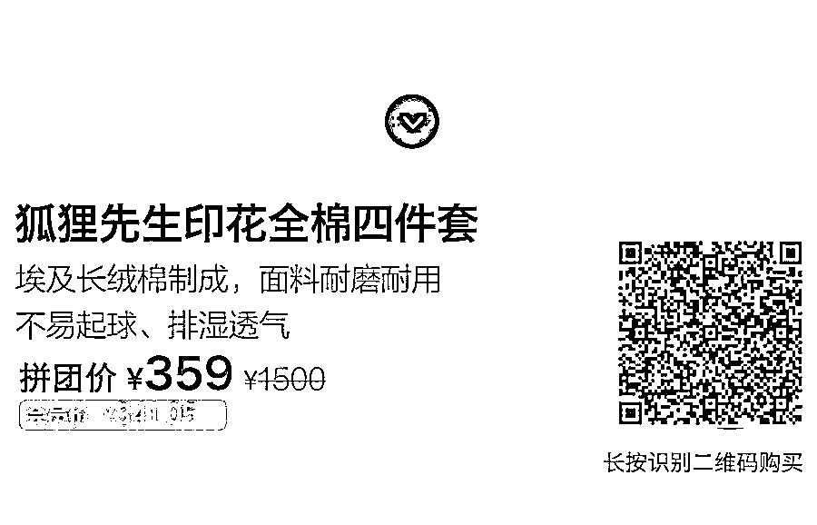

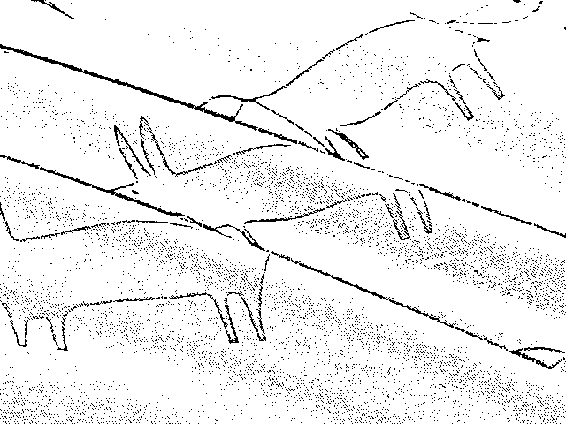

这款床品是**埃及长绒棉**精纺而成。

埃及长绒棉纤维柔长，有其它面料比不上的绵韧，**甚至有轻微的磨毛质感，暖暖的，**耐磨耐用、抗皱、久洗不容易褪色。

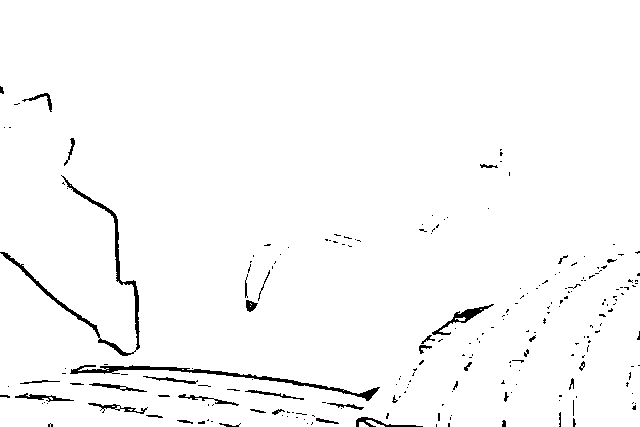

床品是用 40 支的棉纱，斜纹织法织成，每平方英寸 200 根棉线，**不易起球、不易起毛、不容易变形。**

“支”是织造中衡量纱线粗细的单位，支数越大，纱线越细，支数越小，纱线越粗。

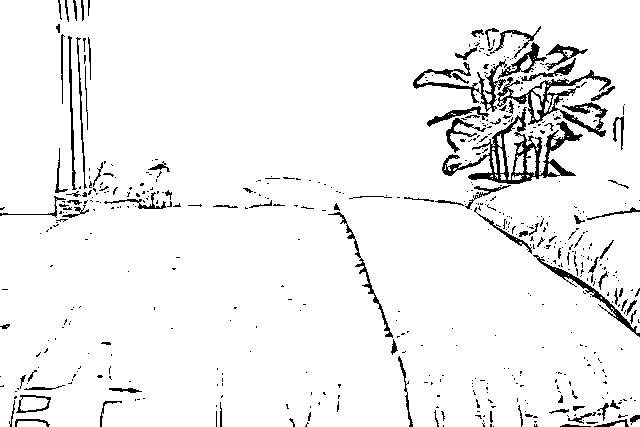

织成的床品**透气排湿性能优异，比普通面料的床品透气性强 5 倍，**睡着非常柔软、舒服。

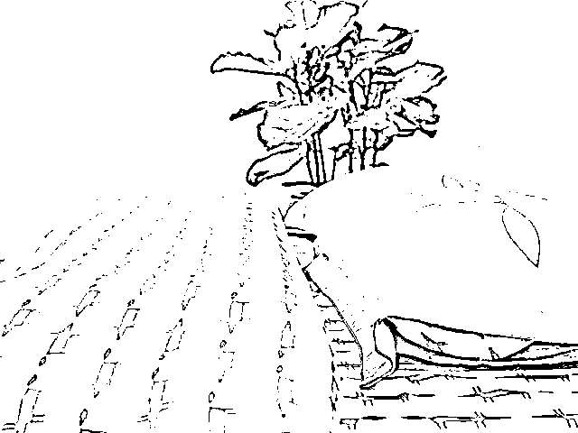

四件套上的**可爱小狐狸图案**，是 Scion 的标志性图案，人们亲切地叫他“狐狸先生”，是设计师 Hannah Bowen 的作品。

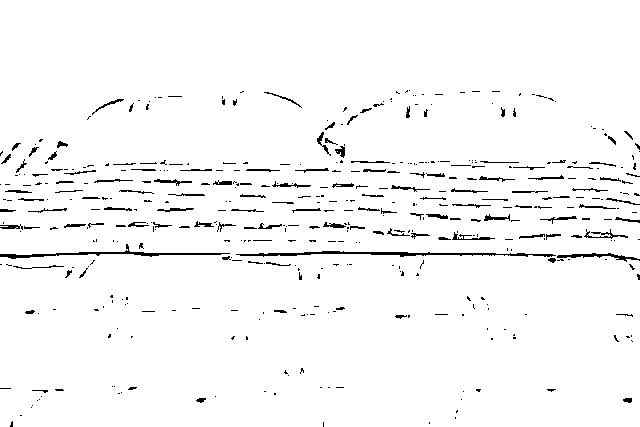

狐狸印花的风格愉快醒目、生机勃勃、富有生命力。

**时髦的米色、橘色撞色，就像狐狸先生在丛林中穿行而过。**

被套是 AB 面设计，内面的小狐狸，是狐狸先生的孩子们。

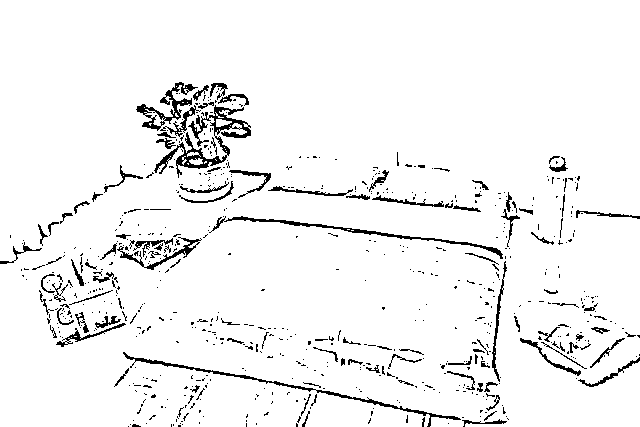

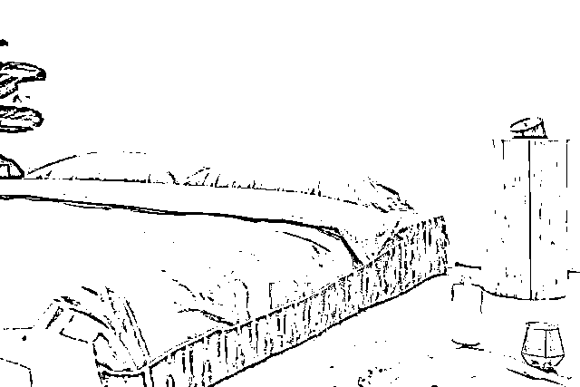

狐狸先生图案还有灰色款，更沉稳、雅致。

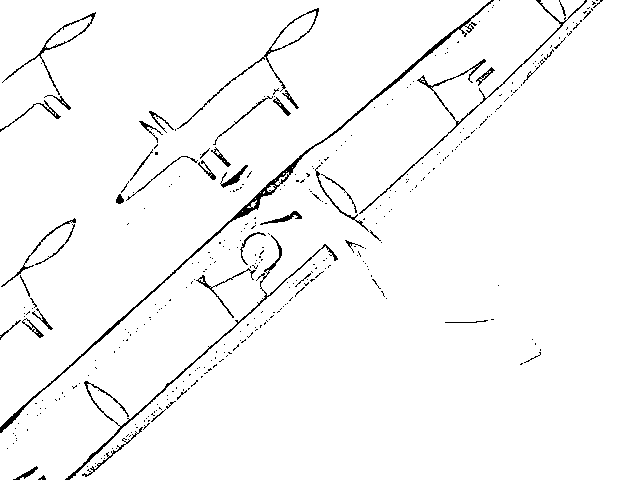

被套开口处是纽扣设计，里面有绑带如果被子上有扣眼，可以将绑带串进扣眼里固定住，被子在被套里就不会移位。

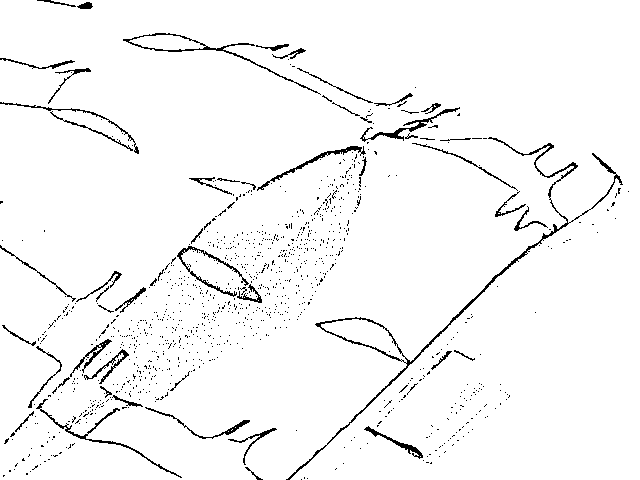

枕套是信封式设计，枕头从背面装进去，正面没有接缝，枕着不硌头。

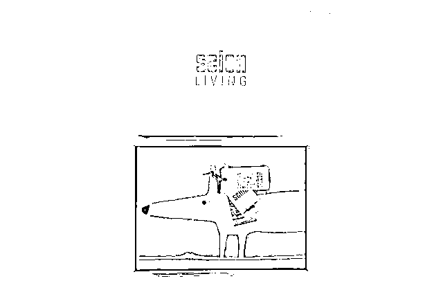

每套床品都有礼盒包装，很适合送人。

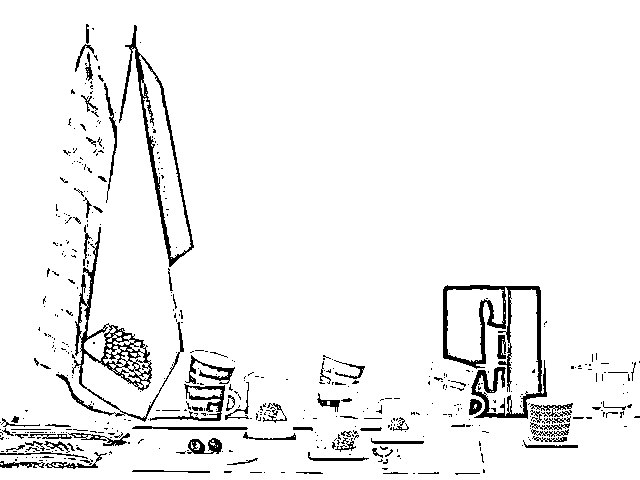

Scion 塞恩品牌于 2012 年发布之初就赢得了广泛赞誉：它丰富多彩、充满青春活力的设计以及生机勃勃的色彩运用，加上其富有竞争力的价格，为现代生活注入了全新理念。

Scion 塞恩系列时尚前卫且价格亲民、发展迅速，并且得到了世界范围内各大家居零售店与高端独立家居店的高度认可。

限时特惠：

狐狸先生印花全棉四件套限时拼团价￥359（日常售价￥1500）

不管是老用户还是新用户，都能发起团购，

任意五人成团，

申请开团后 24 小时内，只要有 4 位用户参团，即成团。

享受超值拼团价 359 元（日销价 1500 元）

拼团特惠至 8 月 24 日 23:59 结束

因为四件套的价格现在非常有优势，现采取预售的形式，预计 9 月 25 日左右发货。请大家耐心等候～

长按识别下方商品二维码即可拼团

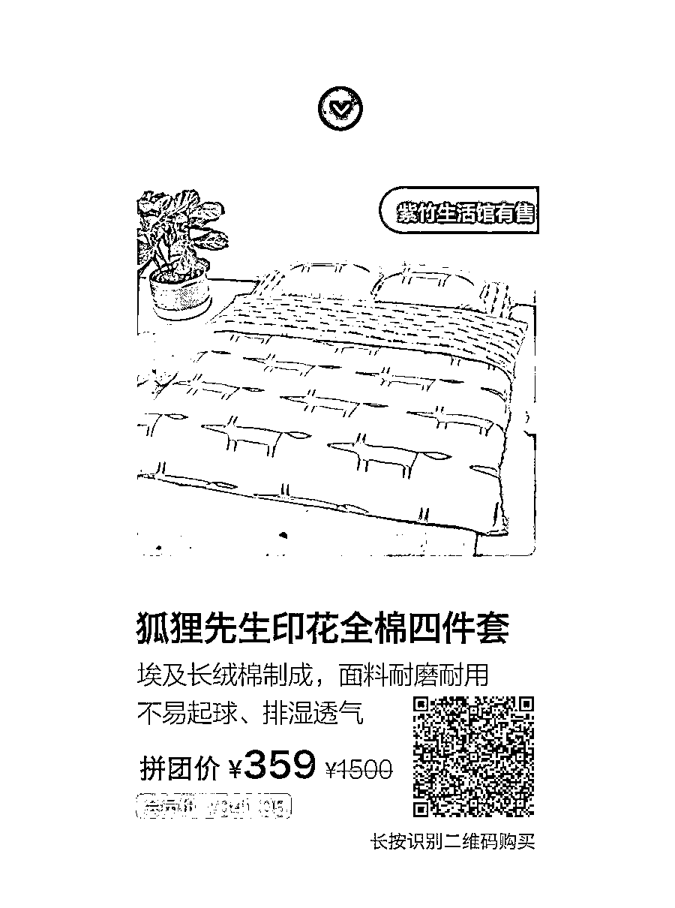

▼ **点这里，购买狐狸先生印花全面四件套**