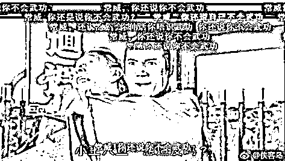
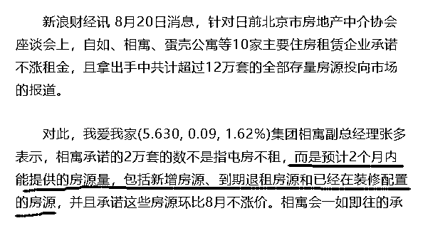
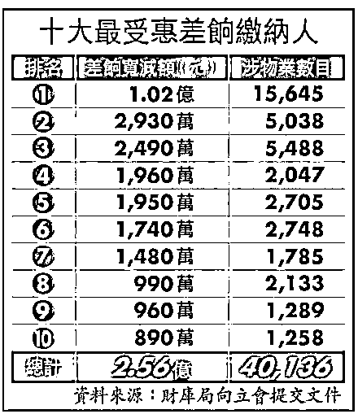
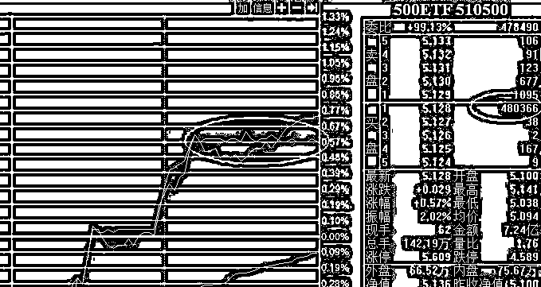
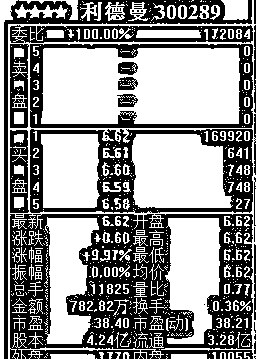
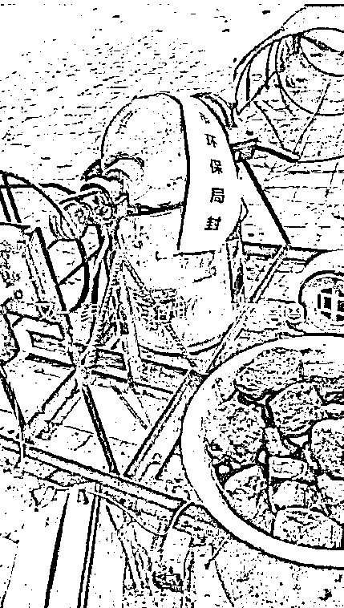

# 夜报|| 原来北京中介已经囤了 12 万套房了

今天有事，回来的时候已经太晚了，头条的资料搜集到一半时间已经不足了，所以今天头条挪到明天取，夜报提到头条的位置。

很多新粉不知道头条和夜报有啥区别，我这里简单的介绍一下，头条就是抓住一个问题，写深写细写透，用论文级的格式把一个问题写清楚。而夜报就是每天的新闻集合短评，每一个问题都简单的说一下自己的看法和态度，不会列入过多的参考资料和数据，但是胜在数量多，而且每一个新闻都有我的短评。

昨天北京市房地产中介协会召开座谈会，自如、相寓、蛋壳公寓等 10 家主要住房租赁企业负责人参加会议，座谈会结束后，参会企业明确承诺不涨租金且拿出手中全部存量房源投向市场。

那么这个存量房源有多少呢，自如 8 万间、相寓 2 万套、蛋壳公寓 2 万间、中天置地 1500 间、乐乎公寓 1000 套、小家联行 1000 间、魔方公寓 900 间、美丽屋 775 套、世杰佳园 400 间、润邦润家 150 间，总计 125725 套（间）。

看完这个数据我震惊了，居然有 12 万套，我前几天的文章分析中认为 17 年资本才开始介入租赁市场，所以房产租赁寡头只能说初现雏形，离完全成长还需要很久，所以地产中介只是靠这资本的能量短期扰乱市场而已，没想到区区一年时间，这帮人在北京都有了 12 万套房了。

囤那么多套房，北京中介你们是打算发展养殖业吗？还说北京房租上涨和你们没关系？

而且最厉害的是，根据澄清文稿，这 12 万套房，并不是指北京中介掌控的所有房源，而是指新增房源，如链家的自如承诺的 8 万套，指的是他在未来 2 个月内，要给市场投入 8 万套新增租赁房源，而我爱我家旗下的相寓承诺的 2 万套，是未来 2 个月内要投入 2 万套。

讲真的，这个声明发了之后，我对这些巨无霸更恐惧了，2 个月内就能调集这么多房源，他们总共控制了究竟多少套，北京城总共才多少套房源能拿来出租，资本仅仅入场一年，按这个趋势下去，5 年之后，租赁市场必定是寡头垄断格局。

限购限贷政策，其实很好的保护了穷人，否则的话肯定会出现手握几千套房的巨无霸，而即便在限购限贷政策之下，北京也出现了有几百套房的房神，甚至听说还有一个机构，服务的业主起步门槛就是一次性托管 100 套房源。。。

你还别不信，在没有限购限贷的香港，几十年的地产牛市，已经催生出了房祖宗了，名下有 15645 套房你敢信吗？香港的房产税稍微减了一点点，就受益上亿元，一天巡视一套房，检阅完打下的所有“江山”，总共需要 42 年。

所以，如果不加以限制，北京中介将来完全有可能达到这种恐怖的能量地步，未来某一天，当这些中介定下一个行价，对求租者说“这附近全都是这个价，你去哪都一样”的时候，还有什么力量能阻止他们作恶。

今天国务院税务总局公布消息，划定了税务局进行社保征收的时间顺序表，要在今年 12 月 10 日前要完成社会保险费和第一批非税收入征管职责划转交接工作，自 2019 年 1 月 1 日起由税务部门统一征收各项社会保险费和先行划转的非税收入。

我们都知道，现在去求职，给你报的工资，一定是税前工资，你实发到手的，一定是税后工资，而税后收入并不是指扣除个人所得税，税后收入=税前收入-个人社保缴费-公积金缴费-个人所得税。

换句话说，五险一金理论上来说是个人缴纳的保险，但是实际上，大家都默认他是税收了，行规里赤裸裸的把他是否扣减来区分为税前税后。

所以这次把社保的征收权力给予税务局，是实至名归，不过身上的遮羞布也被拔掉了。如果把单位缴纳的社保也计算在内的话，企业为一个员工支付了一万工资，差不多 4400 元直接就被拿走了，不考虑个税的前提下，实发到手只有 5600 左右。

所以如果五险一金定义为税，那么中国人的个税会有 44%之多，再加上一点个人所得税，个人税负压力直接突破 50%。

这只是从工资里直接拿走的部分，还有从商品里征收的各种间接税，从你吃的面包到你住的房子，时时刻刻都在纳税。

这个税负压力也太沉重了点。

~~~

今天彭博发布新闻，称中国政府相关资金今日入市干预，买入大盘蓝筹股，以支持市场；相关资金入市只是为了维护市场稳定，并非为了推高股价。

证监会今天上午召开闭门会，对券商分析师征询对市场的看法。

而上证报宣布，主流保险机构参与了主力资金 8 月 20 日的“精彩表演”。多家大型保险公司确认已在当日加仓，加仓标的包括沪深 300 指数、中证 500 指数及金融股，每家的加仓规模有数亿元。

看到这里，基本可以确认，今天证监会的确组织了大批资金入场维稳，尤其是多家大型保险公司均向媒体确认今日已经加仓，每家都掏出几亿元加仓，这个清一色的步调以及每家出一点钱的态度，摆明了就是上面的监管层组织的护盘行为。

而此前曾有媒体称，8 月 17 日下午 4 点，证监会主席曾召集多部门开会，分析股市局面，商讨应对之策，但是随后官方说这是不实消息。

现在看来，无风不起浪，这并不是空穴来风，证监会肯定是秘密组织了维稳会议，否则不会刚过周末，周一刚开盘，就有大资金统一步调持续入场。

今天总队维稳守法之粗暴，从股市图形上看，大概是这个样子的，简直是无脑到极致，典型庄股控盘手法，不知道是不是把前一段时间抓的庄家都带到牢里开始操盘了。

之所以这么做，我估计是 2638 是一个面子工程，全市场都在看 2638，等他破了之后看刘主席笑话，而刘主席为了自身的面子和政绩，当然不允许 2638 破，所以这周组织了资金进行护盘。

这个股市，从来就没有无止尽的的下跌，当年从 3600 爆发股灾 3.0，也就是跌到 2638 而已，如今差不多也是 3600 开始下跌的，从年初一直跌到现在，丝毫像样的反弹都没有，几乎是单边下跌，已经大半年了。跌的极限差不多就是千点左右，不会更多了，这种大型急跌+阴跌，短期内是绝对回不去 3600 的，但是 3000 点是肯定回得去的，而且可能会很快，因为诛心之战已经把所有人都杀绝望了。

所以，不是说始终不动，而是这个接近底部的区间，没有动弹的必要，2850-3000 点，这里就是接近底部的区间，上上下下无所谓，无非是大环境特别差的时候，短暂套上一段时间而已，持股就要讲究淡定和耐心，尤其是大环境特别差的时候。

而本周，我觉得日子就会比上周好过很多。

~~~

对了再插播几个好玩的，首先是今天居然还有游资挑衅刘主席，上一次挑衅的是谁来着，好像是佛山的一位大佬，下场还不够惨吗，居然还有不怕死的，明天证监会就去查你。

还有一个，现在的环保已经丧心病狂了，我居然看到了一个爆米花炉子被环保局贴了封条，又一家私人企业倒闭了。。

今天就先这么多，大家晚安。