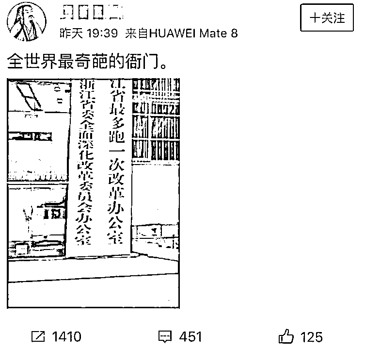

# 杭州有一个衙门，全球最奇葩

喜欢我的都关注我了~

浙江省有一个衙门，位于杭州，名字特别奇葩，奇葩程度被网友们认为是全球之最，他的名字叫“浙江省最多跑一次改革办公室”。

这张图一放到网上，立刻就火了，引来大量转发，但是这个办公室虽然名称奇葩，但是工作内容却并不奇葩，甚至可以说，是难得的好衙门，执行的也是难得的良政。

这个改革办公室，其主要工作内容就是协调各部门的关系，贯彻落实浙江省的最多跑一次改革，这个办公室的名字并不奇葩，要我说，应该叫接地气。

这项改革是浙江省政务改革的金字招牌，让浙江省的政府服务质量和服务态度直接跃居中国第一，在申请材料齐全，符合法律规定的情况下，要求所有部门，不能让群众跑第二次。

听起来肯定是好事啊，但是这是不是一句空话呢，并不是的，浙江省出台了“最多跑一次”清单，把所有的公共服务全部细化明确，而不是一个空洞的口号和要求，并且公开承诺，所有部门**“办结最多一个工作日、现场等候最多一小时”。**

目标真的很明确，也很符合人民群众的要求，但是能推行的下去吗？要知道政府部门的低效和推三阻四是出了名的，随便办个啥事都要开这证明那证明，生怕自己担一点责任，群众跑断腿那是他们的事，又不会扣公务员自己一分钱工资。

这个任务当然没那么容易完成啦，要是那么容易完成就不叫改革了，而是叫指示，杭州市长曾暗访“最多跑一次”，结果发现，**没有一次办成事。。。**

为什么明文规定之下，依然做不到最多跑一次？是办事的公务员故意踢皮球推诿事情吗？不是的，在暗访过程中杭州徐市长发现，在“办结最多一个工作日、现场等候最多一小时”的结果倒逼制度之下，前台办事员非常热情主动，也力图实现一次搞定，但是“最多跑一次”有一个前提条件，那就是**申请材料齐全，符合法律规定**。

这句话成为了这项政策执行不下去的命门，首先这句话肯定是没错的，资料不齐全，或者不符合规定，办事的公务员怎么也不能帮你办啊，不办是理所当然的，办了是违法违规的。

例如在暗访中，徐市长陪同在杭务工者高先生办理公积金提取业务，被告知需要开无房证明，这没什么问题啊，但是无房证明需要去开元路的房产档案馆开具，最多跑一次的目标落空了。

政府下达的目标是在申请材料齐全，符合法律规定的情况下，群众最多跑一次。但是**群众眼里的“最多跑一次”**，是我来办这个事，跑一次就办妥了。

群众的要求虽然很难实现，但是这才是**真正的**“最多跑一次”，浙江省在完成了第一阶段的“最多跑一次”后，开始马不停蹄的向第二阶段的“最多跑一次”进化。

办理公积金提取业务的“最多跑一次”业务失败之后，徐市长问办公人员，**“****外地无房户提取公积金的现象这么普遍，为什么部门间的数据不能联网？为什么现场没有开具证明的自助打印机？”**

随后，徐市长召集各部门开会，宣布“最多跑一次”将**以用户体验为主，从用户的角度去思考**，实现真正的“最多跑一次”。

就因为这一句话，杭州市付出了巨大的成本和牺牲，几乎将整个政府职能服务部门彻底改组。因为以前的政府办事部门设立，首先讲究的是合法合规，其次讲究是自身处理事情的方便性，罕有从用户角度考虑的情况。所以这就导致政府各部门互相独立互相分割，要实现“最多跑一次”难如登天。

所以，杭州市将所有部门的数据全部打通，将所有可能有互动的部门全部搬到一起办公，并尽可能的简化办事流程，最终奇迹般的实现了**真正的“最多跑一次”**，让我们来看一下用户的评价。

可能是因为淘宝就在杭州吧，所以杭州把淘宝小二的客服评价体系用到了公务员身上，而且是事后短信私下通知来评价，这种差评投诉威慑体系之下，工作人员态度当然好了，哪个敢不好。

全程连打印资料都是工作人员给弄的？估计是这位工作人员想多拿几个好评吧，这个月绩效考核压力太大，我这边城市的办事员只会甩一句，楼下复印，一块钱一张。

快下班的公务员，不是应该让群众明天再来吗？什么时候这么好说话了，还主动延长一点时间？

浙江省的“最多跑一次”已经落实到什么程度了呢，已经落实到了变态的程度，据说他们现在开始追求办事不出村，实现每个村都“最多跑一次”，简直不可思议。

我还以为每个村都弄了一堆职能部门呢，原来是每个村设了代办员，把村民的待办事项集中起来，让代办员跑到市里统一代办，简直是方便到家了，能在我们小区也设一个吗。。。

看完这些资料之后，我发现这个“最多跑一次改革办公室”的名称是多么的可爱，这么接地气的办公室，**来十个都不嫌多**，名字再奇葩都无所谓。

群众办事难，是一个老调常谈的话题，我也从未奢望这种事情能够被改变，因为官僚体系文化摆在那里，想让公务员真正**把自己当成群众的服务员**，摆正自己的姿态，简直难如登天，没想到浙江省居然奇迹般的实现了，名字无伤大雅，能给群众办事才是真的。

如果将来有朝一日，“最多跑一次”能再度进化为“一次都不用跑”，让群众足不出户就能办理各种公共服务，那就太完美了。目前看是天方夜谭，但是随着技术的进步，这是完全有可能实现的。

毕竟，阻挠政府公共服务进步的，**永远都是政府的服务意识**，而不是技术难度，**只要服务意识上来了，其他的都不困难****。**

觉得此文的分析有道理，对你有所帮助，请随手转发。

长按下方图片，识别二维码，即可关注我，每天都有 10W+

近期精彩文章回顾（回复“目录”关键词可查看更多）

华为员工都这么穷，怪不得拼多多能火 | 房价跌 20%就会全面崩盘，地产杠杆远比你想的要脆弱 |  为什么碧桂园的质量那么差 | 清醒点，放弃全面开征房产税的幻想 | 央行和财政部隔空掐架，我支持央妈 |中国土地制度源自香港，但是香港却是劏房密布 | 为什么中介哄抢租赁房源，因为贩毒都没它来钱快