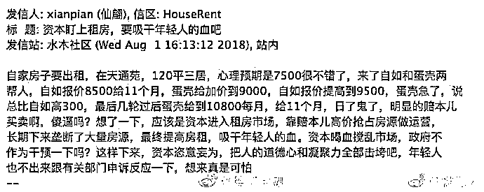
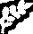

# 紫竹张先生：联手炒高的房租，比房价更可怕

近日，北京暴涨的房租引来社会关注，这次的房租暴涨夸张到什么地步呢，据爆料，一名业主打算出租自己位于天通苑的三居室，预期租金 7500/月，结果被二方中介互相抬价，硬生生的给抬到了 10800 每月。

这个租金涨幅简直可怕，一次性抬高了接近 50%的房租，而实际上，虽然这个只是个例，但是据数据显示，2017 年 2 月-2018 年 5 月，上海房租上涨 19.5%，深圳上涨 15.5%，北京大涨 25.9%，可见房租上涨并不是个例，而是普遍现象。

在房价被政府死死的摁住的同时，房价立刻就开始上窜，但是联手炒高的房租，实际上比房价更可怕。

曾经的房租是纯市场经济

自中国有商品房开始，房租市场一直是纯市场经济，而且是典型的完美市场经济，所有的租客全部是零散个体，所有的房东也全部是零散个体，没有任何人有能力操纵价格，也没有任何人有能力制造预期。

所以，一直以来，房租市场完全是价值的体现，不含一点泡沫。有很多房客觉得房租太贵了而不租或者搬到更远的地方去租住，而很多房东觉得自己精装修的婚房就为了这么一点租金给别人住也不划算索性就空置，在双方力量的博弈之下，最后定出了一个双方都能接受的平均租金水平。

但是在房价的快速上涨背景之下，房租的增长就显得过于缓慢。目前北上深的房子，如果只靠房租回本，需要 70~80 年左右，而全球公认的健康水平，是 18-25 年。

换句话说，如果你认为中国的房租水平是健康的，那么中国的房价就需要腰斩，再腰斩，才能让双方的价值相匹配。如果你认为中国的房价是健康的，那么中国的房租就需要翻倍，再翻倍才能互相匹配，房价和房租出现了极其巨大的落差。

在过去 20 年，房价动不动就翻倍，但是房租增长的极其稳健缓慢，基本就是每年 5~8%左右的涨幅，和工资增长水平几乎保持完全一致。其背后的原因很简单，租房市场是纯散户市场，个体力量微乎其微，完全是市场决定价格。

资本和中介相结合的力量

曾经的地产中介，只是一个单纯的中介，就是撮合房东和房客，严格来说是靠贩卖信息为生。但是从 2017 年开始，国家开始大力提倡租赁市场之后，资本就大举进入，和中介相结合之后，产生了可怕的连锁反应。

中介掌握了本地市场多年的详细交易数据，但是没钱，而资本是外行，并不清楚当地的客户数据，不过看好这个风口，金风玉露一相逢，房租便立刻暴涨。

为何他们的结合会带来房租上涨，因为中国的资本市场很奇怪，他们极其浮躁，只看数据不看盈利，单纯的追求大规模，喜欢跑马圈地，不成功便成仁，这种风格催生出了京东这样的真货色，也带来了更多的如共享单车这样的假货色。

而资本对于租赁市场的要求就是，以最短的时间，拿下最多的房源，依靠规模和市场占有率，开启下一轮融资。

资本的力量能短期抬高价格

中国的房租市场是一个纯散户化的市场，即便中介有资本的助力前来市场扫货，拿下的房源相对整个市场而言，也是微不足道，中国的租赁巨头才刚刚起步，其力量和庞大的市场相比，过于弱小。

但是他的资金优势，能让他在短期内剧烈影响价格，其原理类似于游资炒作，虽然吃进的筹码只占据总筹码的极少数，但是由于其利用资金优势短期大量吃进，所以把市场浮动筹码一扫而空，进而影响价格和预期。

那么当市场上同一时间出现的可租赁房源就那么多的时候，被中介一口气全部高价吃进，就会严重影响其他业主的预期，当所有人都调高价格的时候，价格就真的上升了。

而资金持续不断的扫掉低价租赁房源，最终把所有的房租都定在高价的时候，一开始高价签约的部分转租出去，不仅不吃亏，而且会大赚。

房租预期才是推动上涨的真正动力

资本和中介的力量虽然强大，但是想凭一己之力抬动整个租赁市场，那是螳臂当车，如果若干年后成长出几个租赁巨头或许还有这个能力操纵价格，但是目前的他们，远远没有这个资格。

他们敢于炒高房租的原因，是因为市场一致预期房租会上涨，而政府不仅不会打压房租，反而会乐见其成。这些风头在 2017 年政府的多项文件里已经表露的非常清晰，租购并举，发展租赁市场，而资本也选择在 2017 年进入布局。

如何发展租赁市场，靠暴跌来发展吗？那肯定是不可能的，正如同涨价去库存一样，不断上涨的房租，才是发展租赁市场最好的春药。

对于政府来说，上涨的房租最大的好处，就是化解房地产泡沫，当前的房价泡沫实在是太高了，腰斩再腰斩才能回归到价值中枢，但是政府敢让他跌吗？不敢，第一个腰斩都不敢，那会出大事情的。政府只敢让房价横着，靠时间让他软着陆，刺破泡沫硬着陆的代价，没有一个政府官员敢承担。

在房价不能下跌的情况下，房租越高，则地产泡沫越小，如果房租能翻一倍，靠租金回本的时间就会缩小到 35-40 年，再涨一倍，就会缩小到 18-20 年，这基本就回到了价格中枢了。

所以，政府的文件支持并鼓励房租上涨，形成了市场的一致预期，这才是资本敢入场的核心勇气。

而 2017 年在北京大幅开展的整治群租房行动，大量减少了北京的可租赁廉价房源，人为的减少了供应端的，但是需求不变，这是本次全国房租上涨的导火索，结合文件，全国房屋涨租行动轰轰烈烈的开始了。

中国的房租并不低

那么中国的房租是不是被严重低估了呢，所以具备催生的潜力，并不是，按照国际通用标准，当月租金超过月收入的 1/3 的时候，房租就会进入不健康的痛苦区间，而北上深的平均房租，已经达到了平均月收入的 50%以上！这不止是不健康了，这是在天天敲骨头问你痛不痛。

为什么中国的房租那么贵，和房价的上涨是脱不开关系的，房价连年暴涨的时候，虽然房租属于市场经济没办法爆炒，但是毕竟双方是属于上下游市场，房价暴涨，一定会略微带动房租上涨。

所以，中国的房租和工资的占比，本来就已经远远超过国际警戒线，严格来说，房租他也有泡沫。当一个城市白领一个月的收入 50%都拿出来付房租的时候，这个房租你还能炒到哪去，你翻个倍给我看看，看白领会不会拿月收入的 100%出来付房租，然后自己饿死街头。

所以，在工资不涨的情况下，中国的房租基本就到顶了，炒高房租唯一的下场，就是逼迫外地人离开大城市，然后大城市慢慢的衰落下去，没有人，什么都是虚的。

而放任中介把租金炒上去，是对租赁市场的极度不负责任，很有可能产生和共享单车一样的后果，而租赁市场不仅仅是浪费资金的问题，还有可能对城市就业市场产生毁灭性的打击。

毕竟，如果一个人因为房租占工资的比例过高，而被迫离开了这个城市，短期之内，他就不会回来，跨城市迁徙，那不是你想迁就迁的，极其麻烦。

房价这东西，你爱炒就抄，银行杠杆资金在里面疯狂的击鼓传花呗，买得起的都已经买了，买不起的已经躺地上死猪不怕开水烫了。但是租赁市场不一样，房子未必是刚需，但是租房一定是刚需，如果一个人在城市里买不起也租不起，他除了离开别无选择。

如果人都走了，你这个城市就靠钢筋混凝土发展吗？

