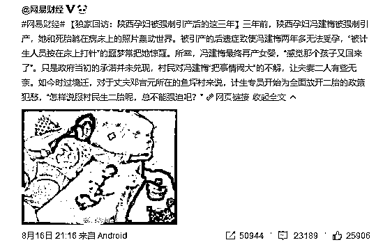

# 生孩子应该被鼓励，但是官媒鼓吹罚款不可取

新华日报近日刊文，提倡设立生育基金制度，规定 40 岁以下公民不论男女，每年必须以工资的一定比例缴纳生育基金，并进入个人账户。家庭在生育第二胎及以上时，可申请取出生育基金并领取生育补贴，用于补偿妇女及其家庭在生育期中断劳动而造成的短期收入损失。如公民未生育二孩，账户资金则待退休时再行取出。

丝毫不奇怪的，这篇文章火了，也丝毫不奇怪的，这篇文章下面的评论出现一边倒，同样丝毫不奇怪的，这篇文章所有的评论被和谐了。

在生育率不断下跌的时候，生孩应该被鼓励，但是这种不生就罚款的粗暴治国手段，涉嫌懒政怠政，非常不可取。

生育率下跌是动物天性决定的

当人口密度达到一定程度的时候，生育率下跌是不可避免的，这种现象不止出现在人类身上，也同样适用于一切动物。

上世纪，美国的生态学家 John 曾做了一次鼎鼎大名的白鼠无限繁殖试验，试图找出人类生育的奥秘。为什么选择老鼠，因为老鼠也是哺乳且群居性动物，并且在鼠群内部有和人类相似的，非常明显的社会结构和等级。

在美国国家卫生院的资金支持下，这个试验启动了，在一个固定的空间内，4 对老鼠被当做种子投入其中，这个空间有非常多的巢穴以及筑巢材料，巢穴可容纳 3840 只老鼠，而每日投喂的食物能供给 9500 只老鼠，水能供给 6144 只老鼠，研究员进行定期的消毒灭菌，衣来伸手饭来张口，这里简直就是老鼠天堂。

按研究人员估算，鼠群的极限人口数量，应该达到 4000-6000 只左右，因为这个时候会达到自然资源所承载的极限，然后才会有老鼠因为资源不足而死去。

而实际上，560 天之后，当老鼠繁衍到 2200 只左右的时候，鼠群数量达到了最巅峰的数量状态，然后整个鼠群停止了繁衍行为，人口一路下滑，整个鼠群所有的老鼠丧失了交配欲望，在物资丰盛的情况下，再也没有新老鼠出生了。更可怕的是，凡是在实验场地内呆过的老鼠，即便放到了野外和普通老鼠相遇，他们也没有交配欲望，在实验的第 1588 天，实验结束，整个种群只剩下 27 只老鼠（其中 23 只雌鼠，4 只雄鼠）。

鼠群数量

这篇论文的数据震惊了欧美社会，随后关于人口研究的论文是一篇接一篇，最后整个欧美社会达成共识，政府应该不惜一切代价鼓励生育。

这个实验告诉我们，当人口密度过大的时候，即便没有达到自然资源所承载的极限，整个种群也会自发的停止生育行为，这是隐藏在 DNA 中的天性决定的。

在数万年的进化史中，每当人口数量达到一定程度的时候，就会爆发巨大的战争或者瘟疫来清理一次人口，所以人类从来没有经历过自然停止生育这回事，而二战之后的核威慑之下带来的长时间和平，使得全球的人口，第一次开始缓慢的进入这一新的领域，那就是自发停止生育行为。

欧洲的生育率曾出现反弹

很多人都认为，经济越发达的地方，生育率越低，这是因为养育孩子的成本太大所导致的，可以用经济学去解释，但是实际上，养育孩子不仅是和经济学有关，也和动物学有关，因为鼠群实验的结果，在欧洲得到了实际验证。

二战之后，北欧的生育率就一路走低，1973 年，北欧芬兰总和生育率已经达到 1.49，六年后丹麦更是跌至 1.39，成为全世界的生育洼地，眼看要到亡国灭种的关头了。芬兰和丹麦虽是小国，但是经济非常发达，是最初经济学家拿来解释经济越发达，人口越下滑的典型范例。

但是 1980 年开始，北欧富国的生育率出现了奇迹般的回升，1993 年丹麦生育率突破 1.75,而 2008 年挪威的生育率居然突破了 2，而同期，中国的生育率已经跌到了 1.4 之下。

北欧富国实行了鼓励生育的政策，给生孩子的家庭大额补贴，但是这并不是生育率大幅反弹的主要原因，因为其他富国如日本法国等也都实行这种制度，人口生育并未有大幅反弹。

根据人口专家的研究，北欧国家人口反弹的主要原因，是因为其城镇化进程结束后，开始了向小城镇的反向回流，如果你住在深山老林，周围都是黑灯瞎火，步行半小时到不了你邻居家，丁克家族根本熬不住的，吓都吓死了，生一个二个也没什么安全感，动物本能会迫使你不断的繁衍后代。

但是实际上，分散居住的经济效率是非常低的，大城市为什么越密集越能吸引人，是因为密集带来效率，而效率带来金钱，穷国通过不断城镇化来完成致富之路，只有当国家富裕达到了一定程度，才有资本和能力开始反向城镇化。所以并不是经济越发达，生育率越低，那只能说明你还不够发达。美国的生育率相对其他国家维持一个相对健康的水平，我觉得就和美国的低密度人口环境有一定关系。

所以，如果国家把大城市的人口密度给降下去，比如把北京的住宅建筑用地扩大一倍，能有效刺激人口反弹，房价就是最好的避孕药，不仅仅是民间笑称，它是真的有一定经济学道理的。

为什么民众反对情绪如此浓厚

这次新华日报只是提出了一个建议，建议向所有人征收生育基金来补贴生育，为何民众的反对声音如此之大，而且如此强硬，是因为这个政策实在是过于急转弯了。

只生一个好，国家给养老，这句朗朗上口的宣传语曾经贴遍了中国大地每一处公路旁边的水泥墙上，国家每年投入上千亿专项资金从事计划生育，养活了计生委大批工作人员。

按照《中国卫生统计年鉴 2013》显示，从 1980 年到 2012 年，共有妇女上环 3.02 亿次，实施妇女输卵管结扎手术 1.04 亿次，人工引流产 2.95 亿例。计生委曾经表示，自己让中国少生了 4 亿人，还真不是吹的，从这个数据看，计生委完美的完成了国家交付的任务，这个钱没有白花。

一直到 3 年前，计生委依然奋战在第一线，陕西孕妇冯建梅被强制引产一事曾引起媒体轩然大波，这些图片资料永远的留存在了互联网上，让我们今天可以拿出来进行对比。

所以，前几年国家依然还在大力推行计划生育，所有的宣传工具都在告诉民众，生孩子是给国家造成负担的，所以要收社会抚养费，多生孩子是可耻的。

然后突然 180°大转弯，告诉民众，必须生孩子，不生孩子要罚款，罚的款当社会抚养费，交给那些生孩子的人，你说哪个民众能接受的了。

就算是今天，超生游击队依然是个贬义词，在各类书籍上致富秘诀依然是少生孩子多种树，计生办的工作人员，依然在天天上班，这个时候为了让民众多生孩子而开始倡议把工资的一定比例强制没收缴纳生育基金，这样的专家不是傻就是坏，如果政府采纳，那就是标准的懒政怠政。

鼓励生育的必要性

中国人口断崖式下滑是不可避免的，我曾在《用人口和土地的历史数据分析中国房价的未来走势》一文中列举了中国多年的人口数据，其中 1982-1992 年的婴儿潮，其生育高峰大概在 2014 年左右就结束，所以，中国从 2014 年开始推出单独二孩政策，就是基于这个人口数据做出的结论政策。

之所以最近几年人口没有出现断崖式的下滑，完全是因为二胎政策的原因，如果依然执行一胎政策，人口数据会比 1990-1999 那个自由落体式的人口出生数据还要惨，大概应该是这个样子。

大家可以去查询一下这几年的一孩数据，2017 年出生人口人口有所减少，共计 1723 万人，一孩出生人数 840 万，二孩出生人数 883 万人，如果剔除二胎的因素，那这个一孩数据简直凄惨的可怕，出生人口数据会比我上图划定的最低点还要低。

所以国家鼓励生育势在必行，大家养老是靠什么，是靠养老金吗？是靠房子吗？都不是，他们一个是废纸，一个是废渣。养老的核心因素，是靠人。

你以为你存了一个亿你就可以安心养老了？那是建立在中国后继有人、经济稳定的情况下，我举个极端的例子，假设 40 年后，整个中国有 13 亿需要赡养的老人，和 13 个青壮年，13 亿老人就算每人一亿人民币，每人 100 套豪华别墅，都没用，那些东西会一文不值。

我们的养老，完全依赖于中国的下一代，下一代人口众多，我们的养老就不是问题，下一代人口稀少，不管我们现在存多少钱，我们的养老都是问题。因为货币只代表一个符号，养老金的本质是商品和服务的跨代转移，养孩防老对于个体家庭来说可能是错误的，有时候是养孩坑爹，但是对于国家来说，养孩防老是绝对正确的。

所以，鼓励生育是非常有必要的，人口生育率再这么萎靡下去，是否会亡国灭种先不谈，但是你的养老肯定就是一个大问题了。

鼓励生育的正确做法

那么应该如何鼓励生育呢，像开头那位砖家建议的那样？不生就罚款？如果治国就靠罚款的话，那治国也太儿戏了吧。

首先，国家应该做的就是启动舆论宣传工具，开展人口危机的国情教育，教科书上关于人口是国家负担的言论和词语一律删除，纠正几十年来计划生育所形成的错误观念，废除一切不利于生育的法律条款。

人口才是财富的根源，少生孩子多种树不能致富，多生孩子多种树才可以。

然后，应该撤销所有计生办，如果国家一边对不生孩子的人罚款，一边对多生孩子的人也罚款，这是任何民众都接受不了的现实，如果国家认为应该多生孩子，那么计生办完全没必要保留，他的存在就是为了少生孩子。让计生办转为鼓励生育那也是不可能的，根据其他国家的经验来看，人口是鼓励不上来的，只有补贴才有一点效果，每年花上千亿养着计生办，不如拿这上千亿出来补贴生育了，多少还有点用。

另外，应重新制定带薪产假政策，带薪产假应由社保支付而不是企业支付，现行政策是典型的国家请客，企业买单，导致政策如同废纸，企业为了不支付这笔费用，处处歧视生育女性，让很多女性不敢生。

国家是不产生经济效益的，所有的资金都是由税收产生，虽然资金的最终来源都是收税，但是对谁收税，怎么收，这都是学问，为什么要讲究合理性和合法性呢，就是这个原因。关于生育这方面，只能补贴，不能收税，资金应从国库里其他税种里出，尽最大努力降低人们的抵触情绪，鼓励人们的生育意愿，直接以罚款来解决资金问题，这真的是典型的懒政怠政。

最后，再强调一遍，以减少人口为政绩的计生委没有全部撤销之前，谈鼓励生育没有任何意义，没有人会接受。

近期精彩文章回顾（回复“目录”关键词可查看更多）

华为员工都这么穷，怪不得拼多多能火 | 房价跌 20%就会全面崩盘，地产杠杆远比你想的要脆弱 |  为什么碧桂园的质量那么差 | 清醒点，放弃全面开征房产税的幻想 | 央行和财政部隔空掐架，我支持央妈