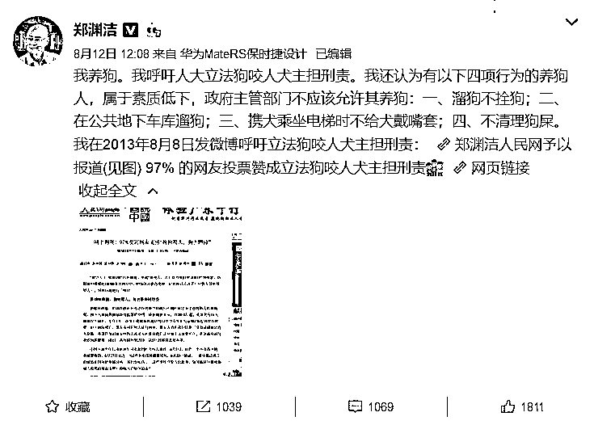
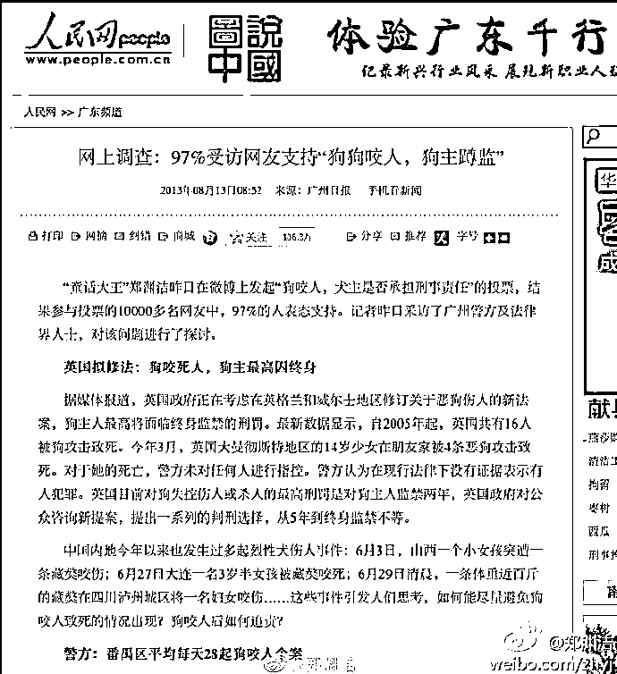
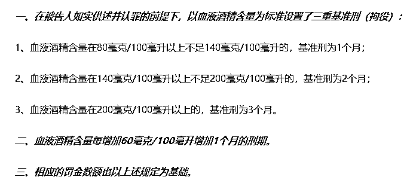
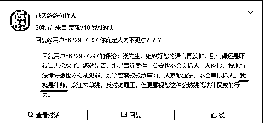
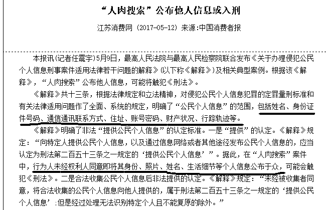

# 遛狗不栓绳，应参考醉驾入刑

昨天，我和大家列举了各地公安局和狗闹对抗皆处于下风的事实现状，我也对警方做了声援，但是这些行动对推进养狗文明有没有作用呢，有用，但是没有决定性的作用，过一段时间，该怎么样还会怎么样。

我前一段时间客观报道了俄罗斯和火爆网络的北京某小区使用异烟肼的事件，只是报道了一下，居然能激发全社会对非法养狗的大声讨，简直**不可思议**。这说明不文明养狗行为已经严重威胁了大多数普通人的生命安全。

投放异烟肼利用法律盲区，**属于以暴制暴**，我虽然客观报道，但是并不支持。那么我们有没有更好的办法去推动文明养狗呢，我思来想去，还**真的有**，那就是遛狗不栓绳的行为，应**参考醉驾入刑**，因为他们的性质真的极度类似。这个办法只要实行，就能真正实现法治社会下的文明养狗。

**1**

**现行养狗法律已经沦为一纸空文**

中国从来没有人狗矛盾，只有守法公民和不守法狗主人的矛盾，狗的行为完全决定于它的主人。现在如此民怨沸腾，只能说明现行养狗条例并不适用中国的社会现状，所以出现法律变成**一纸空文**的现状。既然养狗的法律法规变成了一纸空文，那么这个法律就必须被改进，其核心要点，应落在**制裁非法狗主人**身上。

怎么改进，修修补补推出更严格的养狗条例可以吗？不行的，其实现行的养狗法律其实已经很严格了，即便你改的再严格，也**不会改变本质**，他的核心问题是执法成本太高，而对狗主人**威慑力不足**。

之所以会产生这样的现象，是因为他属于民法，而民法的最重要特征，就是它顾及的是平等主体之间的日常大事小事，法官具有很大的自由裁量权，这个自由裁量权，很多时候，在中国都被用来和稀泥了。使用民法起诉对方，取证极难，耗时耗力，而且赔偿极少。很多人因为很不划算被迫撤诉，默默的吞下被侵犯的苦果。**“有本事你去告啊”**，这句话是仅次于**“我家狗狗不咬人”**的另外一句名言。

中国各地的养狗法规，看起来很严，但是基本都没用，大城市里满地都是禁养犬种，但是警方连捕捉一只流浪犬都会**被围攻公安局**，怎么敢去捕捉这些有主人的非法犬只。

所以现在各地轮番推出更严厉的养犬条例，但是恕我直言，不管把这个养狗的民法怎么改，他都注定是一纸空文。

**2**

**优化现行法律的一个思路**

既然现行养狗法规是一纸空文，那该怎么办呢，难道这个不文明养狗的现状就注定只能这么永远持续下去吗，然后合法公民和非法狗主人就日复一日的继续打架？

童话大王郑渊洁在 2013 年 8 月就曾呼吁狗咬人，狗主人应负担刑责，有 97%的群众投票表示支持，这次非法养狗冲突爆发之后，他再次呼吁狗咬人，**人入刑**。

首先，我这里支持郑渊洁老师的呼吁，狗咬人，狗主人理应入刑责，现行属于民法的养狗法规完全对猖獗的非法狗主人无能为力。然后，我对郑渊洁老师的提案进行修改，我认为不应是狗咬人才入刑责，而是应该遛狗不栓绳就入刑责，而不是应该**等他咬人了**才算违法，其法理和依据，应类比于和这种行为**极度类似**的醉酒驾车，按现行法律，只要醉酒开车，就要入刑，并不会等到你醉驾撞人了才入刑。

**3**

**为什么醉酒驾车会入刑责**

在当初推出醉酒驾车入刑的法律之前，这里是一个法律盲区，饮酒开车是完全不违法的，不仅不违法刑法，连民法都不违反。

所以，很多车主参加酒宴之后，都开开心心的驾车回家了。酒驾一定会撞人吗？不一定，如果酒驾一定撞人，他早就入刑了。实际上，酒驾之后撞人的概率是极低的，大家可以问一下自己的亲戚朋友统计一下数据，酒后开车多少次，又撞过几个人？

所以，在过去，很多人根本不认为酒后开车有什么错，即便是推出了酒驾入刑的法律后，他们很多人也依然不服，我就喝几口酒，能有什么事，我开这么多年车了都没出过事。**“我技术好，喝酒开车不撞人”**当年在车主那里也是非常有市场的一句话。

那么**你家车车真的不撞人吗**？按警方的统计，虽然酒后开车撞人依然是小概率事件，但是相比不饮酒的人群来说，撞人的概率呈现**百倍激增**，而且极易引发撞死人的**严重车祸**。

当年如果酒驾车主把人撞伤了，依然是只需要赔偿医药费就可以了，和今天的狗咬人是一样一样的。如果说今天的遛狗不栓绳有专门的养犬条例相对应，只不过是违法没人管而已的话，那么当年的酒驾，是真真正正的法律盲区，完全没有任何法律可以制裁，只能等他撞伤人甚至**撞死人**了，才能依据其他法律进行处罚。

随着酒驾引发的民怨越来越大，最终国家专门为酒驾修改了一次法律，**酒驾违法，醉驾入刑**，定期组织交警拉网式排查。这条法律一出，中国酒后驾驶的人数急速下降，如今已经微乎其微几乎不再引起民愤了。

依现行中国法律，酒后驾车，首先要分你是酒驾还是醉驾。血液酒精含量超过 20mg/100ml，但不足 80mg/100ml 的，属于酒驾，而超过 80mg/100ml 的，一律属于醉驾。

酒驾不入刑，但是会遭到行政处罚，适用法律为《道路交通安全法》，其第九十一条之规定，饮酒后驾驶机动车的，处暂扣六个月机动车驾驶证，并处一千元以上二千元以下罚款。因饮酒后驾驶机动车被处罚，再次饮酒后驾驶机动车的，处十日以下拘留，并处一千元以上二千元以下罚款，吊销机动车驾驶证。

而醉驾则会直接**入刑**，根据最高人民法院等颁布的《关于办理醉酒驾驶机动车刑事案件适用法律若干问题的意见》，在道路上驾驶机动车，血液酒精含量达到 80mg/100ml 以上的，属于醉酒驾驶机动车，依照刑法第一百三十三条之一第一款的规定，以危险驾驶罪定罪处罚，由公安机关交通管理部门约束至酒醒，吊销机动车驾驶证，**依法追究刑事责任；**五年内不得重新取得机动车驾驶证。

那么这个刑事责任，会有多重呢，醉驾只要被抓到，必须入刑，醉驾的量刑原则为拘役并处罚金，拘役时间为 1 个月以上 6 个月以下，至于是按照上限或接近上限处罚，那要看各地的执法尺度了。在没有引发任何后果的情况下，一般都依据酒精含量标准进行判定，下面是一个比较常用的判罚标准。

大部分被抓住的醉驾，如果没有引发事故，则基本都是按 1~3 个月量刑，如果引发了事故那就好办了，数罪并罚，从严从重处理。

好多人看起来好像有点轻，怎么这么接近法律处罚下限，其实不少了，醉驾入刑，最具震慑力的地方，并不在于他的刑期，而在于**入刑**。注意看，酒驾处罚上面写的是**拘留**，而醉驾这里的，写的是**拘役**。

一字之差，天地之别，在中国只要你触犯了刑法，那么就会**留案底**，哪怕只是一个月，基本上就不要再想进入体制内或者一些大公司了，你可以去一些小公司碰碰运气。越是体制内的人，越害怕这个入刑条款，拘役一天都不行。

所以，不管当初是对驾照扣分还是罚款，都**无可奈何**的酒后驾车行为，在推出入刑条款后，奇迹般的消失了。

**4**

**遛狗不栓绳和酒驾的相似性**

明明很多人酒后开车并没有撞到人，只有极少数人酒后开车出事了，为什么一定要把醉酒驾驶定为危险行为。

那是因为，酒后驾驶，出事的概率会大增，尤其是醉酒驾车，对不特定的公众对象的生命安全造成了巨大威胁，**明知**醉酒驾驶是对他人生命的不负责依然选择醉酒开车，当然应该**入刑**，某种意义上，这都可以归类于危害公共安全罪了，因为他直接危及公众的生命安全。

醉酒驾车，没有说必须撞到人才被惩罚，而是只要你对公众安全造成了威胁，你就会被惩罚。那么我们可以看到一个和醉酒驾车非常相似的行为，那就是**遛狗不栓绳。**

狗是危险性动物，但是遛狗不栓绳一定会有人被咬吗？不一定，很多狗狗可能一辈子都不咬人。不过和文明养狗的栓绳遛狗相比，毫无疑问遛狗不栓绳的行为，让不特定公众的生命安全遭到的威胁，呈现百倍的增加。遛狗不栓绳，和醉酒驾驶，对不特定公众生命安全的威胁**没有质的区别**。

而实际上，每年因为酒驾被撞伤的人数，远远低与中国每年被狗咬伤的人数，酒驾伤人远远没有狗咬人来的普遍，所以，遛狗不栓绳，理应参考醉驾入刑，否则很难得到根治。

当然，狗咬人的致命性低于车撞人的致命性，所以可以**参考醉驾**，然后全部降低一档。遛狗不栓绳的情况里，有没有咬到人，狗有证还是无证，是初犯还是累犯，对社会的危害轻重程度都不同。醉驾无论是否引发事故都会入刑，但是遛狗不栓绳可以放宽一点尺度，我个人建议：

遛狗不栓绳**且发生咬人事件**的情况下，应入刑。在**犬只合法**情况下，处拘役一个月，如果有其他违法行为，比如**犬只非法**，则增加一个月，使用大型犬烈犬等致命性更高的犬种，也增加一个月。如果出现咬成重伤甚至咬死人的情况下，应**数罪并罚**，从严从重处理。

遛狗不栓绳被警察当场抓住，但是**没有咬人**的情况下，则应区分犬只是否合法。如果**犬只合法**，则按酒驾处理，**不入刑**，但是应扣 12 分重新学习并处罚款。**再次累犯**，则处 10 日拘留并处罚款。如果犬只**不合法**，则应入刑，处拘役一个月。

上述是我的建议，如何制定具体法律及量刑尺度，还需要高层的详细讨论和修订，推动养狗文明，让民众放弃以暴制暴，回归理性的法治社会，这是一个非常好的办法。

为什么呢，因为在大城市养狗，真的很费时间，也很花钱，不是一般人能伺候的起的，这群人大部分都有钱有闲，不是体制内的，就是大企业的，他们非常惧怕入刑后档案留污点，就算只入刑一天，对这些人的**威慑力**都是非常大的，远远大于民法武器，对这些有钱有闲有地位的人来说，如果没有刑法威慑，他们就只有一句话**“有本事你去告啊”**。

近来多个城市推出养狗积分制，仿照驾照对车的管理条例进行狗的管理，但是当年驾照扣分并没有刹住醉驾之风，直到**入刑才得到彻底解决**。故我今天在此提出建议，如果要推进文明养狗，只有一个办法，那就是**遛狗不栓绳应参考醉驾进行处理**。

遛狗不栓绳，对不特定公众的危害，完全类似于醉酒驾车，当年抓醉酒司机，和今天抓违法狗主人一样困难，明知违法人数众多但是却难以执法，让警察非常头疼。在现行法律**对违法养狗完全无效**的情况下，涂涂改改是解决不了问题的，而**异烟肼属于以暴制暴不值得提倡**，那么能推动文明养犬的唯一指望，就落在修改法律上面了，如果遛狗不栓绳参考醉驾入刑，我认为应该可以**推动中国的养狗文明**。

有些法律，需要**里程碑的事件**去推动，希望这次就是那个里程碑。

（本文完）

~~

在国内狗权组织反复冲击这个工号的情况下，我今天发布这篇文章。我搜了一下，这么多年，不管是大 V，还是政府部门，甚至是公安局，凡是和狗权组织战斗的，全败，无一胜绩，都被骂的缩头了，我这人就不信邪，我就想**试一试**狗权组织的大小狗霸王的威力。

顺便做个投票

你是否支持遛狗不栓绳参考醉驾入刑

~~~

对了，最近很多狗霸王对我发动人肉攻击，鼎鼎大名的狗霸王四连击“**断章取义、造谣抹黑、人肉攻击、聚众闹事。”**目前已经对我使用了前三步，不过我并不是被他们人肉攻击的长沙民警，我不怕事情大。

首先，给那些半桶水律师做个普法教育，中国居然有这样的律师，真是法律界的不幸，我算是知道网上那些律师到处瞎说的谣言论断是怎么来的了，因为这些假律师真的是法盲啊。

我今天告诉这位“律师”，人肉搜索，不仅犯法，而且**触犯的是刑法**，别以为人肉攻击长沙民警没事就真的以为不犯法了，那是公安局不想追究你，想息事宁人，不愿把事情闹大而已。

2017 年 5 月 9 日最高人民法院、最高人民检察院在北京联合发布《关于办理侵犯公民个人信息刑事案件适用法律若干问题的解释》，其中的第三条对刑法第二百五十三条之一的规定中的“提供公民个人信息”的认定作了进一步明确。

按照二高颁布的《解释》之认定：“未经被收集者同意，将合法收集的公民个人信息向他人提供的，属于刑法第二百五十三条之一规定的‘提供公民个人信息’，但是经过处理无法识别特定个人且不能复原的除外。”

个人信息包含哪方面呢，行为人未经权利人同意即将其**身份、照片、姓名、生活细节、身份证件号码、通信通讯联系方式、住址、账号密码、财产状况、行踪轨迹等个人信息**公布于众，属于触犯刑法

这些信息只要公布其一，然后信息上网了，则立刻触发向不特定公众提供信息这一条认定标准。不管你阅读量多少，都属于**面向不特定公众散发隐私信息，立刻入刑**。

那么怎么处罚呢，**情节严重的，处三年以下有期徒刑或者拘役，并处或者单处罚金；情节特别严重的，处三年以上七年以下有期徒刑，并处罚金**。

这里唯一的漏洞，恐怕就是二高的《解释》中那一句，情节严重了，怎么才算情节严重，这个是由法官来自由把控的，要是法官认为不严重，那就抓瞎了。

所以我会怕狗霸王第四击聚众闹事嘛？不怕，等你们人肉到家门口我会直接报警，然后找律师对所有涉及人肉的穷追猛打，我只是没抽开身而已，最近精力不在这上面，你真以为我拿你们没辙，法律在我这边，依法办案即可，起诉 1 个和起诉 100 个成本差不多，来多少起诉多少就是了，就等你们上门送罪证了，情节越严重越好，现在就怕情节不严重。

人肉搜索还有一个最大的问题是，取证极其困难，你一较真，很多人就直接删帖销毁了罪证，所以我这里希望大家帮个忙，凡是有非法人肉，公布个人信息的，麻烦**截图固定罪证**，然后再截一个能表明其身份的图，如注册信息等，方便将来直接请微信或者微博官方锁定身份证号码，要知道现在都是实名认证的，只要法院提出请求，平台都需要配合提供个人身份给警方。

一般情况下，二张图即可，然后通过留言发给我，收到后我会发送一个谢谢给你表示我收到了。我先找个**小本本**把这些黑资料全部记下来，然后等聚众闹事的时候**统一算账**。

另外，我这里公开承诺，以后任何时候，只要还有**民警**依法处理流浪狗被狗权组织**非法人肉攻击**，我立刻就会开一个帖子，替警方搜集罪证。警方很难从茫茫的网络中找到对应的帖子截图，我也不能，但是如果发动大规模的群众协助，找到这些非法帖子，那就太容易了。

~~~~

很多人说我最近和狗话题扯的太深了，我的粉丝全是财经粉，不是宠物粉，很多人不爱看这个，在这里我表示非常抱歉，我现在生活都受到影响，没办法恢复正常的更新，给我几天时间，处理完这些事情，因为有些话哽在喉中，不吐不快。等几天之后狗霸王消停了，我就开始正常的财经更新。

